# AI Agent 时代的技术团队重塑

## 前言

过去二十年，软件开发的组织方式相对稳定：**前端工程师负责界面，后端工程师负责业务逻辑，测试工程师负责质量保障**。这种分工模式根深蒂固，几乎成了行业标准。

但 2025-2026 年的 AI 技术跃进——从 Cursor Agent Mode、Claude Code 的完全自主编程，到 MCP 协议的标准化、多智能体系统的落地——已经让这个假设从"未来预测"变成了"正在发生的现实"。

本文从 2026 年的实践视角出发，回顾正在发生的变革，并推演未来 3-5 年技术团队的组织演化路径。

## 现状：职能分工遇上 AI 浪潮

### 传统分工的固有问题

传统分工模式下，一个功能的交付需要经历多轮接力：

- 前端与后端定义接口（API 契约）
- 前端等待后端接口就绪才能开发
- 测试需要等待前后端联调完成
- 需求变更需要多方同步

**结果**：大量时间消耗在沟通和等待上，而非真正的价值创造。

同时，前端与后端的边界越来越模糊——Serverless 让后端逻辑前端化，BFF 让后端为前端定制，全栈框架（Next.js、Nuxt）模糊了前后端边界。分工的初衷是"专业的人做专业的事"，但现实是：**越来越多人花时间在做边界的修补工作**。

### AI 带来的质变

2025-2026 年，AI 编程能力经历了质变而非量变：

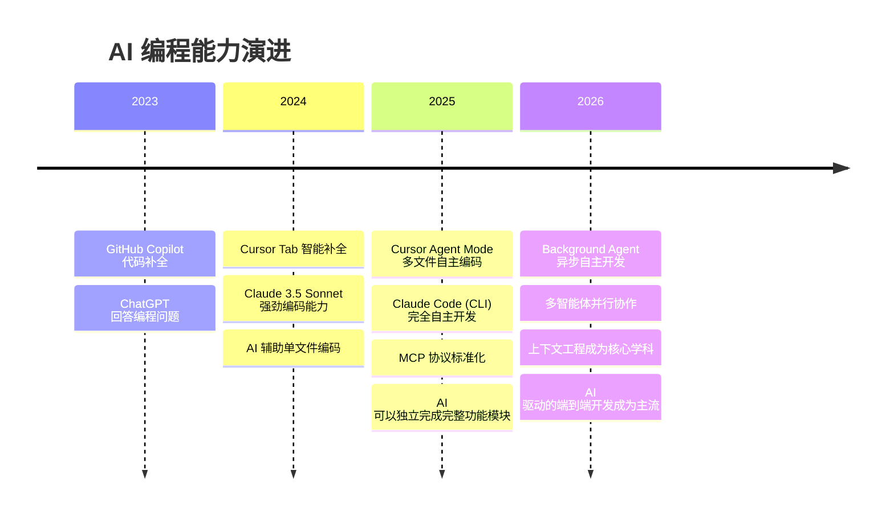

关键里程碑：

| 时间 | 突破 | 影响 |
|------|------|------|
| 2024 Q4 | Cursor Agent Mode | AI 从"补全代码"升级为"自主开发"，跨文件编辑成为可能 |
| 2025 Q1 | Claude Code (CLI) | 终端中的全自主 AI 开发者，可执行命令、读写文件、运行测试 |
| 2025 Q2 | MCP 协议标准化 | AI Agent 获得统一的工具调用能力，可以连接数据库、API、文件系统等 |
| 2025 Q3 | Background Agent | AI 在后台异步完成开发任务，人类只需审查结果 |
| 2026 Q1 | 多智能体协作 | 多个 AI Agent 并行开发不同模块，自动协调依赖 |

这些突破意味着：**AI 不再是"帮你写代码的助手"，而是"能独立完成模块开发的数字团队成员"**。

## AI 编程的三个关键范式转变

### 1. 从代码补全到 Agent 自主开发

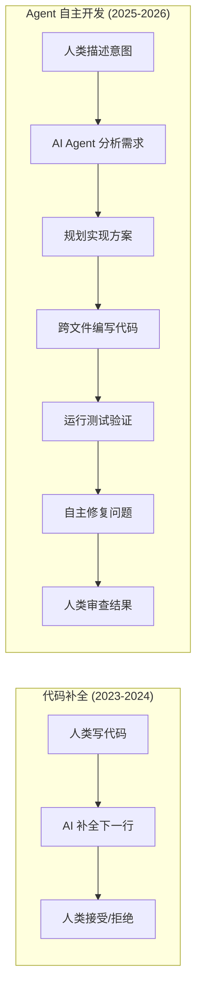

Claude Code 可以在终端中自主：阅读代码库 → 理解架构 → 规划实现 → 编写代码 → 运行测试 → 修复 Bug → 提交 PR。Cursor 的 Background Agent 可以在云端异步完成这一切，开发者只需要在完成后审查。

### 2. 上下文工程：AI 时代的核心技术能力

**上下文工程 (Context Engineering)** 是 2025-2026 年最重要的新兴学科。它决定了 AI Agent 产出代码的质量上限。

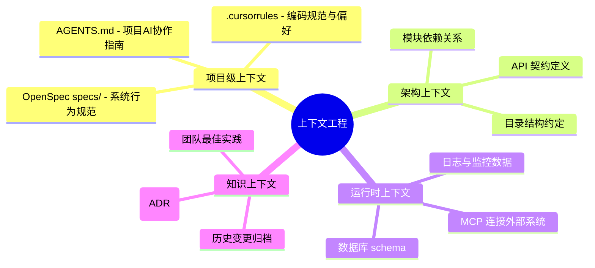

**核心认知**：AI 写出什么样的代码，80% 取决于你给它什么样的上下文。管理上下文的能力——而非编写 Prompt 的技巧——是 AI 时代最核心的技术能力。

上下文工程的关键实践：

| 层次 | 工具/机制 | 作用 |
|------|-----------|------|
| **项目规范** | `AGENTS.md`, `.cursorrules` | 告诉 AI 这个项目的编码风格、架构偏好、禁忌规则 |
| **系统行为** | OpenSpec `specs/` | 描述系统当前的行为规范，作为 AI 开发的参照标准 |
| **外部系统** | MCP Server | 让 AI 直接访问数据库、API、文件系统，获取实时上下文 |
| **变更管理** | OpenSpec `changes/` | 定义当前变更的范围和意图，约束 AI 的修改边界 |

### 3. 多智能体协作：从单兵作战到数字团队

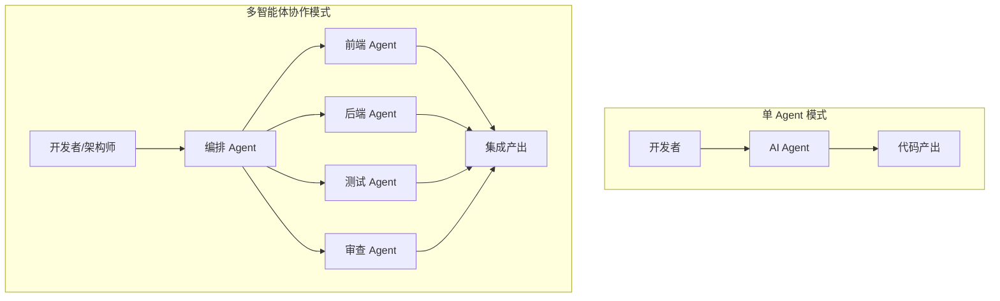

在多智能体模式下：
- **前端 Agent** 和 **后端 Agent** 基于同一份 Spec 并行开发
- **测试 Agent** 根据 Spec 自动生成测试用例
- **审查 Agent** 对产出代码进行架构一致性检查
- **编排 Agent** 协调依赖关系，确保模块间接口一致

这已经不是科幻——Cursor 的 Background Agent、Claude Code 的 Task 工具、多个 AI Agent 在不同终端并行工作，已经是 2026 年的日常实践。

## 组织演化路线图

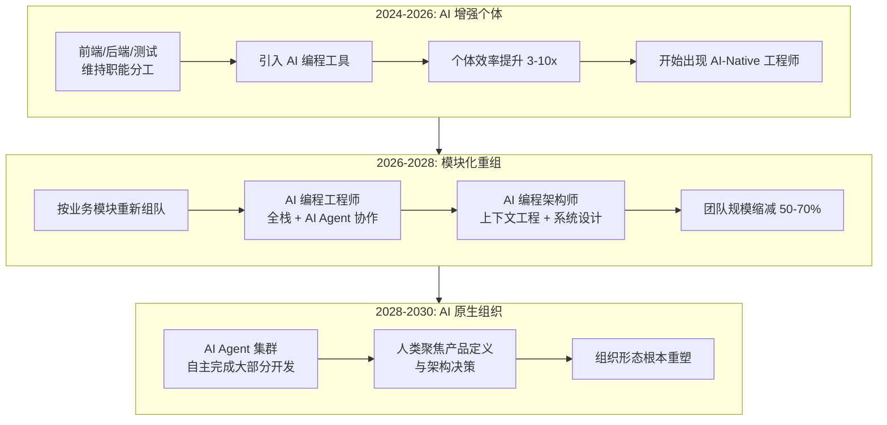

### 第一阶段：2024-2026，AI 增强个体（正在发生）

这是我们当前所处的阶段。核心特征：

**维持职能分工，但个体能力大幅提升**：
- 前端工程师用 Cursor Agent 一天完成过去一周的界面开发
- 后端工程师用 Claude Code 自主实现完整 API 模块
- 测试工程师用 AI 自动生成测试用例和测试数据

**开始出现"AI-Native 工程师"**：
- 不按传统前端/后端思维工作
- 以业务功能为单位，利用 AI 完成端到端开发
- 擅长上下文工程，善于"喂养" AI 正确的上下文
- 产出效率可以达到传统工程师的 5-10 倍

**组织层面的变化信号**：
- 一些前瞻团队开始试点"一人一模块"的开发模式
- 前后端职责边界开始松动
- AI 编程规范（AGENTS.md、.cursorrules）开始在团队中推广
- OpenSpec 等 Spec-Driven 开发框架开始被采纳

### 第二阶段：2026-2028，模块化团队重组

**核心变化**：不再按职能划分团队，而是按**业务模块**划分。每个模块团队都能借助 AI 独立完成端到端交付。

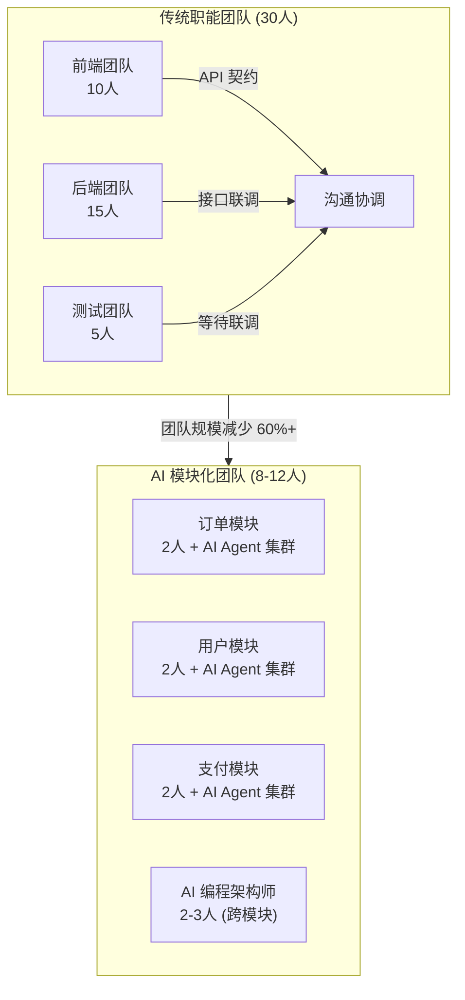

**一个模块团队的工作方式**：

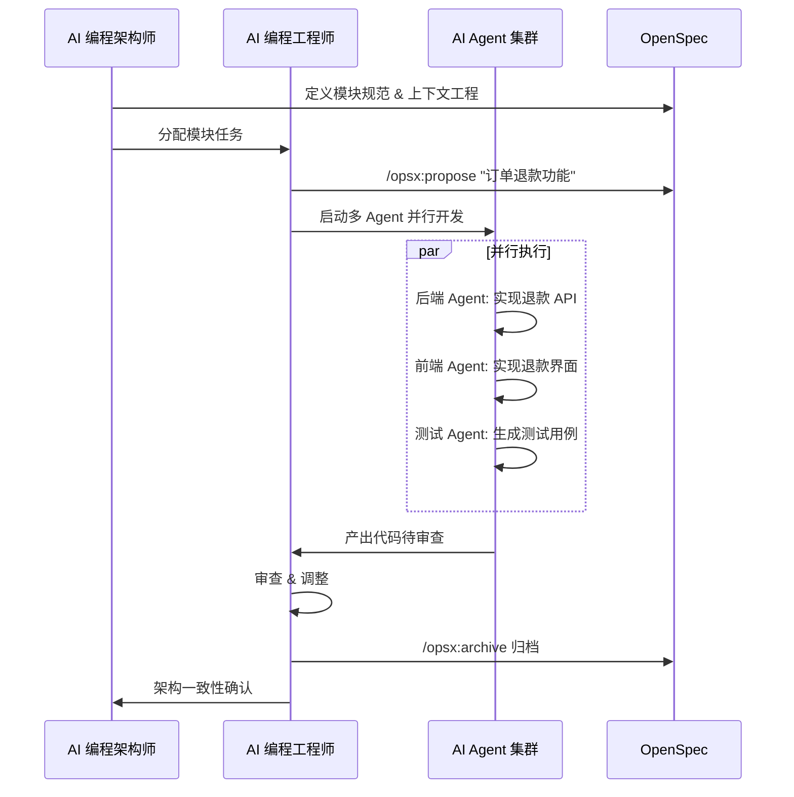

**为什么是 2026-2028？**

前提条件正在 2026 年快速成熟：
1. **AI Agent 可靠性**：Claude Code、Cursor Agent 的端到端开发成功率已超过 80%
2. **上下文工程方法论**：AGENTS.md、OpenSpec 等标准化方案已被验证
3. **MCP 生态成熟**：AI 可以直接操作数据库、调用 API、访问文档系统
4. **多智能体协调**：并行开发模式的工程实践已积累足够经验

### 第三阶段：2028-2030，AI 原生组织

**更激进的预测**：AI Agent 集群能够自主完成 90% 以上的标准开发工作，人类的核心价值转移到产品定义、架构决策和创新探索。

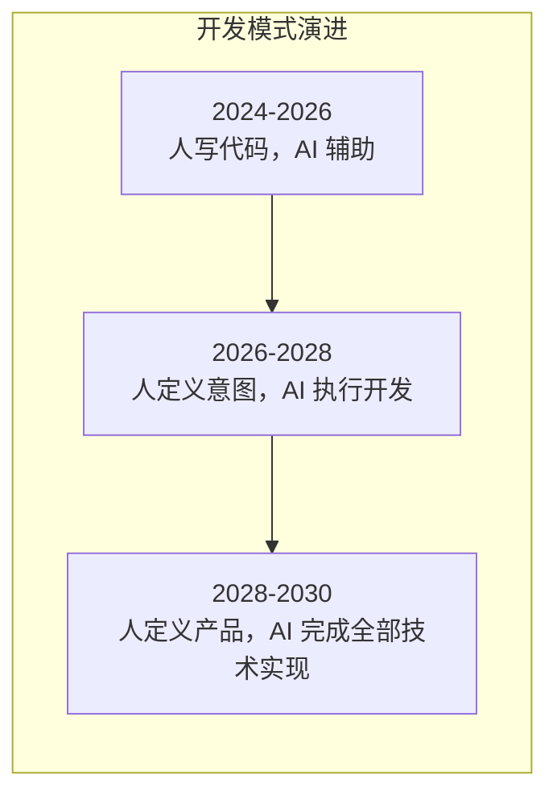

| 层次 | 描述 | 人类角色 |
|------|------|----------|
| **AI 增强编程** | AI 帮助写代码，人来决策 | 编码者 + 决策者 |
| **AI 驱动编程** | 人定义意图和约束，AI 自主编码 | 定义者 + 审查者 |
| **AI 原生产品** | 人定义产品和体验，AI 完成全部技术 | 产品设计者 |

在这个阶段：
- **产品经理重新成为核心**——想法可以直接转化为产品
- **技术团队的价值转移**——从"实现功能"到"定义产品"和"设计体验"
- **创新门槛大幅降低**——一个人 + AI Agent 集群 = 一支完整的开发团队

## 新角色体系

### 角色全景

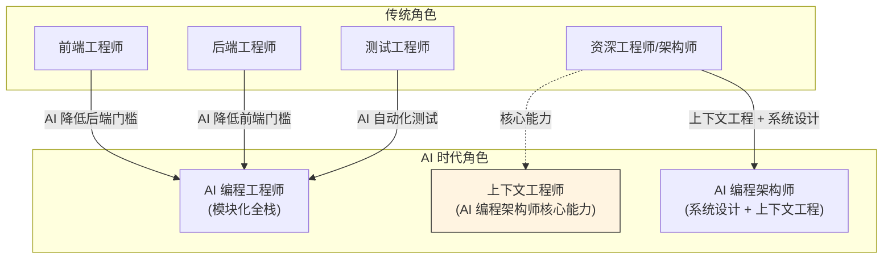

### AI 编程工程师

**定义**：模块化团队的核心成员，擅长与 AI Agent 协作，能够独立完成端到端功能交付。

不再是传统的前端或后端工程师，而是 **"AI 协作开发者"**——他们的核心竞争力不是记住所有 API 和语法，而是能够高效地指挥 AI Agent 完成高质量开发。

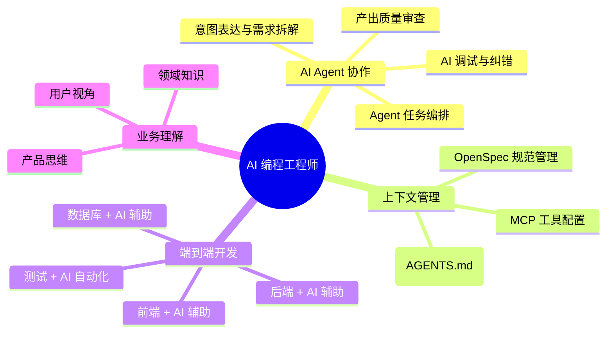

**关键能力变化**：

| 传统能力 | AI 时代能力 | 变化 |
|----------|-------------|------|
| 熟练掌握框架 API | 理解框架设计理念 | 从"记忆"到"理解" |
| 手写高质量代码 | 高效审查 AI 产出 | 从"生产"到"审查" |
| 单一技术栈深耕 | 跨栈全链路思维 | 从"专精"到"全局" |
| 解决技术难题 | 定义问题与约束 | 从"解题"到"出题" |
| 掌握调试工具 | AI 辅助调试 + 上下文诊断 | 从"手动"到"协作" |

### AI 编程架构师

当每个团队成员都在用 AI Agent 开发时，新问题出现了：

- **AI 产出一致性**：不同人给 AI 不同的上下文，产出的代码风格和架构差异大
- **上下文碎片化**：项目知识散落在个人的 Prompt 和记忆中
- **系统性失控**：快速迭代带来的技术债务无人管控
- **Agent 协调复杂度**：多 Agent 并行开发的冲突和依赖管理

**AI 编程架构师的核心职责**：

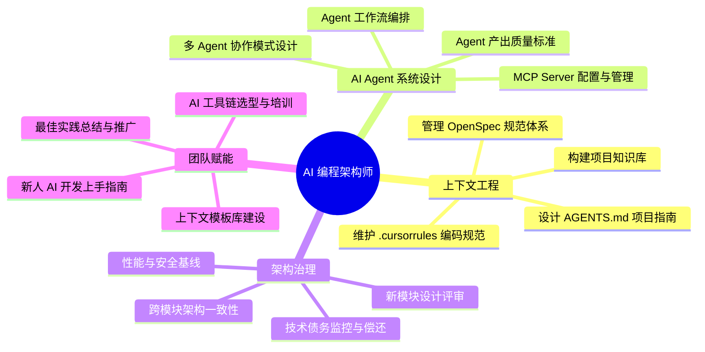

**AI 编程架构师的日常**：

```bash
# 晨会：审查 AI Agent 的隔夜产出
# 检查 Background Agent 的 PR
gh pr list --state open --label "ai-generated"

# 上午：维护项目上下文工程体系
# 更新 AGENTS.md 中的架构约束
# 优化 .cursorrules 中的编码规范
# 审查 OpenSpec 变更的架构合规性

# 下午：解决跨模块的架构问题
# 设计新模块的 Agent 工作流
# 配置 MCP Server 连接新的外部系统
# 编写上下文模板供团队使用

# 晚间：分析 AI 产出质量趋势
# 识别 AI 常见错误模式
# 优化上下文以减少 AI 幻觉
```

### 两个角色的关系

| 维度 | AI 编程工程师 | AI 编程架构师 |
|------|---------------|---------------|
| **定位** | 执行层——模块化开发的主力 | 规划层——AI 开发体系的设计者 |
| **比例** | 每模块 1-3 人 | 每业务线 1-2 人 |
| **核心技能** | Agent 协作 + 端到端开发 | 上下文工程 + 系统设计 |
| **产出** | 功能代码 + 测试 | 规范、上下文模板、架构决策 |
| **来源** | 原前端/后端/测试工程师 | 原架构师/技术负责人 |
| **价值** | 高效交付业务功能 | 保障 AI 产出的质量和一致性 |

## 实践指南：当下可以做什么

### 个人层面

**立即行动**：
1. **深度学习一款 AI 编码工具**——Cursor Agent Mode 或 Claude Code，达到日常开发中 70%+ 的工作由 AI 完成
2. **学习上下文工程**——理解 AGENTS.md、.cursorrules、OpenSpec 的设计思想，开始在项目中实践
3. **拓宽技术栈**——不需要精通另一端，但要理解全链路架构，让 AI 能替你补全
4. **培养审查能力**——从"写代码的人"转变为"审查代码的人"，提升架构判断力

**认知升级**：
- 从"我会写什么代码"到"我能让 AI 写出什么代码"
- 从"技术深度"到"系统思维 + 业务理解"
- 从"单一领域专家"到"全局视角的模块负责人"

### 团队层面

**短期（3 个月内）**：
1. 在团队中推广 AI 编程工具，设定效率基线
2. 选择一个模块试点 Spec-Driven + AI Agent 开发模式
3. 指定一名成员负责项目 AGENTS.md 和 .cursorrules 的维护
4. 开始积累 AI 编程的最佳实践和常见陷阱

**中期（6-12 个月）**：
1. 开始按业务模块重组小型团队
2. 建立上下文工程体系（OpenSpec + AGENTS.md + MCP）
3. 培养 1-2 名 AI 编程架构师
4. 建设团队的 AI 编程知识库

**长期（1-2 年）**：
1. 全面推行模块化团队组织
2. 建立多智能体协作工作流
3. 实现 Background Agent + 人类审查的开发模式
4. 持续优化上下文工程体系

### 组织层面

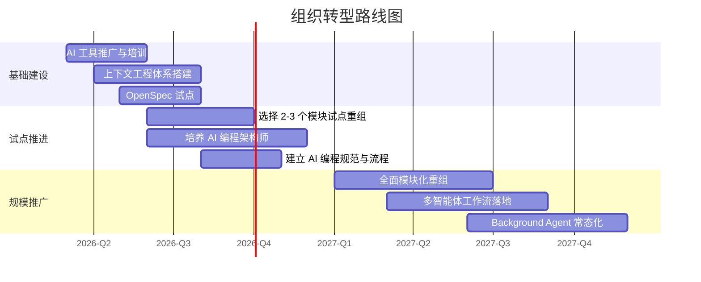

## 挑战与应对

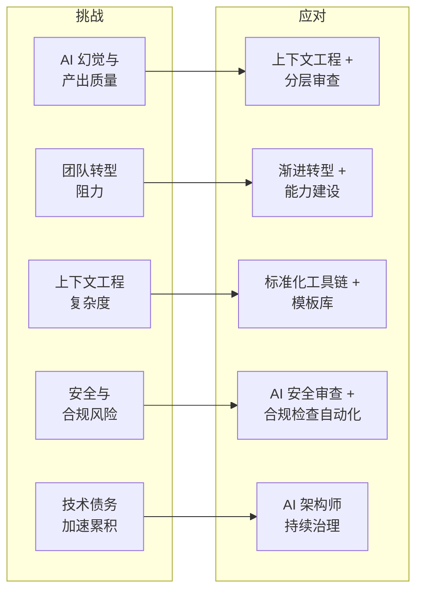

### 1. AI 幻觉与产出质量

**挑战**：AI 可能产出看似正确但实际有缺陷的代码，尤其在复杂业务逻辑中。

**应对**：
- **上下文工程是根本解法**——给 AI 越精确的上下文，幻觉越少
- 建立分层审查机制：AI Agent 自审 → 自动化测试 → 人工架构审查
- 在 AGENTS.md 中明确标注项目的关键约束和禁忌规则
- 利用 OpenSpec 的 Spec 作为 AI 产出的验证标准

### 2. 团队转型阻力

**挑战**：现有前端/后端/测试工程师对角色变化的抵触。

**应对**：
- 转型不是抛弃原有技能，而是**在原有技能上叠加 AI 协作能力**
- 让团队看到实际效率提升，用结果说话
- 给予充分的学习时间和支持
- 从志愿者开始试点，而非强制全员转型

### 3. 上下文工程的复杂度

**挑战**：维护高质量的项目上下文是一项持续性工作。

**应对**：
- 指定 AI 编程架构师专职负责
- 建立标准化的上下文模板（AGENTS.md 模板、OpenSpec 规范模板）
- 将上下文维护融入日常开发流程，而非额外负担
- 利用 AI 自身辅助上下文的维护和更新

### 4. 安全与合规

**挑战**：AI 生成的代码可能引入安全漏洞或合规问题。

**应对**：
- 在 AGENTS.md 中硬编码安全约束（如禁止明文存储密钥）
- 将安全扫描集成到 AI Agent 的工作流中
- 对敏感模块（支付、认证）保持更高比例的人工审查
- 建立 AI 代码的安全审计追溯机制

### 5. 技术债务加速累积

**挑战**：AI 高速生成代码，技术债务可能快速失控。

**应对**：
- AI 编程架构师持续监控代码质量指标
- 定期进行 AI 辅助的重构 sprint
- 在 OpenSpec 中维护架构演进规划
- 利用 AI Agent 自身进行技术债务识别和偿还

## 写在最后

**这不是未来预测，而是正在发生的现实。**

2025-2026 年，AI 编程工具已经从"辅助"跨入"驱动"阶段。2026-2028 年，模块化团队将成为前沿组织的标准配置。2028-2030 年，AI 原生组织将重新定义技术团队的存在意义。

**变革的速度比我们预想的更快。** 一年前，我们还在讨论 AI 能否写出合格的代码；今天，我们已经在讨论如何管理 AI Agent 集群的协作。

**对个体的建议**：

1. **立刻开始**——现在投入学习 AI 编程工具，不要等组织推动
2. **重塑定位**——从"代码生产者"转向"AI 协作者"和"系统思考者"
3. **投资上下文工程**——这是未来 3 年最有价值的技术能力
4. **保持业务敏感度**——AI 解决了"怎么做"，人的价值在于"做什么"

**对组织的建议**：

1. **小步快跑**——先在 1-2 个模块试点，积累经验后推广
2. **投资架构师**——尽早培养 AI 编程架构师，他们是转型的关键
3. **建设上下文工程体系**——AGENTS.md + OpenSpec + MCP 是基础设施
4. **拥抱效率衰减期**——转型初期效率可能暂时下降，这是正常的学习成本

技术的进步从来不会停止。**在 AI 时代，不是 AI 取代人，而是会用 AI 的人取代不会用的人。**

---

**相关文档**：
- [AI 驱动的端到端开发协作标准](./AI协作基础设施专题/AI驱动的端到端开发协作标准.md)
- [跨仓库 AI 协作方案：Spec 与上下文工程](./OpenSpec专题/跨仓库AI协作方案-Spec与上下文工程.md)
