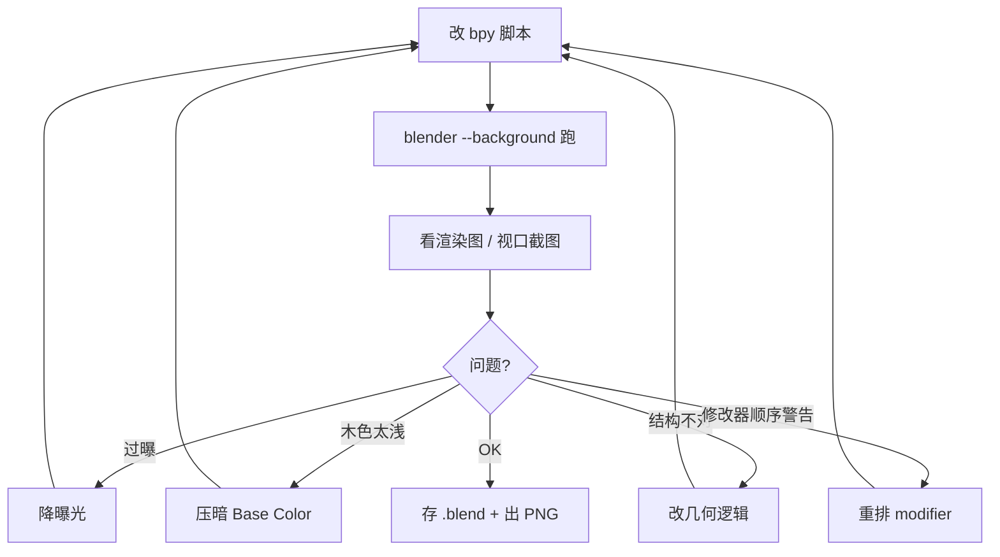

# AI 驱动 3D 建模：用 MCP 让 Agent 操作 Blender

## 前言

让 AI 帮你写代码已经很成熟了，那让 AI 帮你**建 3D 模型**呢？

这件事听起来玄，但通过 [MCP](https://modelcontextprotocol.io)（Model Context Protocol）其实可以落地：把 Blender 接成一个 MCP server，AI Agent 就能像调用工具一样操作 Blender——创建物体、调材质、打灯、渲染。

本文记录一次完整的实践：用开源项目 [`ahujasid/blender-mcp`](https://github.com/ahujasid/blender-mcp) 把 Agent 接进 Blender，做一个**胡桃木手机扩音器**的产品级渲染。过程里踩了不少坑，也看清了 AI 做 3D 建模的真实能力边界——它能做什么、在哪里会栽跟头，都比"AI 一句话生成模型"的宣传要具体得多。

## 一、blender-mcp 的架构

blender-mcp 由**两半**组成，理解这个结构是一切的前提：


**第一半：Blender 里的 addon。** 装好后叫 `blender_mcp_addon`，在 Blender GUI 里注册一个侧边栏面板（按 `N` 键调出，分类 `BlenderMCP`），有个 `Connect to Claude` 按钮。它在 Blender 进程里起一个 **TCP socket 服务器，监听 `127.0.0.1:9876`**，可以设置自启动。

**第二半：MCP server。** 用 `uvx blender-mcp` 启动，这是 MCP 协议侧的进程，供 Claude Desktop / Cursor 这类客户端调用。它作为客户端连到上面那个 9876 端口，把 MCP 工具调用翻译成 socket 命令发给 Blender。

环境要求：Blender 3+、Python 3.10+、`uv/uvx`。addon 会 `import requests`，好在 Blender 自带的 Python 里已经有，不用额外装。

### 一个必须知道的限制

addon 源码里写死了一条：

```
BlenderMCP: cannot start server in background mode (blender -b) - commands would never execute
```

也就是说，**`blender --background` 模式下 socket server 根本不会启动。** 想让 AI 实时驱动 Blender，必须开着 GUI。这就分出了两条技术路线：

- **GUI + MCP 实时驱动**：开着 Blender，Agent 一条条发命令，能看到模型实时"长出来"
- **`blender --background --python xx.py` 后台批处理**：一次性跑完脚本出图，适合迭代渲染

后面会看到，实际是两条路线混着用的。

### 接入 Claude Desktop

改 `claude_desktop_config.json`，在 `mcpServers` 里加一条（记得先备份、用 `python3 -m json.tool` 校验 JSON 合法）：

```json
"blender": {
  "command": "/opt/homebrew/bin/uvx",
  "args": ["--python", "3.11", "blender-mcp"],
  "env": { "UV_PYTHON_PREFERENCE": "only-managed" }
}
```

这里用 `uvx` 的**绝对路径**并 pin 到 Python 3.11 是有原因的：从 Dock 启动的 GUI 客户端拿不到 shell 的 PATH，写相对命令会找不到 `uvx`。

还有一个关键机制：**MCP server 是在会话启动时加载的，运行中的会话没法热挂新 server。** 改完配置必须重启客户端才能生效——这是我第一次尝试时"Agent 说找不到 Blender 工具"的根因。

## 二、MCP 的本质：远程执行 bpy

把 addon 源码翻开，MCP 工具面清晰起来。始终可用的基础 handler 有这些：

```python
handlers = {
    "get_scene_info": ...,           # 读场景信息
    "get_object_info": ...,          # 读某个物体信息
    "get_viewport_screenshot": ...,  # 截当前视口 —— Agent 靠它"看"场景
    "execute_code": ...,             # 执行任意 bpy Python —— 最核心
    "get_polyhaven_status": ...,
    # ... Sketchfab / Hyper3D / Hunyuan3D 等资产工具按面板开关条件启用
}
```

面板上开启对应开关后，还会启用资产类工具，比如 Poly Haven 的 `search_polyhaven_assets` / `download_polyhaven_asset` / `set_texture`，以及 Hyper3D Rodin、Sketchfab 的模型生成/下载。

但**最核心的一个是 `execute_code`**——它就是"在 Blender 主线程里跑一段任意 bpy Python"。理解到这一层，MCP 的神秘感就消失了：

> **所谓"AI 操作 Blender"，本质就是 AI 写一段 `bpy` 代码，通过 socket 发给 Blender 执行。**

socket 线协议极简，往 `127.0.0.1:9876` 发一行 JSON `{"type": "execute_code", "params": {"code": "..."}}`，读回 `{"status": "success"/"error", ...}`。一个最小客户端就能驱动它：

```python
import socket, json

def send_code(sock, code):
    payload = {"type": "execute_code", "params": {"code": code}}
    sock.sendall(json.dumps(payload).encode("utf-8"))
    data = sock.recv(1024 * 1024)
    response = json.loads(data.decode("utf-8"))
    if response.get("status") == "error":
        raise RuntimeError(response.get("message"))
    return response
```

addon 侧的 server 收到命令后，会用一个 wrapper **把代码丢回 Blender 主线程执行**——因为 `bpy` 不是线程安全的，socket 在后台线程收，执行必须回主线程。

### 一个真实的协议坑：独立命名空间

分步骤实时建模时撞到一个很隐蔽的坑：

> **`execute_code` 每次调用都是独立的命名空间，上一步 `def` 的函数，下一步取不到。**

这很反直觉——你以为在跟一个持续的 Python 会话对话，其实每条命令都是干净的新环境。解决办法是把需要跨命令复用的函数，挂到 Blender 的 `bpy.app.driver_namespace` 里持久化：

```python
# 第一步：把共享函数挂到 driver_namespace
bpy.app.driver_namespace["add_cube"] = add_cube
# 后续步骤：从 driver_namespace 取回来用
add_cube = bpy.app.driver_namespace["add_cube"]
```

## 三、程序化建模：AI 写的 bpy 长什么样

### 实时建房子

第一个练手目标是一栋带纹理的房子，诉求是"让人看到 AI 在**实时**绘制"。实现手法是：每建一个部件就发一条 `execute_code`，中间停顿并刷新视口：

```python
def redraw():
    bpy.ops.wm.redraw_timer(type="DRAW_WIN_SWAP", iterations=1)

def add_cube(name, location, scale, material):
    bpy.ops.mesh.primitive_cube_add(size=1, location=location)
    obj = bpy.context.object
    obj.name = name
    obj.dimensions = scale
    bpy.ops.object.transform_apply(location=False, rotation=False, scale=True)
    obj.data.materials.append(material)
    return obj
```

屋顶这种非规则形状，用 `from_pydata` 手搓顶点和面（一个带山墙的五面体）：

```python
verts = [(-2.35,-1.55,2.05),(2.35,-1.55,2.05),(2.35,1.55,2.05),
         (-2.35,1.55,2.05),(-2.35,0,3.15),(2.35,0,3.15)]
faces = [(0,1,2,3),(0,4,5,1),(3,2,5,4),(0,3,4),(1,5,2)]
mesh.from_pydata(verts, [], faces)
```

材质走**程序化 Principled BSDF + 着色器节点**：噪声纹理做墙面斑驳、Brick 纹理做屋顶瓦片、发光材质做一个"绘制光标"来强化实时感。

第一版出来是明显的"卡通假"。要往写实走，路径很清晰：

1. **换渲染引擎**：EEVEE → **Cycles**（`bpy.context.scene.render.engine`），采样调到 64~96，开环境光遮蔽
2. **真实 PBR 贴图**：从 [Poly Haven API](https://polyhaven.com) 拉真实材质（混凝土墙、屋顶、地砖、草地、碎石），每套下 Diffuse/Roughness/Normal/Displacement 四张图，做到建筑可视化（archviz）级别

### 胡桃木手机扩音器：产品级建模

真正的"产品级"目标是一个胡桃木手机扩音器（就是那种不插电、靠共鸣腔放大手机外放的木质底座）。需求来自一张尺寸图，Agent 先把尺寸读出来：`180×48×62` 的圆角长条，正面 `92×12` 的手机槽。建模用毫米→米换算：

```python
MM = 0.001
LENGTH = 180 * MM
DEPTH  = 62  * MM
HEIGHT = 48  * MM
```

主体是个**胶囊柱体**——用参数曲线生成圆角矩形截面，再沿一个轴挤出：

```python
def capsule_points(width, height, segments=32):
    radius = height / 2
    half = width / 2
    straight = half - radius
    pts = []
    for i in range(segments + 1):
        a = math.radians(90 - 180 * i / segments)
        pts.append((straight + radius*math.cos(a), radius*math.sin(a)))
    for i in range(segments + 1):
        a = math.radians(-90 - 180 * i / segments)
        pts.append((-straight + radius*math.cos(a), radius*math.sin(a)))
    return pts
```

开槽、挖孔用**布尔差集**（手机槽、声道口都靠它）：

```python
def boolean_difference(target, cutter):
    mod = target.modifiers.new("cut", "BOOLEAN")
    mod.operation = "DIFFERENCE"
    mod.object = cutter
    bpy.context.view_layer.objects.active = target
    bpy.ops.object.modifier_apply(modifier=mod.name)
    cutter.hide_viewport = True
    cutter.hide_render = True
```

胡桃木材质是重头戏——程序化木纹：`TexCoord` → `Mapping`（各向异性缩放）→ `ShaderNodeTexWave`（波类型 `RINGS`，高扭曲）做年轮 → ColorRamp 映射到深浅棕，另一路噪声接 `Bump` 做表面法线：

```python
bsdf.inputs["Base Color"].default_value = (0.30, 0.145, 0.065, 1)
bsdf.inputs["Roughness"].default_value = 0.42
wave.wave_type = "RINGS"
wave.inputs["Distortion"].default_value = 18
ramp.color_ramp.elements[0].color = (0.14, 0.065, 0.025, 1)  # 深棕
ramp.color_ramp.elements[1].color = (0.60, 0.32, 0.14, 1)    # 浅棕
```

## 四、迭代纠错循环（最能体现"AI 建模"的真实面貌）

AI 建模不是一次成型，而是一个闭环：**改脚本 → `blender --background --python` 跑 → 看渲染图 → 判断问题 → 再改。** 真实发生的几轮：



1. **过曝**：第一版曝光炸白，木纹被高光吃掉 → 降灯光和色彩管理曝光
2. **木色太浅（像枫木不像胡桃木）**：连续三轮下调 Base Color 高亮端，把"米黄高光"压成"巧克力棕"
3. **修改器顺序警告**：Bevel 修改器不在第一个位置报警告 → 把倒角/加权法线抽成一个函数，移到布尔开槽**之后**再加，警告消失

### 最大的一次纠错：语义理解错了

最有代表性的一轮，是 AI **把结构做错了**——它把"声道"做成了贴在正面的一块灰色装饰面。但声道不是装饰，是**功能性的共鸣通道**：手机放在顶部槽里，声音经由内部通道传导到正面开口被放大。

纠正它需要点明物理原理，然后 AI 才改对了三处：

- 正面的长条开口改成**真实的布尔挖孔**，向机身内部延伸，而不是一块贴面
- 手机槽底部加一个**声学耦合腔**，让"手机→内部通道→正面放大"这条声学路径在几何上成立
- 声道内壁用**吸光的纯黑材质**，和外圈可读的深灰分层，避免再被误读成"塞了块灰板"

这一轮暴露了 AI 建模的核心短板：**几何"看着像"和结构"逻辑对"是两回事。** AI 能很快做出一个形状上接近的东西，但它未必理解这个东西为什么长这样、每个特征承担什么功能。

每轮改动都做**双重验证**：`python3 -m py_compile` 查语法，Blender 后台实跑确认退出码为 0、`.blend` 和 PNG 的时间戳/哈希确实变了。渲染用 Cycles，单张约 220 采样、跑约 5 分钟。

## 五、对 AI 做 3D 建模的诚实评估

基于这次完整实践，给一个不吹不黑的评估。

**做得好的：**

- **程序化几何 + 布尔 + 程序化材质**这套组合，AI 生成得又快又完整，一版脚本就能出结构基本正确的产品模型。参数曲线、`from_pydata` 手搓网格、布尔挖孔这些，AI 写得相当熟练。
- **"看图→改参数"的视觉反馈闭环真实有效**。靠视口截图，AI 能自我诊断出过曝、木色偏浅这类问题并调参。
- **尺寸驱动建模很扎实**。从参考图读出 `180×48×62`、`92×12` 落到 mm 常量，尺寸精度没问题。

**明显的局限：**

- **语义理解会出错**。"声道"被做成装饰贴面，是靠人点出物理原理才纠正的——形似不等于神似。
- **材质调参靠反复试**。胡桃木色调了三四轮才从"枫木"压成"胡桃木"，纯靠目测渲染图迭代，没有一次到位。
- **平台/框架的坑不少**。`blender -b` 下 socket 不启动、`execute_code` 每次独立命名空间、GUI 客户端找不到 `uvx`、macOS 录屏权限——这些都得现场踩坑解决。
- **Cycles 渲染慢**（单张约 5 分钟）显著拉长了迭代周期，"改一版等 5 分钟看结果"的节奏会磨掉不少耐心。

## 结语

MCP 把 Blender 变成了 AI 可编程的对象，而拆穿了看，它做的事情朴素得很——**远程执行 bpy Python**。这个视角一旦建立，"AI 建模"就从魔法变成了工程：你在教 AI 写 `bpy` 脚本，并用渲染图给它反馈。

AI 在这里是一个上手快、但需要人把关结构逻辑的助手。它能替你写掉大量机械的几何和材质代码，把你从 API 细节里解放出来；但**"这个东西为什么这样设计"这个问题，目前还得人来回答。** 至少在这次实践里，最关键的一次进步，来自一句"声道是用来放大声音的，不是装饰"。
