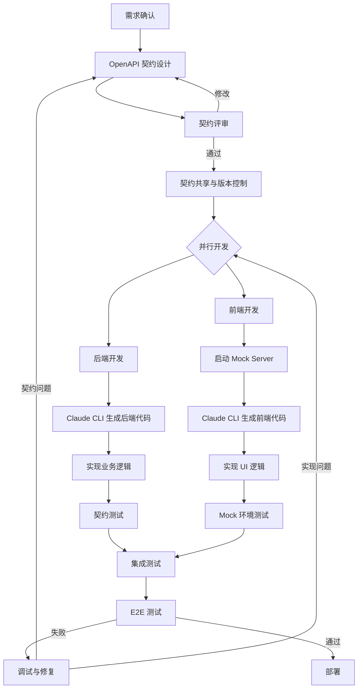
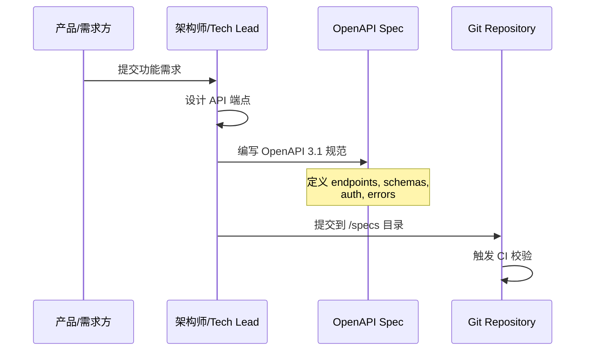
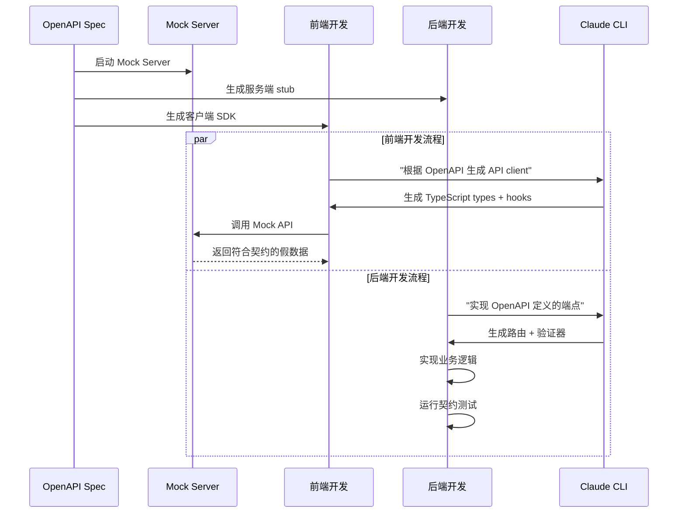
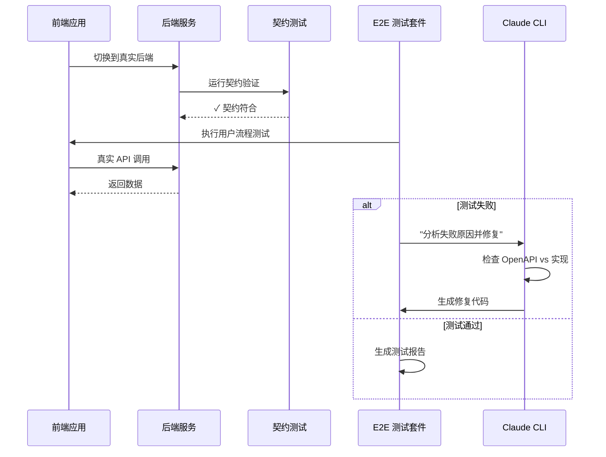
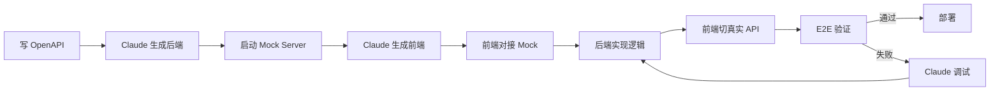

# AI 全栈开发协作流程标准

基于 Claude CLI + OpenAPI 的 Contract-First 开发模式

---

## 核心协作流程



---

## 详细阶段说明

### 阶段 1: 契约设计 (Contract Design)



**关键产物:**
- `openapi.yaml` - 单一真相源
- 包含完整的 schemas, paths, components
- 版本化管理 (语义化版本)

**核心原则:**
- API 契约先于代码实现
- 前后端团队共同评审契约
- 契约即文档，契约即测试基准

---

### 阶段 2: 并行开发 (Parallel Development)



**工具链:**
- **Mock Server**: Prism, Apidog, Beeceptor
- **代码生成**: openapi-generator, Claude CLI
- **契约测试**: Specmatic, Pact, Dredd

**关键优势:**
- 前后端完全解耦，无需等待
- Mock Server 提供符合契约的假数据
- 集成时前端零修改切换到真实后端

---

### 阶段 3: 集成与 E2E (Integration & E2E)



**测试层级:**
1. **契约测试** - 验证后端实现符合 OpenAPI 规范
2. **集成测试** - 验证前后端数据交互正确
3. **E2E 测试** - 验证完整用户流程

---

## 实施标准与最佳实践

### 1. OpenAPI 规范管理

```yaml
# 目录结构
project/
├── specs/
│   ├── openapi.yaml          # 主规范文件
│   ├── schemas/              # 可复用的 schemas
│   │   ├── user.yaml
│   │   └── product.yaml
│   └── versions/             # 历史版本
├── .github/workflows/
│   └── validate-spec.yml     # CI 自动校验
└── README.md
```

**规范要求:**
- 使用 OpenAPI 3.1+ 版本
- 所有端点必须包含完整的 request/response schemas
- 定义清晰的错误码和错误响应格式
- 包含认证/授权机制说明
- 添加详细的 description 和 examples

**示例 OpenAPI 片段:**

```yaml
openapi: 3.1.0
info:
  title: User Management API
  version: 1.0.0
paths:
  /api/users:
    post:
      summary: 创建用户
      operationId: createUser
      requestBody:
        required: true
        content:
          application/json:
            schema:
              $ref: '#/components/schemas/CreateUserRequest'
      responses:
        '201':
          description: 用户创建成功
          content:
            application/json:
              schema:
                $ref: '#/components/schemas/User'
        '400':
          description: 请求参数错误
          content:
            application/json:
              schema:
                $ref: '#/components/schemas/Error'
components:
  schemas:
    CreateUserRequest:
      type: object
      required:
        - email
        - name
      properties:
        email:
          type: string
          format: email
        name:
          type: string
          minLength: 2
    User:
      type: object
      properties:
        id:
          type: string
        email:
          type: string
        name:
          type: string
        createdAt:
          type: string
          format: date-time
    Error:
      type: object
      properties:
        code:
          type: string
        message:
          type: string
```

---

### 2. Claude CLI 工作流

#### 后端生成命令示例

```bash
# 生成后端路由和验证器
claude "根据 specs/openapi.yaml 生成 Express.js 路由，包含请求验证"

# 实现具体端点
claude "实现 POST /api/users 端点，符合 OpenAPI 规范中的定义"

# 生成契约测试
claude "为所有 API 端点生成 Specmatic 契约测试"

# 生成错误处理中间件
claude "根据 OpenAPI 错误定义生成统一错误处理中间件"
```

#### 前端生成命令示例

```bash
# 生成 TypeScript 类型
claude "从 specs/openapi.yaml 生成 TypeScript 类型定义"

# 生成 API client
claude "生成 React Query hooks，基于 OpenAPI 规范"

# 生成 Mock 数据
claude "为前端开发生成符合 schema 的 Mock 数据"

# 生成表单验证
claude "根据 OpenAPI schema 生成 Zod 验证规则"
```

---

### 3. 协作检查清单

#### 契约设计阶段
- [ ] OpenAPI 规范通过 Spectral/Redocly 校验
- [ ] 前后端团队共同评审契约
- [ ] 定义清晰的版本策略
- [ ] 契约提交到 Git 并打 tag
- [ ] 生成并发布 API 文档

#### 开发阶段
- [ ] Mock Server 正常运行
- [ ] 前端能够调用 Mock API
- [ ] 后端实现通过契约测试
- [ ] 代码生成的 types/stubs 与规范同步
- [ ] 错误处理符合契约定义

#### 集成阶段
- [ ] 前端切换到真实后端无需修改代码
- [ ] 所有契约测试通过
- [ ] E2E 测试覆盖核心用户流程
- [ ] API 文档自动生成并可访问
- [ ] 性能测试通过

---

### 4. 单人全栈快速迭代模式



**时间分配建议 (单功能迭代):**
- 契约设计: 20%
- 后端实现: 30%
- 前端实现: 30%
- 集成测试: 15%
- E2E 测试: 5%

**单人全栈工作流程:**

1. **上午: 契约 + 后端**
   - 编写 OpenAPI 规范
   - 用 Claude CLI 生成后端代码
   - 实现核心业务逻辑
   - 运行契约测试

2. **下午: 前端 + 集成**
   - 启动 Mock Server
   - 用 Claude CLI 生成前端代码
   - 实现 UI 和交互
   - 切换真实后端并测试

3. **晚上: E2E + 优化**
   - 运行 E2E 测试
   - 修复问题
   - 性能优化
   - 文档更新

---

## 工具推荐

### 必备工具

| 类别 | 工具 | 用途 |
|------|------|------|
| **OpenAPI 编辑** | Stoplight Studio, Swagger Editor | 可视化编辑 OpenAPI 规范 |
| **Mock Server** | Prism (推荐), Apidog | 基于 OpenAPI 生成 Mock API |
| **契约测试** | Specmatic, Dredd | 验证实现符合契约 |
| **代码生成** | openapi-generator + Claude CLI | 生成客户端/服务端代码 |
| **文档生成** | Redoc, Swagger UI | 自动生成 API 文档 |
| **CI/CD** | Spectral (lint), Portman (测试生成) | 自动化校验和测试 |

### Claude CLI Skills 推荐

- `automating-api-testing` - API 测试自动化
- `api-tests` - 契约验证
- `e2e` - E2E 测试执行与修复

### Mock Server 快速启动

```bash
# 使用 Prism
npm install -g @stoplight/prism-cli
prism mock specs/openapi.yaml

# 使用 Apidog (推荐用于团队协作)
# 导入 OpenAPI 规范后一键启动 Mock Server
```

---

## 落地验证路径

### 第一周: 后端优先验证

**目标:** 验证 OpenAPI → 后端代码 → 契约测试的完整流程

1. 选择一个简单的 CRUD 模块 (如用户管理)
2. 编写 OpenAPI 规范 (2-3 个端点)
3. 用 Claude CLI 生成后端代码
4. 实现业务逻辑并通过契约测试
5. 生成 API 文档

**验收标准:**
- OpenAPI 规范通过 Spectral 校验
- 所有端点通过 Specmatic 契约测试
- API 文档可访问

---

### 第二周: 前端集成验证

**目标:** 验证 Mock Server → 前端开发 → 真实后端切换的流程

1. 启动 Mock Server
2. 用 Claude CLI 生成前端 API client
3. 实现 UI 并对接 Mock API
4. 切换到真实后端
5. 运行 E2E 测试

**验收标准:**
- 前端能正常调用 Mock API
- 切换真实后端无需修改代码
- E2E 测试通过

---

### 第三周: 流程优化

**目标:** 建立自动化流程和最佳实践

1. 建立 CI/CD 自动化
   - OpenAPI 规范自动校验
   - 契约测试自动运行
   - E2E 测试自动执行
2. 优化 Claude CLI 提示词
3. 完善测试覆盖率
4. 文档化最佳实践

**验收标准:**
- CI/CD 流程完整运行
- 测试覆盖率 > 80%
- 团队协作流程文档完善

---

## 常见问题与解决方案

### Q1: OpenAPI 规范变更如何管理？

**解决方案:**
- 使用语义化版本 (semver)
- 重大变更 (breaking changes) 升级主版本号
- 向后兼容的新增功能升级次版本号
- 保留历史版本在 `specs/versions/` 目录
- 使用 Git tag 标记每个版本

### Q2: 前后端对 OpenAPI 理解不一致怎么办？

**解决方案:**
- 契约评审会议，前后端共同参与
- 使用 Swagger UI 可视化展示契约
- 添加详细的 description 和 examples
- Mock Server 作为共同参考实现

### Q3: 如何处理复杂的业务逻辑？

**解决方案:**
- OpenAPI 只定义接口契约，不涉及业务逻辑
- 业务逻辑在后端实现层完成
- 使用 Claude CLI 辅助生成业务逻辑框架
- 契约测试只验证接口符合性，不验证业务逻辑

### Q4: E2E 测试失败如何快速定位问题？

**解决方案:**
1. 先运行契约测试，确认后端符合 OpenAPI
2. 检查前端 API client 是否与 OpenAPI 同步
3. 使用 Claude CLI 分析测试日志
4. 对比 Mock Server 响应和真实后端响应

---

## 成功指标

### 开发效率
- 单功能开发周期缩短 40%+
- 前后端集成问题减少 70%+
- API 文档自动生成，无需手动维护

### 代码质量
- 契约测试覆盖率 100%
- E2E 测试覆盖率 > 80%
- API 接口一致性 100%

### 团队协作
- 前后端并行开发，无阻塞
- 单人可独立完成全栈功能
- 新成员上手时间缩短 50%+

---

## 参考资源

### 核心概念
- [Contract-First API Development](https://specmatic.io/updates/build-apps-from-api-specs-using-ai-self-correcting-contract-driven-agentic-workflows-with-specmatic/)
- [API-First Strategy Guide](https://nordicapis.com/a-software-architects-guide-to-api-first-strategy/)
- [OpenAPI Specification 2026](https://www.xano.com/blog/openapi-specification-the-definitive-guide/)

### 工具文档
- [Prism Mock Server](https://stoplight.io/open-source/prism)
- [Specmatic Contract Testing](https://specmatic.io/)
- [Apidog API Development Platform](https://apidog.com/)

### AI 辅助开发
- [Claude CLI API Testing Guide](https://www.apidog.com/blog/apidog-cli-claude-skills-api-test-automation-guide/)
- [AI-Driven Full Stack Development](https://samsongama.com/posts/ai-full-stack/)

---

## 附录: 完整示例项目结构

```
my-fullstack-project/
├── specs/
│   ├── openapi.yaml
│   ├── schemas/
│   │   ├── user.yaml
│   │   ├── product.yaml
│   │   └── order.yaml
│   └── versions/
│       └── v1.0.0.yaml
├── backend/
│   ├── src/
│   │   ├── routes/          # 从 OpenAPI 生成
│   │   ├── validators/      # 从 OpenAPI 生成
│   │   ├── services/        # 业务逻辑
│   │   └── models/
│   └── tests/
│       └── contract/        # Specmatic 测试
├── frontend/
│   ├── src/
│   │   ├── api/
│   │   │   ├── client.ts    # 从 OpenAPI 生成
│   │   │   └── types.ts     # 从 OpenAPI 生成
│   │   ├── components/
│   │   └── hooks/
│   └── tests/
│       └── e2e/
├── .github/
│   └── workflows/
│       ├── validate-spec.yml
│       ├── contract-test.yml
│       └── e2e-test.yml
├── docs/
│   └── api/                 # 自动生成的 API 文档
└── README.md
```

---

**文档版本:** 1.0.0  
**最后更新:** 2026-03-05  
**适用场景:** AI 全栈开发、单人全栈、小团队快速迭代
