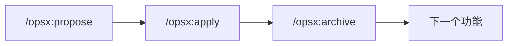
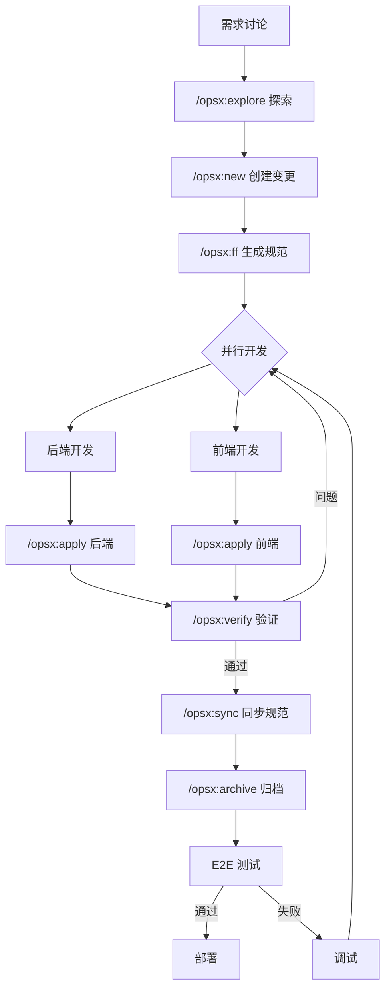
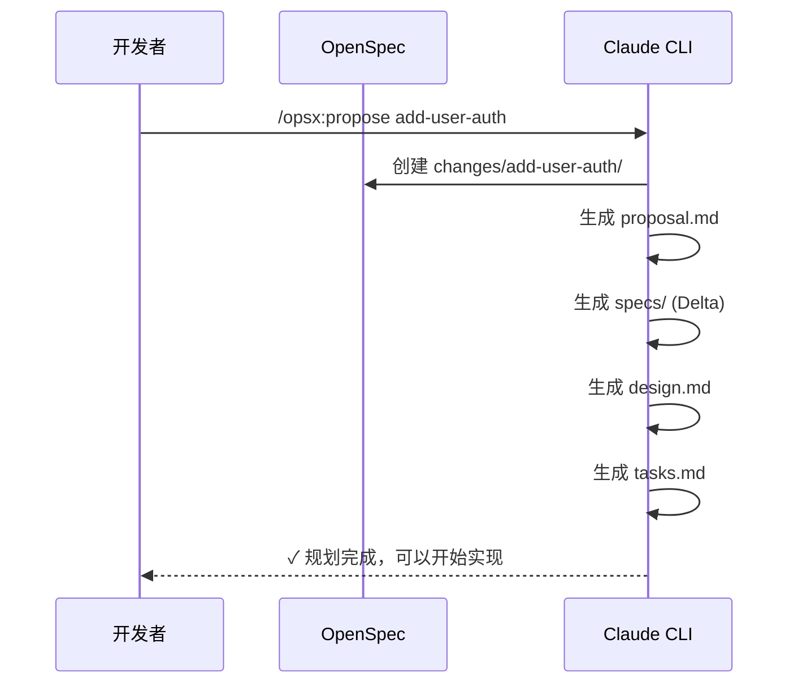
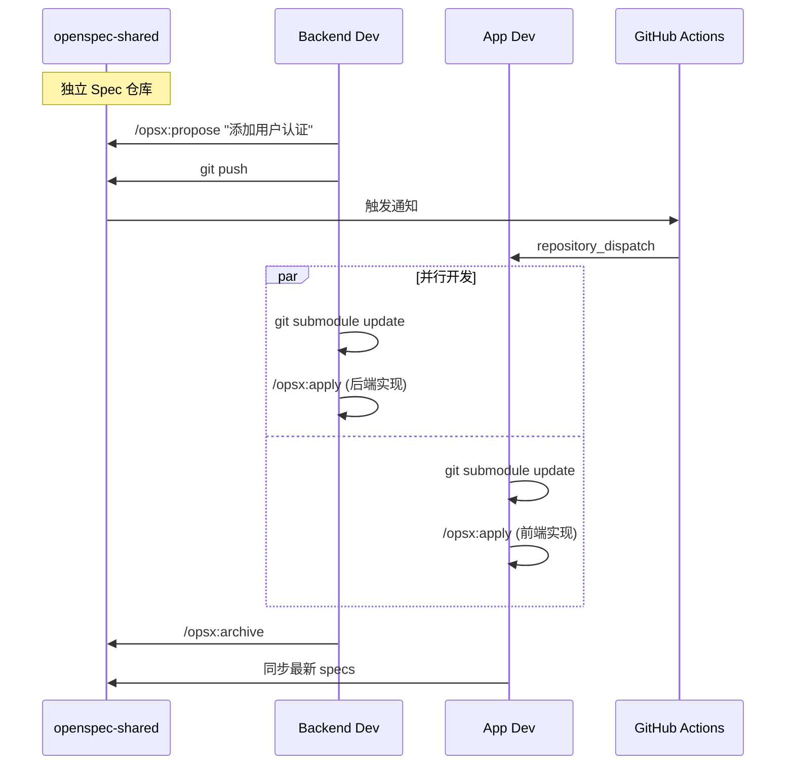
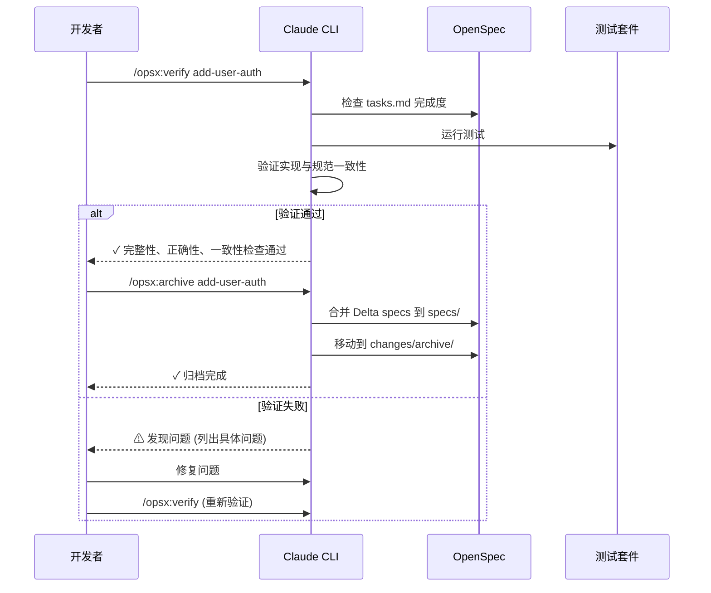
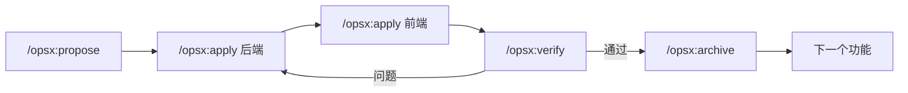
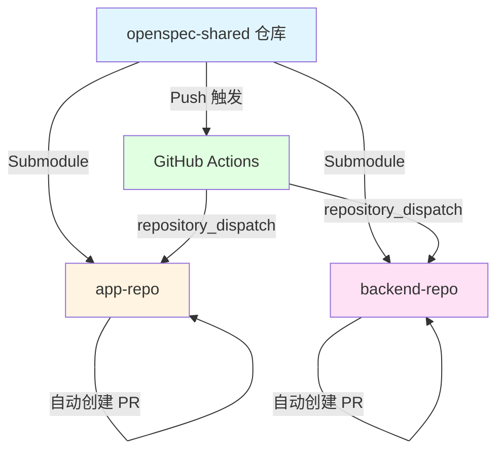

# AI 全栈开发协作流程标准

基于 Claude CLI + OpenSpec 的 Spec-Driven 开发模式

---

## 核心理念

OpenSpec 哲学：
- **流动而非僵化** (fluid not rigid)
- **迭代而非瀑布** (iterative not waterfall)  
- **简单而非复杂** (easy not complex)
- **行动而非阶段** (actions not phases)

## 核心协作流程

### 快速路径 (推荐单人全栈)



### 完整路径 (团队协作/复杂需求)



---

## OpenSpec 项目结构

### 单仓库模式

```yaml
project/
├── openspec/
│   ├── specs/                    # 真相源 - 系统当前行为规范
│   │   ├── auth/
│   │   │   └── spec.md
│   │   ├── api/
│   │   │   └── spec.md
│   │   └── ui/
│   │       └── spec.md
│   ├── changes/                  # 进行中的变更
│   │   ├── add-dark-mode/
│   │   │   ├── proposal.md       # 为什么做、做什么
│   │   │   ├── specs/            # Delta 规范 (变更内容)
│   │   │   │   └── ui/
│   │   │   │       └── spec.md
│   │   │   ├── design.md         # 技术方案
│   │   │   └── tasks.md          # 实现清单
│   │   └── fix-login-bug/
│   │       └── ...
│   └── config.yaml               # 项目配置
├── src/                          # 源代码
├── tests/                        # 测试
└── README.md
```

### 跨仓库模式 (推荐用于前后端分离)

```yaml
# 独立 Spec 仓库
openspec-shared/
├── openspec/
│   ├── specs/
│   │   ├── api/          # Backend 维护
│   │   ├── auth/         # Backend 维护
│   │   ├── data/         # 共同维护
│   │   └── ui/           # App 维护
│   ├── changes/
│   └── config.yaml
├── schemas/
│   └── openapi.yaml      # API 契约 (可选)
└── scripts/
    └── sync.sh

# App 仓库
app-repo/
├── openspec-shared/      # Git Submodule
├── .openspec -> openspec-shared/openspec
├── src/
└── package.json

# Backend 仓库
backend-repo/
├── openspec-shared/      # Git Submodule
├── .openspec -> openspec-shared/openspec
├── src/
└── package.json
```

**核心概念:**
- **specs/** - 系统当前状态的规范文档
- **changes/** - 每个变更独立文件夹，包含所有相关制品
- **Delta Specs** - 显示 ADDED/MODIFIED/REMOVED 的增量规范
- **跨仓库共享** - 使用 Git Submodule 实现 App 和 Backend 的规范同步

---

## 详细阶段说明

### 阶段 1: 规范设计 (Spec Design)



**关键产物:**

1. **proposal.md** - 意图和范围
```markdown
# Proposal: Add User Authentication

## Intent
实现用户认证系统，支持邮箱密码登录

## Scope
- 用户注册和登录
- JWT token 管理
- 密码加密存储

## Approach
使用 Passport.js + JWT 策略
```

2. **specs/auth/spec.md** - Delta 规范
```markdown
# Delta for Auth

## ADDED Requirements

### Requirement: User Registration
系统必须允许用户通过邮箱和密码注册

#### Scenario: 成功注册
- GIVEN 用户提供有效邮箱和密码
- WHEN 提交注册表单
- THEN 创建新用户账户
- AND 返回 JWT token

#### Scenario: 邮箱已存在
- GIVEN 邮箱已被注册
- WHEN 尝试注册
- THEN 返回 400 错误
- AND 提示邮箱已存在
```

3. **design.md** - 技术方案
```markdown
# Design: User Authentication

## Architecture
- Express.js 中间件
- Passport.js 认证策略
- bcrypt 密码加密
- JWT token 签发

## API Endpoints
- POST /api/auth/register
- POST /api/auth/login
- GET /api/auth/me (需要认证)

## Database Schema
User {
  id: UUID
  email: String (unique)
  passwordHash: String
  createdAt: DateTime
}
```

4. **tasks.md** - 实现清单
```markdown
# Tasks

## 1. 后端基础设施
- [ ] 1.1 安装依赖 (passport, bcrypt, jsonwebtoken)
- [ ] 1.2 创建 User model
- [ ] 1.3 配置 Passport JWT 策略

## 2. API 端点
- [ ] 2.1 实现 POST /api/auth/register
- [ ] 2.2 实现 POST /api/auth/login
- [ ] 2.3 实现 GET /api/auth/me

## 3. 前端集成
- [ ] 3.1 创建 auth API client
- [ ] 3.2 实现登录表单
- [ ] 3.3 实现 token 存储和刷新
```

---

### 阶段 2: 并行开发 (Parallel Development)

#### 跨仓库协作模式



#### 同步工作流

**初始化 (一次性):**
```bash
# 1. 创建独立 Spec 仓库
mkdir openspec-shared && cd openspec-shared
git init && openspec init

# 2. App 仓库集成
cd app-repo
git submodule add <spec-repo-url> openspec-shared
ln -s openspec-shared/openspec .openspec

# 3. Backend 仓库集成
cd backend-repo
git submodule add <spec-repo-url> openspec-shared
ln -s openspec-shared/openspec .openspec
```

**日常同步:**
```bash
# 拉取最新 specs
npm run sync-specs
# 或
git submodule update --remote openspec-shared

# 自动同步脚本 (package.json)
{
  "scripts": {
    "sync-specs": "git submodule update --remote openspec-shared",
    "predev": "npm run sync-specs"
  }
}
```

**关键优势:**
- 前后端基于同一份 specs 并行开发
- Spec 变更自动通知相关仓库 (GitHub Actions)
- 版本化管理，支持锁定特定版本
- 清晰的职责划分 (api/ 由 Backend 维护，ui/ 由 App 维护)

**实际操作:**

后端开发者:
```bash
# 同步最新 specs
cd backend-repo
npm run sync-specs

# 实现后端任务
/opsx:apply add-user-auth

# 归档并推送到 spec 仓库
cd openspec-shared
/opsx:archive add-user-auth
git push
```

前端开发者:
```bash
# 收到通知，同步 specs
cd app-repo
npm run sync-specs

# 查看变更
cd openspec-shared
openspec list

# 实现前端任务
cd ..
/opsx:apply add-user-auth
```

---

### 阶段 3: 验证与归档 (Verify & Archive)



**验证维度:**

| 维度 | 检查内容 |
|------|---------|
| **完整性** | 所有 tasks 完成、所有需求已实现、场景已覆盖 |
| **正确性** | 实现符合规范意图、边界情况已处理 |
| **一致性** | 设计决策体现在代码中、命名和模式一致 |

**归档流程:**
```bash
# 验证实现
/opsx:verify add-user-auth

# 归档变更
/opsx:archive add-user-auth

# OpenSpec 会:
# 1. 将 Delta specs 合并到主 specs/
# 2. 移动变更到 archive/
# 3. 保留审计历史
```

---

## 实施标准与最佳实践

### 1. OpenSpec 规范管理

**初始化项目:**
```bash
cd your-project
openspec init

# 选择配置 profile (core 或 expanded)
openspec config profile

# 更新 AI 指令
openspec update
```

**规范编写标准:**

```markdown
# Spec 模板

## Requirements

### Requirement: [需求名称]
[需求描述 - 使用 MUST/SHALL/SHOULD]

#### Scenario: [场景名称]
- GIVEN [前置条件]
- WHEN [触发动作]
- THEN [预期结果]
- AND [额外断言]

#### Scenario: [边界情况]
- GIVEN [异常前置条件]
- WHEN [触发动作]
- THEN [错误处理]
```

**Delta Spec 示例:**

```markdown
# Delta for API

## ADDED Requirements

### Requirement: Rate Limiting
API 必须对每个用户实施速率限制

#### Scenario: 超出限制
- GIVEN 用户在 1 分钟内发送了 100 个请求
- WHEN 发送第 101 个请求
- THEN 返回 429 Too Many Requests
- AND 包含 Retry-After header

## MODIFIED Requirements

### Requirement: Authentication Timeout
会话超时时间从 60 分钟改为 30 分钟

## REMOVED Requirements

### Requirement: Remember Me
(已弃用，改用 2FA)
```

---

### 2. Claude CLI 工作流

#### 快速路径 (单人全栈)

```bash
# 1. 提出变更并生成规划
You: /opsx:propose "添加用户认证功能"

AI: ✓ 创建 openspec/changes/add-user-auth/
    ✓ proposal.md
    ✓ specs/auth/spec.md (Delta)
    ✓ design.md
    ✓ tasks.md
    准备开始实现！

# 2. 实现
You: /opsx:apply

AI: 实现 tasks.md 中的任务...
    ✓ 1.1 创建 User model
    ✓ 1.2 实现注册端点
    ✓ 2.1 实现登录端点
    ...
    所有任务完成！

# 3. 归档
You: /opsx:archive

AI: ✓ 合并 specs 到 openspec/specs/auth/
    ✓ 移动到 archive/2026-03-05-add-user-auth/
    完成！
```

#### 探索式路径 (复杂需求)

```bash
# 1. 探索问题空间
You: /opsx:explore

AI: 你想探索什么？

You: 如何优化我们的 API 性能？

AI: 让我分析一下...
    发现 3 个瓶颈:
    1. N+1 查询问题
    2. 缺少缓存层
    3. 大量同步 I/O
    
    建议优先处理 N+1 查询问题

# 2. 创建变更
You: /opsx:new optimize-api-queries

# 3. 逐步生成制品
You: /opsx:continue

AI: 创建 proposal.md...
    下一步: specs, design
    
You: /opsx:continue

AI: 创建 specs/...
    下一步: design

# 或者快速生成所有制品
You: /opsx:ff

AI: ✓ proposal.md
    ✓ specs/
    ✓ design.md
    ✓ tasks.md
```

#### 并行变更管理

```bash
# 正在开发功能 A
You: /opsx:apply add-dark-mode

# 突然需要修复紧急 bug
You: /opsx:propose "修复登录重定向问题"
You: /opsx:apply fix-login-redirect

AI: 实现修复...
    ✓ 完成

You: /opsx:archive fix-login-redirect

# 回到功能 A
You: /opsx:apply add-dark-mode

AI: 继续 add-dark-mode...
    从任务 2.3 继续...

# 批量归档多个完成的变更
You: /opsx:bulk-archive

AI: 发现 3 个已完成的变更:
    - add-dark-mode
    - fix-login-redirect  
    - update-footer
    
    检查规范冲突...
    ✓ 无冲突
    
    归档所有 3 个变更？

You: 是

AI: ✓ 已归档所有变更
```

---

### 3. 协作检查清单

#### 规范设计阶段
- [ ] 运行 `openspec init` 初始化项目
- [ ] 使用 `/opsx:propose` 或 `/opsx:new` 创建变更
- [ ] 确保 proposal.md 清晰描述意图和范围
- [ ] Delta specs 包含完整的场景和边界情况
- [ ] design.md 说明技术方案和架构决策
- [ ] tasks.md 分解为可执行的小任务

#### 开发阶段
- [ ] 使用 `/opsx:apply` 实现任务
- [ ] 前后端基于同一份 specs 并行开发
- [ ] 定期运行 `openspec list` 查看进度
- [ ] 使用 `openspec show <change>` 查看变更详情
- [ ] 保持 tasks.md 更新 (勾选完成的任务)

#### 验证阶段
- [ ] 运行 `/opsx:verify` 验证实现
- [ ] 检查完整性 (所有任务完成)
- [ ] 检查正确性 (实现符合规范)
- [ ] 检查一致性 (代码与设计一致)
- [ ] 运行 E2E 测试

#### 归档阶段
- [ ] 使用 `/opsx:sync` 同步 specs (可选)
- [ ] 使用 `/opsx:archive` 归档变更
- [ ] 确认 Delta specs 已合并到主 specs/
- [ ] 变更已移动到 archive/ 目录
- [ ] 更新项目文档

---

### 4. 单人全栈快速迭代模式



**时间分配建议 (单功能迭代):**
- 规范设计: 15% (AI 辅助快速生成)
- 后端实现: 35%
- 前端实现: 35%
- 验证测试: 15%

**单人全栈工作流程:**

**上午: 规范 + 后端**
```bash
# 9:00 - 9:30: 规范设计
/opsx:propose "添加产品评论功能"

# 9:30 - 12:00: 后端实现
/opsx:apply add-product-reviews
# AI 实现后端 API、数据库模型、业务逻辑
```

**下午: 前端 + 集成**
```bash
# 13:00 - 16:00: 前端实现
/opsx:apply add-product-reviews
# AI 实现前端组件、API 集成、UI 交互

# 16:00 - 17:00: 验证和归档
/opsx:verify add-product-reviews
/opsx:archive add-product-reviews
```

**关键技巧:**
- 使用 `/opsx:propose` 快速生成规划，无需手写规范
- 让 AI 按照 tasks.md 自动实现，减少手动编码
- 利用 `/opsx:verify` 自动检查实现质量
- 保持变更小而聚焦，快速迭代

---

## 工具推荐

### 必备工具

| 类别 | 工具 | 用途 |
|------|------|------|
| **规范框架** | OpenSpec | Spec-Driven Development 核心框架 |
| **AI 助手** | Claude CLI, Cursor, Windsurf | 支持 OpenSpec 的 AI 编码工具 |
| **测试框架** | Vitest, Jest, Playwright | 单元测试和 E2E 测试 |
| **文档生成** | OpenSpec Dashboard | 可视化查看变更和规范 |
| **版本控制** | Git | 代码和规范版本管理 |

### OpenSpec 支持的 AI 工具

OpenSpec 支持 20+ AI 编码助手，包括:
- **Claude Code** (推荐)
- **Cursor**
- **Windsurf**
- **Kiro**
- **Cline**
- **Aider**
- **GitHub Copilot**
- 更多工具查看: [Supported Tools](https://github.com/Fission-AI/OpenSpec/blob/main/docs/supported-tools.md)

### CLI 命令速查

```bash
# 项目管理
openspec init                    # 初始化项目
openspec config profile          # 配置 profile (core/expanded)
openspec update                  # 更新 AI 指令

# 查看状态
openspec list                    # 列出所有变更
openspec show <change>           # 查看变更详情
openspec view                    # 打开交互式 Dashboard

# 验证
openspec validate <change>       # 验证规范格式
```

### AI 命令速查 (Slash Commands)

**Core Profile (默认):**
- `/opsx:propose <idea>` - 创建变更并生成所有规划制品
- `/opsx:explore` - 探索问题空间
- `/opsx:apply [change]` - 实现任务
- `/opsx:archive <change>` - 归档变更

**Expanded Profile (可选):**
- `/opsx:new <change>` - 创建变更脚手架
- `/opsx:continue [change]` - 创建下一个制品
- `/opsx:ff [change]` - 快速生成所有规划制品
- `/opsx:verify <change>` - 验证实现
- `/opsx:sync <change>` - 同步 specs
- `/opsx:bulk-archive` - 批量归档
- `/opsx:onboard` - 项目入职指南

---

## 落地验证路径

### 第一周: 后端优先验证

**目标:** 验证 OpenSpec → 后端代码 → 测试的完整流程

**步骤:**
1. 安装 OpenSpec
   ```bash
   npm install -g @fission-ai/openspec@latest
   cd your-project
   openspec init
   ```

2. 创建第一个变更 (用户认证)
   ```bash
   # 在 Claude CLI 中
   /opsx:propose "实现用户注册和登录功能"
   ```

3. 实现后端
   ```bash
   /opsx:apply add-user-auth
   ```

4. 验证和归档
   ```bash
   /opsx:verify add-user-auth
   /opsx:archive add-user-auth
   ```

**验收标准:**
- ✓ OpenSpec 项目结构创建成功
- ✓ proposal.md, specs/, design.md, tasks.md 生成
- ✓ 后端代码实现并通过测试
- ✓ 变更成功归档到 archive/

---

### 第二周: 前端集成验证

**目标:** 验证前后端并行开发和集成流程

**步骤:**

1. **设置跨仓库协作**
   ```bash
   # 创建独立 Spec 仓库
   mkdir openspec-shared && cd openspec-shared
   git init && openspec init
   git remote add origin <your-repo-url>
   git push -u origin main
   
   # App 仓库集成
   cd app-repo
   git submodule add <spec-repo-url> openspec-shared
   ln -s openspec-shared/openspec .openspec
   
   # Backend 仓库集成
   cd backend-repo
   git submodule add <spec-repo-url> openspec-shared
   ln -s openspec-shared/openspec .openspec
   ```

2. **配置自动同步**
   ```json
   // package.json (App & Backend)
   {
     "scripts": {
       "sync-specs": "git submodule update --remote openspec-shared",
       "predev": "npm run sync-specs"
     }
   }
   ```

3. **创建前端功能变更**
   ```bash
   # Backend 在 spec 仓库创建变更
   cd openspec-shared
   /opsx:propose "实现用户登录界面和 API"
   /opsx:archive add-login-ui
   git push
   ```

4. **并行开发**
   ```bash
   # Backend 开发者
   cd backend-repo
   npm run sync-specs
   /opsx:apply add-login-ui  # 实现 API
   
   # App 开发者 (同时进行)
   cd app-repo
   npm run sync-specs
   /opsx:apply add-login-ui  # 实现 UI
   ```

5. **集成测试**
   ```bash
   # 运行 E2E 测试
   npm run test:e2e
   ```

6. **验证和归档**
   ```bash
   /opsx:verify add-login-ui
   
   # 在 spec 仓库归档
   cd openspec-shared
   /opsx:archive add-login-ui
   git push
   ```

**验收标准:**
- ✓ 独立 Spec 仓库创建成功
- ✓ App 和 Backend 通过 submodule 集成
- ✓ 自动同步脚本配置完成
- ✓ 前后端基于同一份 specs 并行开发
- ✓ 前端成功调用后端 API
- ✓ E2E 测试通过
- ✓ 变更成功归档到 spec 仓库

---

### 第三周: 流程优化

**目标:** 建立团队协作流程和自动化

**步骤:**

1. **配置 GitHub Actions 自动通知**
   ```yaml
   # openspec-shared/.github/workflows/notify.yml
   name: Notify Spec Consumers
   
   on:
     push:
       branches: [main]
       paths: ['openspec/specs/**']
   
   jobs:
     notify:
       runs-on: ubuntu-latest
       steps:
         - uses: actions/checkout@v3
         - name: Notify App Repo
           uses: peter-evans/repository-dispatch@v2
           with:
             token: ${{ secrets.PAT_TOKEN }}
             repository: your-org/app-repo
             event-type: spec-updated
         - name: Notify Backend Repo
           uses: peter-evans/repository-dispatch@v2
           with:
             token: ${{ secrets.PAT_TOKEN }}
             repository: your-org/backend-repo
             event-type: spec-updated
   ```

2. **配置自动同步 PR**
   ```yaml
   # app-repo/.github/workflows/sync-specs.yml
   name: Sync OpenSpec
   
   on:
     repository_dispatch:
       types: [spec-updated]
   
   jobs:
     sync:
       runs-on: ubuntu-latest
       steps:
         - uses: actions/checkout@v3
           with:
             submodules: true
         - name: Update Submodule
           run: |
             git submodule update --remote openspec-shared
             git add openspec-shared
         - name: Create PR
           uses: peter-evans/create-pull-request@v5
           with:
             title: "🔄 Sync OpenSpec Specs"
             body: "自动同步 OpenSpec 规范变更"
             branch: sync-openspec
   ```

3. **建立 Git 工作流**
   ```bash
   # .gitignore
   .openspec
   
   # 提交规范
   git commit -m "feat(api): add user avatar upload
   
   - ADDED: POST /api/users/:id/avatar
   - MODIFIED: GET /api/users/:id
   - Affects: app-repo, backend-repo"
   ```

4. **创建同步脚本**
   ```bash
   # scripts/sync-openspec.sh
   #!/bin/bash
   git submodule update --init --remote openspec-shared
   ln -sf openspec-shared/openspec .openspec
   echo "✅ OpenSpec synced"
   
   # 显示最近变更
   cd openspec-shared
   git log -3 --oneline
   ```

5. **团队协作规范**
   - 每个功能一个独立的 change
   - Backend 负责维护 `specs/api/` 和 `specs/auth/`
   - App 负责维护 `specs/ui/`
   - 共同维护 `specs/data/`
   - 使用 `/opsx:verify` 验证后再归档
   - 定期运行 `/opsx:bulk-archive` 清理完成的变更

6. **文档化最佳实践**
   - 创建团队 OpenSpec 使用指南
   - 记录跨仓库协作流程
   - 分享成功案例

**验收标准:**
- ✓ GitHub Actions 自动通知配置完成
- ✓ Spec 变更自动触发 App/Backend PR
- ✓ 同步脚本正常工作
- ✓ 团队成员熟悉跨仓库协作流程
- ✓ 建立清晰的职责划分和协作规范
- ✓ 至少完成 3 个完整的跨仓库功能迭代

---

## 常见问题与解决方案

### Q1: OpenSpec 和 OpenAPI 有什么区别？

**OpenSpec** 是一个 Spec-Driven Development 框架，用于管理需求规范、设计文档和任务清单。它关注的是"要构建什么"和"如何构建"。

**OpenAPI** 是 API 接口规范标准，用于描述 REST API 的端点、参数、响应等。它关注的是"API 契约"。

**两者可以结合使用:**
- 在 OpenSpec 的 `design.md` 中引用 OpenAPI 规范
- 在 `specs/` 中描述 API 行为需求
- 使用 OpenAPI 生成代码，使用 OpenSpec 管理开发流程

### Q2: 如何处理规范变更？

**解决方案:**
- 规范是流动的，可以随时更新
- 在实现过程中发现问题，直接更新对应的制品
- 使用 `/opsx:continue` 重新生成制品
- OpenSpec 不强制阶段锁定，支持迭代式开发

```bash
# 发现设计需要调整
# 直接编辑 design.md 或让 AI 重新生成
/opsx:continue add-feature

AI: 检测到 design.md 已存在
    是否重新生成? (y/n)

You: y

AI: 基于最新理解重新生成 design.md...
```

### Q3: 多人协作时如何避免冲突？

**解决方案:**

**1. 变更隔离** - 每个人在独立的 change 文件夹中工作
```bash
# 团队成员 A
/opsx:propose "添加深色模式"
/opsx:apply add-dark-mode

# 团队成员 B (同时进行)
/opsx:propose "优化页面加载"
/opsx:apply optimize-loading
```

**2. 跨仓库协作** - 使用独立 Spec 仓库
```bash
# Backend 开发者在 spec 仓库提交变更
cd openspec-shared
/opsx:propose "添加用户头像上传 API"
/opsx:archive add-avatar-upload
git push

# App 开发者自动收到通知
cd app-repo
npm run sync-specs  # 自动拉取最新 specs
```

**3. 规范共享** - 主 `specs/` 目录作为共同参考
```yaml
openspec-shared/
├── specs/
│   ├── api/          # Backend 负责维护
│   ├── auth/         # Backend 负责维护
│   ├── data/         # 共同维护
│   └── ui/           # App 负责维护
```

**4. 批量归档** - 使用 `/opsx:bulk-archive` 自动检测冲突
```bash
/opsx:bulk-archive

AI: 检测到 add-dark-mode 和 optimize-loading
    都修改了 specs/ui/spec.md
    
    检查代码实现...
    两个变更互不冲突
    
    按时间顺序归档:
    1. add-dark-mode
    2. optimize-loading
```

**5. 版本锁定** - 锁定特定 spec 版本避免意外变更
```bash
# 锁定到稳定版本
cd app-repo/openspec-shared
git checkout v1.2.0
cd ..
git add openspec-shared
git commit -m "chore: lock openspec to v1.2.0"
```

### Q4: 如何快速上手 OpenSpec？

**解决方案:**
1. 使用 Core Profile (默认) 开始
   - 只需要记住 3 个命令: `propose`, `apply`, `archive`
   
2. 从小功能开始
   - 选择一个简单的 CRUD 功能练习
   
3. 使用 `/opsx:explore` 学习
   ```bash
   /opsx:explore
   
   You: 如何使用 OpenSpec？
   
   AI: OpenSpec 帮助你和 AI 在编码前达成共识...
       [提供详细指导]
   ```

4. 查看示例
   ```bash
   openspec view
   # 打开交互式 Dashboard 查看变更结构
   ```

### Q5: E2E 测试失败如何快速定位？

**解决方案:**
1. 使用 `/opsx:verify` 先验证实现
   ```bash
   /opsx:verify add-feature
   
   AI: ⚠ 发现问题:
       - Scenario "用户登录失败" 未实现
       - design.md 提到使用 Redis 但代码使用内存存储
   ```

2. 检查 specs 和实现的一致性
   ```bash
   # 让 AI 分析差异
   You: 检查 add-feature 的实现是否符合 specs
   
   AI: 分析中...
       发现 3 处不一致:
       1. API 返回格式与 spec 不符
       2. 错误码定义不匹配
       3. 缺少边界情况处理
   ```

3. 使用 Claude CLI 调试
   ```bash
   You: E2E 测试失败，错误信息: [粘贴错误]
   
   AI: 分析错误...
       问题在于 login API 返回的 token 格式错误
       修复方案: [提供具体代码]
   ```

---

## 成功指标

### 开发效率
- 单功能开发周期缩短 50%+ (AI 辅助生成规范和代码)
- 前后端集成问题减少 80%+ (基于共同规范)
- 规范文档自动生成，无需手动维护

### 代码质量
- 需求覆盖率 100% (所有需求都有对应的 spec)
- 实现一致性 > 90% (通过 `/opsx:verify` 验证)
- E2E 测试覆盖率 > 80%

### 团队协作
- 前后端并行开发，无阻塞
- 单人可独立完成全栈功能
- 新成员上手时间缩短 60%+ (清晰的规范和制品)
- 变更历史完整可追溯 (archive 保留所有历史)

---

## 参考资源

### OpenSpec 官方资源
- [OpenSpec GitHub](https://github.com/Fission-AI/OpenSpec)
- [Getting Started Guide](https://github.com/Fission-AI/OpenSpec/blob/main/docs/getting-started.md)
- [Workflows Documentation](https://github.com/Fission-AI/OpenSpec/blob/main/docs/workflows.md)
- [Commands Reference](https://github.com/Fission-AI/OpenSpec/blob/main/docs/commands.md)
- [Supported Tools](https://github.com/Fission-AI/OpenSpec/blob/main/docs/supported-tools.md)

### 核心概念
- [Spec-Driven Development](https://github.com/Fission-AI/OpenSpec/blob/main/docs/concepts.md)
- [Delta Specs Explained](https://github.com/Fission-AI/OpenSpec/blob/main/docs/getting-started.md#how-delta-specs-work)
- [Customization Guide](https://github.com/Fission-AI/OpenSpec/blob/main/docs/customization.md)

### 社区
- [OpenSpec Discord](https://discord.gg/YctCnvvshC)
- [Twitter @0xTab](https://x.com/0xTab)
- [团队 Slack](mailto:teams@openspec.dev) (企业用户)

---

## 附录: 完整示例项目结构

### 跨仓库模式 (推荐)

```
# 独立 Spec 仓库
openspec-shared/
├── openspec/
│   ├── specs/                    # 真相源
│   │   ├── api/                  # Backend 维护
│   │   │   └── spec.md
│   │   ├── auth/                 # Backend 维护
│   │   │   └── spec.md
│   │   ├── data/                 # 共同维护
│   │   │   └── spec.md
│   │   └── ui/                   # App 维护
│   │       └── spec.md
│   ├── changes/                  # 进行中的变更
│   │   ├── add-avatar-upload/
│   │   │   ├── proposal.md
│   │   │   ├── specs/
│   │   │   │   └── api/
│   │   │   │       └── spec.md
│   │   │   ├── design.md
│   │   │   └── tasks.md
│   │   └── optimize-loading/
│   │       └── ...
│   └── config.yaml
├── schemas/
│   └── openapi.yaml              # API 契约 (可选)
├── scripts/
│   ├── sync.sh
│   └── validate.sh
├── .github/
│   └── workflows/
│       └── notify-consumers.yml
└── README.md

# App 仓库
app-repo/
├── openspec-shared/              # Git Submodule
│   └── openspec/
├── .openspec -> openspec-shared/openspec  # 软链接
├── src/
│   ├── components/
│   ├── pages/
│   └── api/
├── tests/
│   └── e2e/
├── scripts/
│   └── sync-openspec.sh
├── .github/
│   └── workflows/
│       └── sync-specs.yml        # 自动同步 PR
├── package.json
└── README.md

# Backend 仓库
backend-repo/
├── openspec-shared/              # Git Submodule
│   └── openspec/
├── .openspec -> openspec-shared/openspec  # 软链接
├── src/
│   ├── routes/
│   ├── models/
│   └── services/
├── tests/
│   ├── unit/
│   └── integration/
├── scripts/
│   └── sync-openspec.sh
├── .github/
│   └── workflows/
│       └── sync-specs.yml        # 自动同步 PR
├── package.json
└── README.md
```

### 单仓库模式 (适合小团队)

```
my-fullstack-project/
├── openspec/
│   ├── specs/                    # 真相源
│   │   ├── auth/
│   │   │   └── spec.md
│   │   ├── api/
│   │   │   └── spec.md
│   │   └── ui/
│   │       └── spec.md
│   ├── changes/                  # 进行中的变更
│   │   ├── add-dark-mode/
│   │   │   ├── proposal.md
│   │   │   ├── specs/
│   │   │   │   └── ui/
│   │   │   │       └── spec.md
│   │   │   ├── design.md
│   │   │   └── tasks.md
│   │   └── optimize-api/
│   │       └── ...
│   ├── changes/archive/          # 已完成的变更
│   │   ├── 2026-03-01-add-auth/
│   │   ├── 2026-03-02-fix-login/
│   │   └── 2026-03-03-add-reviews/
│   └── config.yaml
├── src/
│   ├── backend/
│   │   ├── routes/
│   │   ├── models/
│   │   └── services/
│   └── frontend/
│       ├── components/
│       ├── pages/
│       └── api/
├── tests/
│   ├── unit/
│   ├── integration/
│   └── e2e/
├── .github/
│   └── workflows/
│       └── openspec.yml
└── README.md
```

### 典型的 Change 文件夹结构

```
openspec/changes/add-user-auth/
├── proposal.md              # 意图和范围
├── specs/                   # Delta 规范
│   └── auth/
│       └── spec.md
├── design.md                # 技术方案
└── tasks.md                 # 实现清单

# 归档后
openspec/changes/archive/2026-03-05-add-user-auth/
├── proposal.md
├── specs/
│   └── auth/
│       └── spec.md
├── design.md
├── tasks.md
└── metadata.json            # 归档元数据
```

### 跨仓库协作流程图



---

**文档版本:** 2.0.0  
**最后更新:** 2026-03-05  
**适用场景:** AI 全栈开发、单人全栈、小团队快速迭代、前后端分离协作  
**核心工具:** OpenSpec + Claude CLI  
**相关文档:** [跨仓库OpenSpec协作方案.md](./跨仓库OpenSpec协作方案.md)
