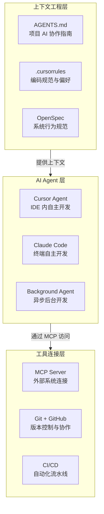
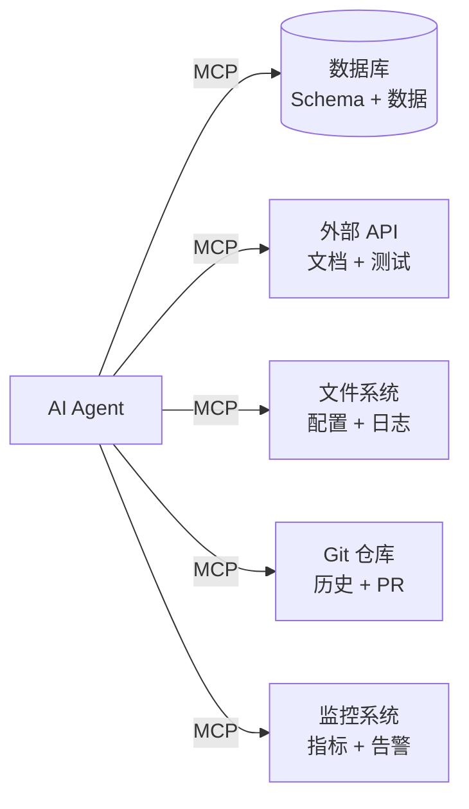
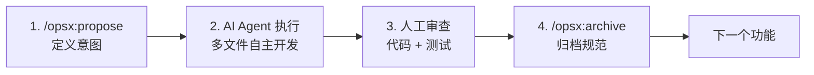
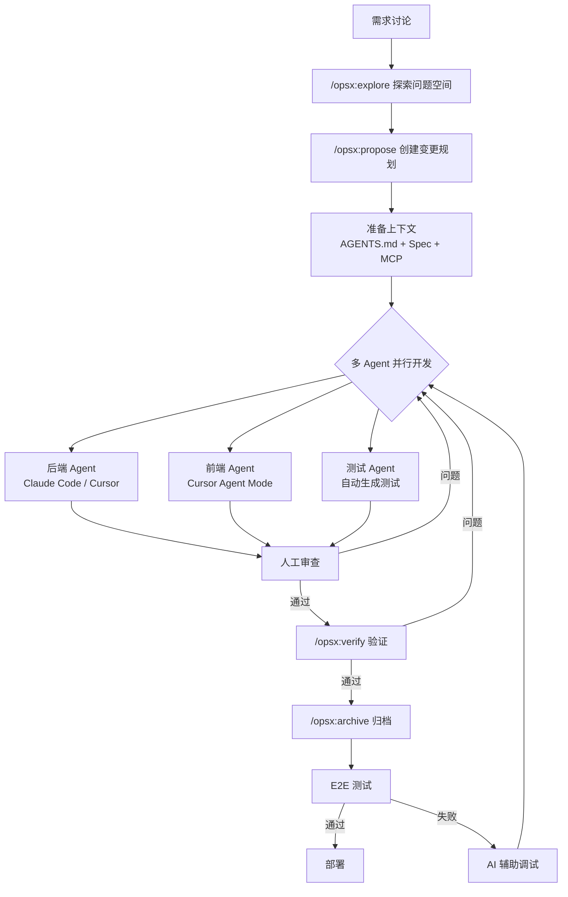
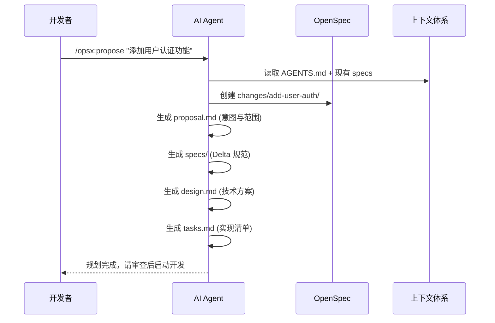
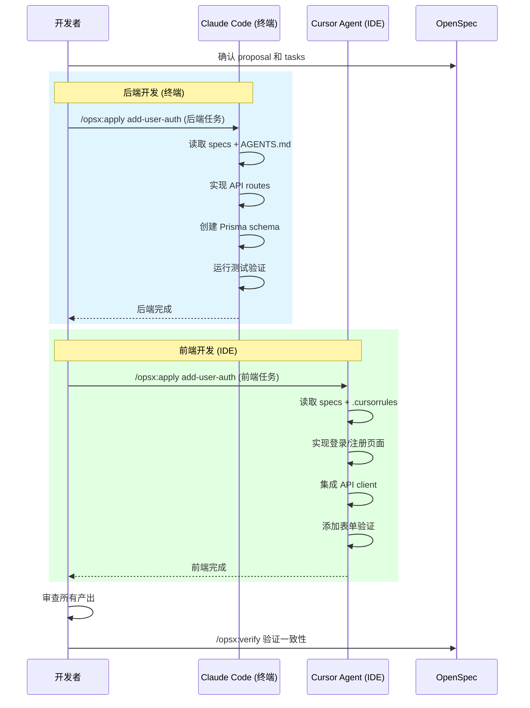
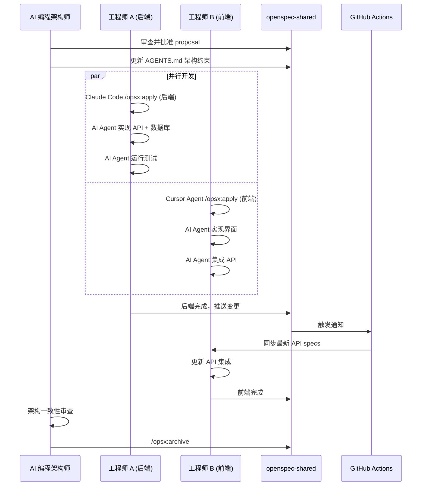
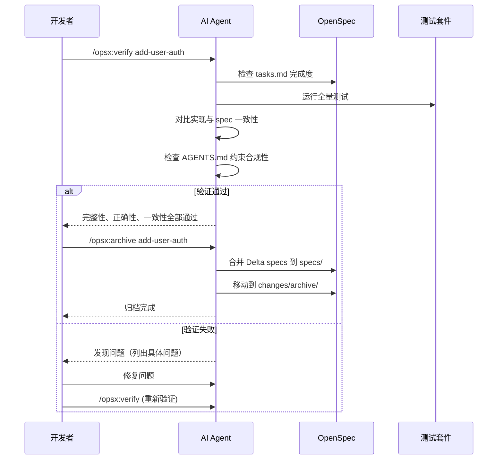
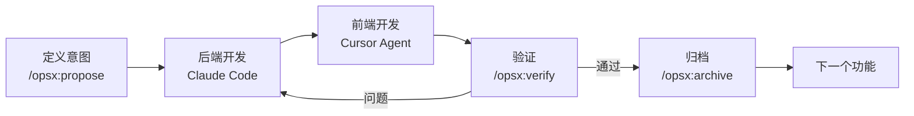

# AI 驱动的端到端开发协作标准

> 发布日期：2026-03-06
> 最后更新：2026-03-12
> 说明：本文描述的是一套方法论；具体命令、产品入口和规则格式请以对应工具当前版本为准。

基于 Spec-Driven + AI Agent 的端到端开发模式

---

## 核心理念

### 开发哲学

- **Spec 驱动，Agent 执行** — 人定义意图和约束，AI Agent 自主完成实现
- **上下文为王** — AI 产出质量的 80% 取决于你给它的上下文
- **流动而非僵化** — 规范是活文档，随开发迭代演进
- **审查而非编写** — 人的核心价值从"写代码"转向"审查代码"

### 技术栈总览



## 上下文工程体系

在使用 AI Agent 开发之前，必须先建立项目的上下文工程体系。这是保障 AI 产出质量的基础设施。

### 项目上下文三件套

#### 1. AGENTS.md — 项目 AI 协作指南

放置在项目根目录，告诉所有 AI Agent 这个项目的核心约束。

```markdown
# AGENTS.md 示例

## 项目概述
本项目是一个电商平台，使用 Next.js 14 + Prisma + PostgreSQL。

## 架构约束
- 使用 App Router，不使用 Pages Router
- API 路由统一放在 app/api/ 下
- 所有数据库操作必须通过 Prisma Client
- 认证使用 NextAuth.js v5

## 编码规范
- TypeScript strict mode
- 组件使用函数式 + hooks，禁止 class 组件
- 状态管理使用 Zustand
- 样式使用 Tailwind CSS，禁止内联 style

## 禁忌规则
- 不要在客户端组件中直接调用数据库
- 不要在 API 路由中返回敏感字段（password, token）
- 不要使用 any 类型
- 不要修改 prisma/schema.prisma 除非明确被要求

## 测试规范
- 单元测试使用 Vitest
- E2E 测试使用 Playwright
- 每个 API 路由必须有对应的集成测试
```

#### 2. .cursorrules — 编码偏好

IDE 级别的 AI 编码偏好配置。

```
# 代码风格
- 使用 early return 减少嵌套
- 优先使用 const 而非 let
- 函数参数超过 3 个时使用对象参数
- 错误处理优先使用 Result 模式

# 命名约定
- 组件文件使用 PascalCase
- 工具函数使用 camelCase
- 常量使用 UPPER_SNAKE_CASE
- 数据库模型使用 PascalCase 单数形式

# 性能要求
- 列表组件必须使用虚拟滚动（超过 100 项时）
- 图片使用 next/image 组件
- API 响应超过 1KB 时考虑分页
```

#### 3. OpenSpec — 系统行为规范

OpenSpec 是系统"当前行为"的单一真相源，同时也是 AI Agent 开发新功能时的参照标准。

```yaml
project/
├── openspec/
│   ├── specs/                    # 真相源 - 系统当前行为
│   │   ├── auth/spec.md          # 认证模块规范
│   │   ├── api/spec.md           # API 模块规范
│   │   ├── data/spec.md          # 数据模型规范
│   │   └── ui/spec.md            # UI 交互规范
│   ├── changes/                  # 进行中的变更
│   │   └── add-feature/
│   │       ├── proposal.md       # 意图与范围
│   │       ├── specs/            # Delta 规范
│   │       ├── design.md         # 技术方案
│   │       └── tasks.md          # 实现清单
│   └── config.yaml
├── AGENTS.md                     # AI 协作指南
├── .cursorrules                  # 编码偏好
└── src/
```

### MCP 连接外部系统

通过 MCP (Model Context Protocol) 让 AI Agent 直接访问外部系统获取实时上下文。



常用 MCP Server 配置：

| MCP Server | 用途 | 典型场景 |
|------------|------|----------|
| postgres / mysql | 数据库访问 | AI 直接查询 schema，理解数据模型 |
| filesystem | 文件系统 | AI 读取配置文件、日志、文档 |
| github | GitHub 操作 | AI 创建 PR、查看 issue、读取代码 |
| fetch | HTTP 请求 | AI 调用外部 API、查看文档 |

---

## 核心开发流程

### 快速路径（推荐单人全栈）



### 完整路径（团队协作 / 复杂需求）



---

## 详细阶段说明

### 阶段 1: 规范设计



**关键产物**：

**proposal.md** — 意图和范围：

```markdown
# Proposal: Add User Authentication

## Intent
实现用户认证系统，支持邮箱密码登录和 OAuth

## Scope
- 用户注册和登录
- JWT token 管理
- Google/GitHub OAuth 集成

## Constraints (从 AGENTS.md 继承)
- 使用 NextAuth.js v5
- 数据库操作通过 Prisma
- 密码使用 bcrypt 加密
```

**specs/auth/spec.md** — Delta 规范（增量）：

```markdown
# Delta for Auth

## ADDED Requirements

### Requirement: User Registration
系统必须允许用户通过邮箱和密码注册

#### Scenario: 成功注册
- GIVEN 用户提供有效邮箱和密码（8位以上）
- WHEN 提交注册表单
- THEN 创建新用户账户
- AND 发送验证邮件
- AND 返回 JWT token

#### Scenario: 邮箱已存在
- GIVEN 邮箱已被注册
- WHEN 尝试注册
- THEN 返回 409 Conflict
- AND 提示"该邮箱已注册"
```

**design.md** — 技术方案：

```markdown
# Design: User Authentication

## Architecture Decision
使用 NextAuth.js v5 + Prisma Adapter

## API Endpoints
- POST /api/auth/register (自定义)
- POST /api/auth/[...nextauth] (NextAuth)
- GET /api/auth/me (自定义)

## Database Schema
model User {
  id            String   @id @default(cuid())
  email         String   @unique
  passwordHash  String?
  name          String?
  accounts      Account[]
  sessions      Session[]
}

## MCP 集成
- 通过 postgres MCP 验证 schema 兼容性
- 通过 github MCP 检查相关 issue
```

---

### 阶段 2: 多 Agent 并行开发

这是 AI 驱动开发的核心阶段。与传统的"人写代码"不同，这里是**人编排 Agent，Agent 写代码**。

#### 单人全栈模式



#### 团队协作模式



#### Background Agent 异步开发

对于明确的任务，可以利用 Background Agent 实现异步开发：

```bash
# 分配任务给 Background Agent
# Agent 在云端异步执行，完成后创建 PR

# 适合 Background Agent 的任务：
# - 明确的 CRUD 功能开发
# - 基于 spec 的 API 实现
# - 测试用例编写
# - 代码重构（有明确规则）

# 不适合 Background Agent 的任务：
# - 需要频繁人机交互的探索性工作
# - 涉及复杂架构决策的新模块
# - 需要实时调试的性能优化
```

---

### 阶段 3: 验证与归档



**验证维度**：

| 维度 | 检查内容 | 工具 |
|------|---------|------|
| **完整性** | 所有 tasks 完成、所有需求已实现、场景已覆盖 | OpenSpec verify |
| **正确性** | 实现符合规范意图、边界情况已处理 | 自动化测试 |
| **一致性** | 代码符合 AGENTS.md 约束、架构风格统一 | AI 审查 |
| **安全性** | 无明文密钥、无 SQL 注入、输入已校验 | 安全扫描 |

---

## 跨仓库协作模式

### 独立 Spec 仓库 + Git Submodule

```yaml
# 独立 Spec 仓库
openspec-shared/
├── openspec/
│   ├── specs/
│   │   ├── api/          # Backend 维护
│   │   ├── auth/         # Backend 维护
│   │   ├── data/         # 共同维护
│   │   └── ui/           # App 维护
│   └── changes/
├── AGENTS.md             # 跨仓库通用 AI 约束
└── schemas/

# App 仓库
app-repo/
├── openspec-shared/      # Git Submodule
├── .openspec -> openspec-shared/openspec
├── AGENTS.md             # App 特定 AI 约束 (继承 shared)
├── .cursorrules
└── src/

# Backend 仓库
backend-repo/
├── openspec-shared/      # Git Submodule
├── .openspec -> openspec-shared/openspec
├── AGENTS.md             # Backend 特定 AI 约束 (继承 shared)
├── .cursorrules
└── src/
```

**同步工作流**：

```bash
# 初始化 (一次性)
cd app-repo
git submodule add <spec-repo-url> openspec-shared
ln -s openspec-shared/openspec .openspec

# 日常同步
npm run sync-specs  # git submodule update --remote openspec-shared

# 自动同步 (package.json)
{
  "scripts": {
    "sync-specs": "git submodule update --remote openspec-shared",
    "predev": "npm run sync-specs"
  }
}
```

详细的跨仓库方案参见 [跨仓库 AI 协作方案：Spec 与上下文工程](../OpenSpec专题/跨仓库AI协作方案-Spec与上下文工程.md)。

---

## 实施标准与最佳实践

### 1. 上下文工程最佳实践

**AGENTS.md 维护原则**：
- 保持简洁——AI 的上下文窗口有限，只放最关键的约束
- 定期更新——每次架构决策后同步更新
- 分层管理——共享仓库放通用约束，各仓库放特定约束
- 版本化管理——AGENTS.md 的变更应有 PR 审查

**OpenSpec 规范编写标准**：

```markdown
# Spec 模板

## Requirements

### Requirement: [需求名称]
[需求描述 - 使用 MUST/SHALL/SHOULD]

#### Scenario: [场景名称]
- GIVEN [前置条件]
- WHEN [触发动作]
- THEN [预期结果]
- AND [额外断言]

#### Scenario: [边界情况]
- GIVEN [异常前置条件]
- WHEN [触发动作]
- THEN [错误处理]
```

### 2. AI Agent 使用规范

**任务分配原则**：

| 任务类型 | 推荐 Agent | 原因 |
|----------|------------|------|
| 新功能开发 | Cursor Agent Mode | IDE 内开发，实时可见，方便交互 |
| API 实现 | Claude Code (CLI) | 终端操作，可运行测试，适合后端 |
| 明确的 CRUD | Background Agent | 异步执行，释放人力做高价值工作 |
| 跨模块重构 | Claude Code + Task | 需要全局视野，CLI 更擅长 |
| UI 开发 | Cursor Agent | 需要实时预览，IDE 更方便 |
| Bug 修复 | Cursor Debug Mode | 需要交互式调试，IDE 体验好 |

**审查清单**：

```markdown
## AI 产出审查要点

### 架构合规
- [ ] 符合 AGENTS.md 约束
- [ ] 遵循项目目录结构
- [ ] 使用正确的技术选型

### 代码质量
- [ ] 无 any 类型 / 无类型断言滥用
- [ ] 错误处理完整
- [ ] 边界情况覆盖
- [ ] 无硬编码的配置值

### 安全
- [ ] 输入校验完整
- [ ] 无敏感信息暴露
- [ ] 权限检查到位

### 测试
- [ ] 关键路径有测试覆盖
- [ ] 边界情况有测试
- [ ] 测试可独立运行
```

### 3. 协作检查清单

#### 规范设计阶段
- [ ] 运行 `openspec init` 初始化项目
- [ ] 编写 AGENTS.md 定义 AI 协作约束
- [ ] 配置 .cursorrules 编码偏好
- [ ] 使用 `/opsx:propose` 创建变更
- [ ] proposal.md 清晰描述意图和范围
- [ ] Delta specs 包含完整的场景和边界情况
- [ ] design.md 说明技术方案并引用 AGENTS.md 约束

#### 开发阶段
- [ ] 使用 `/opsx:apply` 启动 AI Agent 开发
- [ ] 确认 AI Agent 读取了正确的上下文（AGENTS.md + specs）
- [ ] MCP 连接已配置（如需访问数据库/API）
- [ ] 定期检查 AI Agent 的产出方向
- [ ] 保持 tasks.md 更新

#### 验证阶段
- [ ] 运行 `/opsx:verify` 验证实现
- [ ] 检查 AGENTS.md 约束合规性
- [ ] 运行全量自动化测试
- [ ] 人工审查关键逻辑和安全点
- [ ] 运行 E2E 测试

#### 归档阶段
- [ ] 使用 `/opsx:archive` 归档变更
- [ ] 确认 Delta specs 已合并到主 specs/
- [ ] 更新 AGENTS.md（如有架构变更）

---

## 单人全栈快速迭代模式



**典型一天的工作流程**：

```bash
# 9:00 - 9:30: 规范设计
/opsx:propose "添加产品评论功能"
# AI 自动生成 proposal + specs + design + tasks

# 9:30 - 11:30: 后端开发 (Claude Code)
/opsx:apply add-product-reviews
# Claude Code 自主实现：
#   - Prisma schema 变更
#   - API routes (CRUD)
#   - 业务逻辑
#   - 集成测试

# 11:30 - 12:00: 审查后端产出
# 检查架构合规性、安全性、测试覆盖

# 13:00 - 15:00: 前端开发 (Cursor Agent)
/opsx:apply add-product-reviews
# Cursor Agent 自主实现：
#   - 评论组件
#   - API 集成
#   - 表单验证
#   - 响应式布局

# 15:00 - 15:30: 审查前端产出

# 15:30 - 16:30: 验证与修复
/opsx:verify add-product-reviews
# 如有问题，AI Agent 辅助修复

# 16:30 - 17:00: 归档
/opsx:archive add-product-reviews
```

**关键效率提升**：
- AI Agent 处理 ~80% 的编码工作
- 人类聚焦在意图定义（~15%）和审查（~5%）
- 单功能从需求到上线周期：**1-2 天 → 半天**

---

## 工具生态

### 核心工具

| 类别 | 工具 | 用途 |
|------|------|------|
| **上下文工程** | OpenSpec, AGENTS.md, .cursorrules | 定义 AI 的工作约束和参照标准 |
| **AI Agent** | Cursor (Agent Mode), Claude Code (CLI) | 自主编码的 AI 开发者 |
| **异步开发** | Cursor Background Agent | 后台异步完成开发任务 |
| **工具连接** | MCP (Model Context Protocol) | AI Agent 连接外部系统 |
| **测试** | Vitest, Playwright | 单元测试与 E2E 测试 |
| **版本控制** | Git + GitHub | 代码和规范版本管理 |
| **CI/CD** | GitHub Actions | 自动化构建、测试、部署 |

### AI 编码工具对比

| 工具 | 定位 | 最佳场景 | 特点 |
|------|------|----------|------|
| **Cursor Agent** | IDE 内自主开发 | UI 开发、跨文件修改 | 实时预览、多文件编辑、Background Agent |
| **Claude Code** | 终端自主开发 | 后端开发、系统集成 | 可执行命令、运行测试、全自主 |
| **GitHub Copilot** | 行级代码补全 | 日常编码辅助 | 补全速度快、IDE 集成深 |
| **Windsurf** | IDE 内开发 | 全栈开发 | 类 Cursor，Cascade 流式操作 |

### OpenSpec 命令速查

```bash
# 项目管理
openspec init                    # 初始化项目
openspec config profile          # 配置 profile
openspec update                  # 更新 AI 指令

# 查看状态
openspec list                    # 列出所有变更
openspec show <change>           # 查看变更详情
openspec view                    # 交互式 Dashboard

# AI Slash Commands (Core)
/opsx:propose <idea>             # 创建变更并生成规划
/opsx:apply [change]             # 启动 AI Agent 实现
/opsx:archive <change>           # 归档变更

# AI Slash Commands (Expanded)
/opsx:explore                    # 探索问题空间
/opsx:verify <change>            # 验证实现
/opsx:sync <change>              # 同步 specs
/opsx:bulk-archive               # 批量归档
```

---

## 落地验证路径

### 第一周: 上下文工程基础

**目标**：建立项目的上下文工程体系

**步骤**：

```bash
# 1. 初始化 OpenSpec
npm install -g @fission-ai/openspec@latest
cd your-project
openspec init

# 2. 编写 AGENTS.md
# 定义项目的架构约束、编码规范、禁忌规则

# 3. 配置 .cursorrules
# 定义 IDE 级别的编码偏好

# 4. 配置 MCP (如需要)
# 连接数据库、API 等外部系统

# 5. 用 /opsx:propose 创建第一个变更
/opsx:propose "实现用户注册和登录功能"
```

**验收标准**：
- AGENTS.md 覆盖核心架构约束
- OpenSpec specs/ 包含主要模块的行为规范
- AI Agent 能正确读取上下文并产出符合规范的代码

### 第二周: AI Agent 开发实战

**目标**：完成一个完整的 AI Agent 驱动的功能开发

```bash
# 1. 后端开发 (Claude Code)
/opsx:apply add-user-auth

# 2. 前端开发 (Cursor Agent)
/opsx:apply add-user-auth

# 3. 验证
/opsx:verify add-user-auth

# 4. 归档
/opsx:archive add-user-auth
```

**验收标准**：
- AI Agent 产出代码符合 AGENTS.md 约束
- 所有 spec 场景有对应测试覆盖
- 端到端功能正常工作
- 开发效率对比传统模式提升 3x+

### 第三周: 团队协作与优化

**目标**：建立团队级的 AI 开发协作流程

```bash
# 1. 设置跨仓库协作 (如前后端分离)
# 详见《跨仓库 AI 协作方案：Spec 与上下文工程》

# 2. 配置 GitHub Actions 自动化
# spec 变更自动通知、自动同步 PR

# 3. 建立团队 AI 编程规范
# 审查流程、Agent 使用规范、上下文维护责任

# 4. 开始并行功能开发
# 多人多模块并行，验证协作流程
```

**验收标准**：
- 团队成员熟悉 AI Agent 开发工作流
- 跨仓库 spec 同步流畅
- 建立清晰的 AI 产出审查流程
- 至少完成 3 个完整的功能迭代

---

## 常见问题

### Q1: AGENTS.md 和 OpenSpec 的关系？

**AGENTS.md** 是项目级的 AI 协作指南，定义"这个项目怎么开发"——架构约束、编码风格、技术选型。所有 AI Agent 都应该读取它。

**OpenSpec** 是系统行为规范，定义"这个系统做什么"——功能需求、场景、边界情况。它是功能开发的参照标准。

两者互补：AGENTS.md 告诉 AI "怎么写"，OpenSpec 告诉 AI "写什么"。

### Q2: 如何管理 AI Agent 的产出质量？

1. **源头管控**——高质量的上下文（AGENTS.md + specs）= 高质量的产出
2. **自动化守护**——CI 中集成 lint、类型检查、测试、安全扫描
3. **人工审查**——关注架构决策和业务逻辑，而非代码风格
4. **持续优化**——根据 AI 产出的常见问题，更新 AGENTS.md

### Q3: 多人协作时如何避免 AI 产出冲突？

- **变更隔离**——每人在独立的 change 文件夹中工作
- **规范共享**——通过 OpenSpec specs/ 作为共同参照
- **职责划分**——api/ 由后端维护，ui/ 由前端维护
- **批量归档**——使用 `/opsx:bulk-archive` 自动检测冲突

### Q4: 什么时候不应该用 AI Agent？

- **核心算法创新**——需要深度思考和创造性的部分
- **敏感安全模块**——支付核心逻辑、加密算法实现（可用 AI 辅助，但需更严格审查）
- **架构决策**——这是 AI 编程架构师的职责，AI 可以辅助分析但不应决策
- **产品定义**——AI 可以帮助实现，但"做什么"是人的决定

---

## 成功指标

### 开发效率
- 单功能开发周期缩短 3-5x（AI Agent 处理大部分编码）
- 前后端集成问题减少 80%+（基于共同 spec）
- 人工编码时间占比降至 20% 以下

### 代码质量
- AGENTS.md 约束合规率 > 95%
- 自动化测试覆盖率 > 80%
- AI 产出代码首次审查通过率 > 70%

### 团队协作
- 前后端可并行开发，无阻塞
- 单人可独立完成全栈功能
- 新成员上手时间缩短 60%+
- 变更历史完整可追溯

---

**文档版本:** 3.0.0
**最后更新:** 2026-03-12
**适用场景:** AI 驱动的全栈开发、单人全栈、模块化团队协作
**核心工具:** OpenSpec + AI Agent (Cursor/Claude Code) + MCP + AGENTS.md
**AI 协作系列**
- [跨仓库 AI 协作方案：Spec 与上下文工程](../OpenSpec专题/跨仓库AI协作方案-Spec与上下文工程.md)
- [Agent 执行流程与规范：AGENTS.md、CLAUDE.md 与规则文档](./Agent执行流程与规范-AGENTS与规则文档.md)
- [MCP：Model Context Protocol 入门与实践](./MCP-Model-Context-Protocol入门与实践.md)
- [Agent Skill：是什么、怎么用与推荐](./Agent-Skill是什么怎么用与推荐.md)
- [如何开发 AI Agent](../如何开发AI-Agent.md)
- [AI Agent 时代的技术团队重塑](../AI Agent 时代的技术团队重塑.md)
