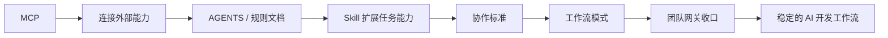

# AI协作基础设施专题

这个专题讨论的不是某一个单点工具，而是一组共同构成 AI 工程落地底座的能力：
**协议接入、规则治理、能力扩展，以及面向实际开发流程的协作标准**

很多团队不是不知道 Agent 能写代码，而是不知道怎样把这些能力接进真实工程环境，形成稳定的协作链路。

## 阅读顺序

- [MCP：Model Context Protocol 入门与实践](./MCP-Model-Context-Protocol入门与实践.md)
  - 适合先理解 Agent 怎样接入外部工具、数据与系统

- [Agent 执行流程与规范：AGENTS.md、CLAUDE.md 与规则文档](./Agent执行流程与规范-AGENTS与规则文档.md)
  - 适合理解规则文档为什么会成为 Agent 执行的治理层

- [Agent Skill：是什么、怎么用与推荐](./Agent-Skill是什么怎么用与推荐.md)
  - 适合理解任务能力如何按场景被扩展和复用

- [AI 驱动的端到端开发协作标准](./AI驱动的端到端开发协作标准.md)
  - 适合把前面三层能力放回完整研发流程里看

- [与 AI 编码代理协作的工作流模式](./与 AI 编码代理协作的工作流模式.md)
  - 适合理解落到个人手里，怎么编排 Agent 才真正提效

- [团队 AI 使用收口与规范注入：一个透明网关的设计](./团队 AI 使用收口与规范注入：一个透明网关的设计.md)
  - 适合理解怎么把散落的团队用法收口，在转发前静默注入规范

## 这个专题的边界

这个专题只收“偏工程落地”的文章，不把所有 AI 方法论文章都混进来。目前 6 篇，按能力分层排列。

因此这个专题主要回答 6 个问题：

1. Agent 怎么接外部能力
2. Agent 怎么被规则约束
3. Agent 怎么按任务类型扩展能力
4. 团队怎么把这些能力串成可执行的协作流程
5. 落到个人手里，怎么编排 Agent 才真正提效
6. 团队规模化用 AI 时，怎么收口和注入规范

## 为什么做成专题

原来这几篇文章彼此有关联，但散放时阅读路径并不清楚。

整理成专题以后，逻辑会更稳定：

1. 先理解接入层
2. 再理解规则层
3. 再理解能力扩展层
4. 再回到完整协作标准
5. 落到个人层，看怎么编排 Agent
6. 最后到团队层，看怎么收口与注入规范

这样更像一套可以持续补充的“AI 工程基础设施文档”，而不只是零散笔记。
