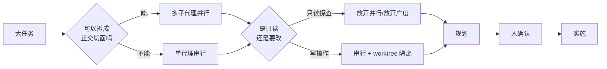
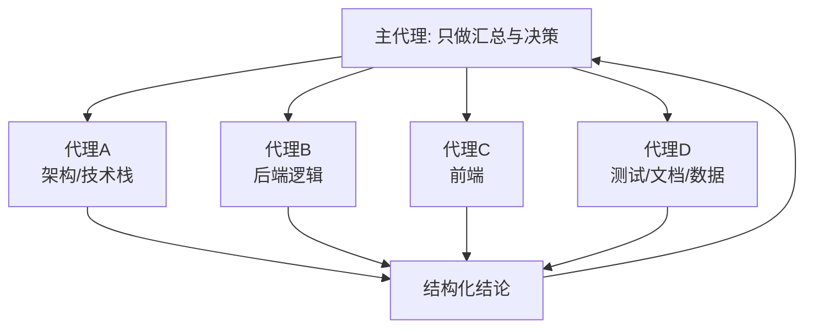

# 与 AI 编码代理协作的工作流模式

## 前言

用 AI 编码代理写了一个月的东西之后，我有一个越来越确定的感受：

**真正决定效率的，不是模型有多聪明，而是你怎么编排它。**

同样一个 Claude Code 或 Codex，交给两个人用，产出可能差好几倍。差别不在 prompt 的措辞技巧，而在工作流——你是把整个项目一股脑丢给它让它"边看边改"，还是先拆成正交的切面并行探查、再规划、再动手；你是每件事都重新交代一遍背景，还是让它续接上下文；你是盯着它一步步做，还是给它一个高层目标让它自迭代。

这篇文章把我这段时间反复用到、也反复验证有效的几个协作模式整理出来。每一个都不是"听起来不错"的理论，而是从真实会话里长出来的。文章最后有一节"心法"，是这些模式背后共通的东西。

先说结论，这些模式几乎都可以用两条主线串起来：

一条是**上下文预算**——怎么把大量原始信息挡在主会话之外；另一条是**副作用边界**——什么能并行放手，什么必须串行盯着。

## 模式一：多子代理并行分解

**是什么**：把一个"理解整个项目"或"改造整个系统"的大任务，一次性拆成多个**只读探查代理**并行跑，每个代理负责一个正交的切面，主代理只做汇总与决策。

一个典型的例子：面对一句"分析一下当前这个项目"，与其让单个代理从头读到尾（读着读着上下文就满了），不如把它展开成几个并行的探查代理，切面划分得干净利落：

- **代理 A：整体架构与技术栈** —— 只读 `package.json` / `README` / `Dockerfile` / 部署脚本，并且明确要求"不要读 `node_modules`"
- **代理 B：后端核心逻辑** —— 逐个模块看，列出路由、职责、存储方式、鉴权
- **代理 C：前端** —— 构建工具、页面用途、与后端的 API 交互
- **代理 D：测试 / 脚本 / 文档 / 数据资产** —— 测试框架、fixture 在模拟什么、实验脚本、规划文档

另一种分解维度是按**"入口 / 影响面 / 兼容热点"**来切。比如一次多模块后端的框架升级：一个代理找版本与构建入口（parent 配置、Dockerfile、CI），一个代理盘点各仓库的分支状态，一个代理专门排查某个中间件的兼容影响点，最后一个规划代理拿着前面所有结论产出分阶段实施方案。

**为什么有效**：

- **每个子代理有独立的上下文窗口**。这是最关键的一点——主会话不会被大量文件内容污染，它只收到结构化的结论。原始的几万行代码留在子代理那边，"用完即弃"。
- 切面正交，就能真正并行（后台一起跑），墙钟时间大幅压缩。
- 探查代理一律只读，几乎没有副作用风险，可以放心并行。

这个模式最大的价值，其实**不是"快"，而是"省上下文"**。这一点后面还会再讲。

## 模式二：探查 / 规划 / 实施 三段式

**是什么**：不让代理"边看边改"。先用探查类代理产出一张事实地图（文件路径 + 行号 + 关键代码片段），再用规划代理基于结论出方案，人确认之后才进入实施。

探查代理的 prompt 有一个很稳定的骨架，值得抄下来：

- 开头强约束：**"只做只读探索，不修改任何文件"**
- 中间明确输出形式：**"给出文件路径、类 / 方法名、关键代码片段（含行号）"**
- 结尾一句验收式提问：**"最后明确回答：〈某个是 / 否的关键问题〉"**

那句结尾特别重要。比较一下这两种 prompt：

> ❌ "分析一下这个模块的缓存逻辑"
> ✅ "探查这个模块的缓存逻辑，最后明确回答：写入主库后，缓存是同步失效还是异步失效？"

前者会返回一大堆材料却不给结论，后者会逼着代理落到一个可判定的答案上。**"最后明确回答 X 是否成立"比"分析一下 X"产出可用得多。**

规划代理则拿到探查结论的摘要，被要求输出一个固定结构：

1. 推荐路径（分阶段）
2. 需要改动的关键文件
3. 兼容策略
4. 验证 / 部署步骤
5. 风险点和回滚点

**为什么有效**：

- 它把"理解成本"和"修改风险"**解耦**了。理解阶段可以放开并行、放开广度（我在探查 prompt 里经常写"搜索广度：very thorough"）；修改阶段则收敛、串行、可回滚。
- 规划单独产出、可以被人审阅修正，再进入不可逆的写操作。这一步的人工确认，往往能拦下代理"想当然"的方案。

**一个进阶用法——串行接力式探查**：当第二个探查依赖第一个的结论时（不能并行），可以在第二个代理的 prompt 里预置"已知背景（另一个探查已确认，无需重复确认这些）"，把前一个代理的发现喂进去，让它只探增量。并行不适用时，就退化成有状态的接力。

## 模式三：worktree 隔离高风险改动

**是什么**：对主仓库做有风险的大改（比如框架大版本升级）时，用 git worktree 开一个隔离的工作副本，主工作目录仍然可以继续做别的事。

真实的触发场景往往是这么一句话：**"因为我在本地开发其他项目，你需要用 worktree 进行升级。"** 代理进入隔离副本操作，升级完成、验证通过后，才提交、推送、走后续流程。整个过程主工作区一次都没被打断。

**为什么有效**：

- **物理隔离**。风险改动出了问题也不会污染当前分支，主工作区始终可用。
- 和"多子代理"叠加时特别顺：让并行的代理各自跑在独立的 worktree 里，它们有各自独立的文件视图，不会互相踩。

这条和模式一其实是同一个思路在不同层面的体现——**用隔离换取放手的底气**。上下文隔离让你敢并行读，文件隔离让你敢并行写。

## 模式四：会话恢复，跨天续接上下文

**是什么**：长任务跨越多次会话时，直接"恢复会话"续接之前的上下文，而不是重新交代一遍背景。

训练、迭代这类任务天然是跨天的。与其每天重新描述"我们在训练一个宠物姿态识别模型、已经标了多少、踩过哪些坑"，不如直接：

> "恢复一下最近的第二个会话，在训练 YOLO 模型。"

续上之后直接下达增量指令（继续标注、继续训练、换个参数再跑）。

**为什么有效**：

- 训练 / 迭代类任务上下文重建成本很高，resume 让代理保留了此前的项目认知、踩过的坑、已经做过的决定。
- 用序号（"最近第二个"）而不是会话 ID 来定位，符合人的记忆方式，降低了恢复的操作成本——你不需要记住一串 UUID。

## 模式五：自定步长的循环迭代

**是什么**：一个自定义命令（我用的是 `/loop`），把 `[间隔] <prompt>` 解析出来，通过定时任务**把同一句指令反复重新注入**，实现无人值守的自迭代。

它的解析规则是这样的（一个挺通用的小 spec）：

1. 首个 token 匹配 `^\d+[smhd]$`（如 `5m`、`2h`）→ 作为间隔，其余是 prompt；
2. 否则若结尾是 `every <N><unit>` / `every 5 minutes` → 抽出间隔（但仅当 `every` 后面确实是时间表达式才算，`check every PR` 不算）；
3. 否则默认间隔 `10m`，整句都是 prompt。

间隔按 `s / m / h / d` 换算成定时表达式。

用它驱动过的典型任务：

- **"优化前端页面，让它更像一个成熟的产品"** —— 这句话被以固定间隔持续注入了很多轮，代理每一轮自己决定这次打磨哪里，中途我偶尔插一句"先部署到服务器看下效果"再让它继续。
- **"想办法让标注模型更准、标注更多图片用于训练"** —— 每隔一段时间自动推进一次标注质量。

**为什么有效**：

- "让产品更成熟""让标注更准"这类**没有明确终点的打磨型任务**，人不可能每隔几分钟手动催一次。定时重注入把"持续改进"这件事自动化了。
- 每一轮都是同一句高层目标，代理自己决定这轮改哪、验证哪，形成自驱的"验证—改进"循环。
- 人始终保留随时插话（部署、纠偏）再回到循环的能力。

**局限也很明确**：循环 prompt 太笼统时，代理容易在细枝末节反复打转。实践中我常配合"先部署看效果"这类**外部反馈锚点**来给它纠偏——纯靠它自己目测，容易越改越飘。

## 模式六：先调研找现成方案，再动手写

**是什么**：实现之前，先派一个代理专门去"上网 / 在 GitHub 上找现成方案"，明确要求**"只做只读搜索，不要 fork / clone 写东西"**；同时另一个代理去官方文档 / 源码里**精确锁定协议或数据格式的规格**，确认无误再动手改代码。

**为什么有效**：把"要不要自己写"这个决策前置，用低成本的调研代理先探清边界。尤其是协议类的工作——格式必须精确匹配，否则根本跑不通——先把规格钉死再改代码，能省掉大量来回试错。

**但这里有个真实的张力**：我有时会打断调研，"别查了，赶紧动手改"。这说明**调研代理要设时间 / 深度上限**，否则对一个"我已经知道怎么改"的任务，并行调研反而是拖累。

一个朴素的判断标准：

- 任务是**分析型 / 不确定型**的（"这个怎么实现""有没有现成的"）→ 调研和并行探查帮大忙；
- 任务是**已知型 / 机械型**的（"把这个函数改成那样"）→ 别调研了，直接干。

## 贯穿其中的几条心法

把上面六个模式抽象一层，背后是这么几条共通的东西：

**1. 上下文预算是第一约束。**
多子代理最大的价值不是"快"，而是把大量原始文件内容挡在子代理的上下文里，主会话只接收提炼后的结论。上下文的稀缺是真实存在的——我甚至见过系统提示里"为适配预算而压缩 skill 描述"的情况。你越早开始把"读"和"想"分给不同的上下文，主会话能撑的任务就越大。

**2. 副作用决定能否并行。**
只读探查随便并行；写操作串行加隔离。这一条界线几乎解释了前面所有的编排选择——为什么探查敢开一堆、为什么升级要用 worktree、为什么规划要单独一步再让人确认。想清楚一个动作"可不可逆、会不会互相踩"，编排方式基本就定了。

**3. 给代理的 prompt 要带"验收式尾巴"。**
"最后明确回答 X 是否成立"，比"分析一下 X"可用得多。让代理知道**什么算完成**，它才不会返回一堆材料却不落结论。

**4. 人始终握着纠偏权。**
`/loop` 和长任务里，"用户打断"这个动作是频繁出现的。自动化不等于放手，而是**"自动推进 + 随时插话"**。给代理一个高层目标让它自己跑，但你随时能拽回来——这才是可持续的用法。

**5. 在 prompt 里显式声明边界。**
"不要读 `node_modules`""不要触发构建""只读 `kubectl get / describe`，不要触发部署"——这些显式的边界声明，能显著减少代理跑偏和误伤。代理不会自动知道什么是危险的，你得告诉它。

## 结语

回头看，这一个月我对 AI 编码代理的用法，核心变化就一句话：**从"让它帮我写代码"，变成"我来编排它、它来执行"。**

模型本身很强，但它不知道你的项目边界在哪、什么能并行、什么不可逆、什么算完成。这些恰恰是编排要解决的问题。上面这六个模式和五条心法，说到底都是在回答同一个问题——

**怎么在放手让它跑，和握住方向盘之间，找到那条线。**
