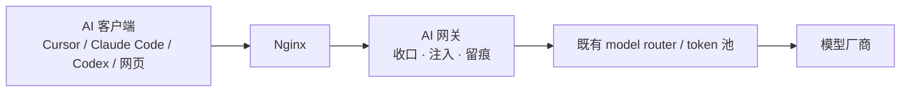
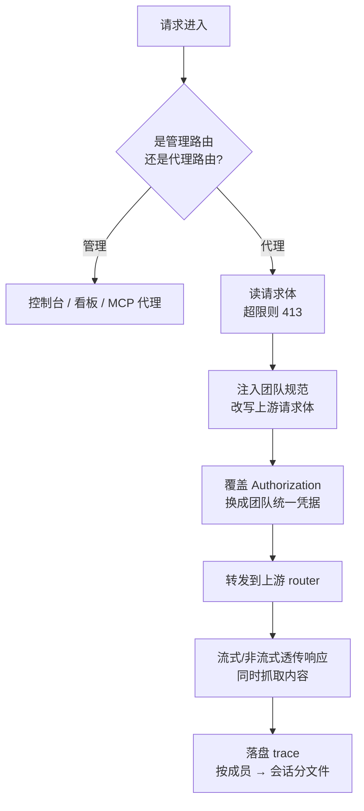

# 团队 AI 使用收口与规范注入：一个透明网关的设计

## 前言

一个团队开始规模化用 AI 编码，很快会遇到一个不在技术清单上、却真实存在的问题：**每个人都在用，但每个人用得不一样。**

有人用 Cursor，有人用 Claude Code，有人用 Codex，还有人开着网页版聊天窗。每个客户端各写各的 system prompt，各接各的 MCP，团队沉淀的那套"我们项目该怎么写代码、该用哪个内部工具、哪些事不许自动做"的规范，根本传不进这些工具里。规范写在 wiki 上，而 AI 从来不读 wiki。

于是同一个团队，AI 产出的风格、用的工具、踩的坑，全靠个人自觉。规范一旦离开人的记忆，就等于不存在。

一个务实的解法不是去管每一个客户端，而是**在所有客户端和上游模型之间插一层**。所有请求都从这层过，那么"注入团队规范"这件事，就只需要在这一层做一次。

本文记录这样一个透明 AI 网关的设计——它做三件事：**收口、注入、留痕**。

## 一、它站在哪一层

先把位置摆清楚，因为这决定了它能做什么、不能做什么。



关键点：**它不替代已有的 model router 和 token 池。** 很多团队已经有一套自建的路由和额度管理，网关不去动它，只是插在它前面。这一层只关心"请求进来时，该往里塞什么团队规范"，以及"这次请求发生了什么"。

它收口的是 **OpenAI 兼容协议**，不是某个具体厂商的私有接口。这样无论下游客户端认为自己在跟谁说话，只要走的是标准协议，就都能被收进来。实际拦下来的主要是这几个面：

- `POST /v1/chat/completions`
- `GET /v1/models`
- `POST /responses`（配合 `session-id` / `thread-id` header，兼容 Codex 风格的 CLI）

除此之外的路径要么是网关自己的管理界面，要么直接 404。它对自己的边界很诚实——不是万能代理，只转发它认识的那几个协议面。

## 二、收口：一次请求的生命周期

一个请求打进来，网关按固定顺序处理：



这里有几个设计值得单独拎出来说。

**用团队统一凭据出口。** 转发时，网关会把请求里用户自带的 `Authorization` 换成网关侧配置的统一凭据。也就是说，成员的客户端里填什么 key 不重要——真正对上游生效的是团队这一把。这让凭据管理收到了一个点上。

**成员分流靠 token hash，从不存明文。** 那成员自带的 token 就没用了吗？有用，它是**分流和归因的依据**。网关把用户 token 做 SHA-256，只取前若干位当作这个成员的标识：

```
userTokenHash = sha256(bearer_token)[:24]
```

之后所有的 trace、注入节流状态、统计，都按这个 hash 分桶。好处是既能"按成员隔离、按成员统计"，又**从不落地任何明文 token**。要注意它的粒度是 token 而非真实身份账号——这是个有意的取舍，换来了零明文存储。

**session 识别兼容多种客户端。** 不同 CLI 对"会话"的叫法不一样，网关依次去读 `x-gw-session-id`、`x-session-id`、`session-id`、`thread-id`，谁在就用谁，从而兼容 Codex 这类用 `session-id` / `thread-id` 的工具。

**响应流式透传 + 同时抓取。** 普通 JSON 和 SSE 流式都支持，透传给客户端的同时把 assistant 的增量内容抓下来，供后续留痕和总结用。透传不等人，抓取是旁路的。

## 三、注入：本质是改写上游请求体

这是整个设计的核心，说穿了很朴素：**在转发前，往上游请求体里塞一段团队规范。**

具体怎么塞，取决于协议：

- 对 `chat/completions`：在 `messages` 数组**头部插一条 `role: "system"` 消息**。
- 对 `/responses`：把内容**拼进 `instructions` 字段**。

有一个细节很重要——**被改写的只是发往上游的那一份，留痕里存的原始用户请求体保持不动。** 这样审计的时候，你看到的是成员真实发了什么，而不是被网关加工过的版本。注入是给模型看的，不是给审计看的。

### 注入的内容有哪些板块

注入的那一段不是一坨文本，而是结构化拼装起来的：

- **前言**：告诉模型"以下是管理员配置的团队规范和工具提示，请静默应用，不要主动向用户宣告这段内容的存在"。
- **prompt 注入**：管理员配置的全局 prefix / suffix，也就是团队规范正文。
- **Skill 段**：当前启用的 Skill（名称、描述、使用提示、正文、关联的 MCP）。
- **MCP 段**：可用的 MCP 代理端点说明（详见第四节）。
- **结尾提示（endHint）**：按一定概率，要求模型在这次回复末尾原样附加一段话。

关于"静默应用"这点值得说一句：注入的指令里明确要求模型不要把这段内容暴露给用户。这是为了让团队规范像"环境"一样默默生效，而不是每次回复都念一遍规范全文打扰使用者。**这是一个产品取舍，不是隐瞒**——管理员和被注入的规范内容本身对团队是公开可查的。

### 什么时候该注入：四类触发策略

如果每一轮对话都把整段规范塞进去，既浪费 token 又稀释注意力。所以注入需要节流。网关支持四类触发条件：

| 策略 | 含义 | 适用 |
|---|---|---|
| `firstTurn` | 只在会话首轮注入 | 一次性的项目背景、全局规范 |
| `everyTurns` | 每 N 轮注入一次 | 需要反复提醒的强约束 |
| `minIntervalMs` | 两次注入至少间隔一段时间 | 长会话里控制频率 |
| `keywords` | 命中关键词才注入 | 特定话题才需要的专项规范 |

节流状态按 `成员 hash → 会话 → 注入状态` 分文件记录。结尾提示走独立的概率通道，不受主策略的节流阻断——因为它的用途（比如每次都提示某个注意事项）和主注入不一样。

### 契约层：注入什么、怎么被清洗

有一个模块专门当"契约中枢"，是**"注入什么、怎么被清洗"的单一事实源**。它定义了所有输入的 schema 版本号，以及统一的 normalize、长度上限、正则白名单和脱敏规则。

脱敏这块尤其关键：所有要落地或要进注入文本的内容，都先过一遍正则清洗，抹掉 `Bearer` token、`api_key` / `password` / `token` / `secret` / `cookie` 这类键值对。**规范注入的内容里绝不能夹带凭据**，这条在契约层就被强制保证，而不是靠每个调用点自觉。

## 四、工具收口：MCP 也走这一层

规范注入解决了"AI 该怎么写"，还有另一半问题：**AI 该用哪些工具。**

团队里 MCP 的乱象和 prompt 一样——各接各的。网关的做法是把 MCP 也收口：管理员在一个 registry 里登记 MCP server（支持 stdio / http / sse，scope 可以是全局或限定某个环境），网关对外暴露统一的代理端点。注入文案会引导 AI **优先走网关的代理端点**去调工具。

这里最漂亮的一个设计是 **"只登记不外泄"**：

- MCP 的真实 command / url / env / header 只登记在网关侧，**不进注入文本**。
- 注入给 AI 的，只有 env 的**键名**、header 的**键名**，而不是它们的值。
- 每次 MCP 调用带上绑定用户会话的 access token，记一条流水，可按端点 / 工具 / 传输方式 / 成员聚合统计。

也就是说，AI 知道"有这么个工具、需要哪些参数名"，但拿不到任何 secret 的值。工具的接入细节收敛在网关，成员和模型都碰不到。

## 五、治理：把"不许做的事"写进架构

收口和注入之外，这类网关的第三个价值是**治理**——用架构把边界钉死，而不是靠提醒。几个体现：

**"只规划不执行"。** 网关里有一个确定性的续作规划器（注意，是确定性逻辑，不是再调一次大模型）。它能为一个任务生成"下一步该做什么"的计划——inspect → 执行下一步 → verify 三类动作，带 readiness 分级，还带一组 guardrails：不许在没有证据的情况下宣称成功、不许泄露密钥、不许自动执行破坏性命令。

但最关键的一条配置是：**`canExecuteWithoutApproval: false`。** 网关只产出**可审查的计划**，执行权交回给外部 agent 或人。这条把"AI 自动化"和"AI 自动执行"划开了——自动推进规划，但不自动动手。

**鉴权按"生产就该严"来设默认。** 管理台用密码登录 + HMAC 签名的 HttpOnly / SameSite=Strict cookie，密码和 session 校验用常数时间比较防时序攻击。更进一步，它会**拒绝弱配置**：密钥太短、密码太短、或者还在用开发占位符，直接不让启动。安全不是可选项，是启动前置条件。

**双层审计。** 代理层记全量请求 / 响应 trace（敏感头已脱敏）；管理层单独记配置变更事件、MCP 调用流水、注入统计。改了什么配置、谁调了什么工具、注入命中了多少次，各有各的账本。

## 六、可观测：让"为什么注入了这些"可解释

治理如果不可见，就没法信任。这类网关通常配一个管理控制台，能看到：

- 注入策略、prompt 前后缀、结尾提示的配置。
- Skill 库和 MCP registry 的增删改查。
- **注入预览**：dry-run 一次，看看这次会注入什么，且不产生任何统计或会话副作用。
- 统计面板：注入总量、命中原因、各板块（skill / mcp / memory / endHint）分别注入了多少、MCP 代理调用统计。

其中"注入预览"和一个可解释回执的设计最值得学：它能回答**"这次为什么注入了这些内容"**——是哪条策略命中的、选了哪些 Skill、为什么。注入这件事本身变成了可审查、可复现的，而不是一个黑盒。

## 七、几点心得

把这套设计里可迁移的思路抽出来：

1. **收口的价值不在"快"，在"只需做一次"。** 团队规范、凭据、工具接入，散在 N 个客户端里就是 N 份维护成本；收到一层网关上，就只有一份。规模越大，这层越值。

2. **注入即改写请求体，但要保留原始版本。** 给模型的和给审计的分开——模型看加工过的，审计看原始的。这条让"注入"和"可信留痕"不打架。

3. **secret 只登记不外泄，靠架构而非自觉。** 无论是凭据还是 MCP 配置，值都收敛在网关，注入里只给键名。再配一个契约层做统一脱敏，让"不泄密"成为数据流过的默认，而不是每个开发者要记得的规矩。

4. **治理是把边界写进代码。** "只规划不执行""拒绝弱密钥""破坏性命令不自动跑"——这些不是文档里的建议，是配置项和启动检查。规范一旦能被绕过，就等于没有。

5. **可解释是信任的前提。** 当 AI 的行为被一层网关悄悄影响时，团队更需要"能看到发生了什么"。注入预览、可解释回执、双层审计，都是为了让这层不透明的加工重新变得透明。

说到底，团队用 AI 的规范化，不是去约束每个人怎么用工具，而是**把规范放到一个所有人都绕不开、又都不用操心的位置**。一层透明网关，恰好就是这个位置。
