# 团队记忆中枢：TencentDB Agent Memory 架构与实践

## 前言

上一篇《[团队 AI 使用收口与规范注入](./团队%20AI%20使用收口与规范注入：一个透明网关的设计.md)》讲的是**规范怎么进到模型里**。这篇要讲的是它的下半场：**经验怎么留下来**。

做一个团队里用 AI 的日常观察，会发现一个很尴尬的循环：

- 新同学问"网关鉴权那块为什么不用 JWT"，老同学的 AI 答不上来——因为当初那个决策是在某个人的 Cursor 会话里讨论的，会话关了就没了。
- 同一个坑，前端踩一遍，后端再踩一遍，下个月换个人又踩一遍。每次都是"从零开始排查"。
- 有人写了个很好用的排查脚本，但这个"会做什么"的能力只存在于他自己的对话历史里，别人不知道，Agent 更不知道。

问题的本质是：**团队的知识产出速度，早就超过了知识的沉淀速度**。AI 让每个人每天产生大量高质量的思考过程，但这些过程全都落在一次性的会话窗口里，随窗口关闭而蒸发。

TencentDB Agent Memory 想解决的正是这件事。它的自我定位是 **team-level memory hub**——团队级记忆中枢。核心主张可以概括成一句话：**把"记忆"从模型的上下文窗口里搬出来，变成团队可以共享、可以治理、可以版本化的资产。**

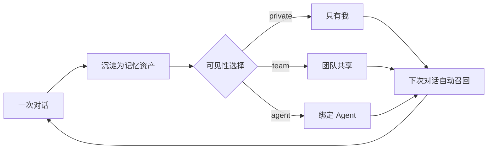

这个环闭上的时候，"团队用过 AI"和"团队变强了"才第一次成为同一件事。

## 一、它解决的是哪个具体问题

在展开架构之前，先把边界划清楚——它不是又一个 RAG 套壳。

普通 RAG 解决的是"**文档太多，模型读不完**"：把静态文档切块、向量化、按需检索。它假设知识已经写在某个地方了。

而 Agent Memory 要处理的知识，绝大部分**从来没有被写下来过**。它散落在对话里、工具调用记录里、失败重试的痕迹里。这些内容形态脏、时序强、还带大量噪音，直接丢进向量库只会污染检索质量。

所以它的思路不是"存进去再检索"，而是**先把对话加工成结构化的资产，再让资产被复用**：

| 原始形态 | 加工后的资产 | 复用方式 |
|---------|------------|---------|
| 一段对话 | Chat Memory（原子记忆块） | 按语义召回，注入下次上下文 |
| 一次成功的操作流程 | Skill（带版本的过程性知识） | 被 Agent 按需调用 |
| 讨论出来的结论 | Wiki（互相链接的知识页） | 作为背景知识注入 |
| 代码库结构 | CodeGraph（符号/文件/调用影响） | 精准定位改动面 |

关键差异在于：**加工是一次性的，复用是持续的**。对话关了就没了，但资产会一直在。

## 二、三个服务，各管一段

先看它跑起来是什么样子。整套系统由三个独立进程组成，职责切得很干净：

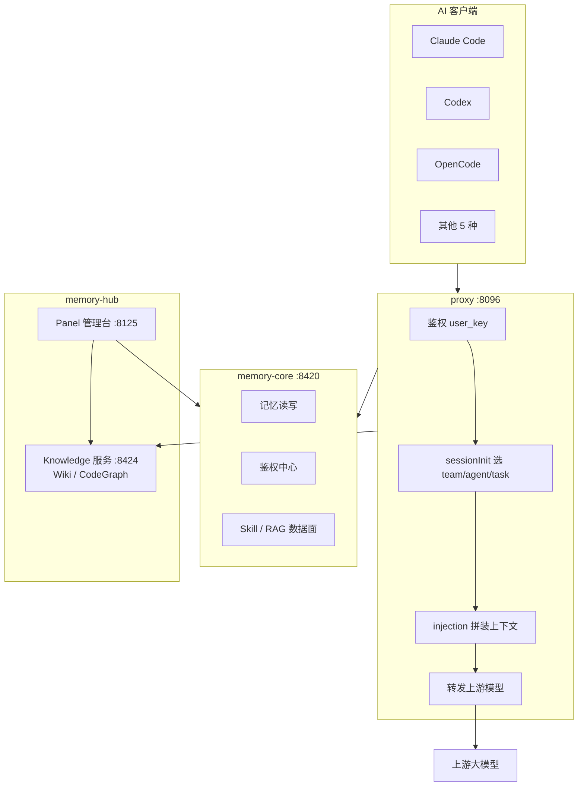

| 服务 | 默认端口 | 职责 |
|------|---------|------|
| `memory-core` | 8420 | 记忆读写、鉴权中心、Skill 与 RAG 数据面 |
| `memory-hub` | 8125 / 8424 | Panel 管理台（组织、权限、看板）+ Knowledge 服务（Wiki、CodeGraph） |
| `proxy` | 8096 | LLM 请求代理，双协议（Anthropic / OpenAI），负责注入与转发 |

这个切分里有两个设计值得单独说。

**第一，proxy 和 memory 是分开的。** 很多类似产品会把"记忆"和"代理"做成一件事，结果是客户端必须装插件、配 MCP 才能用。而这里 proxy 是独立的 HTTP 层，客户端只需要把 base URL 指过来就行——**接入成本从"改造客户端"降到了"改一个环境变量"**。这个决定直接决定了它能不能被推广到整个团队。

**第二，鉴权收敛在 memory-core。** proxy 不自己存用户体系，它向 core 校验 `user_key`。这意味着团队的组织结构、成员、权限只有一份真相来源，不会出现"panel 里删了人，proxy 还在放行"这种不一致。

## 三、长期记忆：从对话到人格的四层金字塔

这是它最核心的设计。长期记忆不是平铺的一堆向量，而是分四层递进的：

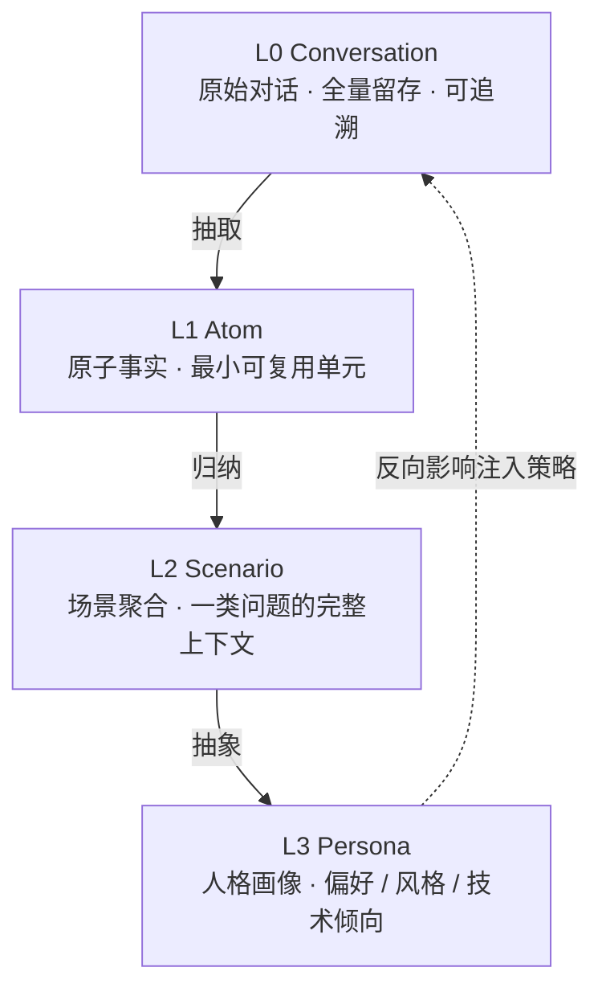

- **L0 Conversation**——原始对话，全量留着。它的价值不在于被召回，而在于**可追溯**：任何一条上层记忆，都能回溯到它从哪次对话来。可信度靠这个层兜底。
- **L1 Atom**——原子事实，从对话里抽出来的最小可复用单元。"这个项目的网关用 HMAC 签 cookie""上线前必须过 `verify.sh`"，一条一个事实，不带上下文噪音。
- **L2 Scenario**——把同一类原子事实聚合成场景。"排查线上 502"是一个场景，底下挂着十几条相关原子事实，构成这类问题的完整上下文。
- **L3 Persona**——最上层的人格画像。偏好、代码风格、技术倾向。它决定了**同样一条记忆，对不同的 Agent 应该怎么表达**。

越往上，抽象程度越高、数量越少、复用面越广；越往下，越具体、越多、越精确。检索时的策略通常是**上层定调、下层补细节**：先靠 L2/L3 判断"这次对话属于哪一类、该用什么风格",再用 L1 把具体事实填进去。

管理台里的 Chat_Memory 页面就是这一层的可视化入口：

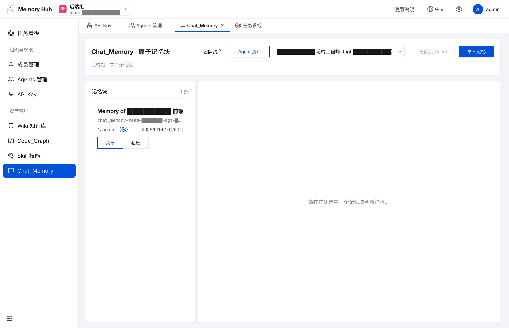

能看到原子记忆块是按场景组织的，每块可以单独查看来源、调整可见性。

## 四、短期记忆：符号化，而不是把日志全塞进上下文

长期记忆解决"跨会话"，短期记忆解决"跨步骤"。

一个 Agent 干一个稍大的任务，会产生大量中间过程：读了多少文件、跑了什么命令、输出了什么日志、试错了几轮。传统做法是把这些都留在上下文里，结果就是**上下文被工具输出淹没，模型反而看不见真正重要的东西**。

它的做法叫**符号化（symbolic）短期记忆**——把过程性的东西外化成文件，上下文里只留符号引用：

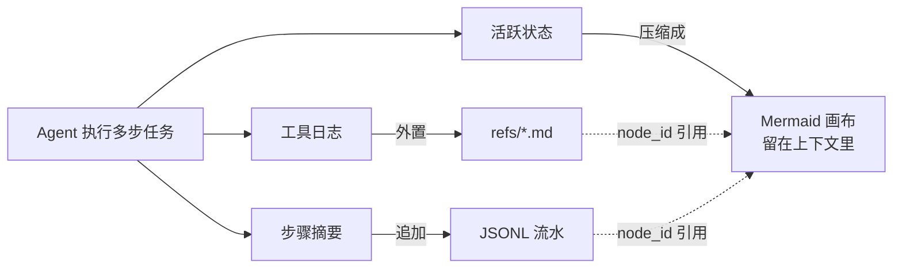

三个层次：

1. **工具日志外置到 `refs/*.md`**——完整的输出落盘，不进上下文。
2. **步骤摘要追加进 JSONL**——每步一行，结构化，便于回放和分析。
3. **活跃状态压缩成一张 Mermaid 画布**——留在上下文里的只有这张图：当前在做什么、已经完成什么、下一步是什么。

而串起这三层的是 **`node_id`**：上下文里画布上的每个节点，都带着一个 `node_id`，指向 `refs/` 里对应的完整内容。模型看到的是"我读过这个文件，结论是 X"，需要细节时按 `node_id` 把原文捞回来。

这个设计解决了一个很实际的问题：**上下文是稀缺资源，但执行过程的完整信息是必需资源**。两者不该争抢同一块空间。符号化的本质是给执行过程建了一个"分页机制"——上下文里放页表，磁盘上放页内容。

## 五、四类记忆资产

沉淀的资产分四类，各自解决不同的复用问题：

| 资产类型 | 内容 | 回答的问题 | 典型用法 |
|---------|------|-----------|---------|
| **Chat Memory** | 原子记忆块 | "我们之前是怎么想的？" | 自动召回注入 |
| **Skill** | 带版本的过程性知识 | "这件事该怎么做？" | 按需调用 |
| **Wiki** | 互相链接的知识页 | "这块是什么？" | 背景知识注入 |
| **CodeGraph** | 符号 / 文件 / 调用影响 | "改这里会影响到哪？" | 精准定位改动面 |

**Skill 是最有意思的一类。** 它和 Prompt 模板的区别在于：Skill 是**带版本的**。一个排查流程今天修了一版，明天发现问题改一版，版本历史留着。这意味着团队可以像维护代码一样维护"怎么做一件事"的知识，而不是散落在一个个 prompt 片段里。

**CodeGraph 解决的是 RAG 的老毛病。** 纯向量检索在代码库里经常失效——函数名和注释里没有的语义关联，向量搜不出来。而代码库天然有图结构：谁调用谁、谁引用谁、改了哪个符号会波及哪些文件。把这张图建出来，"改动影响面分析"就从猜测变成了查询。

## 六、可见性：共享是一次显式动作

memory hub 这个词里，hub 是关键字。**单个 Agent 的记忆再强，也只是个人助理；把记忆做成团队可共享的资产，才叫中枢。**

但它没有采取"默认全团队可见"这种粗暴做法，而是给了四档显式可见性：

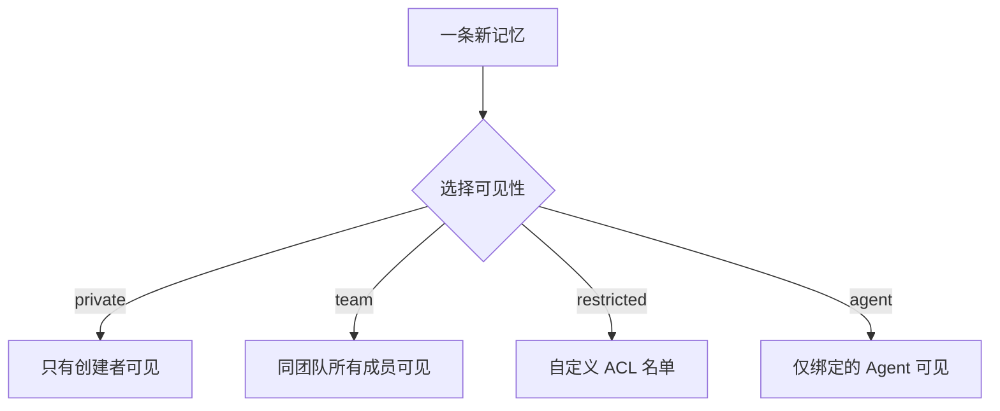

这个默认值的选择很关键。**共享是一次动作，不是一次疏忽**——不选就是 private，不会因为忘了配置而把内部排查记录泄露出去。

四档里 `agent` 这一档最容易被忽略，但很实用：有些记忆只对某个 Agent 有意义（比如"这个 Agent 专属的验收清单"），放进团队公共池反而是噪音。给它一个专属档位，既共享了又没污染。

## 七、接入：改两个环境变量

前面架构讲得再漂亮，如果接入要装插件、配 MCP，团队推广就会死在第一周。所以这里值得单独看看它的接入成本。

Claude Code 的接入方式是：

```bash
export ANTHROPIC_BASE_URL="http://<memory-host>:8096/claude-code/default"
export ANTHROPIC_AUTH_TOKEN="sk-mem-****"
```

就这两行。**不需要装插件，不需要配 MCP server。**

拆开看这两个值：

- **Base URL 的末尾一段是记忆实例 ID**（示例里的 `default`）。也就是说，同一个人可以配多个环境变量组合，分别指向不同的记忆实例——做公司项目时用公司实例，做开源项目时用个人实例，记忆互不污染。
- **Token 是一个 `sk-mem-` 前缀的 user_key**，在管理台的 API Key 页面生成。它就是前面说的"鉴权收敛在 core"里的那个凭据。

管理台会直接把 8 种客户端的接入地址列出来，复制即用：

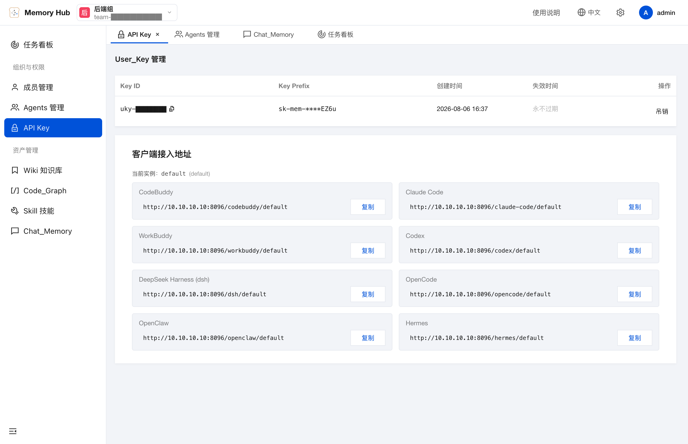

覆盖的客户端包括 CodeBuddy、Claude Code、WorkBuddy、Codex、DeepSeek Harness（dsh）、OpenCode、OpenClaw、Hermes。**注意这些都是客户端以自己的协议发请求，proxy 负责翻译**——Claude Code 走的是 Anthropic 协议，Codex 走的是 OpenAI 协议，proxy 两种都接。这是"接入成本降到环境变量"能成立的技术前提。

管理台还有一个"使用说明"页，把上手路径明确成三步：

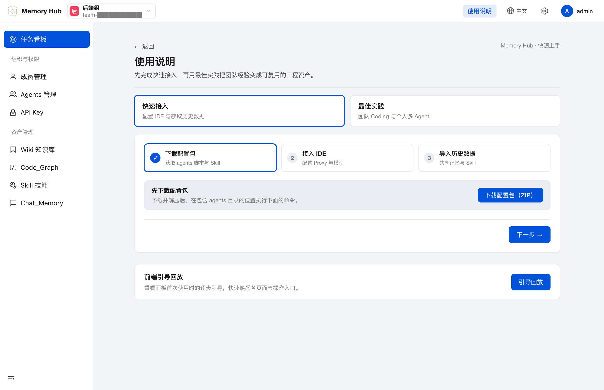

第三步"导入历史数据"是容易被低估的一环——**新接入一个记忆系统时，最大的冷启动问题是它什么都不知道**。允许把历史会话导进来，等于跳过了漫长的"养记忆"阶段。

## 八、请求进来之后发生了什么

到这里可以完整走一遍请求链路了。一个 Claude Code 请求打到 proxy，会按固定顺序过四道：

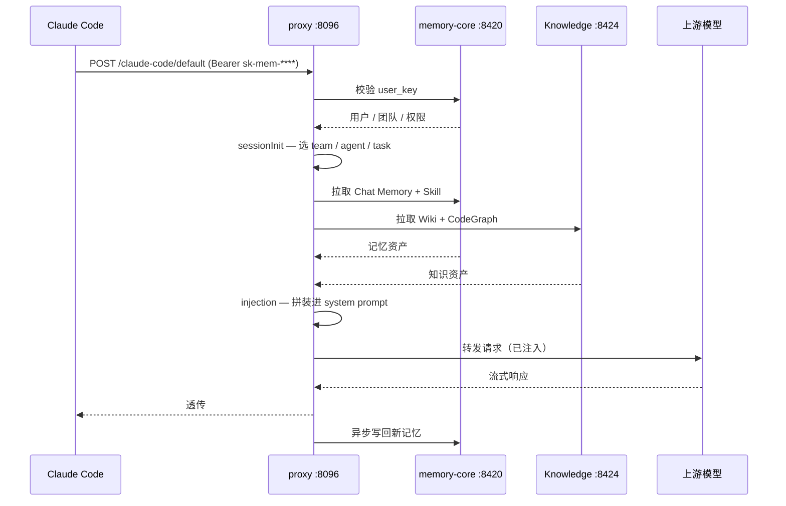

四道分别是：

1. **鉴权**——校验 `user_key`，确定"你是谁、属于哪个团队、有哪些权限"。
2. **sessionInit**——选择本次会话的 `team / agent / task`。这一步决定了后面召回的范围：是站在"后端组"的语境里，还是站在"某个具体任务"的语境里。
3. **injection**——从 core 拉记忆资产、从 Knowledge 拉知识资产，把它们拼装进 system prompt。这是"记忆真正起作用"的地方。
4. **转发**——请求带着注入好的上下文发给上游模型，响应流式透传回客户端；同时异步把本次对话写回记忆池，形成闭环。

值得注意的是第 3 步的**双向性**：注入是把记忆给模型，写回是把对话变记忆。两者异步解耦，写入慢了不会拖慢响应。

## 九、Team / Agent / 任务看板

记忆是资产，资产需要归属关系。管理台的组织视图是三层结构：

**Team 层**——团队是最外层的容器，成员、共享资产、默认 Agent 模板都挂在这一层。有个细节值得留意：**"默认 Agent 模板"机制**——新成员加入团队时，按模板自动创建其专属默认 Agent，且模板只能选用团队公共资产（`visibility=team`）。这条约束保证了新人的 Agent 起步就有团队上下文，而不是一片空白，同时不会把私有资产意外带过去。

**Agent 层**——每个 Agent 有自己的 id，以及四类资产的挂载情况（skills / code_graph / llm_wiki / chat_memory）：

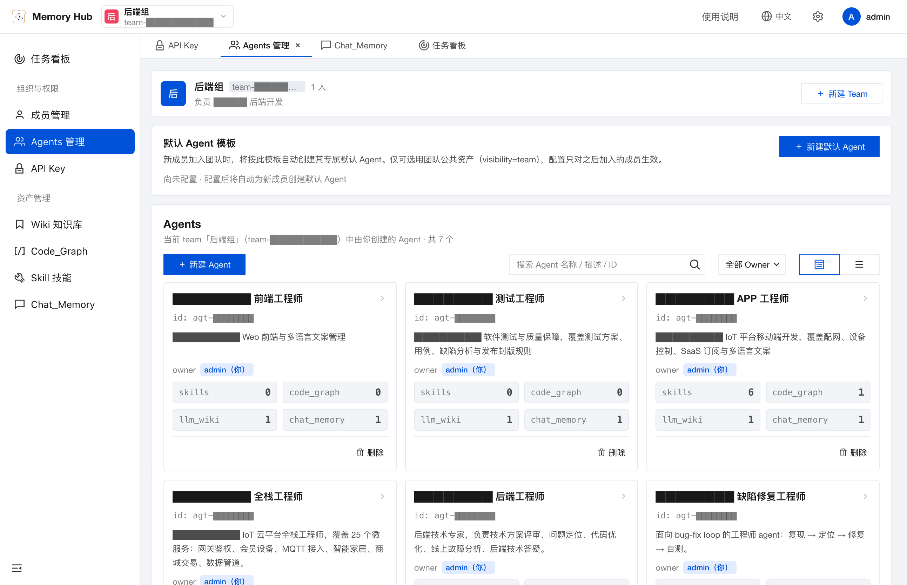

从截图里能看出一个很自然的演化：前端、测试、APP 工程师这几个 Agent 的 `skills` 和 `code_graph` 都是 0，而全栈、后端、缺陷修复这几个的 `skills` 有 6、`code_graph` 有 1。**这不是配置遗漏，而是使用痕迹**——哪类角色的工作更容易沉淀出可复用的过程性知识，在这个数字上一目了然。

**任务看板**——把 Agent 的执行和具体任务关联起来：

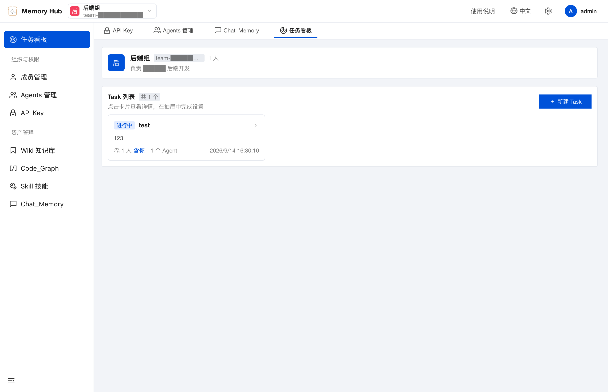

这一层的意义在于**让记忆有了落点**。记忆不是凭空产生的，它产生于"某个 Agent 为了某个任务做了什么"。把任务和记忆关联起来，才能回答"这条经验是哪次任务得来的"，也才能在未来遇到类似任务时精准召回。

## 十、部署

部署走的是容器化一键脚本，路径在 `deploy/global-images/`：

```bash
cd deploy/global-images
./start-all.sh        # 交互式：生成 .env、引导 LLM 配置、探测连通性、拉起容器
./verify.sh           # dry-run 校验，不实际启动
./stop-all.sh         # 停止
./stop-all.sh --purge # 停止并清空数据
```

几个实用点：

- `start-all.sh` 是**交互式**的，会引导完成 LLM 配置并做连通性探测——把"配置错了要跑起来才知道"提前到了启动阶段。
- `verify.sh` 提供 dry-run，**部署前可以先确认配置能否成立**，不产生副作用。
- 管理员 `user_key` 在首次启动时**自动生成**（32 位），写进 `.admin-key` 文件。这是"拒绝弱配置"思路的延续：不给用户机会设一个弱口令，直接生成强凭据。

## 十一、几点心得

把这套设计里可迁移的思路抽出来：

1. **记忆系统的难点不在"存"，在"加工"。** 向量库是廉价的，把一段脏对话变成一条干净原子事实才是贵的。L0→L3 这个四层结构，本质是一条加工流水线，检索只是流水线的出口。

2. **上下文是稀缺资源，执行过程是必需资源，两者要分页。** `refs/*.md` + `node_id` 这套符号化机制，就是把操作系统的分页思想搬进了上下文管理——页表留在内存（上下文），页内容放在磁盘（文件）。这个类比想通了，短期记忆的设计就顺了。

3. **接入成本决定推广上限。** 架构再优雅，如果需要每个成员装插件、配 MCP，团队推广就会死在第一周。把接入压缩到两个环境变量，是这套东西能被整个团队用起来的分水岭。

4. **默认私有，共享是显式动作。** 四档可见性里，默认值选 private 而不是 team。这个选择的代价是用户要多点一下，收益是**永远不会因为疏忽而泄露**。在内部知识这种半敏感场景里，这个交换是值得的。

5. **凭据生成的默认值应该"强"，而不是"让用户设"。** 自动生成 32 位 admin key 写入文件、拒绝弱配置启动——把安全性做成默认路径，而不是一份需要人记住的规范。

6. **让使用痕迹可见，本身就是治理。** skills 数字是 6 还是 0，暴露的是"哪类角色的经验更容易沉淀"。这种可见性比任何"请大家多写文档"的号召都有效。

## 适用场景与局限性

**它适合：**

- 团队规模上来以后，AI 使用经验开始大量流失的场景。
- 已经有多个 AI 客户端（Claude Code / Codex / Cursor 混用），需要一个统一的记忆落点。
- 希望把"怎么做某件事"沉淀成可版本化的团队资产，而不只是散落的 prompt。
- 有明确的团队内部知识边界要求，需要能控制"什么能被谁看到"。

**它不适合 / 需要注意：**

- **它解决的是"记忆"，不是"规范"。** 强制团队规范注入是网关那一层的职责（上一篇的主题），两者是配合关系而非替代关系。想让所有人遵守同一套规范，只上记忆系统是不够的。
- **记忆质量依赖加工质量。** 四层金字塔的每一层都是一次有损压缩。如果 L1 原子事实抽取得不准，上层全部失真。上线后需要有人定期抽查记忆质量，不能指望全自动。
- **不是零成本运维。** 三个服务加数据存储，需要一台持续运行的机器和基础运维。小团队（三五个人）用它，收益可能覆盖不了维护成本。
- **它需要"养"。** 冷启动阶段记忆是空的，前几周体感可能还不如不用。允许导入历史数据能缓解，但不能消除。要有心理预期。
- **上下文注入有上限。** 召回不是越多越好，注入过多记忆反而会稀释当前任务的注意力。召回的精度和数量需要调，不是开箱即最优。

## 总结

- ❌ 它不是又一个 RAG：RAG 假设知识已经被写下来了，而 Agent Memory 处理的知识绝大多数从未被记录过
- ❌ 它不解决规范强制：那是透明网关的职责，两者是互补关系
- ❌ 它不是零成本：三个服务要运维，冷启动要养，记忆质量要人抽查
- ✅ 它把记忆从上下文窗口里搬出来，变成团队可共享、可治理、可版本化的资产
- ✅ L0→L3 四层金字塔，是一条"原始对话 → 可复用资产"的加工流水线，检索只是出口
- ✅ 符号化短期记忆用 `refs/*.md` + `node_id` 给上下文做了分页，日志和注意力不再争抢同一块空间
- ✅ 接入只要两个环境变量，不需要插件和 MCP——这个决定直接决定了它能不能团队化推广
- ✅ 默认私有、共享显式、凭据自动生成强口令，把安全做成默认路径而不是规范

一句话概括：**Agent Memory 真正想解决的，不是"让 AI 记得更多"，而是"让团队的 AI 使用能够复利"。** 一次对话关掉，如果什么都没留下，那它只是一次消费；如果留下了资产，那它就是一次投资。

## 相关文章

- [团队 AI 使用收口与规范注入：一个透明网关的设计](./团队%20AI%20使用收口与规范注入：一个透明网关的设计.md)
- [Agent 执行流程与规范：AGENTS.md、CLAUDE.md 与规则文档](./Agent执行流程与规范-AGENTS与规则文档.md)
- [Agent Skill：是什么、怎么用与推荐](./Agent-Skill是什么怎么用与推荐.md)
- [MCP：Model Context Protocol 入门与实践](./MCP-Model-Context-Protocol入门与实践.md)
- [AI 驱动的端到端开发协作标准](./AI驱动的端到端开发协作标准.md)

## 参考资料

- [TencentCloud/TencentDB-Agent-Memory](https://github.com/TencentCloud/TencentDB-Agent-Memory)
- 本文截图来自本地部署的 Memory Hub 管理台，已对实例地址、凭据与内部标识做脱敏处理
