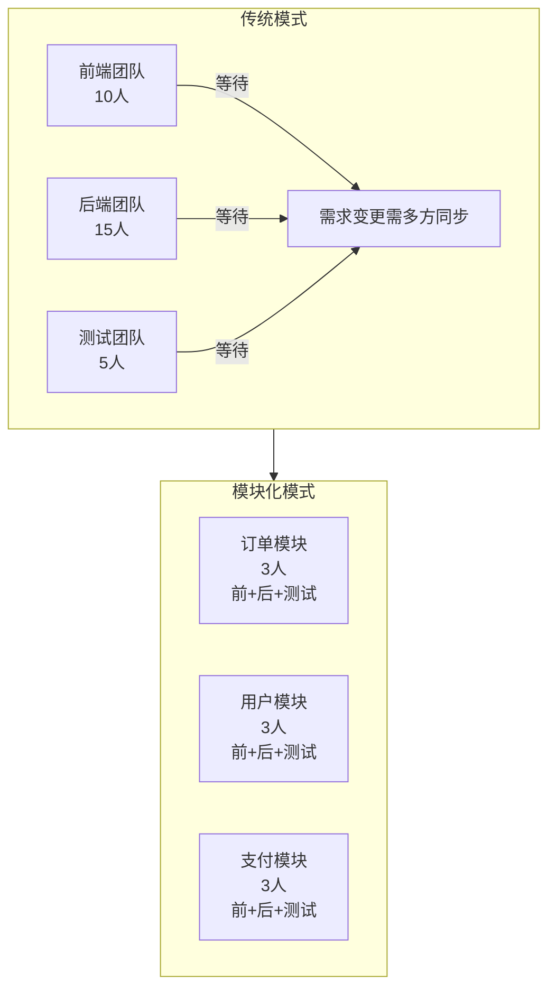
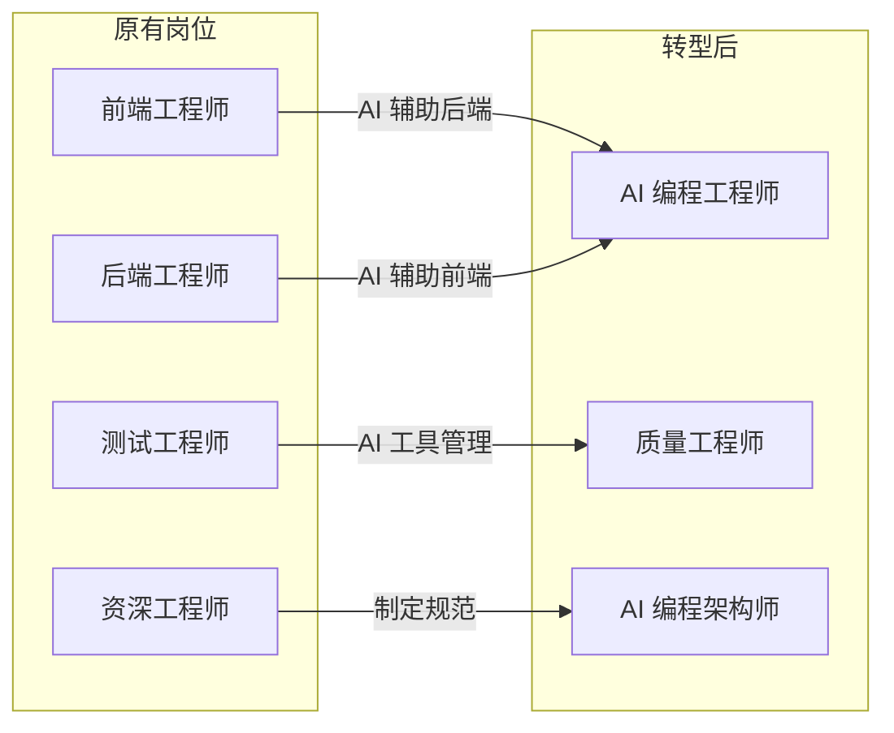
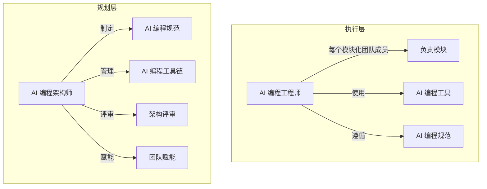
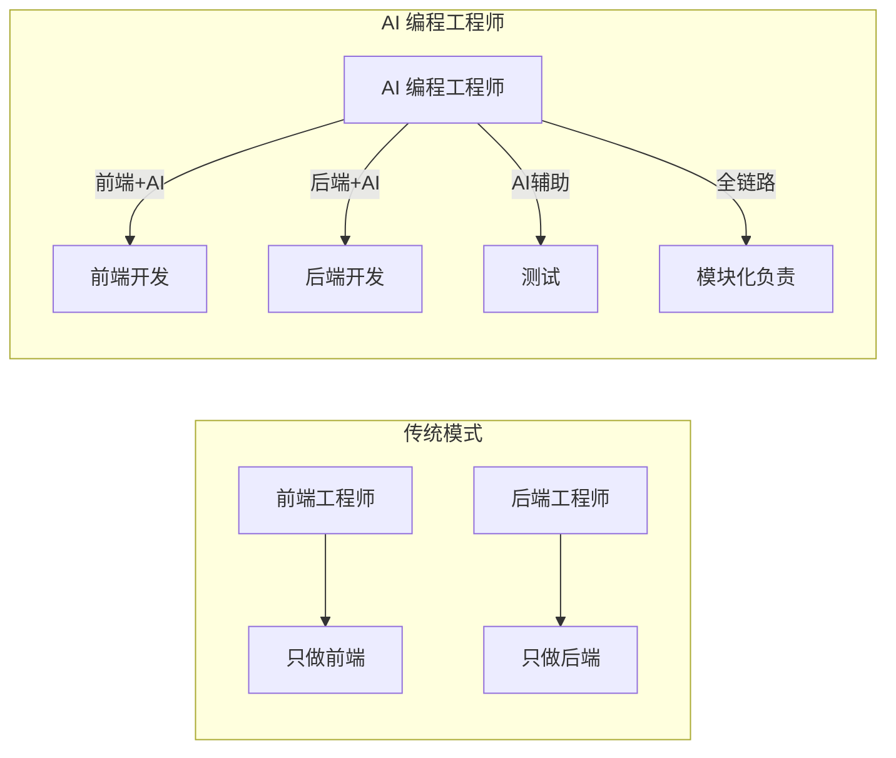
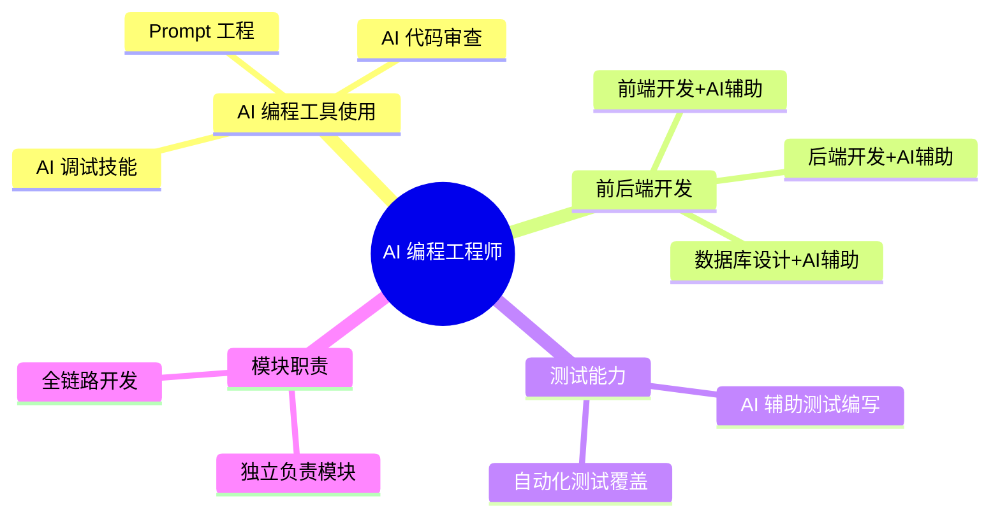
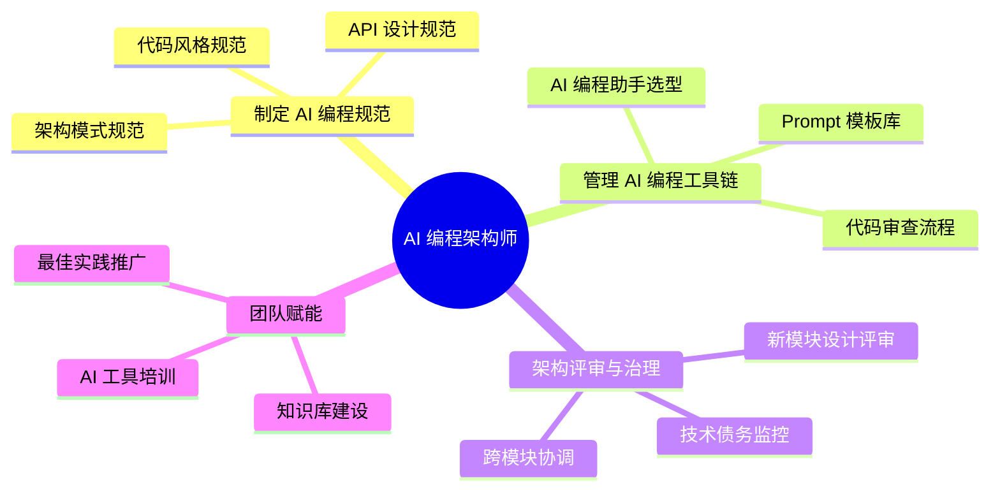
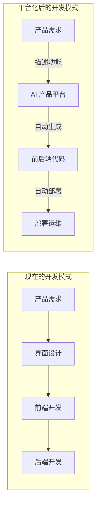
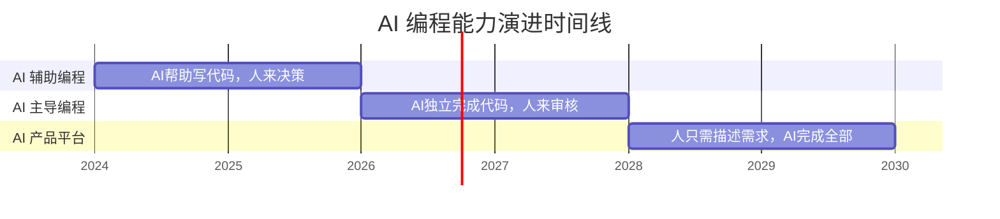
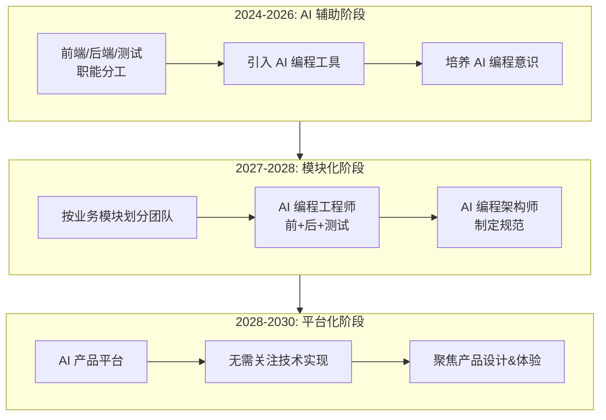
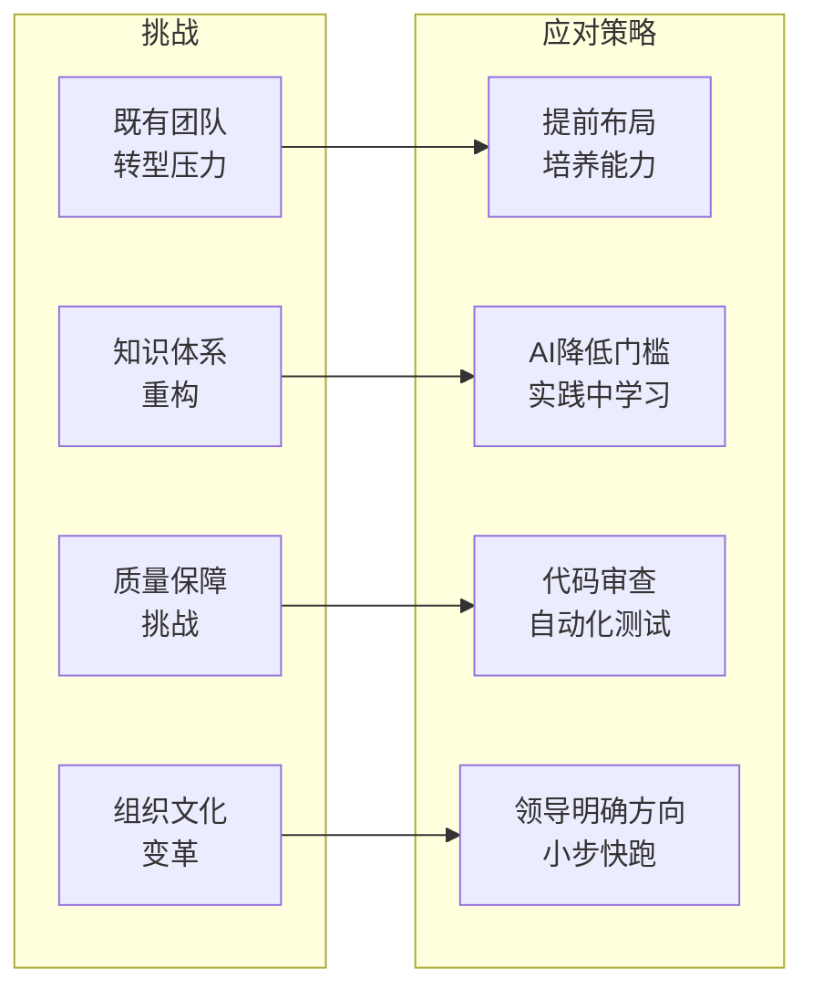

# AI 时代的组织架构演化

## 前言

过去二十年，软件开发的组织方式相对稳定：**前端工程师负责界面，后端工程师负责业务逻辑，测试工程师负责质量保障**。这种分工模式根深蒂固，几乎成了行业标准。

但当 AI 能够独立完成前后端开发时，这种分工模式将面临根本性变革。本文探讨技术团队如何从职能分工走向模块化协作，以及 AI 编程工程师 & AI 编程架构师这一新角色的诞生。

## 现状：职能分工的困境

### 1. 沟通成本高企

传统分工模式下，一个功能的交付需要：

- 前端与后端定义接口（API 契约）
- 前端等待后端接口就绪才能开发
- 测试需要等待前后端联调完成
- 需求变更需要多方同步

**结果**：大量时间消耗在沟通和等待上，而非真正的技术实现。

### 2. 边界模糊加剧

现代开发中，前端与后端的边界越来越模糊：

- **Serverless**：后端逻辑前端化
- **BFF（Backend for Frontend）**：后端为前端定制
- **小程序/H5/App**：同一套接口，多端适配
- **低代码平台**：业务逻辑可视化配置

分工的初衷是"专业的人做专业的事"，但现实是：**越来越多的人花费大量时间在做边界的修补工作**。

### 3. 全栈工程师的呼声

近年来，"全栈工程师"的呼声越来越高。一个理想的全栈工程师能够独立完成前后端开发，但现实是：

- 一个人精通前端和后端已经很难
- 还要掌握数据库、运维、测试...
- **全栈 = 什么都会一点，但什么都不精**

这是分工困境的另一个极端：**专业化与全面性难以兼顾**。

## 第一步：2027-2028，模块化团队的兴起

### 新的组织形态：模块化团队

**核心变化**：不再按职能（前端/后端/测试）划分团队，而是按**业务模块**划分。

### 为什么是 2027-2028？

**前提条件**：

1. **AI 编程能力成熟**：AI 能够独立完成前后端代码生成，准确率超过 90%
2. **AI 辅助调试普及**：AI 能够自主定位和修复 bug
3. **基础设施标准化**：一套代码可以无缝运行在前后端环境

这些条件预计在 **2027-2028 年基本具备**。

### 模块化团队的工作方式

**一个模块 = 一个功能域 = 一个团队**

例如"订单模块"团队负责：
- 订单展示页面（前端）
- 订单创建、查询、取消接口（后端）
- 订单相关的自动化测试
- 订单模块的部署和运维

**关键变化**：团队中的每个人都需要能够使用 AI 工具完成前后端开发。但这不是要求每个人都成为全栈专家——**AI 降低了门槛，让普通人也能完成专业工作**。

### 原有岗位的转型

| 原有岗位 | 转型方向 |
|---------|---------|
| 前端工程师 | AI 编程工程师（前端为主，AI 辅助后端） |
| 后端工程师 | AI 编程工程师（后端为主，AI 辅助前端） |
| 测试工程师 | 质量工程师（测试策略 + AI 工具管理） |
| 少数资深工程师 | AI 编程架构师 |

## AI 编程工程师 & AI 编程架构师：新角色的诞生

### 两个角色的定位

在模块化团队中，有两个与 AI 编程相关的新角色：

| 角色 | 定位 | 比例 |
|------|------|------|
| **AI 编程工程师** | 模块化团队的每个成员，使用 AI 工具进行模块化编程 | 每个模块 2-3 人 |
| **AI 编程架构师** | 制定 AI 编程规范、管理工具链、进行架构评审 | 每条业务线 1-2 人 |

### AI 编程工程师

**定义**：模块化团队中的每个成员，熟练使用 AI 编程工具，能够独立完成前后端代码开发。

**核心变化**：不再是传统的前端工程师或后端工程师，而是**AI 编程工程师**——使用 AI 工具进行模块化编程。

**核心能力**：

**要求**：
- 掌握 AI 编程工具（Cursor、Copilot、Claude Code 等）
- 熟悉 Prompt 工程，能够高效与 AI 协作
- 具备前后端全链路开发能力
- 遵循团队制定的 AI 编程规范

### AI 编程架构师

当每个人都在用 AI 写代码时，问题出现了：

- **代码质量参差不齐**：AI 生成的代码风格不统一
- **架构缺乏一致性**：不同模块的实现风格差异大
- **技术债务累积**：快速迭代导致的技术债务谁来管控？

**需要有人来制定 AI 编程的"交通规则"**。

### AI 编程架构师从哪里来？

**来源**：原有的资深工程师，包括：
- 架构师
- 技术负责人
- 高级开发工程师
- 少数优秀的全栈工程师

**比例**：每条业务线 1-2 人，他们不需要亲自写业务代码，而是**为团队创造高效的 AI 编程环境**。

## 第二步：2028-2030，平台化的时代

### 屏蔽底层实现的平台

**更激进的预测**：2028-2030 年，将出现**屏蔽底层实现细节的平台**。

### 平台化的三个层次

| 层次 | 描述 | 时间 |
|------|------|------|
| **AI 辅助编程** | AI 帮助写代码，人来决策 | 2024-2026 |
| **AI 主导编程** | AI 独立完成代码，人来审核 | 2026-2028 |
| **AI 产品平台** | 人只需要描述需求，AI 完成全部 | 2028-2030 |

### 产品经理的回归

当底层实现被平台屏蔽后：

- **产品经理重新成为核心**：他们只需要关注产品功能、用户体验、商业价值
- **技术实现不再是障碍**：想法可以快速转化为产品
- **创新门槛大幅降低**：人人都是产品经理

**技术团队的价值转移**：从"实现功能"转向"定义产品"和"优化体验"。

## 组织演进的推演

### 不同阶段的团队配置

**2024-2026（AI 辅助阶段）**：
- 维持现有职能分工
- 引入 AI 编程工具提升效率
- 开始培养 AI 编程意识

**2027-2028（模块化阶段）**：
- 按业务模块重新组织团队
- 每个人具备前后端 AI 辅助开发能力
- 设立 AI 编程工程师 & AI 编程架构师角色

**2028-2030（平台化阶段）**：
- 大部分技术实现由平台完成
- 团队聚焦产品设计和用户体验
- 少量 AI 平台运营和维护人员

## 挑战与应对

### 1. 既有团队的转型压力

**挑战**：现有前端/后端/测试工程师如何转型？

**应对**：
- 提前布局，培养 AI 辅助开发能力
- 转型不是抛弃原有技能，而是叠加新能力
- 给予充分的学习时间和支持

### 2. 知识体系的重构

**挑战**：AI 编程工程师需要掌握更广的知识面

**应对**：
- AI 降低了学习门槛，不需要精通才能工作
- 重点学习架构思维和产品思维
- 在实践中学习，而非理论先行

### 3. 质量保障的挑战

**挑战**：AI 生成的代码质量如何保证？

**应对**：
- 建立严格的 AI 代码审查流程
- AI 编程工程师 & AI 编程架构师制定质量标准
- 自动化测试覆盖所有关键场景

### 4. 组织文化的变革

**挑战**：从"专业分工"到"模块负责"的文化冲击

**应对**：
- 领导层需要明确转型方向
- 树立模块化团队的成功案例
- 允许试错，逐步推进

## 写在最后

**这不是科幻，而是正在发生的未来。**

2027-2028 年，模块化团队将成为主流；2028-2030 年，平台化将重新定义技术团队的价值。

**对个体的建议**：

1. **拥抱 AI 工具**：现在开始学习 AI 辅助编程
2. **拓宽技术视野**：不要局限于前端或后端
3. **培养架构思维**：从"写代码"转向"设计系统"
4. **关注产品价值**：理解业务，理解用户

**对组织的建议**：

1. **小步快跑**：先在部分团队试点模块化
2. **培养 AI 架构师**：让少数人先掌握 AI 编程规范
3. **持续迭代**：根据实际情况调整转型节奏

技术的进步从来不会停止，**唯一不变的是变化本身**。

---

**参考资料**：
- [AI 辅助编程的现状与未来](https://example.com)
- [模块化组织设计原则](https://example.com)
- [平台化战略的实践经验](https://example.com)
