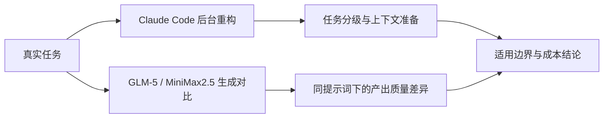

# AI 编程工具评测专题

这个专题不做“哪个模型更强”的泛泛对比，而是盯着一个更具体的问题：
**同一个真实任务丢给不同的 AI 编程工具/模型，产出质量、边界和成本分别是什么样子**

## 文章导航

- [Claude Code 后台重构实践报告](./Claude%20Code%20后台重构实践报告.md)
  - 任务分级、最小上下文、验收标准怎么定
  - 什么场景下性价比高，什么场景不建议用
- [GLM5 与 MiniMax2.5 生成质量对比报告](./GLM5%20与%20MiniMax2.5%20生成质量对比报告.md)
  - 同一提示词下 proposal / design / tasks / spec 的产出质量对比
  - Stripe 套餐升降级方案的双模型实测

## 为什么做成专题

这两篇文章本质上都在回答“AI 编程工具值不值得用、用在哪里”，放在一起看结论更完整：一篇讲怎么把任务边界和上下文准备到位，一篇讲不同模型在同一任务下的产出差异。单独看容易得出片面结论，合在一起才是完整的评测视角。
