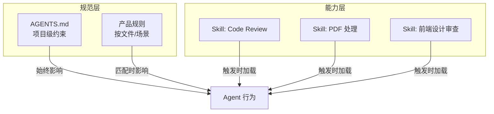

# Agent Skill：是什么、怎么用与推荐

本文说明 **Skill** 作为 **AI 编码 Agent 的通用能力扩展机制** 是什么、与 AGENTS.md / 规则的区别、如何编写与使用，并列举一批好用或常见的 Skill。内容**不绑定单一产品**：不同工具（Cursor、Claude Code、Windsurf、开放生态等）可能有各自的 Skill 目录与加载方式，但 **SKILL.md 的格式与设计思路** 可通用。

---

## 一、Skill 是什么

### 1.1 定义

**Skill** 是一种 **可复用的 Agent 能力模块**：通过一个包含 **`SKILL.md`** 的目录，教 Agent **在特定场景下如何完成特定任务**。  
Agent 会根据对话内容与 Skill 的 **description** 决定是否加载该 Skill，加载后按其中的步骤与约定执行（如按团队标准做 Code Review、按规范生成 commit message、按指南做 UI 审查等）。

可以理解为：

- **AGENTS.md / 项目规则**：定义「这个项目**整体**怎么写、不能怎么做」——偏**约束与规范**。
- **Skill**：定义「遇到**某类任务**时，**按什么流程、用什么知识**来做」——偏**流程与领域能力**。

### 1.2 与 AGENTS.md、Rules 的对比



| 维度 | AGENTS.md / 项目规则 | 产品规则（如 .cursor/rules） | Skill |
|------|------------------------|-------------------------------|--------|
| **作用** | 项目级「怎么写」的约束 | 按路径/场景的细粒度规则 | 某类任务的「怎么做」的流程与知识 |
| **何时生效** | 项目内一般始终或按路径 | 按 glob/描述匹配 | 按描述与用户意图**触发** |
| **形态** | 单文件或少量规则文件 | 产品约定的规则文件 | 单目录，内含 SKILL.md + 可选 reference/scripts |
| **典型内容** | 架构、风格、禁忌 | 某类文件的命名、模式 | 步骤、示例、领域知识、可执行脚本 |

Skill 与 MCP 也可以配合：Skill 描述「何时、按什么步骤用某能力」，MCP 提供「查数据库、调 API」等具体工具，Agent 在 Skill 引导下调用 MCP。

---

## 二、Skill 怎么用

### 2.1 存放位置（因产品而异）

不同 AI 编码产品对 Skill 的**目录与加载方式**不同，常见模式如下（以各产品官方文档为准）：

| 类型 | 常见路径示例 | 说明 |
|------|----------------|------|
| **个人 Skill** | `~/.cursor/skills/`、`~/.agents/skills/` 等 | 当前用户全局可用，具体路径依产品 |
| **项目 Skill** | `.cursor/skills/`、`.skills/`、项目内 `skills/` 等 | 随仓库共享，团队共用 |
| **生态/CLI 安装** | 由 `npx skills`、skills.sh 等管理 | 开放 Skill 生态，多产品可复用 |

**原则**：Skill 的**内容格式**（SKILL.md + frontmatter）可跨产品统一；**放哪里、怎么被加载**由你使用的产品决定。

### 2.2 目录与文件结构（通用约定）

许多采用 Skill 机制的产品约定：每个 Skill 是一个目录，至少包含一个 **SKILL.md**：

```
skill-name/
├── SKILL.md              # 必选：主说明与步骤
├── reference.md          # 可选：详细参考，供需要时读
├── examples.md           # 可选：使用示例
└── scripts/              # 可选：辅助脚本
    ├── validate.py
    └── helper.sh
```

将上述目录放到当前产品认可的 Skill 路径下即可被识别（若该产品支持 Skill）。

### 2.3 SKILL.md 基本格式（通用）

**YAML frontmatter** 用于被 Agent 发现与匹配，建议包含：

```yaml
---
name: skill-name
description: 简短说明这个 Skill 做什么、在什么场景下使用（建议包含触发关键词）
---
```

- **name**：英文、小写、连字符，作为唯一标识。
- **description**：第三人称、具体、包含「做什么」和「何时用」，便于 Agent 判断是否加载。建议带触发场景（如 "Use when the user asks for code review"）。

正文用 Markdown 写：步骤、示例、注意事项、可选的「详见 reference.md」链接等。  
建议 **SKILL.md 主体保持精简**（例如约 500 行以内），过细的内容放到 reference.md，需要时再让 Agent 读。

### 2.4 让 Agent 用上 Skill

- **个人 Skill**：放到当前产品规定的用户级 Skill 目录，产品会在对话中自动扫描并按 description 匹配。
- **项目 Skill**：放到当前产品规定的项目内 Skill 目录并提交到 Git，团队使用该仓库时即可使用。
- Agent 根据 **用户当前问题 + 各 Skill 的 description** 决定加载哪些 Skill，无需手动「打开」某个 Skill。

具体操作以你使用的 Cursor、Claude Code、Windsurf 或其它产品的文档为准。

---

## 三、如何写好 description（触发条件）

Agent 主要靠 **description** 判断「要不要用这个 Skill」，因此要写清：

1. **做什么**（WHAT）：能力一句话概括，可带关键词。
2. **何时用**（WHEN）：如 "Use when the user asks for X"、"when reviewing PRs"、"when working with PDFs"。

示例（保持第三人称）：

```yaml
# 好：具体 + 触发场景
description: Generate conventional commit messages by analyzing git diff. Use when the user asks for commit message help or to review staged changes.

# 好：领域 + 动作 + 触发词
description: Review UI code for accessibility and Web Interface Guidelines. Use when asked to "review my UI", "check accessibility", "audit design", or "check against best practices".

# 避免：太泛
description: Helps with documents
```

---

## 四、好用的 Skill 示例

以下按「用途」分类，为**常见或好用的 Skill 示例**。  
不同产品可能从不同目录加载（如内置目录、用户目录、开放生态），安装与查找方式以各产品及 Skill 来源说明为准。

### 4.1 规则与规范类

| Skill | 用途 | 典型触发 |
|-------|------|----------|
| **create-rule** | 创建项目规则（.cursor/rules、AGENTS.md、项目约定等） | "创建规则"、"设置编码标准" |
| **create-skill** | 编写新的 Skill（结构、frontmatter、最佳实践） | "写一个 Skill"、"创建 Skill"、"SKILL.md 格式" |
| **update-cursor-settings** | 修改编辑器/IDE 的 settings.json | "改设置"、"主题、字体、tab、格式化" |

适合在推进 [Agent 执行流程与规范](./Agent执行流程与规范-AGENTS与规则文档.md) 时，用 create-rule 统一项目规则，用 create-skill 扩展团队专属 Skill。

### 4.2 设计与体验类

| Skill | 用途 | 典型触发 |
|-------|------|----------|
| **web-design-guidelines** | 按 Web Interface Guidelines 审查 UI、可访问性 | "review my UI"、"check accessibility"、"audit design"、"review UX" |
| **frontend-design** | 高质量前端界面与组件设计 | 做组件、页面、前端设计时 |

可与 AGENTS.md 中的前端规范配合：AGENTS.md 定「技术栈与禁忌」，Skill 定「按什么标准审查与设计」。

### 4.3 发现与扩展类

| Skill | 用途 | 典型触发 |
|-------|------|----------|
| **find-skills** | 发现、安装 Agent Skill（如通过 npx skills、skills.sh） | "有没有能做 X 的 Skill"、"怎么装 Skill"、"扩展能力" |
| **migrate-to-skills** | 从旧规则迁移到 Skill 体系 | 从 .cursorrules 或规则迁移到 Skill 时 |

在引入新流程或新领域时，可先问「有没有现成 Skill」，用 find-skills 查找；没有再考虑自建（create-skill）。

### 4.4 领域与工具类（示例）

| Skill | 用途 | 典型触发 |
|-------|------|----------|
| **remotion-best-practices** | Remotion 视频/动效最佳实践 | 做 Remotion 项目、视频生成时 |
| **vercel-react-best-practices** | React/Next.js 性能与最佳实践 | 优化性能、写 React/Next 代码时 |

这类 Skill 提供「领域知识 + 推荐做法」，与 MCP 结合可进一步连到设计稿、构建结果等。

### 4.5 安装与查找方式（通用思路）

- **产品内置**：部分产品自带一批 Skill，无需安装，满足触发即用。
- **个人/项目目录**：将 Skill 目录放到该产品规定的用户级或项目级路径。
- **开放生态**：若使用开放 Skill 生态（如 `npx skills`、skills.sh），可按其文档安装并在支持的产品中使用。

使用 **find-skills** 时，可直接在对话里问「有没有做 X 的 Skill」或「怎么加一个做 X 的 Skill」，由 Agent 按该 Skill 的指引搜索或安装。

---

## 五、和 MCP、规范文档的配合

- **AGENTS.md / 项目规则**：约束「项目内怎么写、禁止什么」——Agent 始终或按路径遵守。
- **Skill**：在特定任务被触发时，提供「步骤 + 知识 + 可选脚本」，扩展 Agent 的**任务能力**。
- **MCP**：提供「查库、调 API、读文件」等**工具能力**；Skill 可以描述「在什么场景下、按什么顺序用这些工具」。

例如：  
「审查 API 实现是否符 spec」：用 **OpenSpec + AGENTS.md** 提供 spec 与规范，用 **MCP** 读数据库 schema 或 API 文档，用 **Skill** 定义「先读 spec → 再对比实现 → 输出审查清单」的流程。

---

## 六、实践清单

- [ ] 确认当前使用的产品支持哪种 Skill 机制，以及规定的目录（用户级/项目级）。
- [ ] 需要时用 **find-skills** 搜索现成 Skill，或用 **create-skill** 按模板新建一个。
- [ ] 每个 Skill 的 **description** 写清「做什么 + 何时用」，便于 Agent 正确触发。
- [ ] 将 Skill 与 AGENTS.md、MCP 一起考虑：规范管约束，Skill 管流程与领域，MCP 管工具。

---

**相关文档**  
- [Agent 执行流程与规范：AGENTS.md 与规则文档](./Agent执行流程与规范-AGENTS与规则文档.md)  
- [跨仓库 AI 协作方案：Spec 与上下文工程](./跨仓库AI协作方案-Spec与上下文工程.md)  
- [MCP：Model Context Protocol 入门与实践](./MCP-Model-Context-Protocol入门与实践.md)
