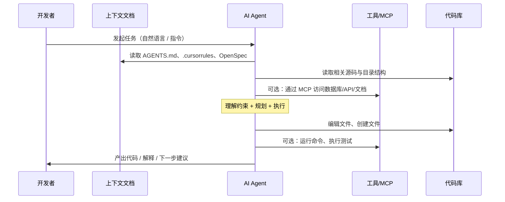
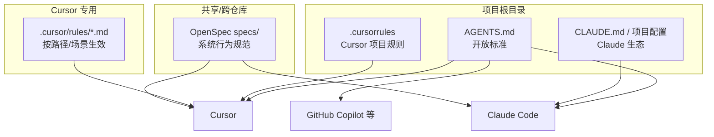
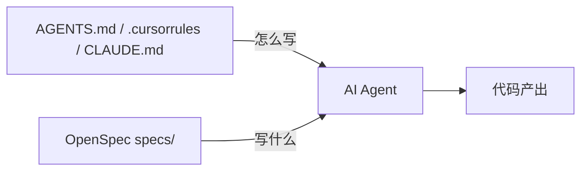

# Agent 执行流程与规范：AGENTS.md、CLAUDE.md 与规则文档

基于 [跨仓库 AI 协作方案：Spec 与上下文工程](./跨仓库AI协作方案-Spec与上下文工程.md) 的上下文工程体系，本文说明 **AI Agent 的执行流程**、**为什么通过文档来管理**，以及 **AGENTS.md、.cursorrules、CLAUDE.md 等规范文档** 的定位与用法。

---

## 一、Agent 执行流程概览

### 1.1 从触发到产出的完整链路



**关键点**：

- **上下文优先**：Agent 在动手写代码前，会先读取项目中的规范文档（AGENTS.md、.cursorrules 等）和代码结构，再决定「怎么写」。
- **文档即约束**：没有文档时，Agent 依赖通用知识和猜测；有文档时，Agent 的行为被约束在项目约定内，产出更一致、可维护。
- **工具扩展**：通过 MCP 等协议，Agent 可以访问数据库、API、文档，形成「文档 + 代码 + 外部系统」的完整上下文。

### 1.2 为什么需要「规范文档」来管理 Agent

| 问题 | 无规范文档时 | 有规范文档时 |
|------|----------------|----------------|
| **架构一致性** | 每次生成可能用不同技术选型、目录结构 | AGENTS.md 约定框架、目录、模式，产出统一 |
| **风格与禁忌** | 可能写出项目禁止的模式（如 any、内联样式） | .cursorrules / AGENTS.md 明确禁忌与风格 |
| **跨会话一致性** | 不同对话、不同人提问，结果不一致 | 同一份文档 = 同一套约束，可复现 |
| **协作与传承** | 约定在人口头或散落各处 | 文档进 Git，新人/新 Agent 都能读到 |
| **质量上限** | 依赖模型通用能力 | 文档提供领域知识，拉高产出上限 |

**结论**：用 **AGENTS.md、.cursorrules、CLAUDE.md 等文档来管理**，本质是在做 **上下文工程**——把「这个项目怎么开发、不能怎么做」写清楚，让 Agent 在每次执行前都加载同一套规则，从而稳定执行流程、提升可维护性。

---

## 二、规范文档体系总览

### 2.1 文档类型与适用工具



| 文档 | 主要读者 | 典型工具 | 作用 |
|------|----------|----------|------|
| **AGENTS.md** | 任意 AI 编码 Agent | Cursor、Claude Code、Copilot、Aider 等 25+ 工具 | 项目级「怎么开发、不能怎么做」的开放标准 |
| **.cursorrules** | Cursor Agent | Cursor | Cursor 项目级规则，可与 AGENTS.md 并存 |
| **.cursor/rules/*.md** | Cursor Agent | Cursor | 按路径、场景细分的规则（含 frontmatter） |
| **CLAUDE.md / 项目配置** | Claude | Claude Code、Claude Desktop | Claude 生态下的项目级指令 |
| **OpenSpec specs/** | 人与 Agent | 任意支持 OpenSpec 的工具 | 系统「当前行为」规范，约束「写什么」 |

### 2.2 文档之间的分工

- **AGENTS.md**：回答「**这个项目怎么写代码**」——架构、技术栈、编码风格、禁忌、测试/CI 约定。偏「约束与惯例」。
- **OpenSpec specs/**：回答「**系统要做什么**」——功能需求、场景、接口契约。偏「需求与行为」。
- **.cursorrules / .cursor/rules**：在 Cursor 内对「**何时、对哪些文件**应用哪条规则」做细粒度控制。
- **CLAUDE.md**：在 Claude 生态里提供与 AGENTS.md 类似的项目说明，便于 Claude Code / Desktop 加载。

**记忆口诀**：AGENTS.md / CLAUDE.md 管「怎么写」，OpenSpec 管「写什么」；.cursorrules 管「在 Cursor 里怎么更细地应用」。

---

## 三、AGENTS.md：是什么、为什么、写什么

### 3.1 是什么

**AGENTS.md** 是放在 **项目根目录** 的一个 **纯 Markdown 文件**，作为开放标准被多种 AI 编码工具自动发现并读取，无需额外配置。

- **谁读**：Cursor、Claude Code、GitHub Copilot、Aider、Windsurf 等 25+ 平台的 AI Agent。
- **何时读**：Agent 在处理该仓库内任务时，会自动将其作为持久上下文加载（具体实现因工具而异）。
- **格式**：无强制 frontmatter，纯 Markdown 即可；可分层（如「继承」共享仓库的 AGENTS.md）。

### 3.2 为什么用 AGENTS.md 管理

1. **单一入口**：项目对 AI 的「总说明」集中在一个文件，便于维护和 Code Review。
2. **跨工具一致**：同一份约定可在 Cursor、Claude Code、Copilot 等之间复用，不绑死某一 IDE。
3. **版本化**：随代码进 Git，变更可追溯，团队对新成员和 Agent 的说明始终同步。
4. **可继承**：跨仓库时可在子仓库中写「先读 openspec-shared/AGENTS.md」，再写本仓库特有规则（参见 [跨仓库 AI 协作方案](./跨仓库AI协作方案-Spec与上下文工程.md)）。

### 3.3 建议写什么

```markdown
# AGENTS.md 建议结构（示例）

## 项目概述
一两句话说明项目是做什么的、主要技术栈。

## 架构约束
- 框架与版本（如 Next.js 14 App Router）
- 目录结构约定
- 模块/包之间的依赖关系
- 禁止使用的模式或库

## 编码规范
- 语言与风格（如 TypeScript strict、命名约定）
- 组件/API 设计习惯
- 错误处理与日志约定

## 测试与 CI
- 如何跑测试、覆盖率要求
- 提交前必须通过的检查
- PR 标题/分支命名约定（可选）

## 禁忌规则
- 禁止 any、禁止明文存密钥等
- 安全与合规红线
```

保持 **简洁、可执行**：Agent 上下文有限，优先写对产出影响最大的约束。

---

## 四、.cursorrules 与 .cursor/rules（Cursor 规则）

### 4.1 .cursorrules

- **位置**：项目根目录，文件名 `.cursorrules`。
- **作用**：为 **Cursor** 提供项目级规则，与 AGENTS.md 可同时存在；Cursor 会同时参考两者。
- **格式**：一般为纯文本或 Markdown，无强制 frontmatter。
- **特点**：只对 Cursor 生效，适合写 Cursor 特有的偏好（如「优先用 Cursor 的 Terminal 跑命令」）。

**与 AGENTS.md 的取舍**：

- 若希望 **跨工具通用** → 主用 AGENTS.md，.cursorrules 只补 Cursor 专属规则。
- 若 **只用 Cursor** 且希望规则更细 → 可多用 .cursor/rules 的 frontmatter 做按路径/场景生效。

### 4.2 .cursor/rules/*.md（或 .mdc）

- **位置**：项目内 `.cursor/rules/` 目录，单文件 `.md` 或 `.mdc`。
- **作用**：**按描述、glob、激活方式** 应用规则，适合「对某类文件或某类任务才生效」的约定。
- **格式**：YAML frontmatter + Markdown 正文，例如：

```yaml
---
description: 对 React 组件的规则
globs: ["**/*.tsx", "**/components/**"]
alwaysApply: false
---
# React 组件规范
- 使用函数组件 + hooks
- 导出使用 named export
```

- **激活方式**（依 Cursor 版本）：Always Apply / Apply Intelligently / 按文件匹配 / 手动引用。

**适用场景**：API 层规则、测试文件规则、文档生成规则等「只对部分路径生效」的规范。

---

## 五、CLAUDE.md 与 Claude 生态

### 5.1 CLAUDE.md 或项目级配置

在 **Claude Code（CLI）**、**Claude Desktop** 等产品中，没有统一强制要求文件名必须是 `CLAUDE.md`，但常见做法是：

- 在 **项目根** 放一个给 Claude 看的说明文件，例如 `CLAUDE.md` 或 `claude.md`，内容与 AGENTS.md 类似：项目概述、架构、编码规范、禁忌。
- 部分工具会 **自动加载项目根下某固定文件名** 的 Markdown 作为项目上下文；具体以各产品文档为准。

**与 AGENTS.md 的关系**：

- **内容上**：可以与 AGENTS.md 保持一致，或写「请先阅读同目录下的 AGENTS.md，并遵守其中约定」。
- **策略**：若团队同时用 Cursor 和 Claude Code，可维护一份 AGENTS.md，在 CLAUDE.md 里仅做简短说明并引用 AGENTS.md，避免双份维护。

### 5.2 Claude Code 与 OpenSpec

在 **Claude Code** 中，若项目使用 **OpenSpec**，会通过 `openspec/` 目录下的 specs 与 changes 驱动开发。此时：

- **AGENTS.md / CLAUDE.md**：约束「怎么写」（风格、架构、禁忌）。
- **OpenSpec specs/**：约束「写什么」（需求与行为）。
- Agent 执行流程中会同时读取这两类上下文（参见本文第一节）。

---

## 六、与 OpenSpec 的配合



- **AGENTS.md（及 .cursorrules、CLAUDE.md）**：定义项目开发规范，减少风格漂移和违规。
- **OpenSpec specs/**：定义功能与行为，减少「做错需求」或「漏场景」。

两者一起，构成「规范 + 需求」的完整上下文，对应 [跨仓库 AI 协作方案](./跨仓库AI协作方案-Spec与上下文工程.md) 中的「上下文工程」与「Spec 与上下文工程」并重。

---

## 七、实践清单

- [ ] 在项目根添加 **AGENTS.md**，写出架构约束、编码规范、禁忌、测试/CI 约定。
- [ ] 若使用 Cursor，视需要添加 **.cursorrules** 或 **.cursor/rules/*.md**，对特定路径/场景细化规则。
- [ ] 若使用 Claude Code / Desktop，添加 **CLAUDE.md** 或项目级说明，并与 AGENTS.md 对齐或引用。
- [ ] 跨仓库时，在共享仓库维护 **共享 AGENTS.md**，各子仓库通过「继承」引用并补充本地规则。
- [ ] 将上述文档纳入 Git 与 PR 流程，规范变更可追溯、可审查。

---

**相关文档**  
- [跨仓库 AI 协作方案：Spec 与上下文工程](./跨仓库AI协作方案-Spec与上下文工程.md)  
- [MCP：Model Context Protocol 入门与实践](./MCP-Model-Context-Protocol入门与实践.md)  
- [Agent Skill：是什么、怎么用与推荐](./Agent-Skill是什么怎么用与推荐.md)
