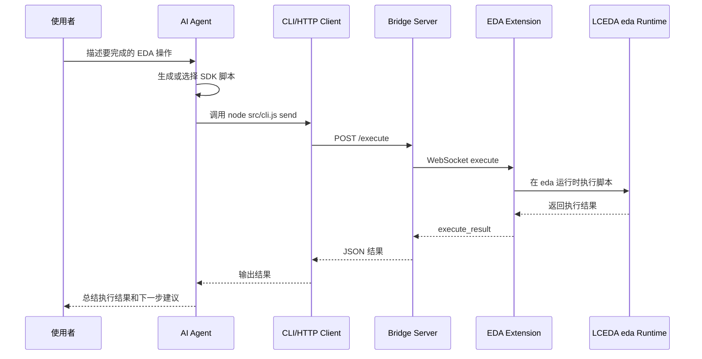

# LCEDA AI Bridge：让 AI 操作嘉立创 EDA 的本地桥接 Demo

> 项目地址：[https://github.com/steven-ld/DeepSort.git](https://github.com/steven-ld/DeepSort.git)  
> Demo 目录：`lceda-ai-bridge`  
> 当前状态：演示版本。需要更高级 SDK、完整自动化方案、商业集成支持或定制开发，可以咨询小红书 `DeepSort`。

## 一、为什么需要这个 Demo

AI Agent 已经可以写代码、读文档、调用工具，但在很多专业软件里，AI 仍然隔着一层墙。

以嘉立创 EDA / EasyEDA Pro 为例，真实的原理图、PCB、DRC、元件、网络标号、导入导出等能力都在编辑器内部的 `eda` SDK 运行时里。普通 AI 助手即使知道 SDK 文档，也不能直接进入编辑器进程调用这些 API。

LCEDA AI Bridge 的思路是：不让 AI 直接“闯进” EDA，而是在本机搭一个受控桥接层。

它把调用链拆成三段：

1. AI 生成或选择一段 EDA SDK 脚本。
2. 本地 Bridge Server 接收这段脚本。
3. 安装在嘉立创 EDA 专业版里的扩展连接 Bridge Server，并在真实 `eda` 运行时中执行脚本。

这样，AI 就可以通过一个本地 demo 完成类似这些动作：

- 检查当前 EDA 运行时支持哪些 API。
- 运行原理图或 PCB DRC。
- 创建 VCC、GND 等网络标号。
- 导出 PCB 的 DSN 文件，交给外部自动布线器处理。
- 导入自动布线器生成的 SES 文件。
- 按 primitive ID 移动 PCB 元件。
- 把“读需求 -> 生成脚本 -> 执行 -> 返回结果 -> 解释结果”的流程串起来。

这不是完整生产级平台，而是一个用于演示 AI 落地路径的基础样板：让 AI 从“写建议”进一步走向“调用真实软件能力”。

## 二、整体架构

LCEDA AI Bridge 由三部分组成：

| 模块 | 目录 | 作用 |
|------|------|------|
| 本地桥接服务 | `src/server.js` | 提供 HTTP 和 WebSocket 服务，接收 AI 或 CLI 的执行请求。 |
| 命令行客户端 | `src/cli.js`、`src/client.js` | 查找桥接服务、检查状态、发送脚本。 |
| EDA 扩展 | `extension/` | 安装到嘉立创 EDA 专业版后，连接本地桥接服务并执行 SDK 代码。 |

整体调用链如下：



这个架构有几个关键点：

- Bridge Server 只绑定本机回环地址，不面向公网开放。
- EDA 扩展通过 WebSocket 主动连接 Bridge Server。
- AI 不直接接触 EDA 进程，只通过 CLI 或 HTTP 发送脚本。
- 脚本最终在 EDA 扩展运行时中执行，因此可以访问真实的 `eda` 对象。
- 返回结果以 JSON 形式回到 CLI，再由 AI 解释给用户。

## 三、仓库结构

项目在 DeepSort 合集仓库中：

```bash
git clone https://github.com/steven-ld/DeepSort.git
cd DeepSort/lceda-ai-bridge
```

核心目录如下：

```text
lceda-ai-bridge/
  README.md
  package.json
  src/
    server.js
    client.js
    cli.js
  docs/
    protocol.md
  examples/
    00-inspect-runtime.js
    10-run-drc.js
    20-export-router-dsn.js
    30-import-router-ses.js
    40-create-schematic-net-flags.js
    50-place-pcb-components-template.js
  extension/
    extension.json
    src/index.ts
    package.json
  test/
```

其中最重要的是：

- `src/server.js`：本地桥接服务。
- `src/cli.js`：命令行入口。
- `extension/src/index.ts`：嘉立创 EDA 扩展入口。
- `examples/`：可直接发送给 EDA 运行时的示例脚本。
- `docs/protocol.md`：HTTP 和 WebSocket 协议说明。

## 四、安装与构建

### 4.1 环境要求

建议环境：

- Node.js 20.17 或更高版本。
- 嘉立创 EDA 专业版 / EasyEDA Pro V3。
- 已打开需要操作的原理图或 PCB 文档。
- 如果要做文件导入导出，需要在 EDA 扩展权限中允许外部交互。

### 4.2 安装依赖

进入 demo 目录：

```bash
cd DeepSort/lceda-ai-bridge
```

安装根项目依赖：

```bash
npm install
```

安装 EDA 扩展依赖：

```bash
npm --prefix extension install
```

### 4.3 构建 EDA 扩展包

执行：

```bash
npm run extension:build
```

构建完成后会生成 `.eext` 扩展包：

```text
extension/build/dist/lceda-ai-gateway_v0.1.0.eext
```

这个文件就是要导入嘉立创 EDA 专业版的扩展包。

## 五、在嘉立创 EDA 专业版中安装扩展

打开嘉立创 EDA 专业版 V3，然后按下面步骤操作：

1. 进入 `高级 -> 扩展管理器... -> 导入`。
2. 选择 `extension/build/dist/lceda-ai-gateway_v0.1.0.eext`。
3. 导入后启用 `LCEDA AI Gateway`。
4. 如果需要 DSN/SES 文件导入导出，开启扩展的外部交互权限。
5. 打开一个原理图或 PCB 工程。

安装成功后，顶部菜单会出现：

```text
AI Gateway -> Start Bridge
AI Gateway -> Stop Bridge
```

这里的 `Start Bridge` 不是启动 Node 服务，而是让 EDA 扩展开始连接本地 Bridge Server。

## 六、启动和检查连接

### 6.1 启动本地桥接服务

在 demo 目录执行：

```bash
npm start
```

服务会在默认端口范围内自动寻找可用端口。

也可以指定端口：

```bash
node src/cli.js start --port 49620
```

### 6.2 启动 EDA 扩展连接

回到嘉立创 EDA 专业版，点击：

```text
AI Gateway -> Start Bridge
```

扩展会扫描默认端口范围并连接本地桥接服务。

### 6.3 检查状态

执行：

```bash
node src/cli.js health
```

正常返回大致如下：

```json
{
  "ok": true,
  "data": {
    "host": "<bridge-host>",
    "port": 49620,
    "identity": "easyeda-bridge",
    "extensionConnected": true
  }
}
```

关键字段是 `extensionConnected`：

- `true`：EDA 扩展已连接，可以发送 SDK 脚本。
- `false`：Bridge Server 已启动，但 EDA 扩展还没有连上。

如果是 `false`，通常需要回到 EDA 中重新点击 `AI Gateway -> Start Bridge`。

## 七、基本使用：从示例脚本开始

### 7.1 检查 EDA 运行时

第一次使用时，建议先运行只读检查：

```bash
node src/cli.js send --file examples/00-inspect-runtime.js
```

这个脚本会返回当前 `eda` 对象下有哪些能力，以及是否具备原理图、PCB、文件系统相关 API。

示例脚本内容很简单：

```js
return {
  edaKeys: Object.keys(eda).sort(),
  hasSchematicApi: Boolean(eda.sch_Document && eda.sch_PrimitiveComponent),
  hasPcbApi: Boolean(eda.pcb_Document && eda.pcb_PrimitiveComponent),
  hasFileSystemApi: Boolean(eda.sys_FileSystem)
};
```

这一步适合作为所有 AI 自动化操作的前置检查：先确认当前环境支持什么，再让 AI 生成后续脚本。

### 7.2 运行 DRC

执行：

```bash
node src/cli.js send --file examples/10-run-drc.js
```

脚本会在 API 存在时分别运行原理图和 PCB DRC：

```js
const result = {};

if (eda.sch_Drc) {
  result.schematic = await eda.sch_Drc.check(true, false, true);
}

if (eda.pcb_Drc) {
  result.pcb = await eda.pcb_Drc.check(true, false, true);
}

return result;
```

AI 可以拿到返回 JSON 后解释检查结果，并提示下一步需要修复哪些问题。

### 7.3 创建网络标号

执行：

```bash
node src/cli.js send --file examples/40-create-schematic-net-flags.js
```

示例脚本会在当前原理图页面创建 `VCC` 和 `GND`：

```js
await eda.sch_PrimitiveComponent.createNetFlag('Power', 'VCC', 0, 0);
await eda.sch_PrimitiveComponent.createNetFlag('Ground', 'GND', 0, -100);
await eda.sch_Document.save();

return {
  ok: true,
  message: 'Created VCC and GND net flags on the current schematic page.'
};
```

这个例子展示了 AI 不只是“分析”，也可以把明确的 EDA SDK 调用落到当前工程里。

### 7.4 导出 DSN，导入 SES

外部自动布线场景通常是：

1. 从 PCB 导出 DSN。
2. 使用 Freerouting、ELECTRA、TopoR 等工具自动布线。
3. 生成 SES。
4. 导入 SES 到当前 PCB。
5. 运行 PCB DRC。

导出 DSN：

```bash
node src/cli.js send --file examples/20-export-router-dsn.js
```

导入 SES 前，需要先修改 `examples/30-import-router-ses.js` 里的文件路径：

```js
const sesPath = '/absolute/path/to/routed.ses';
```

然后执行：

```bash
node src/cli.js send --file examples/30-import-router-ses.js
```

文件读写类操作依赖 EDA 扩展外部交互权限。AI 执行这类脚本前，最好先让它说明将读取哪个文件、写入哪个文件、会影响当前哪个 PCB。

## 八、让 AI 调用 LCEDA AI Bridge

LCEDA AI Bridge 的重点不是手动敲命令，而是让 AI 参与执行流程。

推荐把 AI 调用分成四步：

1. 先让 AI 做只读检查。
2. 让 AI 生成独立脚本文件。
3. 让 AI 说明脚本会调用哪些 `eda` API。
4. 确认后再执行，并让 AI 解释结果。

### 8.1 推荐给 AI 的第一条指令

可以这样对 AI 说：

```text
请在 DeepSort/lceda-ai-bridge 项目中，通过 LCEDA AI Bridge 检查当前 EDA 运行时。

要求：
1. 先执行 examples/00-inspect-runtime.js。
2. 总结返回结果里有哪些 eda API 能力。
3. 不要修改当前 EDA 工程。
4. 如果 extensionConnected 不是 true，先停止并告诉我需要在 EDA 中启动 AI Gateway。
```

AI 应该执行：

```bash
node src/cli.js health
node src/cli.js send --file examples/00-inspect-runtime.js
```

### 8.2 让 AI 生成脚本

当你要 AI 修改 EDA 工程时，不建议直接让它把代码塞进 `--code` 参数里执行。更稳妥的方式是让它先写一个独立脚本文件。

示例提示词：

```text
请帮我写一个通过 LCEDA AI Bridge 执行的 EDA SDK 脚本。

目标：
在当前原理图页面创建 VCC 和 GND 网络标号，然后保存文档。

要求：
1. 先把脚本写到 examples/ai-create-power-flags.js。
2. 执行前先说明会调用哪些 eda API。
3. 脚本执行后返回 { ok: true, message: string }。
4. 不要做 PCB 操作。
5. 不要读取或写入本地文件。
```

确认脚本后，再让 AI 执行：

```bash
node src/cli.js send --file examples/ai-create-power-flags.js
```

### 8.3 让 AI 执行并解释结果

示例提示词：

```text
请执行 examples/ai-create-power-flags.js。

执行后：
1. 把 CLI 返回的 JSON 结果解释给我。
2. 如果失败，不要继续修改工程，先分析失败原因。
3. 如果成功，告诉我当前工程被做了什么改动，以及建议下一步运行什么检查。
```

这个提示词里的关键是：失败时不要盲目重试，成功后要解释影响范围。

### 8.4 适合 AI 执行的任务类型

适合先做成 demo 的 AI 调用任务：

| 任务 | 风险 | 建议 |
|------|------|------|
| 运行 `00-inspect-runtime.js` | 低 | 每次自动化前都可以先执行。 |
| 运行 DRC | 低 | 只读检查，适合让 AI 总结问题。 |
| 创建网络标号 | 中 | 会修改原理图，执行前先确认。 |
| 移动 PCB 元件 | 中高 | 必须确认 primitive ID 和坐标。 |
| 导入 SES | 高 | 会改变布线结果，建议先备份工程。 |
| 文件读写 | 高 | 需要明确路径和权限。 |

## 九、协议和执行机制

Bridge Server 暴露两个核心 HTTP 接口：

| 接口 | 作用 |
|------|------|
| `GET /health` | 查询 Bridge Server 状态和 EDA 扩展连接状态。 |
| `POST /execute` | 发送 JavaScript 代码到 EDA 扩展运行时执行。 |

`POST /execute` 的请求体：

```json
{
  "code": "return Object.keys(eda);",
  "timeoutMs": 30000
}
```

EDA 扩展侧收到代码后，会用类似下面的方式执行：

```ts
const run = new Function('eda', 'code', `return (async () => { ${message.code} })();`);
const result = await run(eda, message.code);
```

这意味着发送的脚本天然处于 async 环境，可以直接使用 `await`。

例如：

```js
return await eda.sch_Drc.check(true, false, true);
```

WebSocket 消息包含一个 `id`，Bridge Server 会用这个 `id` 匹配请求和返回结果，并用 `timeoutMs` 控制超时。

如果 EDA 扩展没有连接，执行请求会失败：

```text
No EDA extension is connected
```

如果脚本执行超时，会返回类似：

```text
EDA execution timed out after 30000ms
```

## 十、二次开发入口

这个 demo 的代码量不大，很适合作为二次开发起点。

### 10.1 扩展 CLI 命令

当前 CLI 支持：

```bash
node src/cli.js start
node src/cli.js health
node src/cli.js send --file examples/00-inspect-runtime.js
node src/cli.js send --code "return Object.keys(eda).sort();"
```

如果要增加更友好的命令，例如：

```bash
node src/cli.js drc
node src/cli.js inspect
node src/cli.js export-dsn
```

可以从 `src/cli.js` 入手，把常用脚本路径封装成命令。

设计建议：

- `inspect` 固定调用 `examples/00-inspect-runtime.js`。
- `drc` 固定调用 `examples/10-run-drc.js`。
- `export-dsn` 支持传入导出名称。
- `import-ses` 必须要求用户传入 SES 绝对路径。
- 高风险命令默认打印将执行的脚本摘要。

### 10.2 增加脚本模板

可以在 `examples/` 下继续沉淀脚本模板：

```text
examples/
  60-query-components.js
  70-create-basic-schematic.js
  80-place-components-from-json.js
  90-run-full-checklist.js
```

建议每个脚本都遵守这个返回格式：

```js
return {
  ok: true,
  action: 'describe-what-happened',
  data: {}
};
```

这样 AI 更容易解释结果，也方便后续做自动化编排。

### 10.3 给 AI 加一层任务协议

目前 Bridge Server 接收的是原始 JavaScript 代码。二次开发时，可以在外层增加一个更安全的任务协议：

```json
{
  "task": "run-drc",
  "params": {
    "scope": "all"
  }
}
```

Bridge Server 收到任务后，不直接执行 AI 生成的任意代码，而是从预设模板中选择脚本。

这样可以把“任意代码执行”收敛成“受控任务执行”，更适合团队内部或客户演示。

### 10.4 增加权限和确认机制

演示版的核心是打通链路。继续做产品化时，可以考虑增加权限层：

| 操作类型 | 建议策略 |
|----------|----------|
| 只读检查 | 可直接执行。 |
| DRC | 可直接执行。 |
| 保存文档 | 执行前确认。 |
| 修改原理图 | 执行前展示脚本摘要。 |
| 修改 PCB | 执行前要求用户确认。 |
| 文件读写 | 必须显示文件路径。 |
| 导入 SES | 必须要求备份提醒。 |

具体实现上，可以在 CLI 或 Bridge Server 层加入 `--confirm` 参数，或者让 AI 先生成计划文件，再由人确认执行。

### 10.5 增加结构化日志

现在 demo 主要返回执行结果。二次开发时建议增加操作日志：

```json
{
  "time": "2026-07-03T10:00:00Z",
  "task": "run-drc",
  "script": "examples/10-run-drc.js",
  "durationMs": 1200,
  "ok": true
}
```

日志用途：

- 演示时可追溯 AI 做过什么。
- 出错后可以复盘。
- 后续可接入 Web UI 或审计系统。

### 10.6 做成 MCP 或 Agent Tool

如果要更贴近 AI Agent 工作流，可以把 `sendCode` 能力包装成 MCP Tool，例如：

- `lceda.health`
- `lceda.inspectRuntime`
- `lceda.runDrc`
- `lceda.executeScript`
- `lceda.exportDsn`
- `lceda.importSes`

这样 AI 不需要通过 shell 命令间接调用，而是直接使用结构化工具。

但即使做成 MCP，也建议保留 CLI，因为 CLI 更容易调试，也方便在 CI、演示脚本和人工排障中使用。

## 十一、安全边界

LCEDA AI Bridge 的能力本质上是“让外部脚本进入 EDA 扩展运行时执行”。这很强，也需要清楚边界。

使用时建议遵守：

1. 只在本机回环地址环境使用，不暴露到公网。
2. 重要工程先备份，再让 AI 执行修改操作。
3. 让 AI 执行前，先要求它说明将调用哪些 `eda` API。
4. 高风险操作先生成脚本文件，再人工审阅。
5. 文件读写类脚本必须明确路径。
6. 失败后不要让 AI 连续盲目重试。
7. 演示版不要直接当作生产级自动化平台使用。

更进一步，可以把 AI 操作分成三级：

| 等级 | 示例 | 策略 |
|------|------|------|
| L1 只读 | inspect、DRC | 允许直接执行。 |
| L2 轻量修改 | 创建网络标号、保存文档 | 执行前展示计划。 |
| L3 高风险修改 | 导入 SES、批量移动 PCB 元件、文件写入 | 必须人工确认并建议备份。 |

## 十二、常见问题

### 12.1 `extensionConnected` 一直是 false

通常说明 Node 服务启动了，但 EDA 扩展没有连上。

检查顺序：

1. 嘉立创 EDA 专业版是否已经打开。
2. `LCEDA AI Gateway` 扩展是否已启用。
3. 是否点击了 `AI Gateway -> Start Bridge`。
4. Bridge Server 是否还在运行。
5. 如果指定了端口，CLI 和扩展扫描范围是否匹配。

### 12.2 `No EDA extension is connected`

这表示 CLI 找到了 Bridge Server，但 Bridge Server 没有可用的 EDA WebSocket 连接。

处理方式：

```bash
node src/cli.js health
```

如果 `extensionConnected` 为 `false`，回到 EDA 里重新点击 `AI Gateway -> Start Bridge`。

### 12.3 执行超时

默认超时是 30 秒。对于 DRC、导入导出或复杂 PCB 操作，可以增加超时：

```bash
node src/cli.js send --timeout 120000 --file examples/10-run-drc.js
```

如果仍然超时，建议让 AI 把脚本拆成多个小步骤。

### 12.4 AI 生成的脚本报错

优先让 AI 做三件事：

1. 重新执行 `examples/00-inspect-runtime.js`。
2. 根据返回结果确认 API 是否存在。
3. 把失败脚本拆成最小可复现片段。

不要让 AI 在不了解 API 返回结构的情况下连续修改工程。

## 十三、一次推荐演示流程

如果要给别人演示这个 demo，可以按下面流程走：

1. 打开嘉立创 EDA 专业版，并打开一个测试工程。
2. 启动 Bridge Server：

   ```bash
   npm start
   ```

3. 在 EDA 中点击 `AI Gateway -> Start Bridge`。
4. 执行健康检查：

   ```bash
   node src/cli.js health
   ```

5. 让 AI 执行只读检查：

   ```bash
   node src/cli.js send --file examples/00-inspect-runtime.js
   ```

6. 让 AI 总结当前 API 能力。
7. 运行 DRC：

   ```bash
   node src/cli.js send --file examples/10-run-drc.js
   ```

8. 让 AI 解释 DRC 结果。
9. 在测试工程中执行一个低风险修改，例如创建网络标号：

   ```bash
   node src/cli.js send --file examples/40-create-schematic-net-flags.js
   ```

10. 让 AI 总结它实际修改了什么。

这个流程能清楚展示 AI 从“理解环境”到“调用专业软件 SDK”再到“解释执行结果”的闭环。

## 十四、总结

LCEDA AI Bridge 这个 demo 的价值不在于代码复杂，而在于它给了一个清晰的 AI 落地模式：

```text
AI Agent
  -> 本地桥接服务
  -> 专业软件扩展
  -> 真实 SDK 运行时
  -> 结构化结果返回
```

很多行业软件都有类似问题：SDK 在应用内部，AI 在应用外部。通过本地桥接、扩展插件、CLI/MCP 工具化，可以把 AI 从“只能写方案”推进到“能在真实工具里执行受控动作”。

当前项目是演示版本，适合学习、验证和二次开发起步。后续如果要走向更完整的 AI EDA 自动化平台，重点不是让 AI 执行更多任意代码，而是逐步补齐：

- 任务协议。
- 权限模型。
- 操作确认。
- 审计日志。
- MCP Tool 化。
- 脚本模板库。
- 更完整的 SDK 封装。

需要更高级 SDK、完整自动化方案、商业集成支持或定制开发，可以咨询小红书 `DeepSort`。
