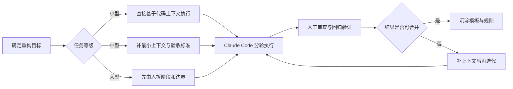

# Claude Code 后台重构实践报告

> 发布日期：2026-01-12
> 最后更新：2026-03-12
> 说明：本文聚焦后端代码重构场景，结论更适用于存量系统治理，不等同于新项目从零开发。

## 先说结论

Claude Code 能明显提升重构执行效率，但前提不是“直接让 AI 重构”，而是先把上下文准备到可执行程度。对后端存量系统来说，真正决定效果的不是模型是否足够聪明，而是你是否提供了足够清晰的边界、约束和验收标准。

我这段时间的实际结论是：

- 小型重构可以直接做，重点是快
- 中型重构必须补最小上下文，否则返工率高
- 大型重构如果没有分阶段方案，AI 只会把复杂问题重新排版

## 这篇报告解决什么问题

在团队里讨论 AI 重构时，最容易出现两个误区：

1. 只关注“能不能改出来”，不关注改完是否更容易维护
2. 只关注单轮效果，不计算准备成本、返工成本和审查成本

所以这篇文章不讨论“Claude Code 是否强大”，而是回答三个更实际的问题：

- 它在后端重构里到底擅长什么
- 什么情况下投入产出比是正的
- 如何把一次性的个人经验，变成团队可复用的方法

## 我的实际使用流程

### 1. 先定义任务级目标

我不会直接说“帮我重构这段代码”，而是先限定任务边界，例如：

- 只处理单个接口或单个服务类
- 不改变数据库结构
- 不改变 API 契约
- 优先解决方法过长、职责混杂、重复逻辑问题

这一步的作用，是把“开放式优化”收缩成“可验证的重构任务”。

### 2. 准备最小可执行上下文

如果是中型及以上任务，我会补三类信息：

- 项目约束：技术栈、目录结构、异常处理、日志规范、事务边界
- 模块背景：这个服务负责什么，哪些调用链不能动
- 验收标准：哪些测试必须过，哪些行为不能变化

早期我会额外生成比较完整的 Spec 和 Command 文档，后来发现不是文档越多越好，而是越贴近当前任务越有效。

### 3. 用持久上下文约束输出

我会把一些稳定信息放进 Memory 或等价机制中，例如：

- 命名规范
- DTO / VO / Entity 的边界
- Service / Repository 的职责划分
- 常见禁忌，比如不要把查询逻辑塞回 Controller

这类信息不适合每次重复描述，但很适合长期约束。

### 4. 分轮执行，而不是一次性重构到底

在效果最好的场景里，Claude Code 往往不是“一次产出最终版本”，而是分成三轮：

1. 先识别问题并给出拆分方案
2. 再按方案执行代码改造
3. 最后补测试、清理命名和检查回归风险

这样做虽然多一轮交互，但比让它一次完成所有工作更稳定。

## 效果最明显的收益

我用设备列表接口和几个典型服务类做过多轮验证，Claude Code 对下面几类问题帮助最大：

### 1. 方法拆分和职责收敛

这是最稳定的收益点。一个 200 到 500 行的方法，只要边界说清楚，Claude Code 通常能比较可靠地拆成更清晰的私有方法或独立服务。

### 2. 代码风格统一

当项目已经有明确规范时，它能比较稳定地统一命名、异常处理、日志写法和参数校验风格，这一点比纯人工逐文件清理更快。

### 3. 重复逻辑提炼

对“多个接口存在相似分支判断、相似数据转换、相似参数清洗”的场景，Claude Code 很适合先找重复，再给出收敛方案。

## 目前最明显的局限

### 1. 它更擅长局部重构，不擅长替你做架构决策

如果你只给一个模糊目标，比如“把这个模块重构得更优雅”，它通常会优先做低风险动作：拆方法、抽工具类、调整命名。真正涉及架构边界、事务模型、缓存策略、依赖反转时，还是需要人先定方向。

### 2. 它会继承现有系统的问题

如果项目里本来就有坏味道，而上下文又主要来自当前代码，那么 AI 很容易在“遵循现状”和“修复现状”之间选错方向。简单说，它很擅长延续一套模式，也很容易延续一套坏模式。

### 3. 文档质量会直接放大或压缩效果

很多人觉得 AI 重构不稳定，实际问题不一定在模型，而在输入。规范写得越模糊，输出就越像“看起来对”；规范越能落到约束和验收标准，输出就越接近“真的可交付”。

### 4. 首轮产出通常不是终稿

如果任务稍复杂，第一轮结果更多是“可审查草稿”，而不是“可以直接合并的 PR”。这一点必须纳入成本评估。

## 成本到底高在哪

真正昂贵的不是执行那一步，而是前置准备和返工。

### 时间成本

我把一次中型重构拆开看，大致是这样：

| 环节 | 典型耗时 | 说明 |
|------|----------|------|
| 任务澄清 | 10-30 分钟 | 明确边界和目标 |
| 上下文准备 | 30-90 分钟 | 整理规范、补说明、列验收标准 |
| AI 执行 | 1-4 小时 | 多轮交互、调整、补代码 |
| 人工审查与回归 | 0.5-2 小时 | 看行为是否变化、检查风格和边界 |

问题不在于 AI 慢，而在于如果每次都重新准备一套完整上下文，整体交付速度会被明显拖慢。

### 金钱成本

如果把文档生成、上下文扩写、多轮重试都算进去，中型任务的 API 消耗并不低。尤其在“任务边界不清楚，反复试错”的情况下，费用会比看上去高很多。

### 核心矛盾

对日常研发来说，重构不是写论文。大多数时候，**速度优先于理论最优**。

- 可接受的是：80 分质量，但 1 小时能完成
- 不可接受的是：95 分质量，但要为此付出 1 到 2 天准备成本

所以真正要优化的不是“让 AI 更认真”，而是“让 AI 在合理成本内稳定达到够用质量”。

## 什么任务值得用 Claude Code 重构

### 适合直接上

- 单接口重构
- 单服务类职责收敛
- 重复逻辑提炼
- 命名和异常处理统一
- 补测试、补注释、补边界校验

### 适合先补上下文再上

- 涉及多个 service / repository 的联动改造
- 涉及事务、缓存、异步消息的重构
- 历史包袱较重、命名不统一的模块治理

### 暂时不适合直接交给它

- 架构重组
- 核心性能瓶颈定位
- 支付、安全、权限等高风险模块的深层重构

这些任务不是不能用 AI，而是不能把“方案决策”也外包给 AI。

## 后来我怎么优化流程

### 1. 给任务分级

这是最有效的一步。

| 任务等级 | 示例 | 推荐做法 |
|----------|------|----------|
| 小型 | 方法拆分、命名优化、补测试 | 直接基于代码上下文执行 |
| 中型 | 单模块重构、服务职责重组 | 补精简版 Spec 和验收标准 |
| 大型 | 跨模块改造、历史系统治理 | 先做人类方案，再让 AI 分阶段执行 |

### 2. 把上下文拆成三层

- 项目级：长期稳定规则，放进 AGENTS / Memory
- 模块级：某个领域模型、调用链、边界约束
- 任务级：这次到底要改什么，什么不能改

这样就不需要每次从零组织一整套输入。

### 3. 先让 AI 做分析，再做改造

相比一上来就要求输出最终代码，我更倾向先让它回答：

- 这段代码有哪些坏味道
- 哪些可以安全改，哪些需要人决策
- 建议拆成哪几个步骤

这一步能显著降低后续返工率。

## 团队落地时我会怎么建议

如果你想把这套流程从个人习惯升级成团队方法，我建议先做三件事：

1. 建立最小重构模板：任务目标、不可变约束、验收清单
2. 沉淀团队级稳定规则：命名、日志、异常、分层职责
3. 对重构任务做分级，避免所有任务都走“重流程”

这样做的目标不是追求最完整，而是让团队形成一个共识：什么时候该快，什么时候该严。

## 总结

Claude Code 做后端重构是有效的，但它最擅长的不是“替你决定怎么重构”，而是“在边界清楚的前提下，快速执行重构”。

如果没有任务分级、没有最小上下文、没有清晰验收标准，它带来的往往不是效率提升，而是把人工思考搬到了更早或者更晚的阶段。反过来，只要把这些基础设施补齐，它在中低风险重构里的性价比会非常高。

**AI 协作系列**
- [AI 驱动的端到端开发协作标准](./AI协作基础设施专题/AI驱动的端到端开发协作标准.md)
- [Agent 执行流程与规范：AGENTS.md、CLAUDE.md 与规则文档](./AI协作基础设施专题/Agent执行流程与规范-AGENTS与规则文档.md)
- [MCP：Model Context Protocol 入门与实践](./AI协作基础设施专题/MCP-Model-Context-Protocol入门与实践.md)
- [如何开发 AI Agent](./如何开发AI-Agent.md)
