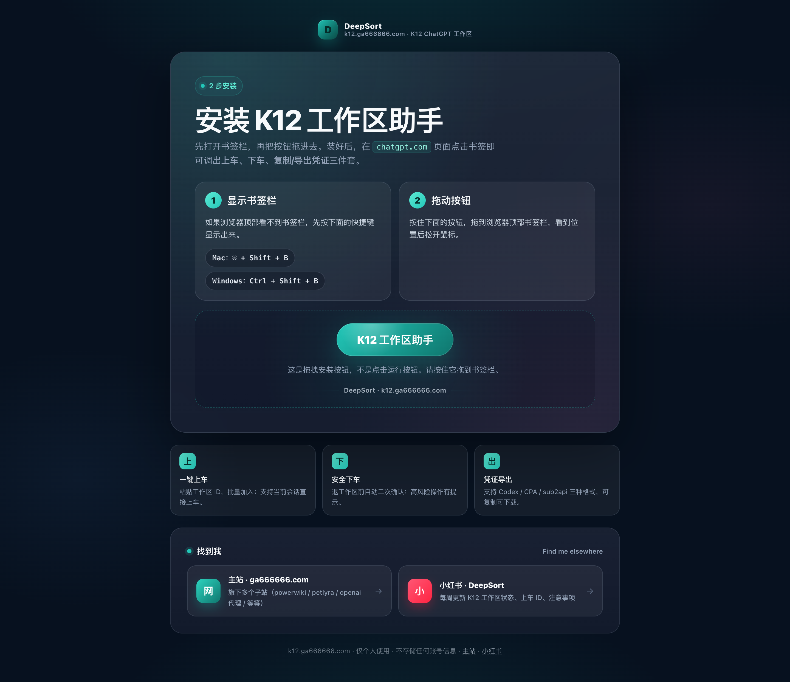
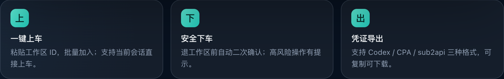
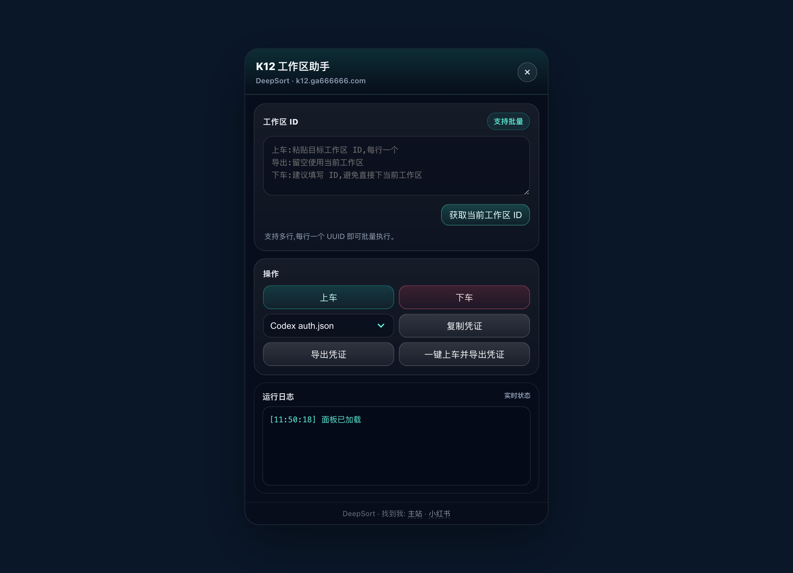
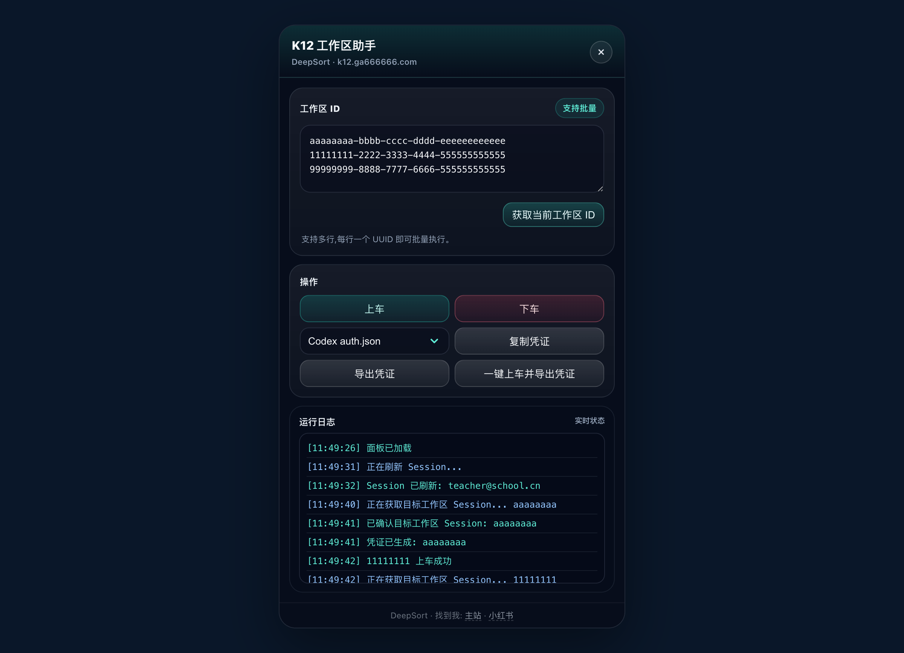
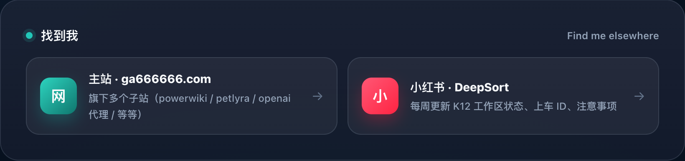

# K12 工作助手使用教程

> 工具主页：[https://k12.ga666666.com](https://k12.ga666666.com)
> 出品：DeepSort · 主站 [ga666666.com](https://ga666666.com) · 小红书 [DeepSort](https://www.xiaohongshu.com/user/profile/5d3c60850000000016006803)

## 一、这是个什么东西

**K12 工作助手**是一个装在浏览器书签栏里的小工具（bookmarklet），专门给 K12 教师在 chatgpt.com 上管理 ChatGPT Team / Enterprise **工作区**用。

它不是个浏览器扩展、不需要装客户端、不需要注册账号 —— 整个东西就是一段 JavaScript，拖到书签栏后点一下就在 chatgpt.com 页面右上角弹一个浮动面板，可以做 5 件事：

1. **上车** — 粘贴工作区 ID 加入别人的 Team 工作区
2. **下车** — 退出工作区
3. **复制凭证** — 把自己工作区的 session token 复制到剪贴板
4. **导出凭证** — 把 session token 导出为文件（支持 3 种格式）
5. **一键上车并导出凭证** — 批量执行：每个 ID 先上车、再抓凭证、最后导出

工具页整体长这样：



## 二、为什么需要它

ChatGPT Team 的工作区**共享方式**比较反直觉：管理员在网页上点「邀请成员」手动加，或者通过 `invites/request` 接口加。本工具把这个流程简化成"粘贴 ID + 点一下"。

最常见的两种使用场景：

- **新老师加入团队** — 团队负责人发你工作区 ID，5 秒上车不用等邀请邮件
- **跨设备 / 跨人传递凭证** — 已有工作区的 session 导出成本地 JSON，丢到别的客户端导入

## 三、2 步安装

### 第 1 步：打开浏览器，访问 [k12.ga666666.com](https://k12.ga666666.com)

页面会显示一个安装卡片，分两个步骤教你怎么操作。


### 第 2 步：显示书签栏

如果你的浏览器顶部看不到书签栏，先按对应系统的快捷键把它叫出来：

- **Mac**：`⌘ + Shift + B`
- **Windows**：`Ctrl + Shift + B`

### 第 3 步：拖动按钮到书签栏

找到安装卡片底部的这个大按钮（**注意：不要点击**）：


按住按钮**拖**到浏览器顶部刚显示出来的书签栏里。看到「K12 工作区助手」文字出现在书签栏上后，**松开鼠标**就装好了。

整个按钮里的链接是一段 `javascript:` 开头的伪 URL —— 这是浏览器书签脚本的标准格式。

> ⚠️ 装好后，**不要在 chatgpt.com 之外的页面点这个书签**，点了会弹一个"请在 chatgpt.com 上点"的二次确认。这是工具的自我保护，避免在别的网站注入面板。

## 四、3 个核心功能一览

按钮拖完后，工具页底部有一组功能速览条，方便来访者快速理解能力：



- **上（上车）** — 粘贴 ID → 批量加入
- **下（下车）** — 退工作区（带二次确认）
- **出（凭证导出）** — 复制 / 下载，3 种格式可选

## 五、正式开始使用

### 5.1 在 chatgpt.com 上点书签

打开 [chatgpt.com](https://chatgpt.com)，确保**已登录**。然后点书签栏上刚拖进去的「K12 工作区助手」按钮。

页面右上角会弹出一个深色浮动面板：



面板分 4 个区域：

| 区域 | 作用 |
|---|---|
| 头部 | 标题 + 关闭按钮（可拖拽） |
| 工作区 ID | 多行文本框，粘贴一个或多个 UUID；旁边有「获取当前工作区 ID」按钮 |
| 操作 | 上车 / 下车 / 格式选择 / 复制凭证 / 导出凭证 / 一键上车并导出凭证 |
| 运行日志 | 实时显示每一步的 API 请求结果（绿色成功 / 红色失败 / 黄色警告） |

面板的标题栏可以**按住拖动**到任意位置；右上角 × 关闭。

### 5.2 上车（加入别人的工作区）

1. 把工作区 ID 粘贴到文本框里，每行一个
   - 拿到 ID 后通常是 UUID 格式：`aaaaaaaa-bbbb-cccc-dddd-eeeeeeeeeeee`
   - 也可以一次贴多行批量执行
2. 点「**上车**」按钮
3. 看「运行日志」里的实时反馈：每个 ID 会先尝试上车（调 `invites/request`），成功就出绿字



如果某个 ID 已经在工作区里，会返回 HTTP 4xx，日志里出红字但不影响其他 ID 继续执行。

执行完后**刷新一下 chatgpt.com 网页**，左边栏的「工作区」下拉里就能看到新加进去的工作区了。

> 💡 如果你不知道当前自己在哪个工作区，点一下「**获取当前工作区 ID**」会自动把当前工作区的 ID 填到文本框里。

### 5.3 下车（退出工作区）

操作流程和上车一样：把要下的 ID 粘到文本框 → 点「**下车**」。

工具会**自动检查**你填的 ID 里有没有当前正在使用的工作区。如果有，会弹一个二次确认：

```
⚠️ 高风险: 你填写的 ID 中包含当前工作区
直接下车可能导致账号退出登录并使其它 token 失效
仍要继续吗?
```

确认后才会真的发 `DELETE` 请求。建议在下车前**先切换到别的 Team 工作区**，再对这个 ID 执行下车 —— 这是最稳的顺序。

### 5.4 复制 / 导出凭证

> ⚠️ **重要**：本工具导出的 `accessToken` / `refreshToken` 等凭证**等同于你的账号密码**。任何拿到这个文件的人都能以你的身份调用 ChatGPT API。**只传给自己信任的人和设备**，不要发到群里、上传到网盘、或截图发给别人。

**复制凭证**：选好格式（Codex / CPA / sub2api 之一） → 点「**复制凭证**」 → 工具把 JSON 写到剪贴板 → 粘贴到任何目标位置。

> 💡 复制只支持单个工作区。如果你想导出多个，工具会拒绝并提示你改用「导出凭证」。

**导出凭证**：选好格式 → 点「**导出凭证**」 → 浏览器弹出下载，文件名形如 `teacher@school.cn_aaaaaaaa_codex.json`。**多个 ID 会导出多个文件**。

#### 三种格式选哪个？

| 格式 | 用途 | 适合谁 |
|---|---|---|
| **Codex auth.json** | Codex CLI / OpenAI 官方兼容格式 | 用 OpenAI CLI / Codex 本地客户端的人 |
| **CPA JSON** | 一些中转 / 代理面板（CoPaw / Proxypanel 等） | 跑中转 API 的人 |
| **sub2api bundle** | sub2api 项目的账号导入格式 | 跑 sub2api 网关的人 |

如果只是**用本机浏览器**的话，不需要导出凭证。**换设备 / 换客户端**时才需要。

### 5.5 一键上车并导出凭证（最常用）

这是本工具的**杀手锏功能**，用于这种场景：

> 团队负责人给了一个新的工作区 ID 列表，希望每个老师都先上车再把凭证拿到本地。

操作：

1. 把多个工作区 ID 粘到文本框（每行一个）
2. 点「**一键上车并导出凭证**」
3. 弹一个 prompt 让你选格式（1 = Codex，2 = CPA，3 = sub2api bundle）
4. 工具自动逐个执行：
   - 对每个 ID 先 `joinWorkspace` 上车
   - 上车成功后 `fetchWorkspaceSession` 拿凭证
   - 把凭证按选定格式打包
   - 浏览器开始下载文件

跑完一次运行日志会长这样（成功 / 失败都有标注）：


只要上车成功的 ID 都会出凭证，**上车失败的不会**（避免下载一堆无效文件）。

## 六、常见问题

### Q1: 拖按钮到书签栏时，浏览器弹"无法安装"或"安全性"警告

不同浏览器对 `javascript:` 书签的处理不一样：

- **Chrome / Edge**：直接拖，正常情况下不会有警告
- **Safari**：可能要求确认，点同意即可
- **Firefox**：通常没问题

如果浏览器彻底禁了 `javascript:` 书签（比较新的安全策略），可以右键按钮 → "复制链接地址" → 在书签管理器里新建书签 → 粘贴 URL 到「网址」一栏。

### Q2: 在 chatgpt.com 上点书签，面板没出现

按这个顺序排查：

1. **确认你在 chatgpt.com**（不是 chat.openai.com 也不是 plus 的子路径）
2. **打开浏览器开发者工具（F12）→ Console 面板**，看有没有红色错误
3. **确认已登录 chatgpt.com**（工具会发 API 请求，没登录会 401）
4. **试一下别的页面**：先随便开个 chatgpt.com 的对话页面再点书签

如果 Console 里有红色错误，把错误信息截图发我（DeepSort）我可以排查。

### Q3: 上车失败，日志里写 `HTTP 403 / 401 / 404`

| 错误码 | 原因 | 解决 |
|---|---|---|
| **401** | 你的 chatgpt.com session 失效了 | 重新登录 |
| **403** | 这个工作区没有开放邀请 / 你被 ban 了 | 联系工作区管理员 |
| **404** | 工作区 ID 写错了 | 核对 ID 是不是 8-4-4-4-12 的 UUID 格式 |
| **429** | 调用太频繁被限流 | 工具里已经加了 800ms / ID 间隔，等几秒重试 |

### Q4: 「获取当前工作区 ID」按钮点了没反应

通常是 chatgpt.com 的 session 还没刷出来。**刷新网页**让 chatgpt.com 重新拉一次 session，然后再点。

### Q5: 面板能开，但是所有按钮点了都没反应

看 Console 是否有 `fetch` 报错。如果有 `CORS` 错误，那是 chatgpt.com 的安全策略改了（不太可能但偶尔发生）。如果有 `Mixed Content` 错误，说明你的 chatgpt.com 是 http 而不是 https，工具不工作（实际上 chatgpt.com 强制 https，应该不会发生）。

### Q6: 我换了一个工作区，但 token 还是旧的

工具里 `curToken` 是按 ID 重新拉过的，每次上车 / 抓凭证前都会调一次 `fetchCurrentSession` 或 `fetchWorkspaceSession`。如果你看到「凭证已生成」日志里写的是新 ID 的前 8 位，那就是对的。

### Q7: 工具能处理多账号吗？

工具本身只针对**当前登录的账号**操作。不内置多账号切换。要切账号 → 在 chatgpt.com 网页右上角头像里点「退出登录」→ 登另一个账号 → 再点书签。

## 七、安全 & 合规

我把这一节单独列出来，是因为这套工具涉及**账号凭证操作**，必须把几个红线说清楚：

### ⚠️ 工具做的事

- 调 ChatGPT 公开 web app 接口（`/api/auth/session`、`/backend-api/accounts/...`），**不抓任何后门 / 不发到第三方服务器**
- 抓到的 `accessToken` / `refreshToken` **只存在你当前浏览器内存里**，本机磁盘上不会留任何东西
- 导出的 JSON 文件由你自己决定保存到哪里，本工具服务器不收集

### ⚠️ 你需要知道的事

- **accessToken ≈ 账号密码**：拿到这个 token 的人能以你的身份用 API、读你的对话、消耗你的额度
- **不要发群、不要发邮件、不要发网盘** — 哪怕只是截图露出前几位也不要
- **多账号共享 / 转售 Team 席位** 违反 OpenAI ToS，被检测到时所有相关账号有被 ban 的风险
- **OpenAI 改接口** — 工具的 API 路径如果哪天 OpenAI 改了，我会同步更新，但中间窗口期可能短暂不可用

### ⚠️ 工具自身的安全

- 整个工具是**纯前端**的（HTML + JS），代码完全在浏览器跑，**没有后端收集数据**
- 安装页（k12.ga666666.com）只托管静态文件（Nginx + 1Panel），后端日志也只记 HTTP 状态码
- 你**完全可以用 F12 / View Source 检查**安装页和 bookmarklet 里的代码

## 八、找到我

- **主站**：[https://ga666666.com](https://ga666666.com) — 旗下多个子站（powerwiki / petlyra / openai 代理 / 等等）
- **小红书**：[DeepSort](https://www.xiaohongshu.com/user/profile/5d3c60850000000016006803) — 每周更新 K12 工作区状态、上车 ID、注意事项



## 九、版本 & 更新

- **v1.0**（2026-07-05）首次发布
  - 书签脚本安装页 + 浮动面板
  - 上车 / 下车 / 复制 / 导出 / 一键上车并导出 5 个功能
  - 3 种凭证格式（Codex / CPA / sub2api）
  - 批量 UUID 解析 + 实时日志
- 后续会考虑加：**工作区管理面板（列出你当前在的所有工作区、一键切换）**、**云端同步历史（可选）**

如果有 bug 或改进建议，去小红书 `@DeepSort` 留言，或者在工具页底部找到我。

---

*本文档由 DeepSort 出品。最后更新：2026-07-05。*
