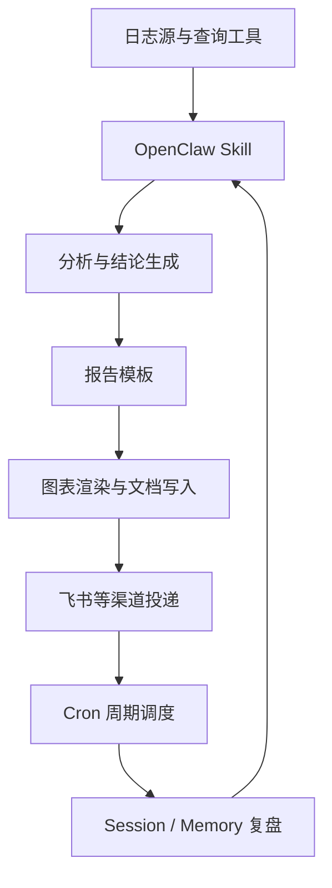

# 案例：用 OpenClaw 构建线上日志巡查系统

> 发布日期：2026-04-22
> 最后更新：2026-04-22
> 说明：本文基于本地 `OpenClaw` 运行环境里的 session、memory 与 cron 记录复盘整理，重点是讨论“它是怎么一步步落地的”，而不是展示一次性效果。

## 先说结论

这个案例里，真正被做出来的并不是“一个会看日志的聊天机器人”，而是一条逐渐收敛成形的生产链路：

- 定时拉取线上日志
- 提炼异常和优先级
- 生成日报与半小时巡检报告
- 把结果投递出去
- 在失败后回到 session / memory 里复盘
- 再把经验写回 Skill 和模板

如果只看单次结果，这类系统很容易被理解成“让 Agent 帮我查日志”。  
但从本地 session 和 memory 记录看，它真正的演进方向更像是：

**从一次性分析任务，逐步变成一个可持续运行、可复盘、可纠偏的巡查系统**

---

## 一、为什么选“线上日志巡查”做第一个落地案例

日志巡查是一个非常适合拿来验证 Agent 框架是否能落地的场景。

因为它同时具备几个特点：

- 输入固定  
  日志源、时间窗口、筛选规则相对稳定

- 输出固定  
  结论、异常项、优先级、趋势图、处理建议，这些都可以收敛成固定格式

- 频率明确  
  可以做 24 小时日报，也可以做 30 分钟巡检

- 结果可验证  
  报告是否生成成功、图片是否插入成功、投递是否成功、巡检是否超时，都能明确判断

- 失败价值高  
  一次失败并不只是“结果没出来”，而是会直接暴露系统当前最薄弱的那一层

换句话说，这不是一个只看“模型回答准不准”的场景，而是一个完整检验 Agent 系统能力的场景。

---

## 二、这个系统最后收敛成了什么结构

从本地 memory 记录里可以看到，日志巡查最终并不是单一提示词，而是由几层能力叠起来的：

这里最重要的不是每一层单独有多强，而是它们形成了一个闭环：

- **Skill** 定义流程骨架
- **模板** 约束输出结构
- **文档写入链路** 负责把结果真正交付出去
- **Cron** 负责周期化执行
- **Session / Memory** 负责把失败变成下一轮约束

这就是它能从“会跑一次”慢慢变成“能持续运行”的原因。

---

## 三、第一阶段：先跑通最小闭环

这个案例最早并不是从“巡查系统”开始的，而是从“能不能把一轮日志检查完整跑完”开始的。

最小闭环其实很朴素：

1. 拉取指定时间范围内的线上日志
2. 提炼异常项和风险等级
3. 输出日报或巡检结论
4. 发送给目标人

在这个阶段，目标不是稳定，而是先确认链路是否成立。  
也就是说，先证明下面这件事是可能的：

> `OpenClaw` 不只是能分析日志文本，它还能把分析结果变成结构化报告，并把报告真正投递出去

如果第一步都走不通，后面谈 Skill、Memory、Cron 都没有意义。

---

## 四、第二阶段：模板开始出现，Agent 从“会说”变成“会输出”

从 `2026-04-02-prod-log-monitor.md` 这类 memory 记录里可以看到，系统在很早就开始把日报模板和半小时巡检模板分开处理，并把模板本身纳入长期沉淀。

这一步非常关键。

因为在日志巡查里，大家最容易忽略的一点是：  
**模型能总结，不代表系统能交付**

真正能交付的输出，至少要满足：

- 结构固定
- 结论先行
- 优先级清晰
- 图表和正文关系稳定
- 长短周期报告的风格分开

在这个案例里，后续之所以能把 24 小时全量报告和 30 分钟快速巡检都稳定下来，靠的不是“多问几次”，而是把模板正式固化成系统的一部分。

也正是在这个阶段，Agent 开始从“会说话”转成“会产出某种标准结果”。

---

## 五、第三阶段：真正的问题开始暴露出来

一旦最小闭环跑通，系统的问题才真正开始浮出水面。

### 5.1 文档排版问题

从 `2026-04-08-log-monitoring.md` 的 session 记录可以看到，一次看似已经完成的文档投递，后来被复盘发现存在两个关键问题：

- 开头信息被写成了一整坨
- 前两张图片块是空的

这类问题特别典型。  
因为从“模型角度”看，它已经完成了总结；但从“系统交付角度”看，它其实没有完成任务。

这个区别很重要。  
Agent 落地时，必须从“回答完成”切到“交付完成”的视角。

### 5.2 半小时巡检超时问题

同一批 session 里还能看到另一个典型问题：

- 30 分钟巡检在 120 秒预算内无法稳定收尾

后来做的处理不是简单重试，而是明确收缩执行负载：

- 更轻的上下文
- 更长的超时预算
- 更极简的输出

这里反映出来的不是某次模型发挥失常，而是一个更本质的问题：

> 周期任务的约束，和交互式任务的约束并不一样

能在对话里慢慢做完，不代表能在 Cron 里稳定跑完。

### 5.3 交付链路必须逐步校验

session 里还明确沉淀了一条关键经验：

- 图片要串行上传
- 每一张都要校验成功
- 不能只看最终“像是发出去了”

这说明当 Agent 开始做系统化任务时，交付链路本身也必须被工程化。  
不然问题就会出现在最后一公里。

---

## 六、第四阶段：把失败写回 Skill 和 Memory

这个案例真正开始像“系统”而不是“脚本”，发生在失败经验被正式写回去之后。

从本地 memory 里可以看到，这些东西后来被明确持久化了：

- 日报模板与半小时模板
- 文档写入踩坑
- 图表模式
- 巡检系统架构
- 定时任务信息
- 超时处理策略

这一步的意义不只是“方便下次参考”。  
更重要的是，它把原本需要人工记住的经验，转成了系统级约束。

换句话说，Agent 不再依赖某个人记得：

- “图片要一张一张发”
- “半小时巡检输出要轻一点”
- “头部信息不能整坨 markdown”

而是这些东西开始被固化进它未来的执行路径里。

这就是落地的核心分界线。

---

## 七、第五阶段：接入 Cron，开始进入持续运行

当模板、写入、复盘都逐渐成形以后，系统才开始进入更像生产运行的阶段：Cron 周期执行。

从本地 `cron/runs/*.jsonl` 里可以看到，定时任务记录已经包含了：

- 任务执行成功
- 投递未完成
- 模型接口不兼容
- 模型超时与 fallback 失败
- 身份未登录
- scope 权限缺失
- 总结失败
- 长时间超时

这些 run 记录本身就很能说明问题。  
因为它告诉我们：一旦 Agent 进入周期系统，影响成败的已经不只是模型，还包括：

- 身份状态
- 权限 scope
- 模型接口兼容性
- provider 与模型切换策略
- 超时预算
- 投递链路

也正是在这里，`OpenClaw` 的价值开始真正体现出来。  
因为它不仅能执行任务，还能留下这些足够细的运行痕迹，让你知道系统到底卡在哪一层。

---

## 八、这个案例最值得复用的，不是日志巡查本身

如果只把这篇文章理解成“怎么让 OpenClaw 查日志”，价值其实是有限的。  
真正值得复用的，是这个案例背后的落地路径。

### 8.1 先找一个最适合收敛的场景

日志巡查之所以适合作为第一案例，不是因为它最重要，而是因为它最容易构成闭环。

同样适合的场景还包括：

- 固定格式日报
- 未完成任务提醒
- 指标异常总结
- 多渠道消息汇总

### 8.2 先让系统会交付，再让系统会优化

很多团队会先追求“更聪明”，但这个案例反过来说明：

- 先让系统真的把结果交付出去
- 再去谈输出质量提升
- 再去谈复杂度扩展

这个顺序更稳。

### 8.3 真正让 Agent 变强的，是“失败后写回系统”

从这个案例看，`OpenClaw` 最关键的不是单次调用，而是失败以后还能把经验回写到：

- Skill
- Memory
- 模板
- 定时任务参数

只要这条路是通的，系统就会越来越稳。  
如果这条路不通，再强的模型也只能不断重复犯错。

---

## 九、OpenClaw 为什么适合承接这种落地

用这个案例反推，可以更清楚看到 `OpenClaw` 的落地点在哪里。

它适合承接这类任务，不是因为“它能接模型”，而是因为它同时具备：

- **Session**  
  把不同来源和不同轮次执行保留下来

- **Skill**  
  把流程固化成长期可复用的执行骨架

- **Memory**  
  把踩坑经验沉淀下来，避免问题反复出现

- **Cron**  
  让场景从人工触发走向周期运行

- **Delivery**  
  让结果真正进入目标渠道，而不是停留在控制台里

这些能力叠在一起，才让“日志巡查”从一次性实验变成了可运行系统。

---

## 十、总结

这个案例最有价值的地方，不是证明 `OpenClaw` 会查日志，而是证明了一件更重要的事：

> 只要场景选对，并且愿意把失败经验持续写回系统，`OpenClaw` 是可以从一个会话型 Agent，逐步落成生产工作流的

在这个过程中，最关键的几个阶段是：

1. 先跑通最小闭环  
2. 再把输出模板稳定下来  
3. 再通过 session 发现真实问题  
4. 再把经验写回 Skill 和 Memory  
5. 最后接入 Cron，进入持续运行

所以这个案例真正给出的，不只是一个“日志巡查方案”，而是一条更通用的落地路径：

**先让 Agent 完成一次任务，再让它稳定完成，再让它持续完成**

这比一开始追求“全自动”“全智能”更慢一些，但也更接近真正能落地的系统。
