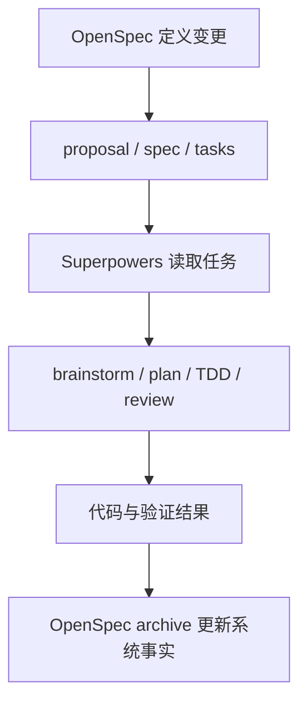

# OpenSpec 对比 Superpowers：规范驱动与技能驱动的 AI 开发工作流

截至 **2026-03-12**，如果把 AI 编码协作框架按核心思路分类，**OpenSpec** 和 **Superpowers** 代表了两条很不一样的路线：

- **OpenSpec**：先把需求、变更和规范写清楚，再让 AI 按 spec 落地。
- **Superpowers**：先给 Agent 一套强约束的技能与流程，让它按固定工程方法做事。

这两者都不是单纯的 prompt 模板，而是在解决同一个问题：**如何让 AI 编码从“会写代码”升级为“可预测地交付代码”。**

---

## 一、先说结论

如果只看一句话：

- **OpenSpec 更像“规格管理系统”**，核心是 artifact 和 change。
- **Superpowers 更像“Agent 工作流操作系统”**，核心是 skills 和强制流程。

如果你的团队主要痛点是：

- **需求经常说不清、变更范围容易漂移、多人协作上下文不一致**，优先看 **OpenSpec**。
- **AI 写代码太随意、缺少测试纪律、缺少审查与分步执行机制**，优先看 **Superpowers**。
- **既想把需求讲清楚，又想让 Agent 严格按工程流程执行**，两者其实可以组合。

---

## 二、两者分别解决什么问题

### 2.1 OpenSpec 解决的是“需求与变更如何成为 AI 的可靠上下文”

OpenSpec 官方把自己定位为 **Spec-driven development for AI coding assistants**。它的重点不是给 Agent 塞更多技巧，而是建立一套清晰的变更管理结构，让 AI 不再只依赖聊天记录理解需求。

其核心做法是把工作拆成结构化产物：

- `openspec/specs/`：当前系统事实
- `openspec/changes/<change>/proposal.md`：为什么做
- `tasks.md`：要做什么
- `spec` delta：要改哪些行为
- 归档后再把已批准变更合回 specs

本质上，OpenSpec 是在做两件事：

1. **把“意图”从聊天记录里抽离出来**
2. **把“变更”从代码 diff 之前就显式化**

所以它更适合团队协作、需求审查、跨仓库共享规范，以及 brownfield 项目的持续演进。

### 2.2 Superpowers 解决的是“Agent 如何按工程纪律工作”

Superpowers 官方把自己定位为 **complete software development workflow for coding agents**。它的关注点不是 spec 文件结构，而是：Agent 一旦开始做开发，必须遵守哪些技能和流程。

它的 README 里明确强调了几类核心能力：

- brainstorming
- write-plan
- execute-plan
- test-driven-development
- code review
- debugging
- subagent-driven development

它背后的思想也很鲜明：

- **TDD first**
- **systematic over ad-hoc**
- **evidence over claims**
- **complexity reduction**

所以 Superpowers 更像“给 Agent 装一整套工程习惯”。它试图让 Agent 在编码之前先澄清设计、先拆计划、先写测试、分批执行、逐步验证，而不是收到一句需求就直接开写。

---

## 三、核心差异：artifact 驱动 vs skill 驱动

### 3.1 OpenSpec 是 artifact 驱动

OpenSpec 的中心不是 Agent 本身，而是 **artifact**。

这里的关键点是：

- AI 要读什么，由 artifact 决定
- 需求是否清晰，通过文档结构体现
- 变更是否可审查，通过 spec delta 体现
- 项目事实与提案事实是分开的

这意味着 OpenSpec 的“确定性”来自 **文档与结构**。

### 3.2 Superpowers 是 skill 驱动

Superpowers 的中心是 **skills + mandatory workflow**。

这里的关键点是：

- Agent 什么时候该 brainstorm、什么时候该写计划，由 skills 决定
- 编码前是否先测试、是否分步执行，由 workflow 决定
- 质量不是靠“希望 AI 自觉”，而是靠流程注入

这意味着 Superpowers 的“确定性”来自 **技能编排与行为约束**。

---

## 四、从工程实践看，差异非常明显

| 维度 | OpenSpec | Superpowers |
|------|----------|-------------|
| **核心对象** | spec、proposal、change、tasks | skill、command、workflow、subagent |
| **主要目标** | 对齐需求与变更 | 规范 Agent 执行方式 |
| **约束来源** | 文档结构与变更流程 | 技能系统与执行纪律 |
| **适合阶段** | 需求分析、方案澄清、变更管理 | 编码实施、测试、审查、执行控制 |
| **适合项目类型** | 中大型项目、存量系统、多人协作 | 强工程纪律团队、Agent 自动化开发 |
| **对 AI 的要求** | 能读 spec 并按 spec 实现 | 能遵守技能与流程编排 |
| **风险点** | 文档写得差会把错误规格固化 | 流程过强时可能显得偏重、偏慢 |
| **最强优势** | 让需求和变更可审查、可归档 | 让 Agent 输出更稳、更可验证 |

---

## 五、使用体验上的本质区别

### 5.1 用 OpenSpec 时，你在管理“知识对象”

你会更关注这些问题：

- 这次改动的 proposal 是否完整？
- 当前 spec 和 change delta 是否一致？
- tasks 是否覆盖了批准后的范围？
- archive 之后，系统事实是否被正确更新？

这是一种偏 **产品/架构/需求管理** 的思路。

### 5.2 用 Superpowers 时，你在管理“Agent 行为”

你会更关注这些问题：

- Agent 有没有先 brainstorm？
- 有没有先写计划再执行？
- 有没有先写失败测试？
- 每个子任务是否验证通过？
- 是否经过 code review 和分支收尾流程？

这是一种偏 **工程执行治理** 的思路。

---

## 六、适用场景判断

### 6.1 更适合 OpenSpec 的场景

#### 场景 1：存量系统持续迭代

当项目已经不是 0 到 1，而是 1 到 N，不同需求会同时影响多个模块时，OpenSpec 的 change folder 模式更有优势。因为它天然适合：

- 记录某次变更为什么发生
- 显示当前 spec 要被怎样修改
- 让多人在编码前对齐范围

#### 场景 2：跨仓库或跨角色协作

如果产品、后端、前端、测试都要围绕同一份行为定义协作，OpenSpec 会更自然。因为 spec 可以成为共享事实，而不只是开发者脑中的理解。

#### 场景 3：需要可审计的 AI 交付链路

如果你希望以后能回看“这个功能当时是怎么定义的、为什么这么改、AI 按什么上下文实现的”，OpenSpec 的归档链路非常适合。

### 6.2 更适合 Superpowers 的场景

#### 场景 1：团队最痛的是 AI 编码不稳定

比如常见问题：

- 不先分析直接写
- 不写测试
- 一次性改太多
- 改完不验证
- 宣称完成但没有证据

Superpowers 正是在解决这些执行层问题。

#### 场景 2：你希望 Agent 像资深工程师一样按流程工作

它不是让 AI 更“聪明”，而是让 AI 更“守纪律”。对于需要稳定落地、强调测试与 review 的团队，这一点很关键。

#### 场景 3：你主要想强化实现阶段，而不是先建设完整 spec 体系

有些团队没有精力先把 OpenSpec 体系搭起来，但又希望 AI 开发立刻更稳，这种情况下先上 Superpowers 往往更快见效。

---

## 七、两者不是替代关系，而是上下游关系

这是最容易被误解的一点。

很多人会把 OpenSpec 和 Superpowers 当作同类产品直接二选一，但从工程视角看，它们更像处在不同层次：

- **OpenSpec 负责“做什么”**
- **Superpowers 负责“怎么做”**

可以用下面这张图理解：

如果把两者组合起来，典型工作方式会变成：

1. 用 **OpenSpec** 明确 proposal、spec delta、tasks
2. 用 **Superpowers** 约束 Agent 先 brainstorm、再 plan、再 TDD、再 review
3. 完成后把批准变更归档回 OpenSpec

这套组合比单独使用任一方都更完整：

- OpenSpec 补足“需求与变更对齐”
- Superpowers 补足“实现与验证纪律”

---

## 八、组合落地建议

### 8.1 团队刚开始引入 AI 协作

建议先上 **Superpowers 风格流程**，因为它对“立刻提升输出稳定性”更直接。先把下面几件事固定下来：

- 先澄清再编码
- 先计划再实施
- 先测试再改代码
- 每一步都给出验证证据

当团队已经适应这种节奏后，再补 OpenSpec 的 artifact 管理。

### 8.2 团队已经有规范沉淀，希望 AI 进入正式研发流程

建议先上 **OpenSpec**。因为这时团队更需要的是：

- 可复用的系统行为定义
- 可归档的 change 历史
- 可共享的 AI 上下文

然后在实施阶段叠加 Superpowers，让 Agent 的执行更稳。

### 8.3 最佳组合方式

一个比较实用的落地组合如下：

- **OpenSpec**：管理 `specs/`、`changes/`、proposal、tasks
- **AGENTS.md / 团队规则**：约束技术栈、目录规范、代码禁忌
- **Superpowers**：规范 brainstorm、planning、TDD、review、subagent execution

这三层分别解决不同问题：

- **Spec 层**：系统行为和变更范围
- **Rule 层**：团队工程约束
- **Workflow 层**：Agent 执行纪律

---

## 九、什么时候不该选它们

### 9.1 不适合重度使用 OpenSpec 的情况

- 小型一次性脚本项目
- 单人快速试错原型
- 团队没有维护 spec 的意愿

如果没有人愿意维护 artifact，OpenSpec 很容易退化成“多了一堆没人在看的文件”。

### 9.2 不适合重度使用 Superpowers 的情况

- 你只想让 AI 快速生成 demo
- 任务规模很小，不值得走完整流程
- 团队对 TDD 和分步执行没有共识

如果团队根本不接受流程纪律，Superpowers 会被嫌“太重”。

---

## 十、最终判断

如果必须做一句最实际的判断：

- **OpenSpec 更强在“规格治理”**
- **Superpowers 更强在“执行治理”**

OpenSpec 把 AI 开发从“聊天驱动”拉回到“文档驱动、变更驱动”。  
Superpowers 把 AI 开发从“随缘发挥”拉回到“流程驱动、验证驱动”。

所以真正成熟的团队，通常不是只选其中一个，而是会逐步形成这样的组合：

- 用 **OpenSpec** 固化系统行为与变更过程
- 用 **Superpowers** 固化 Agent 的执行纪律
- 用 **AGENTS.md / 工程规范** 固化团队自己的技术边界

这才是从“AI 能写代码”走向“AI 能稳定参与工程”的更完整路径。

---

## 参考资料

- OpenSpec 官方仓库：<https://github.com/Fission-AI/OpenSpec>
- OpenSpec 官方站点：<https://openspec.dev/>
- Superpowers 官方仓库：<https://github.com/obra/superpowers>
- Superpowers Marketplace：<https://github.com/obra/superpowers-marketplace>
