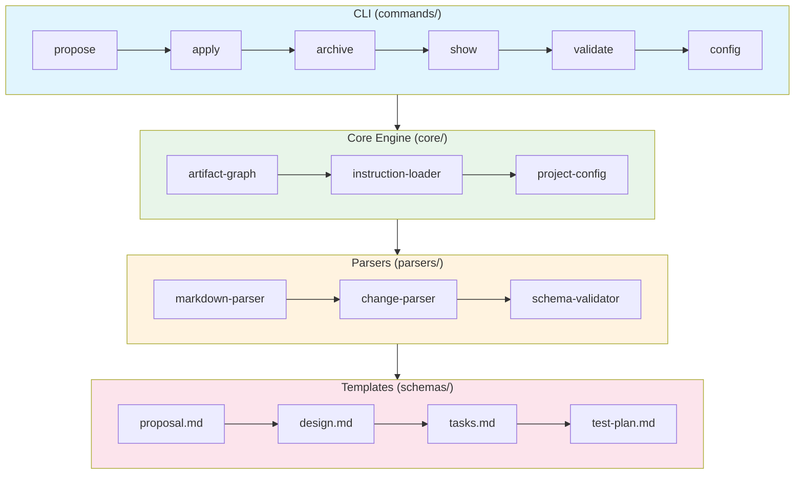
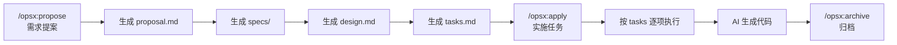
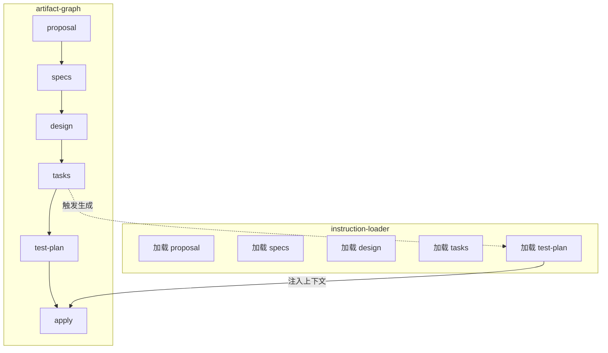
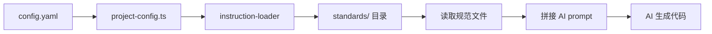
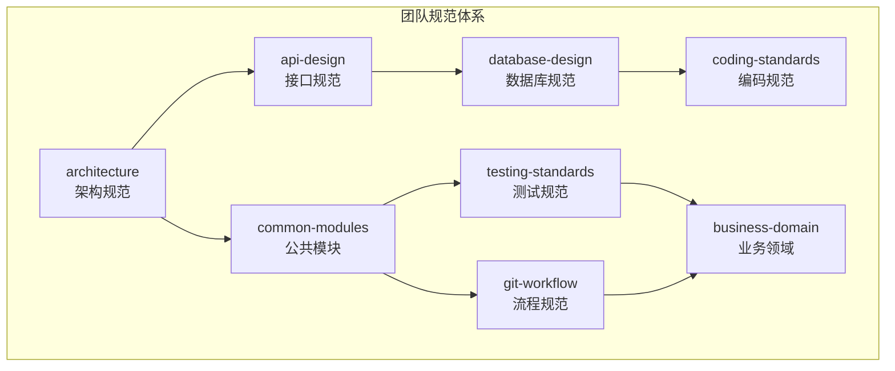
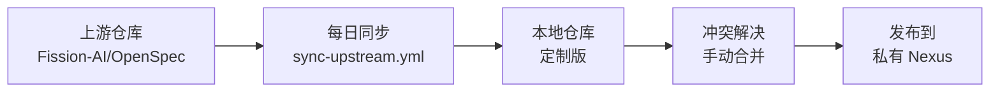

# OpenSpec Fork 定制化实践报告

## 1. OpenSpec 核心原理

在讨论定制化之前，先理解 OpenSpec 的设计理念。

### 1.1 核心理念：Artifact-Guided Development

OpenSpec 的核心创新在于**以 artifact（产出物）驱动开发流程**。传统开发是需求 → 设计 → 编码的线性流程，OpenSpec 将这个流程拆解为一系列可追踪的文档 artifact：

| Artifact | 作用 | 负责人 |
|----------|------|--------|
| proposal | 需求概述、背景、价值 | 产品/开发 |
| specs | 详细需求场景、边界条件 | 产品 |
| design | 技术方案、接口设计、决策记录 | 开发 |
| tasks | 实施任务清单、优先级 | 开发 |
| apply | 代码实现 | AI + 开发 |

**关键洞察**：每个 artifact 都是 AI 的上下文输入。AI 不是凭空写代码，而是基于这些结构化的文档来生成代码。这就是为什么 prompt engineering 在 OpenSpec 中如此重要——artifact 的质量直接决定了 AI 输出的质量。

### 1.2 架构分层



**数据流**：

1. 用户执行 `/opsx:propose <需求>` → CLI 解析命令
2. 从 templates/ 获取 artifact 模板 → 填充用户输入
3. 生成的 artifact 写入 `openspec/changes/<changeName>/`
4. 执行 `/opsx:apply` 时，instruction-loader 读取所有 artifact
5. 将 artifact 内容注入 AI prompt → AI 生成代码

### 1.3 原始工作流（上游）



**原始 artifact 结构**：

```
openspec/
└── changes/
    └── <changeName>/
        ├── proposal.md      # 为什么做（Why）
        ├── specs/           # 需求场景
        │   ├── scenario-1.md
        │   └── scenario-2.md
        ├── design.md        # 怎么实现（How）
        └── tasks.md         # 做什么（What）
```

---

## 2. 定制化内容

### 2.1 定制后工作流

```mermaid
flowchart LR
    A["/opsx:propose<br/>需求提案"] --> B[生成 proposal.md 中文版]
    B --> C[生成 specs/]
    C --> D[生成 design.md 中文版]
    D --> E[生成 tasks.md 中文版]
    E --> F[生成 test-plan.md 中文版]

    F --> G["standards 注入<br/>加载团队规范"]

    G --> H["/opsx:apply<br/>实施任务"]
    H --> I[AI 读取 artifact + standards]
    I --> J[生成符合规范的代码]

    J --> K["/opsx:archive<br/>归档"]
```



**关键改动点**：

1. **test-plan 阶段**：在 tasks 和 apply 之间增加测试计划环节
2. **standards 注入**：apply 前加载团队工程规范
3. **全流程中文化**：模板、指令、输出全部中文

### 2.2 技术实现原理

#### 2.2.1 test-plan 阶段注入

原始工作流只有 4 个 artifact，我们扩展到了 5 个：



**代码改动**（`src/core/artifact-graph/instruction-loader.ts`）：

```typescript
// 原始：只加载 4 个 artifact
const ARTIFACTS = ['proposal', 'specs', 'design', 'tasks'];

// 定制：增加 test-plan
const ARTIFACTS = ['proposal', 'specs', 'design', 'tasks', 'test-plan'];
```

#### 2.2.2 standards 动态注入

这是定制化的核心——让 AI 生成符合团队规范的代码。



**配置机制**（`openspec/config.yaml`）：

```yaml
standards:
  - architecture      # 微服务架构规范
  - api-design       # 接口设计规范
  - coding-standards # 编码规范
  - testing-standards
  # ... 按需配置
```

**加载逻辑**（`src/core/project-config.ts`）：

```typescript
interface ProjectConfig {
  standards?: string[];  // 新增字段
}

function loadStandards(config: ProjectConfig): string[] {
  const standardsDir = path.join(process.cwd(), 'openspec/standards');
  const standards = config.standards || [];

  return standards.map(name => {
    const file = path.join(standardsDir, `${name}.md`);
    return fs.readFileSync(file, 'utf-8');
  });
}
```

#### 2.2.3 解析器中英文兼容

原始解析器只识别英文标题：

```typescript
// 原始代码
const SECTION_PATTERNS = [
  /^##\s+Why/,
  /^##\s+Goals/,
  /^##\s+Non-Goals/,
  /^##\s+Decisions/,
];
```

定制后同时支持中英文：

```typescript
// 定制代码
const SECTION_PATTERNS = [
  /^##\s+(Why|背景与动机)/,
  /^##\s+(Goals|目标)/,
  /^##\s+(Non-Goals|非目标)/,
  /^##\s+(Decisions|决策)/,
];
```

**为什么这样做**：保持对上游英文模板的兼容，同时支持团队内部的中文文档。

#### 2.2.4 遥测模块改造

```mermaid
flowchart TB
    subgraph "原始 telemetry"
        A[trackEvent] --> B[posthog-node]
        B --> C[POST https://api.posthog.io]
    end

    subgraph "定制后"
        D[trackEvent] --> E[// no-op]
    end
```

**改动**（`src/telemetry/index.ts`）：

```typescript
// 原始实现
export function trackEvent(event: string, properties?: Record<string, unknown>) {
  if (!isEnabled) return;
  posthog.capture(event, properties);
}

// 定制后：完全禁用
export function trackEvent(event: string, properties?: Record<string, unknown>) {
  // no-op: 禁用遥测，确保内网可用
}
```

**影响**：

- 移除 posthog-node 依赖
- 零网络请求
- 适合企业内网环境

---

## 3. 9 份工程规范详解

这些规范不是泛泛的最佳实践，而是从团队实际代码中提炼的真实约定。

### 规范体系



| 规范 | 解决的问题 |
|------|-----------|
| architecture.md | 新人不知道服务划分、模块结构 |
| api-design.md | 接口风格不统一、错误码混乱 |
| database-design.md | 表前缀、字段命名不一致 |
| coding-standards.md | 命名风格、异常处理各异 |
| common-modules.md | 不知道有哪些公共组件可用 |
| mqtt-protocol.md | IoT 协议实现各异 |
| git-workflow.md | 分支命名混乱、提交不规范 |
| testing-standards.md | 不会写单元测试 |
| business-domain.md | 不知道核心业务流程 |

---

## 4. 上下游同步策略



**同步原则**：

1. **config.yaml 管理定制**：所有定制化配置放在这个文件，不直接修改上游源码
2. **standards 独立目录**：规范文件放在 `openspec/standards/`，与上游隔离
3. **模板按需覆盖**：中文模板放在 `schemas/spec-driven/templates/`

---

## 5. 效果评估

| 指标 | 原始版 | 定制版 |
|------|--------|--------|
| 模板语言 | 英文 | 中文 |
| 工程规范注入 | 无 | 9 份规范 |
| 测试计划 | 无 | 有 |
| 遥测 | 有（隐私风险） | 无 |
| 内网部署 | 不可用 | 可用 |
| Windows 支持 | 有限 | 完整 |

---

## 6. 总结

通过这次定制化，我们验证了以下原则：

1. **OpenSpec 的核心价值在于 artifact 驱动**：理解了这一点，就明白为什么 test-plan 和 standards 注入能够提升输出质量——它们丰富了 AI 的上下文。

2. **定制化不是 Fork，而是扩展**：通过 config.yaml 和独立目录机制，我们实现了定制化与上游同步的平衡。

3. **工程规范文档化的价值**：将隐性知识显性化，让 AI 生成的代码天然符合团队约定，减少了人工 review 成本。

希望本文能帮助读者深入理解 OpenSpec 的工作原理，并为类似的定制化需求提供参考。

---

*本文基于 OpenSpec 内部定制版实践整理，版本 v1.3.14。*
