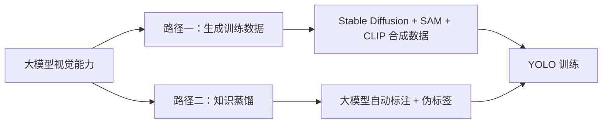

# YOLO 视觉 AI 专题

这个专题围绕同一个问题的两条不同解法：**大模型的视觉能力很强，但跑不快、成本高；YOLO 跑得快、成本低，但需要大量标注数据。怎么用前者反哺后者**。

## 文章导航

- [用 AI 训练 AI：生成式数据增强实践](./AI生成训练数据增强YOLO检测方案.md)
  - Stable Diffusion、SAM、CLIP 组合生成训练数据
  - 混合训练策略与效果对比
- [蒸馏大模型视觉能力到 YOLO 应用](./蒸馏大模型视觉能力到YOLO应用.md)
  - 用大模型做自动标注与伪标签
  - 一次宠物姿态识别的完整落地实践

## 为什么做成专题

两篇文章都在解决"标注数据不够、模型跑不快"这同一类痛点，只是切入路径不同：一个是从数据端生成更多训练样本，一个是从模型端把大模型的理解能力蒸馏进小模型。放在一起看，更容易根据实际场景（缺数据 vs 缺标注）选对路径。
