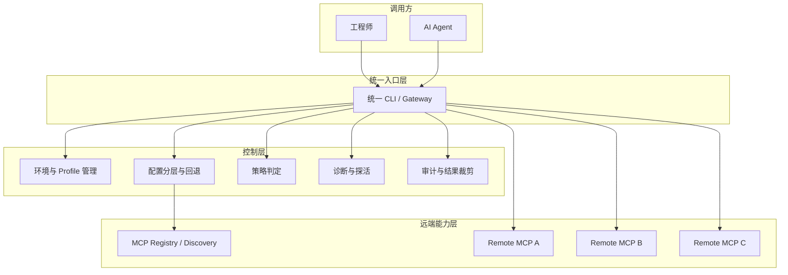
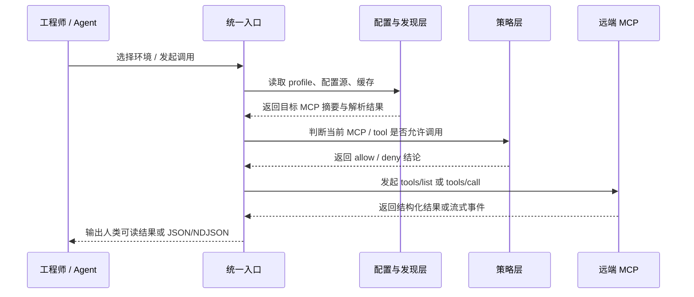

# 从远端 MCP 接入到工程化落地

> 发布日期：2026-04-22
> 最后更新：2026-04-22
> 说明：本文聚焦设计思想与工程原则。文中的实现形态来自一个匿名内部案例，命令名、组件名与细节已做抽象处理。

过去很多团队在谈 MCP 时，关注点往往停留在“能不能连上”。  
但一旦场景从本地实验走向团队协作，问题马上就会变化：不是某个 Agent 能不能调用一个工具，而是这套远端能力能不能被稳定发现、按环境切换、被安全调用、被诊断和被复用。

这也是远端 MCP 接入最容易被低估的地方。  
协议本身并不复杂，真正复杂的是它进入工程体系之后的那一层。

---

## 一、为什么远端 MCP 接入总是停留在试验阶段

本地跑一个 MCP Server 通常不难。  
难的是把它变成一套团队可以长期依赖的能力。

常见问题有四类。

### 1.1 接入方式分散

很多团队最早的做法，是让每个人自己在本地配置一批 MCP Server：

- 有人直接在 Agent 配置里写 URL
- 有人写一层本地脚本做转发
- 有人把环境变量散落在 shell profile 里
- 有人把内部地址、鉴权头、参数格式写进 README

这类做法在单人试验阶段没问题，但一到团队协作就会出现三个结果：

- 同一个远端 MCP，不同人接入方式不同
- 工具说明、鉴权方式、环境切换规则无法统一
- 问题发生后，很难快速判断是配置错、环境错、协议错，还是服务本身不可用

### 1.2 环境模型缺失

远端 MCP 很少只存在一个环境。  
大多数内部系统至少会有 `demo / test / prod` 这样的分层。

如果没有一套明确的环境模型，就会出现：

- 人在 `test` 排障，Agent 实际打到了 `prod`
- 同一个 MCP 名称，在不同环境对应不同 endpoint，但外部看起来完全一样
- 诊断结果不可复现，因为每个人“当前环境”的定义都不一致

对团队来说，环境不是附加参数，而是一等公民。

### 1.3 协议连通不等于可调用

很多接入方案把“能握手”视为成功，但这离“可稳定调用”还差很远。

一个远端 MCP 真正可用，至少还要回答这些问题：

- 它当前暴露了哪些 tools
- 这些 tools 是否允许在当前环境调用
- 当前调用是只读还是可写
- 出错时应该重试，还是立即终止
- 调用结果过大时如何裁剪
- 流式与非流式调用是否有统一输出契约

如果这些没有被收口，AI Agent 的调用就只能停留在“试试看”。

### 1.4 安全与诊断经常被后置

很多远端 MCP 在 PoC 阶段能跑起来，但到了推广阶段就暴露出两个问题：

- 底层配置暴露过多，内部 endpoint、命令参数、环境变量直接泄漏给调用方
- 故障定位成本过高，出现问题时没有统一的 `doctor`、`probe`、审计与错误码

于是团队最后会发现，真正阻碍 MCP 推广的，往往不是模型，也不是协议，而是工程质量。

---

## 二、问题的本质不是“怎么连”，而是“怎么收口”

远端 MCP 接入真正需要解决的，不是单点连通性，而是把一堆零散能力收口成一套稳定接口。

我更倾向于把这个问题理解成三层。

### 2.1 发现层

调用方需要先知道：

- 当前有哪些 MCP
- 它们属于哪个环境
- 哪些是可调用的，哪些只是可见不可调
- 每个 MCP 当前暴露了哪些 tool

如果发现层做不好，Agent 看到的就不是一套能力，而是一堆猜测。

### 2.2 控制层

控制层负责解决：

- 环境选择
- 配置来源
- 凭据管理
- 策略判定
- 诊断与探活

这一层不直接产生业务结果，但它决定了调用行为是否稳定、可控、可追踪。

### 2.3 执行层

执行层才是大家最容易关注的那一层：

- 列工具
- 发调用
- 处理结果
- 支持流式返回

但如果前两层没有工程化，执行层就只能靠调用方自己兜底，最终每个 Agent 都会长出一套自己的兼容逻辑。

这正是系统复杂度外溢的开始。

---

## 三、一套可复用的远端 MCP 工程化原则

如果要把远端 MCP 做成团队基础设施，我认为至少需要以下几条原则。

### 3.1 统一入口，而不是分散直连

不要让每个 Agent、每个脚本、每个人都直接去对接远端服务。  
应该有一个统一入口，把发现、选择、调用、诊断全部收口。

这个入口可以是 CLI，也可以是网关，但它至少要满足两点：

- 对人类使用者足够直接
- 对 AI Agent 足够稳定和可编排

统一入口最大的价值不是“多一层封装”，而是把规则集中到一个地方。

### 3.2 环境是第一类对象

远端 MCP 的设计不能把环境当作一个可有可无的参数。  
环境应该进入系统的主模型里，至少包含：

- 当前环境是什么
- 当前环境如何切换
- 哪些能力在哪个环境可见
- 哪些能力在哪个环境可调用

环境模型一旦稳定，很多排障和协作问题会直接下降一个数量级。

### 3.3 配置必须分层，并允许回退

团队落地时，最怕的是“唯一配置源”过于脆弱。  
更稳妥的方式通常是配置分层：

```text
remote-config > discovery > cache > local-minimal-state
```

这样做的好处是：

- 正常情况下优先吃远端统一配置
- 远端配置缺失时可以通过发现逻辑兜底
- 发现链路临时失败时仍可利用缓存维持基本可用
- 本地只保存最小必要状态，而不是复制整套远端配置

这不是为了复杂而复杂，而是在真实团队环境里提高抗波动能力。

### 3.4 最小暴露，而不是全量透传

对远端 MCP 来说，调用方真正需要知道的，通常只有：

- 这个 MCP 是谁
- 当前环境是什么
- 它是否可调用
- 它有哪些 tool
- 调用时需要什么输入格式

至于底层 endpoint、服务端命令、内部路由、鉴权细节，并不应该默认暴露给上层 Agent。

最小暴露的价值有两个：

- 降低敏感信息泄漏面
- 降低调用方对底层实现细节的耦合

这会显著提升后续演进空间。

### 3.5 可诊断性必须内建

如果一个远端 MCP 体系没有统一诊断入口，它就不算真的完成工程化。

一个成熟的诊断体系至少要能回答：

- 当前本地配置是否完整
- 当前环境是否已选定
- 远端配置是否存在
- 目标 MCP 是否结构上可用
- 目标 MCP 是否探活成功
- 失败属于配置问题、策略问题、远端问题，还是执行问题

最理想的状态是，把这些收敛成统一 `doctor` 与明确错误码，而不是让调用方读日志猜。

### 3.6 输出要同时服务人和 Agent

这是很多内部工具容易忽略的一点。  
如果目标用户既包括工程师，也包括 AI Agent，那么输出就不能只面向人类终端。

比较稳的做法通常是双通道：

- 默认输出适合人阅读
- `--json` 输出适合 Agent 消费

而且 JSON 不只是“把字符串包一层”，而应该有稳定 envelope，例如：

```json
{
  "ok": true,
  "command": "mcp tools",
  "data": {},
  "meta": {},
  "error": null
}
```

当错误也具备稳定结构后，Agent 才能做自动判定、重试和降级。

### 3.7 策略与审计要前置，而不是补丁式添加

一旦远端 MCP 进入真实团队，策略控制就不可避免：

- 哪些 MCP 可调用
- 哪些 tool 可调用
- 哪些环境只允许只读
- 哪些结果需要裁剪
- 哪些调用要留下审计记录

如果这部分不是一开始就在统一入口收口，而是后面零散补丁，最终会变成一组彼此冲突的例外规则。

---

## 四、匿名案例：如何把这些原则落成一套方案

下面用一个匿名内部案例说明这套思路如何落地。  
这个案例的目标不是“再造一个 MCP 协议”，而是在协议之上增加一层工程运行时。

### 4.1 整体结构



这里最核心的变化是：  
调用方不再直接连接某个具体 MCP，而是先进入统一入口，再通过控制层完成收口。

### 4.2 最小可用能力集

这个匿名案例最初只保留了几类核心能力：

- `profile`  
  负责环境同步、环境选择、当前状态展示

- `mcp list / get`  
  负责远端 MCP 发现与摘要展示

- `mcp tools`  
  负责列出某个 MCP 当前真实可用的 tool

- `mcp call`  
  负责统一执行远端 tool 调用

- `doctor`  
  负责把配置、环境、注册信息、探活状态串成一条诊断链

这个能力集有一个重要取舍：  
先把“稳定调用路径”做扎实，而不是一开始就追求功能数量。

### 4.3 一条典型调用链

在这套方案里，一次调用通常会经过这样的过程：



这个流程看起来比“直接调一个 URL”更长，但换来的能力是：

- 每次调用都带着确定环境
- 每次调用都有统一策略判断
- 每次失败都能映射到稳定错误面
- 每次输出都可被人和 Agent 一致消费

这就是工程化的价值。

---

## 五、为什么这类设计天然适合 AI Agent

远端 MCP 的工程化并不只是为了人类工程师。  
它对 AI Agent 的价值反而更明显。

### 5.1 Agent 需要的是稳定契约，不是隐藏经验

人类可以从零散文档、聊天记录和历史经验里拼出“怎么调用”。  
Agent 不擅长这个。

Agent 更擅长的是：

- 读取稳定 JSON
- 按固定步骤先发现、再判断、再调用
- 根据错误码做重试或降级
- 用一致的输出契约继续后续推理

所以一个 AI 友好的远端 MCP 方案，重点不是“功能多”，而是“契约稳”。

### 5.2 Agent 不应该知道太多底层细节

如果让 Agent 直接面对：

- 内部 endpoint
- 鉴权头
- 协议细节差异
- 服务端历史兼容逻辑

那它在每次调用时都会消耗额外上下文去理解这些噪音。  
这既不安全，也不经济。

统一入口的意义之一，就是把“Agent 不该关心的部分”隔离出去，让它只面对必要的抽象。

### 5.3 Agent 比人更依赖诊断闭环

人类遇到问题时，通常会自己猜一猜：是不是网络、是不是环境、是不是权限。  
Agent 如果没有诊断闭环，就只能盲试。

因此，远端 MCP 一旦要服务 Agent，就必须具备：

- preflight
- readiness / probe
- 结构化错误码
- 明确的 retryable 语义

这几项一补齐，很多“Agent 不稳定”的问题，实际上会转化成“接口终于可自动化”。

---

## 六、如果团队要做，建议先落这几层

很多团队一谈工程化，就容易直接开大。  
但远端 MCP 更适合分阶段建设。

### 6.1 第一阶段：先把环境和发现收口

优先做这几件事：

- 明确环境模型
- 明确当前环境如何持久化
- 提供统一的 `list / get`
- 让调用方先能知道“现在有什么”

这一步做完，团队就从“口口相传”进入“可发现”状态。

### 6.2 第二阶段：建立稳定调用路径

接着补齐：

- `tools/list`
- `tools/call`
- 人类输出 + JSON 输出双通道
- 最小暴露摘要

这一步做完，远端 MCP 就不再只是可见，而是可稳定使用。

### 6.3 第三阶段：把诊断、策略、审计补成平台能力

再往后，重点不再是“多接几个 MCP”，而是提升体系质量：

- `doctor`
- readiness probe
- allow / block policy
- tool 级权限控制
- 审计与结果裁剪

做到这一步，体系才真正具备推广条件。

### 6.4 第四阶段：为 Agent 提供配套上下文

最后再补：

- AI 友好的 help / manifest / schema
- SOP 文档
- skill 或 prompt 模板
- 常见调用路径示例

很多团队会先做这层，但如果前面三层没打好，这一层最终只是包装。

---

## 七、总结

远端 MCP 接入真正难的地方，从来都不是“把协议接上”。  
真正难的是，把它变成一套团队可以信任的工程系统。

如果只把远端 MCP 当成一个临时工具连接问题，那么它很容易停留在个人试验阶段。  
但如果把它看成一层面向人和 AI Agent 的工程运行时，那么设计重点就会完全不同：

- 不是直连，而是统一入口
- 不是临时环境变量，而是明确环境模型
- 不是全量透传，而是最小暴露
- 不是“失败了看日志”，而是内建诊断与错误契约
- 不是只给人看，而是同时面向 Agent

从这个角度看，远端 MCP 的工程化并不是附加工作。  
它本身就是让 AI 能稳定进入真实生产体系的基础设施。

如果说 MCP 解决的是“模型如何接入外部世界”，那么工程化要解决的，就是“这条接入链路如何在团队里长期成立”。
