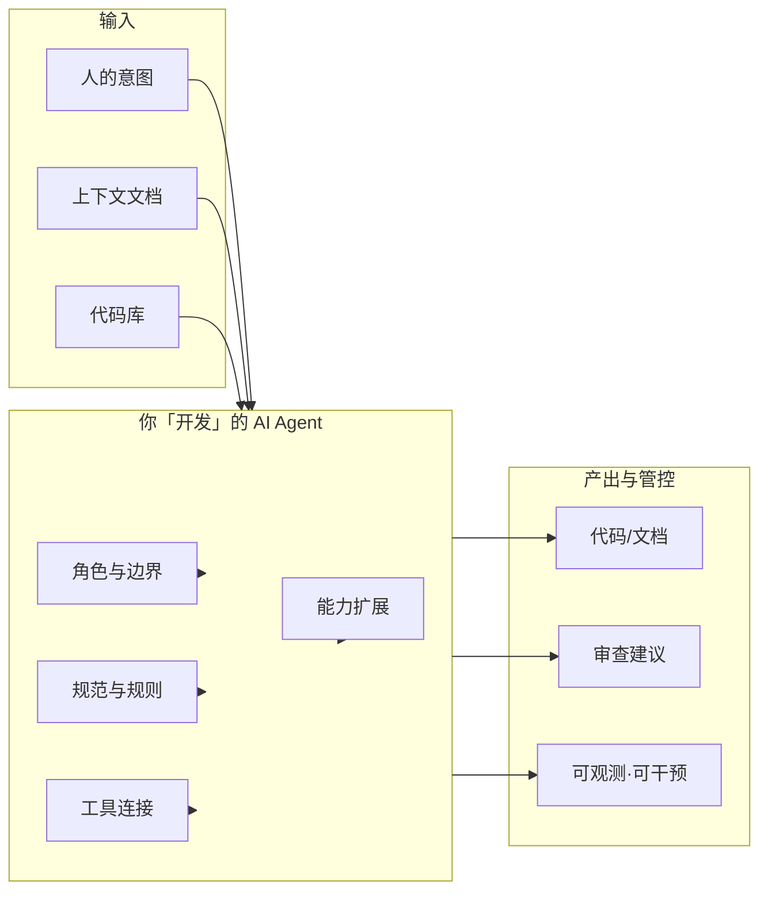
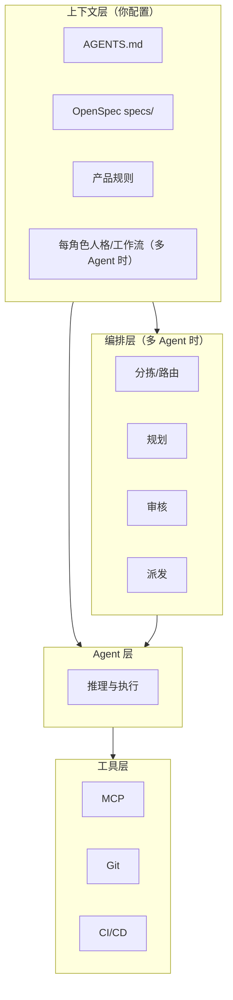

# 如何开发 AI Agent

> 发布日期：2026-01-12
> 最后更新：2026-03-12
> 说明：本文偏架构与方法论，所提到的角色文件、规则目录和多 Agent 编排方式可按具体产品落地。

本文在 [AI 驱动的端到端开发协作标准](./AI驱动的端到端开发协作标准.md)、[Agent 执行流程与规范](./Agent执行流程与规范-AGENTS与规则文档.md) 等文档的基础上，说明**如何设计、配置与扩展**可在项目中稳定工作的 AI Agent。写作时参考了 [Edict](https://github.com/cft0808/edict)（三省六部制多 Agent 编排系统）的架构思想：**分拣 → 规划 → 审核 → 派发 → 执行 → 回奏**、**制度性审核**、**权限矩阵**与**可观测可干预**，使单 Agent 与多 Agent 场景下的设计更可落地。

---

## 一、「开发 AI Agent」指什么

### 1.1 本文的范围

「**开发 AI Agent**」在此不指训练大模型，而是指：

- **设计** Agent 的职责边界、与人的分工、以及多 Agent 时的**沟通权限与流转**
- **配置** 项目与角色级上下文（规范、规则、Spec；多 Agent 时可为每角色单独人格/工作流描述）
- **连接** 外部能力（MCP、API、数据库等）
- **扩展** 任务能力（Skill，可按角色配置不同 Skill 集）
- **保障可观测与可干预**：任务状态、流转记录、叫停/取消/恢复（多 Agent 时尤为重要）
- **验证与迭代** 产出质量与流程

目标是让 Agent 在给定项目中**行为可预期、产出可维护、过程可追溯、关键节点可干预**。

### 1.2 单 Agent 与多 Agent

| 场景 | 关注点 | 多 Agent 时额外关注 |
|------|--------|----------------------|
| **单 Agent** | 上下文、工具、Skill、边界 | — |
| **多 Agent** | 同上 | **分拣/路由**（谁接单）、**规划层**（拆任务）、**审核层**（准奏/封驳）、**派发与执行**、**权限矩阵**（谁可给谁发消息）、**任务状态与可干预** |

多 Agent 时，参考「规划 → **审核** → 派发 → 执行」的流水线可显著提升可靠性：**执行前有专职审核、不合格可打回**，避免「做完就交、无人把关」。详见本文第七节与 [Edict](https://github.com/cft0808/edict) 的三省六部设计。

### 1.3 开发层次与对应文档

| 层次 | 内容 | 对应文档 |
|------|------|----------|
| **角色与边界** | 职责、禁止项、与人的分工；多 Agent 时权限矩阵 | 本文第三节 |
| **上下文工程** | AGENTS.md、OpenSpec、产品规则；多 Agent 时每角色人格/工作流 | [Agent 执行流程与规范](./Agent执行流程与规范-AGENTS与规则文档.md)、[跨仓库方案](./OpenSpec专题/跨仓库AI协作方案-Spec与上下文工程.md) |
| **工具连接** | MCP 等 | [MCP 入门与实践](./MCP-Model-Context-Protocol入门与实践.md) |
| **能力扩展** | Skill，可按角色配置 | [Agent Skill](./Agent-Skill是什么怎么用与推荐.md) |
| **编排与多 Agent** | 分拣→规划→审核→派发→执行、权限矩阵、可观测可干预 | 本文第七节、[Edict](https://github.com/cft0808/edict) |

---

## 二、整体架构：从三层到编排层

单 Agent 可抽象为**三层**：上下文层、Agent 层、工具层。多 Agent 时通常增加**编排层**（分拣、规划、审核、派发）与**可观测/可干预**机制。

- **上下文层**：定义「怎么写」「写什么」；多 Agent 时为每个角色配置独立人格与工作流（如 Edict 的 `SOUL.md`），便于分工清晰。
- **编排层**（多 Agent）：分拣意图 → 规划子任务 → **审核方案/产出（可封驳）** → 派发执行 → 汇总回奏；避免「无人审核、做完就交」。
- **Agent 层**：推理与执行；你通过上下文与编排来塑造行为。
- **工具层**：MCP、Git、CI 等，扩展可访问的数据与操作。

---

## 三、步骤一：定义角色与边界

### 3.1 明确职责与禁止项

在写 AGENTS.md 或角色配置前，先明确：

- **主要场景**：例如「在本仓库内按 OpenSpec 实现功能」「只做代码审查」「只生成测试与文档」。
- **不做什么**：例如「不直接改生产配置」「不执行破坏性 Git 操作除非明确确认」「不替代架构决策」。
- **多 Agent 时**：每个角色只做一类事（如「只规划」「只审核」「只执行某域」），避免职责重叠与越权。

将上述写进 AGENTS.md 的「项目概述」或「Agent 职责与边界」；多 Agent 时可为每角色单独文件（如 `agents/<role>/SOUL.md`）描述人格与工作流。

### 3.2 多 Agent：权限矩阵

多 Agent 协作时，**谁可以给谁发消息**应有明确定义，避免随意互调、循环依赖。

| 做法 | 说明 |
|------|------|
| **白名单** | 仅允许定义好的边（如：太子→中书；中书→门下、尚书；尚书→六部；六部→尚书）。 |
| **文档化** | 用表格或图维护「From → To」矩阵，随架构演进更新。 |
| **实现** | 在编排层或 Gateway 中强制校验，不符合权限的消息拒绝转发。 |

参考：[Edict 权限矩阵](https://github.com/cft0808/edict)（太子→中书→门下→尚书→六部，六部仅回尚书）。

### 3.3 与人的分工

- **人**：定义需求与优先级、做架构与安全决策、审查关键产出、处理模糊与例外；多 Agent 时可保留「御批」节点（人工准奏/封驳）。
- **Agent**：在规范与 Spec 约束下执行；多 Agent 时在权限矩阵内按流转执行，审核层 Agent 可封驳不合格方案或产出。

---

## 四、步骤二：建设上下文工程

建设顺序建议：**AGENTS.md → OpenSpec（若采用）→ 产品规则（若需要）**。多 Agent 时增加**每角色人格/工作流**（如 `SOUL.md`）。

### 4.1 编写 AGENTS.md

- **位置**：项目根目录。
- **内容**：项目概述、架构约束、编码规范、测试/CI、禁忌规则（参见 [Agent 执行流程与规范](./Agent执行流程与规范-AGENTS与规则文档.md)）。
- **原则**：简洁、可执行；优先写对产出影响最大的约束。

跨仓库时可在共享仓库维护共享 AGENTS.md，各子仓库继承并补充（参见 [跨仓库 AI 协作方案](./OpenSpec专题/跨仓库AI协作方案-Spec与上下文工程.md)）。

### 4.2 多 Agent：每角色人格与工作流

每个执行角色可有**独立的人格与工作流描述**，便于模型稳定扮演该角色、输出格式一致。常见形态：

- **文件名**：如 `SOUL.md`、`role.md`，放在 `agents/<角色名>/` 或等价目录。
- **内容**：角色定位、输入/输出规范、工作步骤、禁忌、与上下游的约定。
- **与 AGENTS.md 关系**：AGENTS.md 管项目级通用约束，角色文件管该角色专属行为。

这样「规划」「审核」「执行」等不同角色可加载不同上下文，避免串戏。参考 [Edict agents/*/SOUL.md](https://github.com/cft0808/edict/tree/main/agents)。

### 4.3 引入 OpenSpec（可选但推荐）

- 维护 `openspec/specs/` 为系统行为单一真相源；新功能通过 `changes/` 的 proposal、Delta specs、design、tasks 驱动。
- AGENTS.md 管「怎么写」，OpenSpec 管「写什么」；多 Agent 时规划层与执行层共读同一份 Spec，保证接口一致。

### 4.4 产品规则（可选）

跨工具通用的放 AGENTS.md；产品特有或按路径/场景的放产品规则，与 AGENTS.md 配合。

---

## 五、步骤三：连接工具（MCP）

当 Agent 需要实时数据或执行外部操作时，通过 **MCP** 等连接工具层。

### 5.1 典型需求与对应 MCP

| 需求 | 典型 MCP Server | 说明 |
|------|-----------------|------|
| 查数据库 schema/数据 | Postgres、MySQL 等 | 后端开发、数据分析 |
| 读文件、目录、配置 | Filesystem | 跨目录读 Spec、配置 |
| 调用 HTTP API、文档 | Fetch、自定义 API Server | 集成外部服务、读 OpenAPI |
| Git、Issue、PR | GitHub、Git | 协作与版本信息 |
| 暴露共享 Spec | 自建或 Filesystem 限定路径 | 跨仓库时前后端共读同一份 Spec |

配置方式以当前产品文档为准，参见 [MCP 入门与实践](./MCP-Model-Context-Protocol入门与实践.md)。

### 5.2 安全与权限

- 最小权限：数据库只读或仅开发库；文件系统只开放必要目录。
- 敏感信息不写进文档，用环境变量或本地密钥管理。
- 生产数据与生产 API 一般不直接对 Agent 开放。

---

## 六、步骤四：扩展能力（Skill）

用 **Skill** 固化重复任务流程与领域知识；多 Agent 时**不同角色可配置不同 Skill 集**（如规划用方案设计 Skill，审核用质量标准 Skill，执行用代码/文档 Skill）。

### 6.1 何时加 Skill

- 某类任务有固定步骤或团队标准，希望 Agent 每次都按同一套做。
- 需要注入领域知识（某框架最佳实践、合规要求），且希望按触发条件加载而非全部塞进 AGENTS.md。

### 6.2 如何加 Skill

- 在当前产品支持的 Skill 目录下新增目录，内含 `SKILL.md`（必选）与可选的 reference、scripts。
- **description** 写清「做什么 + 何时用」，便于正确触发。
- 多 Agent 时：在编排或配置中为不同角色挂载不同 Skill 列表，支持从 URL/GitHub 拉取远程 Skill 并做版本管理。

详见 [Agent Skill：是什么、怎么用与推荐](./Agent-Skill是什么怎么用与推荐.md)。参考 [Edict 技能配置与 Remote Skills](https://github.com/cft0808/edict)。

---

## 七、步骤五：编排与多 Agent（可选）

当单 Agent 难以覆盖或希望并行与分工时，引入多 Agent 协作。推荐采用**分层流水线**与**制度性审核**，而非「多个 Agent 自由对话、做完就交」。

### 7.1 推荐流水线：分拣 → 规划 → 审核 → 派发 → 执行 → 回奏

| 阶段 | 职责 | 说明 |
|------|------|------|
| **分拣/路由** | 区分意图类型，决定是否建任务、派给谁 | 避免闲聊与正式任务混在一起；可做输入清洗（去路径、元数据等）。 |
| **规划** | 拆解子任务、产出方案与分配建议 | 输出结构化方案，供审核层检查。 |
| **审核** | 审议方案/产出质量，**准奏或封驳** | **制度性审核**：不合格则打回，不流入执行层；可人工御批。 |
| **派发** | 按方案派发子任务给执行角色 | 明确责任与依赖，避免重复与遗漏。 |
| **执行** | 各角色并行或串行执行 | 共读同一份 Spec，产出符合契约。 |
| **回奏** | 汇总结果、归档、反馈用户 | 完整流转可追溯，便于审计与复盘。 |

**与单层「规划→执行」的差异**：执行前多一道**专职审核**，可封驳，从而在复杂任务上更可靠。参考 [Edict 门下省审核](https://github.com/cft0808/edict)。

### 7.2 任务状态与可观测、可干预

多 Agent 时建议显式定义**任务状态**，并对外暴露**看板或时间线**，便于观测与干预。

- **状态示例**：待分拣 → 待规划 → 待审核 → 已派发 → 执行中 → 待审查 → 已完成；审核封驳时回到待规划或待执行。
- **可观测**：任务列表、当前状态、流转历史、各环节产出摘要；可选 Agent 心跳/健康检测。
- **可干预**：叫停、取消、恢复、人工准奏/封驳；超时与重试策略。

这样既便于排查问题，也便于在关键节点人工介入。参考 [Edict 军机处看板](https://github.com/cft0808/edict)（旨意看板、奏折归档、任务操作）。

### 7.3 同一份 Spec 与权限矩阵

- **同一份 Spec**：规划、审核、执行层共读 OpenSpec（及 AGENTS.md），保证接口与行为一致；跨仓库时用共享 Spec 仓库 + 同步机制（参见 [跨仓库 AI 协作方案](./OpenSpec专题/跨仓库AI协作方案-Spec与上下文工程.md)）。
- **权限矩阵**：在编排层或 Gateway 中强制「谁可给谁发消息」，避免越权与循环调用（见第三节）。

### 7.4 参考实现：Edict（三省六部制）

[**Edict**](https://github.com/cft0808/edict) 将上述设计落成开源实现：太子分拣 → 中书省规划 → **门下省审议/封驳** → 尚书省派发 → 六部+吏部执行 → 回奏；军机处看板、权限矩阵、每省部 SOUL.md 与独立 Skill/模型、奏折归档与任务操作。

- **快速体验**：`docker run -p 7891:7891 cft0808/edict`，打开 <http://localhost:7891>。
- **对照本文**：角色与边界（各省部职责）、上下文（SOUL.md）、Skill（远程 Skill、看板配置）、编排（三省六部流水线）、可观测可干预（看板、叫停/取消/恢复、奏折）。

适合作为多 Agent 编排与制度性审核的**参考实现**与架构文档来源。

---

## 八、步骤六：验证与迭代

### 8.1 验证维度

| 维度 | 检查方式 |
|------|----------|
| **符合规范** | 产出是否遵守 AGENTS.md 与产品规则 |
| **符合 Spec** | 若用 OpenSpec，实现是否覆盖 specs 与 changes 中的场景 |
| **审核通过** | 多 Agent 时审核层是否对方案/产出做了准奏/封驳，封驳项是否已修复 |
| **可构建与测试** | 产出能否通过现有 CI（lint、test、build） |
| **安全与禁忌** | 是否触犯 AGENTS.md 中的禁忌 |

可结合 OpenSpec 的 `/opsx:verify`（若使用）、团队 Code Review、以及多 Agent 下的审核层结果做常态化检查。

### 8.2 迭代改进

- **上下文**：根据常见偏差补充或修正 AGENTS.md、OpenSpec、角色人格/工作流。
- **工具**：根据「缺什么数据/操作」增加或调整 MCP Server。
- **能力**：将重复任务沉淀为 Skill，按角色挂载；优化 description 与步骤。
- **边界与权限**：若出现越权或误用，收紧 AGENTS.md 与权限矩阵。
- **编排与审核**：若执行层常收到不合格方案，加强规划层或审核层描述与示例。

---

## 九、实践清单

**通用**
- [ ] 在 AGENTS.md 或单独文档中写明 Agent 职责与禁止事项。
- [ ] 编写 AGENTS.md：项目概述、架构约束、编码规范、测试/CI、禁忌规则。
- [ ] （可选）引入 OpenSpec，用 Spec 驱动开发与审查。
- [ ] （可选）配置产品规则，与 AGENTS.md 配合。
- [ ] （可选）配置 MCP，遵循最小权限。
- [ ] （可选）为重复任务或领域知识编写 Skill，写好 description。
- [ ] 通过 CI、Code Review、/opsx:verify 等验证产出，并持续迭代。

**多 Agent 时**
- [ ] 定义权限矩阵（谁可给谁发消息），并在实现中强制。
- [ ] 设计分拣→规划→**审核**→派发→执行→回奏流水线，为审核层赋予准奏/封驳能力。
- [ ] 为每个角色配置人格/工作流（如 SOUL.md），必要时独立 Skill 与模型。
- [ ] 定义任务状态与流转，提供看板或时间线，支持叫停/取消/恢复与归档。
- [ ] 输入清洗与规范化（如旨意去路径、元数据），减少噪音进入流水线。

---

## 十、小结

**开发 AI Agent** 的核心是：**用上下文与工具塑造行为**，并在多 Agent 时**用制度性审核与权限约束保证可靠与可管控**。

1. **定义角色与边界**，多 Agent 时显式**权限矩阵**。  
2. **建设上下文工程**（AGENTS.md、OpenSpec、产品规则；多 Agent 时每角色人格/工作流）。  
3. **连接工具**（MCP），扩展可访问的数据与操作。  
4. **扩展能力**（Skill），可按角色配置不同 Skill 集。  
5. **按需编排多 Agent**：采用**分拣→规划→审核→派发→执行→回奏**流水线，**审核层可封驳**；保证**可观测、可干预**与任务状态清晰。  
6. **验证与迭代**，多 Agent 时把「审核通过」纳入验证维度，并持续优化上下文、工具与编排。

单 Agent 按前三步与验证迭代即可；多 Agent 时建议引入审核层与权限矩阵，并参考 [Edict](https://github.com/cft0808/edict) 的架构与实现。

---

**AI 协作系列**  
- [AI 驱动的端到端开发协作标准](./AI驱动的端到端开发协作标准.md)  
- [Agent 执行流程与规范：AGENTS.md 与规则文档](./Agent执行流程与规范-AGENTS与规则文档.md)  
- [跨仓库 AI 协作方案：Spec 与上下文工程](./OpenSpec专题/跨仓库AI协作方案-Spec与上下文工程.md)  
- [MCP：Model Context Protocol 入门与实践](./MCP-Model-Context-Protocol入门与实践.md)  
- [Agent Skill：是什么、怎么用与推荐](./Agent-Skill是什么怎么用与推荐.md)  
- [AI Agent 时代的技术团队重塑](./AI Agent 时代的技术团队重塑.md)  

**参考实现**  
- [Edict（三省六部制 · OpenClaw 多 Agent 编排）](https://github.com/cft0808/edict) — 制度性审核、权限矩阵、实时看板、每角色 SOUL.md 与 Skill、任务可干预的开源实现。
