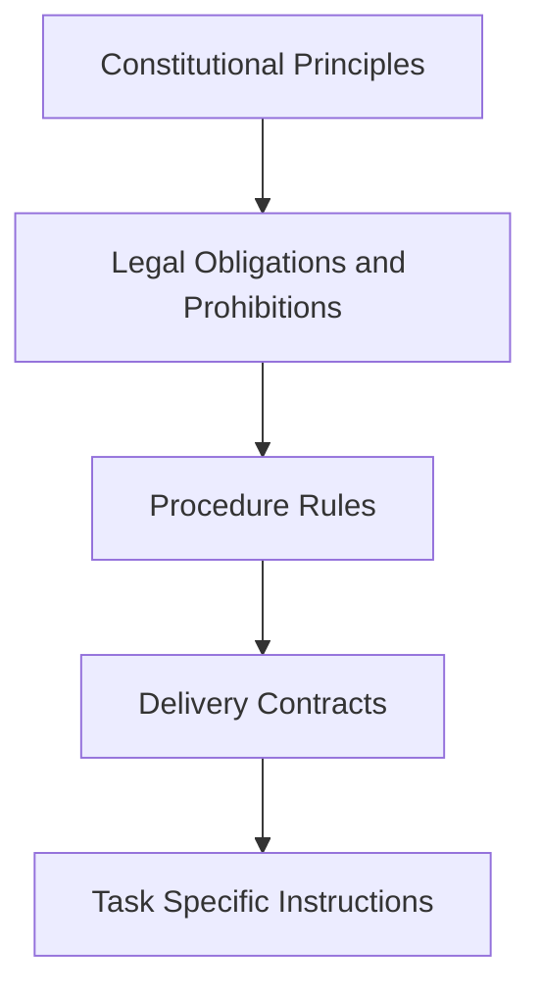

# Constitutional AI Governance Skill 设计说明

> 发布日期：2026-03-16
> 最后更新：2026-03-16
> 目标：解释这个 skill 为什么这样设计，以及它解决了传统提示词式约束的哪些问题。

这个 skill 的核心，不是“再加一层提示词”，而是把 AI 执行过程拆成一套可复用、可审计、可约束的治理协议。它面向的不是随意聊天场景，而是对 **规则优先级、执行步骤、证据边界、交付审计** 有明确要求的 Agent 任务。

---

## 一、设计目标

这个 skill 试图解决四类常见问题：

1. **规则冲突**：系统、开发者、用户、项目规范往往同时存在，普通提示容易相互覆盖。
2. **事实与猜测混写**：模型经常把推断包装成结论，导致方案看起来完整，但依据不足。
3. **跳步执行**：没有固定流程时，Agent 容易从需求直接跳到方案，省略现状分析与边界判定。
4. **难以复核**：结果出来以后，团队很难判断它遵守了哪些规则、忽略了哪些风险。

因此，这个 skill 的设计不是追求“更会说”，而是追求三件事：

- **约束优先于生成**
- **证据优先于判断**
- **审计优先于流畅**

---

## 二、设计结构

从结构上看，这个 skill 由四层组成：

### 2.1 宪法层

`constitutional-rules.md` 先定义最高优先级原则，例如：

- 规则层级必须固定
- 事实、推断、假设、风险必须分开
- 非 trivial 任务必须经过固定阶段
- 重要输出必须披露未验证项与剩余风险

这一层的作用，是防止 Agent 在后续执行中被临时目标带偏。

### 2.2 程序层

`execution-checklist.md` 把任务拆成 Intake、Evidence、Current-State、Scope、Gap、Rule Codification、Validation、Audit 等阶段。

它解决的是“知道要谨慎，但不知道如何稳定地谨慎”这个问题。  
也就是说，谨慎不再依赖模型临场发挥，而是依赖一个固定执行骨架。

### 2.3 工程约束层

`engineering-constraints-map.md` 把治理规则落到工程现实中，例如：

- 先识别 controller/biz/service/repository 链路
- 不破坏现有响应格式和权限校验
- 避免无界扫描和 N+1
- 验收标准要绑定可观察行为

这一层避免 skill 只停留在“治理口号”，而能真正影响代码设计与变更边界。

### 2.4 范围治理层

`scope-and-gap-governance.md` 强制 Agent 在给方案前说明：

- 当前系统怎么工作
- 哪些模块在 scope 内
- 哪些模块虽然相关但不允许改
- 哪些结论因为缺事实只能暂定

这一步非常关键，因为很多 AI 失控并不是“不会做”，而是“默认自己可以多做一点”。

---

## 三、核心机制

### 3.1 固定规则层级

这个 skill 先解决“谁说了算”的问题，再解决“怎么做”的问题。

这样做的价值是：低层指令不能悄悄覆盖高层规则，减少了“为了完成任务而越权”的概率。

### 3.2 证据分类

skill 强制区分：

- `FACT`
- `INFERENCE`
- `ASSUMPTION`
- `RISK`

这不是排版问题，而是认知控制问题。  
一旦模型必须给自己的判断贴标签，它就更难把不确定内容伪装成确定结论。

### 3.3 阶段门禁

在这个 skill 下，非简单任务不能直接跳到“给方案”或“写代码”，而必须经过：

1. 目标与约束识别
2. 证据盘点
3. 当前状态建模
4. 范围裁定
5. 差距矩阵
6. 规则重述
7. 实施与验证计划
8. 交付审计

这种门禁式设计，让 Agent 的输出更像“审查后的工程结论”，而不是“即时生成的建议”。

### 3.4 可审计交付

skill 要求重要输出必须写清：

- 完成了什么
- 没完成什么
- 哪些已验证
- 哪些未验证
- 剩余风险是什么

这会直接改变输出风格：从“看起来完整”转向“边界明确”。

---

## 四、为什么这种设计适合 Skill 形态

相比把这些内容塞进一次性 prompt，Skill 形态有几个优势：

- **稳定加载**：每次命中场景都能复用同一治理协议。
- **可拆分维护**：规则、清单、工程约束、范围治理可以分别更新。
- **可组合**：它可以作为 process skill，和调试、设计、实现类 skill 组合使用。
- **可审查**：团队可以直接 review skill 文件，而不是依赖一段不可见的系统提示。

换句话说，这个 skill 把“AI 要守规矩”从口头要求变成了版本化资产。

---

## 五、适用场景

它更适合以下任务：

- 需要严格遵守多层规则的 Agent 执行
- 涉及后端改造、权限、流程、状态机的设计输出
- 需要把事实、推断、风险严格分开的方案评审
- 需要生成可审计、可复盘、可复用的治理型输出

它不适合：

- 轻量聊天
- 纯创意写作
- 对审计链和工程边界没有要求的随意草稿

---

## 六、总结

这个 skill 的设计思路可以概括为一句话：

> 用“宪法 + 程序 + 工程约束 + 审计披露”替代“单层提示词约束”。

它不是让 AI 更自由，而是让 AI 在复杂任务中更可控、更可追责、更像一个受治理的执行代理。
