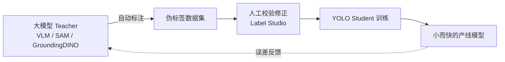
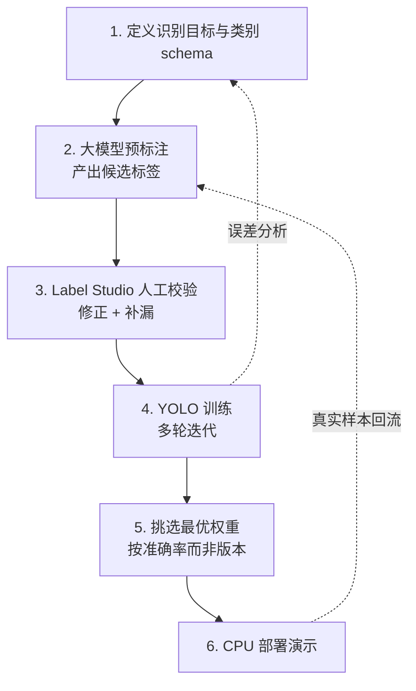
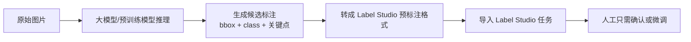
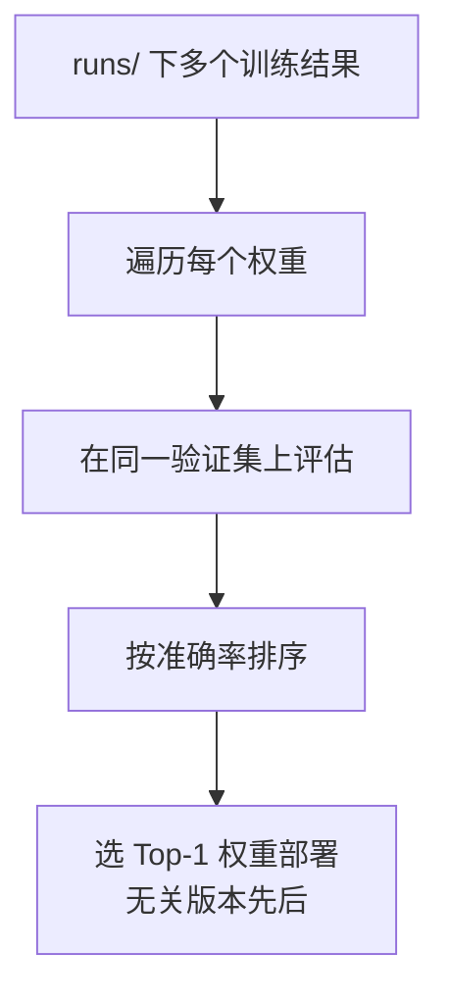

# 蒸馏大模型视觉能力到 YOLO 应用

## 前言

现在的多模态大模型（VLM）和视觉基础模型（SAM、GroundingDINO 这类）有一个很反直觉的特点：**它们看得懂几乎所有东西，但你没法把它们直接放进产品里。**

原因很简单：
- 一次推理动辄几百毫秒到几秒，还常常要联网
- 显存和算力要求高，边缘设备、CPU 服务器根本跑不动
- 按次计费，规模化调用成本压不下来

而 YOLO 正好相反：**又小又快，CPU 上也能实时，但它什么都不懂——你喂什么标注，它学什么。** 一个没见过训练数据的 YOLO 是一张白纸。

这两者的能力曲线是互补的。于是有了一个很自然的问题：

> 能不能把大模型"看得懂"的能力，转移到 YOLO"跑得快"的身上？

这就是**知识蒸馏**（Knowledge Distillation）在视觉工程里最实用的一种形态。本文记录我用这套思路做**宠物姿态识别**的完整过程：从蒸馏策略、标注流水线设计，到最后部署一个纯 CPU 的演示服务。

## 一、这里说的"蒸馏"是什么

经典的知识蒸馏（Hinton 那篇 2015 的定义），指的是让一个小模型（student）去拟合大模型（teacher）输出的软标签（soft label / logits），从而把大模型的"判断倾向"学过来。软标签之所以比硬标签（one-hot）信息量大，是因为它带了**类间关系**——teacher 说"这张图 92% 像猫、7% 像狗、1% 像狐狸"，这个 7% 和 1% 的分布本身就是知识，告诉 student"猫和狗比猫和狐狸更接近"。student 用一个带温度系数 T 的 softmax 去拟合这个分布，T 越大，分布越平滑，类间关系被放得越开。

但这套经典做法在**检测/识别**任务里其实不好直接搬，原因有几个：

- **检测头的输出不是一个干净的分类分布。** YOLO 的输出是"每个 anchor/grid 的框回归 + 分类 + objectness"耦合在一起的张量，teacher（比如一个 VLM 或 GroundingDINO）和 student（YOLO）的输出结构根本对不齐，没法简单地让 student 去拟合 teacher 的 logits。
- **teacher 和 student 常常不同架构、不同 tokenizer、不同分辨率。** 特征空间不对齐，中间层蒸馏（feature distillation）要费很大劲做对齐层。
- **teacher 太重，没法在训练循环里在线跑。** 经典蒸馏通常要 teacher 和 student 一起前向，每个 batch 都要 teacher 出一次 logits——但一个几百亿参数的 VLM 根本没法塞进 YOLO 的训练循环里陪跑。

所以在实际的检测/识别工程里，我们更多用的是一种**放宽版的蒸馏**——**伪标签蒸馏**（pseudo-label distillation）：



区别在于：
- **不直接拟合 logits**，而是让大模型产出**标注**（边界框、类别、关键点、分割掩码），再拿这些标注去训练 YOLO。
- 大模型的"视觉理解"以数据的形式沉淀下来，YOLO 学的是这些数据背后的模式。

两者的取舍可以列成一张表：

| 维度 | 经典 logits 蒸馏 | 伪标签蒸馏 |
|------|-----------------|-----------|
| teacher 何时参与 | 训练循环里在线陪跑 | 离线跑一遍，产出数据集 |
| 中间产物 | 不可读的张量 | 可读的标注（框/类/点） |
| teacher/student 结构 | 要求特征空间可对齐 | 完全解耦，随便换 |
| 人能否介入 | 几乎不能 | 可以在中间校验修正 |
| 传递的信息 | 类间软关系，信息密 | 硬标注，信息稀疏但可控 |
| 主要风险 | 对齐工程复杂 | 伪标签噪声被继承 |

为什么工程上更爱伪标签这种形态？因为它**解耦**了 teacher 和 student：
- teacher 可以随便换（今天用 GroundingDINO，明天换个更强的 VLM），student 训练流程不变
- 中间产物是"数据集"，可以被审查、被修正、被复用——而 logits 蒸馏的中间产物是不可读的张量
- 人可以插在中间做质量兜底（这一点后面会反复出现）
- 数据集可以随时间累积，越滚越大，形成资产；logits 蒸馏每换一次 teacher 就得重来

**代价**也很明确：伪标签是硬标注，丢掉了 teacher 输出里的软信息（那个"7% 像狗"的置信分布，转成框和类之后就没了）；而且伪标签会带噪声，噪声会被 YOLO 忠实地学进去。所以这套方案的成败，几乎全在于**如何控制伪标签的质量**——后面每一节几乎都在围绕这件事。

## 二、方案架构

整条流水线分五段：



关键设计原则只有一条：**让大模型干"看"的活，让人干"判"的活，让 YOLO 干"跑"的活。** 三者各自做自己最擅长、成本最低的事。

## 三、类别 schema 设计：为"模糊"留一个类

这是整个项目里我认为最值得写下来的一点。

做宠物姿态识别，最初的类别设计很直觉——比如按朝向分几类、按构图分几类。但真正开始标注就会撞上一个墙：**大量样本是"介于两者之间"的。**

一只猫的脸可能是四分之三侧脸，既不算正脸也不算纯侧脸；一张构图可能刚好卡在"居中"和"偏置"的边界上。如果 schema 只有非此即彼的几类，会发生两件坏事：

1. **标注者被迫二选一**，同样的模糊样本今天标 A、明天标 B，标签内部矛盾
2. **YOLO 学到互相打架的信号**，在边界区域输出剧烈抖动，置信度全线塌陷

解决办法是**显式引入一个"模糊/不确定"类**。以人脸朝向和构图这两个维度为例，类别集合从"离散的几个确定态"变成"确定态 + 一个 ambiguous 兜底态"：

```python
# 分类维度的选项设计（示意）
CHOICE_SPECS = {
    "face": ["frontal", "profile", "three_quarter", "ambiguous"],
    "composition": ["centered", "rule_of_thirds", "ambiguous"],
    # ... 其他维度同理，每个维度都留一个 ambiguous
}
```

引入模糊类之后：
- 标注者遇到拿不准的样本，有一个**诚实的选项**，不必强行归类
- 训练数据的标签自洽了，YOLO 在边界区不再被拉扯
- 推理时如果模型输出 ambiguous，产品侧可以走**降级逻辑**（比如提示用户重拍、或交给大模型二次确认），而不是硬给一个错误的确定答案

这其实是把"识别的不确定性"从一个 bug 变成了系统的一等公民。**一个诚实的"我不确定"，比一个自信的错误答案有用得多。**

在 Label Studio 里，这套 schema 落成一份 labeling config（XML）。宠物姿态识别既要框出宠物、又要对每只宠物打几个维度的分类标签，配置大致长这样：

```xml
<View>
  <Image name="image" value="$image" zoom="true"/>

  <!-- 先框出每一只宠物 -->
  <RectangleLabels name="bbox" toName="image">
    <Label value="cat" background="#FFA39E"/>
    <Label value="dog" background="#91D5FF"/>
  </RectangleLabels>

  <!-- 对选中的框，再打多维分类标签 -->
  <Choices name="face" toName="image" perRegion="true" required="true">
    <Choice value="frontal"/>
    <Choice value="profile"/>
    <Choice value="three_quarter"/>
    <Choice value="ambiguous"/>
  </Choices>
  <Choices name="composition" toName="image" perRegion="true" required="true">
    <Choice value="centered"/>
    <Choice value="rule_of_thirds"/>
    <Choice value="ambiguous"/>
  </Choices>
</View>
```

几个关键属性值得说明：`perRegion="true"` 让分类标签**挂在每个框上**而不是整张图上——一张图里可能有两只朝向不同的猫；`required="true"` 强制标注者必须选一个，配合 ambiguous 兜底态，就不会出现"漏标"和"硬凑"这两种脏数据。这份 config 同时也是**预标注 JSON 的结构契约**——下一节大模型产出的候选标注，必须严格按 `bbox` / `face` / `composition` 这几个 `name` 组织，才能被 Label Studio 正确渲染成"可以一键确认"的预测。

## 四、大模型预标注：让 teacher 先把活干了一遍

人工从零标注是最贵的一步，所以让大模型先跑一遍预标注（prelabel），人只做"校验 + 修正"，成本能压掉一大截。

预标注流水线大致是：



几个工程上的要点：

**1. 预标注不是"标好了"，是"标了个草稿"。** 大模型给的框可能偏、类可能错、关键点可能飘。它的价值是把人的工作从"画框 + 打标签"降级成"看一眼、拖一下、改个标签"——后者快得多。

**2. 预标注要能被人一眼看出对错。** 所以导入 Label Studio 时，预测的类别、置信度都要带上。低置信度的样本可以自动排到队列前面，让人优先审。

**3. 把不确定推给人，把确定留给机器。** 大模型自己也有置信度。高置信度的样本可以近乎自动通过，低置信度和 ambiguous 的重点人工过。这条分流规则直接决定了标注效率。

具体到实现，有两条技术路线，取舍是"开放词表 vs 结构化输出"：

- **VLM 直接出结构化 JSON**：给多模态大模型一张图 + 一段 prompt，让它直接返回框和分类。好处是一步到位、类别语义完全可控；坏处是框坐标精度一般（VLM 对像素级定位不擅长），而且要靠 prompt 死死约束输出格式。
- **GroundingDINO / SAM 出框，VLM 出语义**：用 GroundingDINO 按文本提示（"cat", "dog"）出高质量框，框的定位准；再把每个框 crop 出来喂给 VLM 做多维分类。分工更干净，但多一次编排。

我这次用的是前者为主、后者补框。给 VLM 的 prompt 关键是**把 labeling config 的 schema 原样翻译成输出约束**，并显式给出 ambiguous 的判定标准：

```text
你是宠物图像标注助手。检测图中每一只猫或狗，对每一只返回：
- box: [x, y, w, h]，归一化到 0~1
- species: "cat" | "dog"
- face: "frontal" | "profile" | "three_quarter" | "ambiguous"
- composition: "centered" | "rule_of_thirds" | "ambiguous"
- confidence: 0~1，你对这一条整体判断的把握

判定规则：
- 朝向介于两个确定态之间、或被遮挡看不清时，face 必须给 "ambiguous"，不要硬猜。
- 只返回 JSON 数组，不要任何解释文字。
```

VLM 返回的 JSON 还要转成 Label Studio 的预标注格式（它的坐标是百分比，且分类要按 `perRegion` 挂到对应的框 region 上）。核心是给每个框生成一个 `id`，再让分类结果的 `region` 引用这个 id：

```python
def to_label_studio(preds: list[dict], img_w: int, img_h: int) -> dict:
    results = []
    for i, p in enumerate(preds):
        region_id = f"r{i}"
        x, y, w, h = p["box"]
        # Label Studio 用百分比坐标
        results.append({
            "id": region_id, "type": "rectanglelabels",
            "from_name": "bbox", "to_name": "image",
            "value": {"x": x*100, "y": y*100, "width": w*100, "height": h*100,
                      "rectanglelabels": [p["species"]]},
        })
        # 分类标签挂到这个框上（perRegion）
        for dim in ("face", "composition"):
            results.append({
                "id": f"{region_id}-{dim}", "type": "choices",
                "from_name": dim, "to_name": "image",
                "value": {"choices": [p[dim]]},
                "region": region_id,   # 引用上面的框
            })
    # 整条预测的平均置信度，用来给人工队列排序
    score = sum(p["confidence"] for p in preds) / max(len(preds), 1)
    return {"data": {"image": ...},
            "predictions": [{"model_version": "vlm-prelabel-v1",
                             "score": score, "result": results}]}
```

**置信度分流**是这一步性价比最高的一招。给一个阈值（比如 0.85），把预标注分三档：

| 置信度档位 | 处理策略 | 人工成本 |
|-----------|---------|---------|
| ≥ 0.85 且无 ambiguous | 抽样复核（比如抽 10%） | 极低 |
| 0.6 ~ 0.85 | 逐条人工确认 | 中 |
| < 0.6 或含 ambiguous | 优先队列，重点人工过 | 高但量少 |

Label Studio 支持按 `predictions.score` 给任务排序，把低置信度的顶到队列最前面——人的注意力永远花在最不确定的样本上，这就是效率的来源。

这一步本身也可以做成一个**自迭代循环**：随着 YOLO 越训越好，它自己就能反过来给新数据做预标注（self-training），人的介入越来越少。teacher 从"大模型"逐渐过渡到"上一版的自己"。但要警惕**确认偏误**——用模型自己的输出训练自己，会把它已有的偏见越滚越强。缓解办法是自训练轮次里始终保留一定比例的、由更强 teacher 或人工标注的"锚点数据"，不让模型在自己的回音室里跑偏。

## 五、YOLO 训练与"按准确率挑权重"

### 数据集组织与一个容易翻车的坑

校验完的数据导出成 YOLO 格式，目录结构是标准的：

```
dataset/
├── images/
│   ├── train/  val/  test/
├── labels/          # 每张图一个同名 .txt，每行: class_id cx cy w h（归一化）
│   ├── train/  val/  test/
└── data.yaml
```

```yaml
# data.yaml
path: ./dataset
train: images/train
val: images/val
test: images/test
names:
  0: cat
  1: dog
```

这里有一个新手极易踩、而且**踩了还很难发现**的坑：**同一只宠物的多张照片，不能跨 train/val/test 划分。** 数据集里常常一只猫有几十张连拍，如果随机按图片划分，同一只猫的照片会同时落进 train 和 val。结果就是验证集准确率虚高——模型不是学会了"识别姿态"，而是"记住了这只猫长什么样"。上线一换新宠物就崩。

正确的划分要**按个体（或按拍摄 session）分组**，保证同一只宠物的所有照片只出现在一个集合里：

```python
from sklearn.model_selection import GroupShuffleSplit
# groups = 每张图对应的宠物个体 id
gss = GroupShuffleSplit(n_splits=1, test_size=0.2, random_state=42)
train_idx, val_idx = next(gss.split(images, groups=pet_ids))
```

这类"数据泄漏"是伪标签蒸馏里最隐蔽的陷阱之一，因为它不报错，只是让你对模型能力产生错觉。

### 训练与超参

用 ultralytics 训练，命令很简洁，但几个参数值得说：

```python
from ultralytics import YOLO

model = YOLO("yolo11n.pt")   # n = nano，CPU 部署选最小的
model.train(
    data="dataset/data.yaml",
    epochs=100, imgsz=640, batch=16,
    patience=20,          # 20 轮无提升就早停，省得过拟合
    cos_lr=True,          # 余弦退火学习率
    close_mosaic=10,      # 最后 10 轮关掉 mosaic 增强，让模型见"真实"分布
    project="runs", name=f"exp_{schema_version}",
)
```

- **选 `yolo11n`（nano）不是因为它最准，而是因为要 CPU 实时。** 蒸馏方案的目标从来不是刷 mAP，是"在目标硬件上跑得动且够用"。选型要从部署约束倒推。
- `close_mosaic=10`：mosaic 增强把四张图拼一起，前期涨泛化，但它造出的是训练期才有的"假分布"，最后几轮关掉，让模型在接近真实的单图分布上收尾。
- `patience` 早停：伪标签有噪声，训太久只会把噪声也拟合进去。

### 按准确率挑权重

训练是多轮迭代的。每调整一次 schema、补一批数据、改一次超参，就产生一批新的权重文件，堆在 `runs/` 目录里。

这里有个很容易踩的习惯性错误：**默认用"最新版本"或"最后一次训练"的权重。**

版本号新 ≠ 效果好。加了一批噪声数据、或者某次超参调坏了，最新的一版完全可能比三版之前的更差。正确的做法是**以验证集准确率为唯一标准去挑权重，不看它是第几版**：



落成脚本就是遍历所有候选权重、在同一验证集上重新评估、按指标排序：

```python
from pathlib import Path
from ultralytics import YOLO

candidates = list(Path("runs").glob("*/weights/best.pt"))
scored = []
for w in candidates:
    metrics = YOLO(w).val(data="dataset/data.yaml", split="val")
    # 按业务关心的指标排；宠物姿态识别更看召回，可换成 metrics.box.mr
    scored.append((metrics.box.map50, w))

scored.sort(reverse=True)
best_score, best_weight = scored[0]
print(f"最优权重: {best_weight}  mAP50={best_score:.4f}")
# 注意打印出来的往往不是最新那一版
```

选哪个指标本身也是个决策：分类维度的准确率、检测的 mAP50、还是更看重"少漏"的召回率，取决于产品对"错判"和"漏判"哪个更不能忍。宠物姿态识别里漏检一个姿态通常比误判一个更糟，所以我更看召回。

道理很朴素，但在快速迭代时非常容易忘——人会本能地信任"最新的"。**让指标说话，不让时间戳说话。**

## 六、纯 CPU 部署演示

做完模型要能给人看。演示环境常常是一台**只有 CPU 的服务器**，这恰恰是 YOLO 相对大模型的主场——大模型在这种机器上根本起不来，而蒸馏出来的 YOLO 可以实时跑。

### 先导出 ONNX，别直接拿 .pt 上 CPU

PyTorch 的 `.pt` 权重在 CPU 上推理，走的是 torch 的通用算子，没针对 CPU 优化。上线前先导出成 ONNX，交给 ONNX Runtime 跑，CPU 上快得多：

```python
from ultralytics import YOLO

model = YOLO("runs/best_by_accuracy.pt")
model.export(format="onnx", imgsz=640, opset=12, simplify=True, dynamic=False)
# 产出 best_by_accuracy.onnx
```

ONNX Runtime 在 CPU 上会用上 MKL-DNN/oneDNN 这类后端，把卷积、matmul 这些热点算子调到 SIMD 指令上。经验上，同一个 nano 模型从 torch-CPU 换到 ONNX Runtime，单张 640 推理延迟大致能砍掉一半到三分之二（具体看 CPU 型号和线程数）。

想更极致，还能做 **INT8 静态量化**——用一小批有代表性的真实图片做校准，把权重和激活从 FP32 压到 INT8：

```python
from onnxruntime.quantization import quantize_static, CalibrationDataReader
# calib_reader 喂一批预处理好的真实图片（几百张即可）
quantize_static("best.onnx", "best.int8.onnx", calibration_data_reader=calib_reader)
```

量化能再降一截延迟、把模型体积压到约四分之一，代价是通常掉一两个点的精度。要不要上，取决于你的精度余量够不够。**注意校准集必须用真实分布的图片**，拿训练集随便抽会让量化尺度偏掉。

一个大致的量级感受（nano 模型、单张 640、桌面级 4 核 CPU，仅供体感，非严格 benchmark）：

| 运行时 | 单张延迟 | 模型体积 | 精度 |
|--------|---------|---------|------|
| torch `.pt` CPU | 基准 | ~6 MB | 基准 |
| ONNX Runtime FP32 | ~基准的 1/2 | ~6 MB | 基本无损 |
| ONNX Runtime INT8 | ~基准的 1/3 | ~1.5 MB | 掉 1~2 点 |

关键不是这些绝对数字，而是：**光换运行时（不动模型）就能拿到很可观的加速，这是上 CPU 前最不该跳过的一步。**

### 服务与降级

部署形态很轻：一个 FastAPI 服务，把导出的模型加载进来，提供一个上传图片、返回识别结果的网页。真正要写清楚的是**推理之后那段"怎么把结果讲给产品"的逻辑**——尤其是命中 ambiguous 时怎么降级：

```python
# CPU 推理服务骨架（示意）
from fastapi import FastAPI, UploadFile
from ultralytics import YOLO

app = FastAPI()
# 加载 ONNX（CPU 上比 .pt 快得多），仍是"按准确率挑出来"的那一版
model = YOLO("runs/best_by_accuracy.onnx", task="detect")

CONF_FLOOR = 0.45   # 低于这个置信度，一律当"没看清"处理

@app.post("/predict")
async def predict(file: UploadFile):
    image = await read_image(file)
    result = model(image, conf=CONF_FLOOR, imgsz=640)[0]

    out = []
    for box in result.boxes:
        cls = model.names[int(box.cls)]
        conf = float(box.conf)
        # 三种情况都不给"确定答案"，而是显式告诉产品该降级
        if cls == "ambiguous" or conf < CONF_FLOOR:
            out.append({"status": "uncertain",
                        "hint": "建议重拍或交大模型二次确认",
                        "raw_conf": round(conf, 3)})
        else:
            out.append({"status": "ok", "label": cls, "conf": round(conf, 3)})
    return {"results": out}
```

这里的重点是**推理服务不替产品做"硬判断"**：它诚实地把 `ok` / `uncertain` 两种状态往上抛，让产品层决定 uncertain 时是重拍、是走大模型兜底、还是直接放行。这跟第三节"给模糊留一个类"是同一件事的两端——schema 里留了 ambiguous，服务层就得真的把它当回事，而不是在最后 argmax 一下抹平掉。

整个链路在这里闭环了：**大模型的视觉理解，经过标注流水线，蒸馏进一个几 MB 的 YOLO 权重，导出成 ONNX，最后在一台没有 GPU 的机器上实时服务。** 这就是蒸馏的工程价值——把"看得懂"搬到了"跑得起"的地方。

## 七、诚实的评估

基于这次实践，说几句实在话。

**这套方案真正的价值：**
- **标注成本**大幅下降。大模型预标注 + 人工校验，比纯手工快一个量级。
- **能力可迁移**。大模型迭代得再快，你的产线模型不用跟着换架构，只需重新蒸馏。
- **推理成本**趋近于零。一次训练，无限次廉价推理，这是大模型直接上线永远给不了的。

**同样真实的局限：**
- **伪标签的噪声会被继承**。teacher 看错的地方，student 会学得一样错。人工校验这一环省不掉，只能减轻。
- **蒸馏有天花板**。YOLO 学到的是大模型在"这个特定任务"上的判断，学不到大模型的通用理解。任务一旦扩展，得重新标、重新训。
- **模糊边界永远存在**。ambiguous 类缓解了标签矛盾，但没有消灭不确定性本身——它只是把不确定性显式化，交给产品逻辑去处理。
- **"最新≠最优"要靠纪律保证**。没有一套按指标挑权重的固定流程，人很容易在迭代中不知不觉部署了更差的模型。

一句话总结：**蒸馏不是让 YOLO 变聪明，而是把大模型的聪明，以数据的形式，一次性地"冻结"进一个跑得飞快的小模型里。** 理解这个边界，就能用好它。
