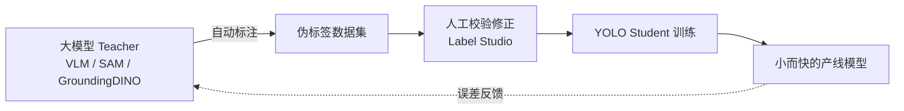
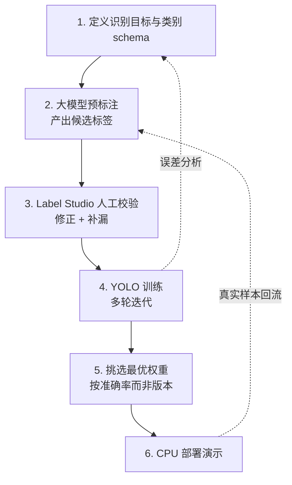
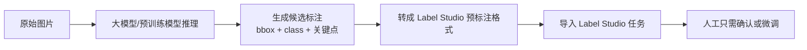
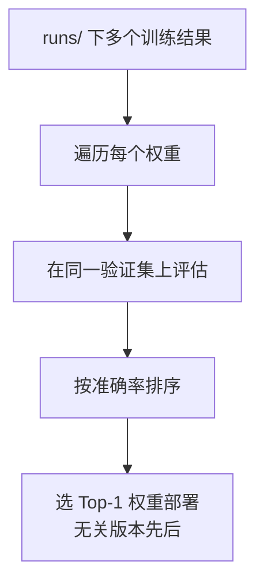

# 蒸馏大模型视觉能力到 YOLO 应用

## 前言

现在的多模态大模型（VLM）和视觉基础模型（SAM、GroundingDINO 这类）有一个很反直觉的特点：**它们看得懂几乎所有东西，但你没法把它们直接放进产品里。**

原因很简单：
- 一次推理动辄几百毫秒到几秒，还常常要联网
- 显存和算力要求高，边缘设备、CPU 服务器根本跑不动
- 按次计费，规模化调用成本压不下来

而 YOLO 正好相反：**又小又快，CPU 上也能实时，但它什么都不懂——你喂什么标注，它学什么。** 一个没见过训练数据的 YOLO 是一张白纸。

这两者的能力曲线是互补的。于是有了一个很自然的问题：

> 能不能把大模型"看得懂"的能力，转移到 YOLO"跑得快"的身上？

这就是**知识蒸馏**（Knowledge Distillation）在视觉工程里最实用的一种形态。本文记录我用这套思路做**宠物姿态识别**的完整过程：从蒸馏策略、标注流水线设计，到最后部署一个纯 CPU 的演示服务。

## 一、这里说的"蒸馏"是什么

经典的知识蒸馏，指的是让一个小模型（student）去拟合大模型（teacher）输出的软标签（soft label / logits），从而把大模型的"判断倾向"学过来。

但在实际的检测/识别工程里，我们更多用的是一种**放宽版的蒸馏**——**伪标签蒸馏**（pseudo-label distillation）：



区别在于：
- **不直接拟合 logits**，而是让大模型产出**标注**（边界框、类别、关键点、分割掩码），再拿这些标注去训练 YOLO。
- 大模型的"视觉理解"以数据的形式沉淀下来，YOLO 学的是这些数据背后的模式。

为什么工程上更爱这种形态？因为它**解耦**了 teacher 和 student：
- teacher 可以随便换（今天用 GroundingDINO，明天换个更强的 VLM），student 训练流程不变
- 中间产物是"数据集"，可以被审查、被修正、被复用——而 logits 蒸馏的中间产物是不可读的张量
- 人可以插在中间做质量兜底（这一点后面会反复出现）

**代价**也很明确：伪标签会带噪声，噪声会被 YOLO 忠实地学进去。所以这套方案的成败，几乎全在于**如何控制伪标签的质量**。

## 二、方案架构

整条流水线分五段：



关键设计原则只有一条：**让大模型干"看"的活，让人干"判"的活，让 YOLO 干"跑"的活。** 三者各自做自己最擅长、成本最低的事。

## 三、类别 schema 设计：为"模糊"留一个类

这是整个项目里我认为最值得写下来的一点。

做宠物姿态识别，最初的类别设计很直觉——比如按朝向分几类、按构图分几类。但真正开始标注就会撞上一个墙：**大量样本是"介于两者之间"的。**

一只猫的脸可能是四分之三侧脸，既不算正脸也不算纯侧脸；一张构图可能刚好卡在"居中"和"偏置"的边界上。如果 schema 只有非此即彼的几类，会发生两件坏事：

1. **标注者被迫二选一**，同样的模糊样本今天标 A、明天标 B，标签内部矛盾
2. **YOLO 学到互相打架的信号**，在边界区域输出剧烈抖动，置信度全线塌陷

解决办法是**显式引入一个"模糊/不确定"类**。以人脸朝向和构图这两个维度为例，类别集合从"离散的几个确定态"变成"确定态 + 一个 ambiguous 兜底态"：

```python
# 分类维度的选项设计（示意）
CHOICE_SPECS = {
    "face": ["frontal", "profile", "three_quarter", "ambiguous"],
    "composition": ["centered", "rule_of_thirds", "ambiguous"],
    # ... 其他维度同理，每个维度都留一个 ambiguous
}
```

引入模糊类之后：
- 标注者遇到拿不准的样本，有一个**诚实的选项**，不必强行归类
- 训练数据的标签自洽了，YOLO 在边界区不再被拉扯
- 推理时如果模型输出 ambiguous，产品侧可以走**降级逻辑**（比如提示用户重拍、或交给大模型二次确认），而不是硬给一个错误的确定答案

这其实是把"识别的不确定性"从一个 bug 变成了系统的一等公民。**一个诚实的"我不确定"，比一个自信的错误答案有用得多。**

## 四、大模型预标注：让 teacher 先把活干了一遍

人工从零标注是最贵的一步，所以让大模型先跑一遍预标注（prelabel），人只做"校验 + 修正"，成本能压掉一大截。

预标注流水线大致是：



几个工程上的要点：

**1. 预标注不是"标好了"，是"标了个草稿"。** 大模型给的框可能偏、类可能错、关键点可能飘。它的价值是把人的工作从"画框 + 打标签"降级成"看一眼、拖一下、改个标签"——后者快得多。

**2. 预标注要能被人一眼看出对错。** 所以导入 Label Studio 时，预测的类别、置信度都要带上。低置信度的样本可以自动排到队列前面，让人优先审。

**3. 把不确定推给人，把确定留给机器。** 大模型自己也有置信度。高置信度的样本可以近乎自动通过，低置信度和 ambiguous 的重点人工过。这条分流规则直接决定了标注效率。

这一步本身也可以做成一个**自迭代循环**：随着 YOLO 越训越好，它自己就能反过来给新数据做预标注（self-training），人的介入越来越少。teacher 从"大模型"逐渐过渡到"上一版的自己"。

## 五、YOLO 训练与"按准确率挑权重"

训练是多轮迭代的。每调整一次 schema、补一批数据、改一次超参，就产生一批新的权重文件，堆在 `runs/` 目录里。

这里有个很容易踩的习惯性错误：**默认用"最新版本"或"最后一次训练"的权重。**

版本号新 ≠ 效果好。加了一批噪声数据、或者某次超参调坏了，最新的一版完全可能比三版之前的更差。正确的做法是**以验证集准确率为唯一标准去挑权重，不看它是第几版**：



道理很朴素，但在快速迭代时非常容易忘——人会本能地信任"最新的"。**让指标说话，不让时间戳说话。**

## 六、纯 CPU 部署演示

做完模型要能给人看。演示环境常常是一台**只有 CPU 的服务器**，这恰恰是 YOLO 相对大模型的主场——大模型在这种机器上根本起不来，而蒸馏出来的 YOLO 可以实时跑。

部署形态很轻：一个 FastAPI 服务，把挑出来的最优权重加载进来，提供一个上传图片、返回识别结果的网页。

```python
# CPU 推理服务骨架（示意）
from fastapi import FastAPI, UploadFile
from ultralytics import YOLO

app = FastAPI()
# 加载的是"按准确率挑出来的最优权重"，不是最新权重
model = YOLO("runs/best_by_accuracy.pt")

@app.post("/predict")
async def predict(file: UploadFile):
    image = await read_image(file)
    result = model(image)[0]
    # 命中 ambiguous 时走降级提示，而不是硬报一个类
    return format_with_uncertainty(result)
```

整个链路在这里闭环了：**大模型的视觉理解，经过标注流水线，蒸馏进一个几 MB 的 YOLO 权重，最后在一台没有 GPU 的机器上实时服务。** 这就是蒸馏的工程价值——把"看得懂"搬到了"跑得起"的地方。

## 七、诚实的评估

基于这次实践，说几句实在话。

**这套方案真正的价值：**
- **标注成本**大幅下降。大模型预标注 + 人工校验，比纯手工快一个量级。
- **能力可迁移**。大模型迭代得再快，你的产线模型不用跟着换架构，只需重新蒸馏。
- **推理成本**趋近于零。一次训练，无限次廉价推理，这是大模型直接上线永远给不了的。

**同样真实的局限：**
- **伪标签的噪声会被继承**。teacher 看错的地方，student 会学得一样错。人工校验这一环省不掉，只能减轻。
- **蒸馏有天花板**。YOLO 学到的是大模型在"这个特定任务"上的判断，学不到大模型的通用理解。任务一旦扩展，得重新标、重新训。
- **模糊边界永远存在**。ambiguous 类缓解了标签矛盾，但没有消灭不确定性本身——它只是把不确定性显式化，交给产品逻辑去处理。
- **"最新≠最优"要靠纪律保证**。没有一套按指标挑权重的固定流程，人很容易在迭代中不知不觉部署了更差的模型。

一句话总结：**蒸馏不是让 YOLO 变聪明，而是把大模型的聪明，以数据的形式，一次性地"冻结"进一个跑得飞快的小模型里。** 理解这个边界，就能用好它。
