# 跨仓库 AI 协作方案：Spec 与上下文工程

## 问题场景

前后端分离的团队中，多个仓库需要共享系统行为规范和 AI 开发上下文：

```
app-repo/              backend-repo/          openspec-shared/
├── AGENTS.md          ├── AGENTS.md          ├── openspec/
├── .cursorrules       ├── .cursorrules       │   └── specs/
├── .openspec → ?      ├── .openspec → ?      ├── AGENTS.md (共享)
└── src/               └── src/               └── schemas/

核心问题:
1. specs 如何跨仓库同步？
2. AGENTS.md 的共享约束如何传递？
3. AI Agent 跨仓库开发时如何获取完整上下文？
```

---

## 方案对比

### 方案 1: 独立 Spec 仓库 + Git Submodule（推荐）

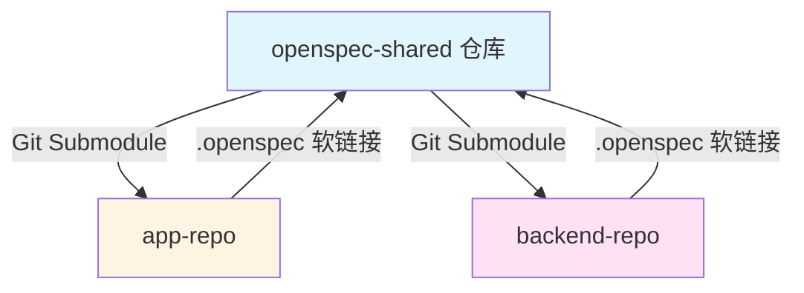

**优势：**
- 单一真相源——所有规范集中管理
- 版本化——支持锁定特定版本
- AI 上下文一致——前后端 Agent 读取相同的 specs
- 变更自动通知——GitHub Actions 触发同步

**适用场景：** 前后端分离的中大型团队

### 方案 2: Monorepo（适合小团队）

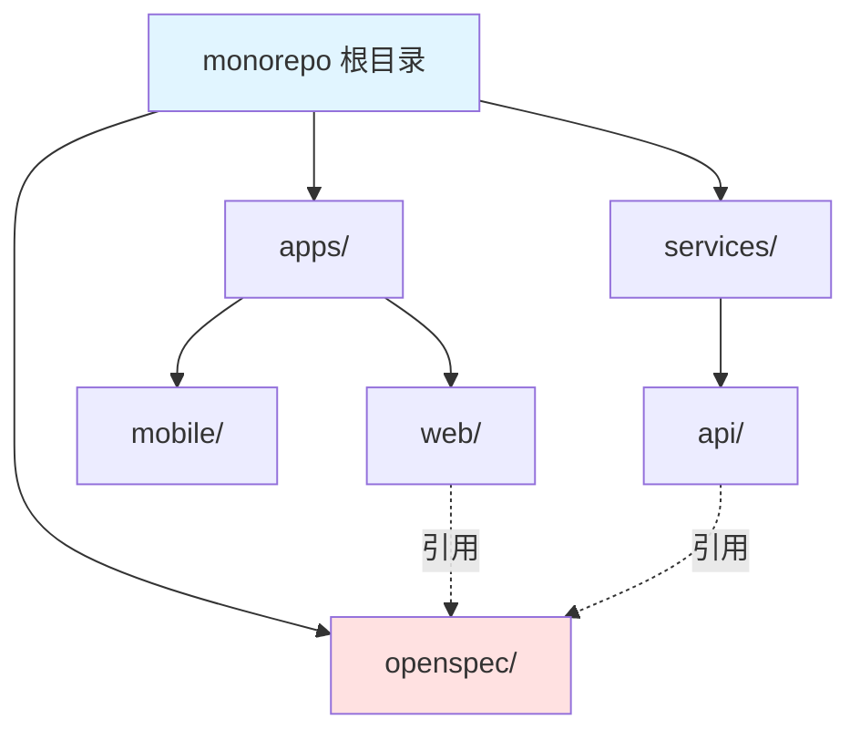

**优势：** 无需跨仓库同步、原子化提交、简化 CI/CD

```yaml
monorepo/
├── openspec/              # 共享 specs + AGENTS.md
│   ├── specs/
│   └── changes/
├── apps/
│   ├── web/
│   └── mobile/
├── services/
│   └── api/
├── AGENTS.md              # 根级 AI 约束
├── package.json
└── turbo.json
```

### 方案 3: NPM Package（适合多团队）

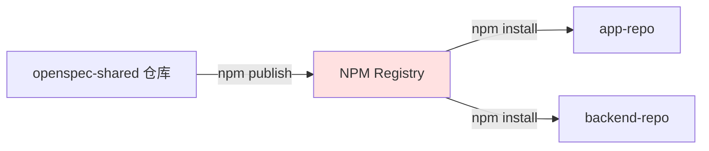

```bash
# openspec-shared: package.json
{ "name": "@your-org/openspec", "version": "1.0.0", "files": ["openspec/", "schemas/"] }

# 各仓库安装
npm install @your-org/openspec@latest
```

**适用场景：** 多团队、多产品共享核心规范

---

## 推荐方案: 独立 Spec 仓库 + 自动化

### 完整架构

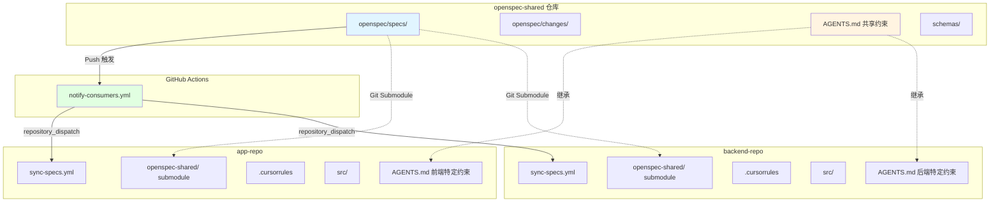

### 实施步骤

#### 1. 创建 Spec 仓库

```bash
mkdir openspec-shared && cd openspec-shared
git init
openspec init
```

**目录结构：**

```yaml
openspec-shared/
├── openspec/
│   ├── specs/
│   │   ├── api/spec.md           # API 端点规范 (Backend 维护)
│   │   ├── auth/spec.md          # 认证流程规范 (Backend 维护)
│   │   ├── data/spec.md          # 数据模型规范 (共同维护)
│   │   └── ui/spec.md            # UI 交互规范 (App 维护)
│   ├── changes/
│   └── config.yaml
├── AGENTS.md                     # 跨仓库共享的 AI 约束
├── schemas/
│   ├── openapi.yaml              # OpenAPI 规范 (可选)
│   └── types/                    # 共享类型定义
├── scripts/
│   ├── sync.sh
│   └── validate.sh
├── .github/
│   └── workflows/
│       └── notify-consumers.yml
└── README.md
```

**共享 AGENTS.md 示例：**

```markdown
# AGENTS.md (openspec-shared)
# 跨仓库共享的 AI 协作约束

## 数据模型约束
- 所有 ID 使用 CUID2 格式
- 时间字段统一使用 ISO 8601 UTC
- 金额字段使用整数（分为单位）
- 软删除使用 deletedAt 字段

## API 契约
- RESTful 设计，遵循 OpenAPI 3.0
- 响应格式: { data, error, meta }
- 分页参数: page, pageSize (默认 20, 最大 100)
- 错误码: 标准 HTTP 状态码 + 自定义业务错误码

## 认证约定
- JWT token 有效期 15 分钟
- Refresh token 有效期 7 天
- 敏感操作需要二次验证
```

#### 2. App 仓库集成

```bash
cd app-repo

# 添加 Submodule
git submodule add https://github.com/your-org/openspec-shared.git openspec-shared
git submodule update --init --recursive

# 创建软链接
ln -s ../openspec-shared/openspec .openspec
echo ".openspec" >> .gitignore
```

**App 仓库的 AGENTS.md（继承 + 扩展）：**

```markdown
# AGENTS.md (app-repo)

## 继承
请先阅读 openspec-shared/AGENTS.md 中的共享约束。

## 前端特定约束
- 框架: Next.js 14 App Router
- 样式: Tailwind CSS + shadcn/ui
- 状态管理: Zustand
- 表单: React Hook Form + Zod
- 组件文件使用 PascalCase

## 禁忌规则
- 不要在客户端组件中直接发起数据库查询
- 不要在 bundle 中包含服务端密钥
```

#### 3. Backend 仓库集成

```bash
cd backend-repo
git submodule add https://github.com/your-org/openspec-shared.git openspec-shared
ln -s ../openspec-shared/openspec .openspec
echo ".openspec" >> .gitignore
```

**Backend 仓库的 AGENTS.md（继承 + 扩展）：**

```markdown
# AGENTS.md (backend-repo)

## 继承
请先阅读 openspec-shared/AGENTS.md 中的共享约束。

## 后端特定约束
- 框架: Express.js + TypeScript
- ORM: Prisma
- 数据库: PostgreSQL
- 认证: Passport.js + JWT

## 安全约束
- 所有 API 路由必须有认证中间件（白名单除外）
- 用户输入必须使用 Zod 校验
- 密码使用 bcrypt (saltRounds: 12)
- 禁止在日志中输出敏感信息
```

#### 4. 自动化同步

**同步脚本 (scripts/sync-openspec.sh)：**

```bash
#!/bin/bash
set -e

SPEC_DIR="openspec-shared"
LINK_NAME=".openspec"

echo "Syncing OpenSpec..."

if [ -d "$SPEC_DIR" ]; then
  cd "$SPEC_DIR"
  git fetch origin
  git pull origin main
  echo "Latest commits:"
  git log -3 --oneline --decorate
  cd ..
else
  echo "Error: $SPEC_DIR not found. Run: git submodule update --init"
  exit 1
fi

if [ ! -L "$LINK_NAME" ]; then
  ln -sf "$SPEC_DIR/openspec" "$LINK_NAME"
fi

echo "OpenSpec sync complete."
```

**package.json：**

```json
{
  "scripts": {
    "sync-specs": "bash scripts/sync-openspec.sh",
    "predev": "npm run sync-specs"
  }
}
```

**GitHub Actions - 通知消费者 (openspec-shared)：**

```yaml
# .github/workflows/notify-consumers.yml
name: Notify Spec Consumers

on:
  push:
    branches: [main]
    paths:
      - 'openspec/specs/**'
      - 'AGENTS.md'
      - 'schemas/**'

jobs:
  notify:
    runs-on: ubuntu-latest
    steps:
      - uses: actions/checkout@v4
        with:
          fetch-depth: 2

      - name: Get changed files
        id: changes
        run: |
          CHANGED=$(git diff --name-only HEAD^ HEAD -- openspec/ AGENTS.md schemas/)
          echo "files=$CHANGED" >> $GITHUB_OUTPUT

      - name: Notify App Repo
        uses: peter-evans/repository-dispatch@v3
        with:
          token: ${{ secrets.PAT_TOKEN }}
          repository: your-org/app-repo
          event-type: spec-updated
          client-payload: |
            { "changed_files": "${{ steps.changes.outputs.files }}" }

      - name: Notify Backend Repo
        uses: peter-evans/repository-dispatch@v3
        with:
          token: ${{ secrets.PAT_TOKEN }}
          repository: your-org/backend-repo
          event-type: spec-updated
          client-payload: |
            { "changed_files": "${{ steps.changes.outputs.files }}" }
```

**GitHub Actions - 自动同步 PR (app-repo / backend-repo)：**

```yaml
# .github/workflows/sync-specs.yml
name: Sync OpenSpec

on:
  repository_dispatch:
    types: [spec-updated]
  workflow_dispatch:

jobs:
  sync:
    runs-on: ubuntu-latest
    steps:
      - uses: actions/checkout@v4
        with:
          submodules: true

      - name: Update Submodule
        run: |
          git submodule update --remote openspec-shared
          git add openspec-shared

      - name: Create PR
        uses: peter-evans/create-pull-request@v6
        with:
          commit-message: "chore: sync openspec from upstream"
          title: "Sync OpenSpec Specs"
          body: |
            ## OpenSpec 更新

            变更文件:
            ${{ github.event.client_payload.changed_files }}

            请检查并更新相关代码。
          branch: sync-openspec
```

---

## 上下文工程的跨仓库策略

### AGENTS.md 分层架构

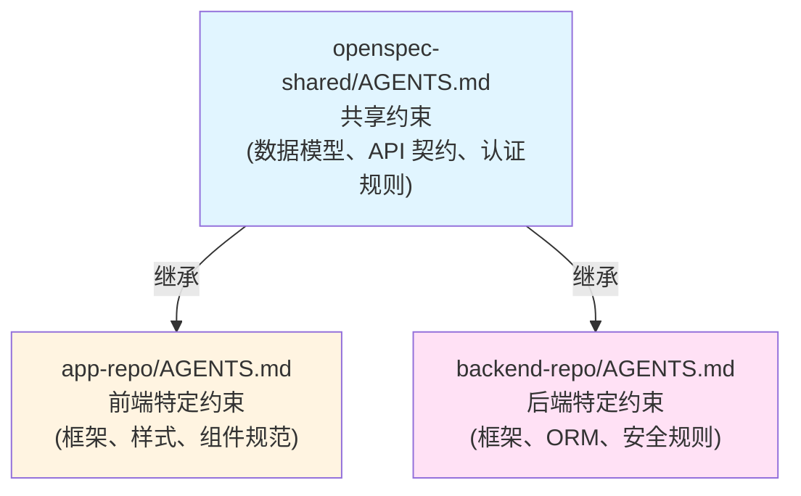

**原则：**
- **共享 AGENTS.md** 放在 openspec-shared，定义跨端通用约束
- **各仓库 AGENTS.md** 用 "继承" 声明引用共享约束，再添加端特定规则
- AI Agent 在开发时读取两份 AGENTS.md，获得完整的上下文

### Spec 职责划分

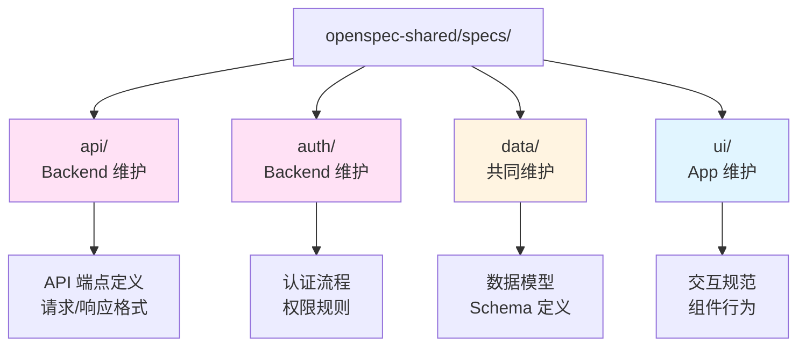

### MCP 跨仓库上下文共享

通过 MCP Server，AI Agent 可以在开发时访问跨仓库的上下文：

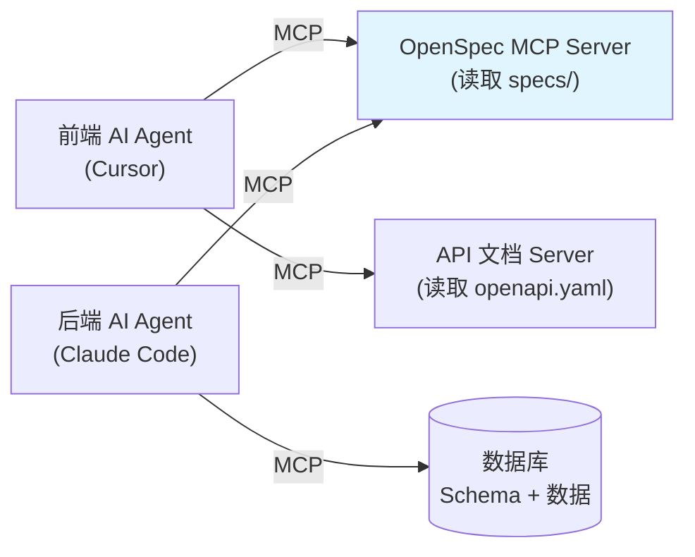

**实践方式：**
- 配置一个 MCP Server 暴露 openspec-shared 的 specs 目录
- 前端 Agent 可以通过 MCP 实时读取后端的 API spec
- 后端 Agent 可以通过 MCP 实时读取前端的 UI spec
- 避免了手动同步带来的信息延迟

---

## 协作工作流

### 场景 1: 后端添加新 API

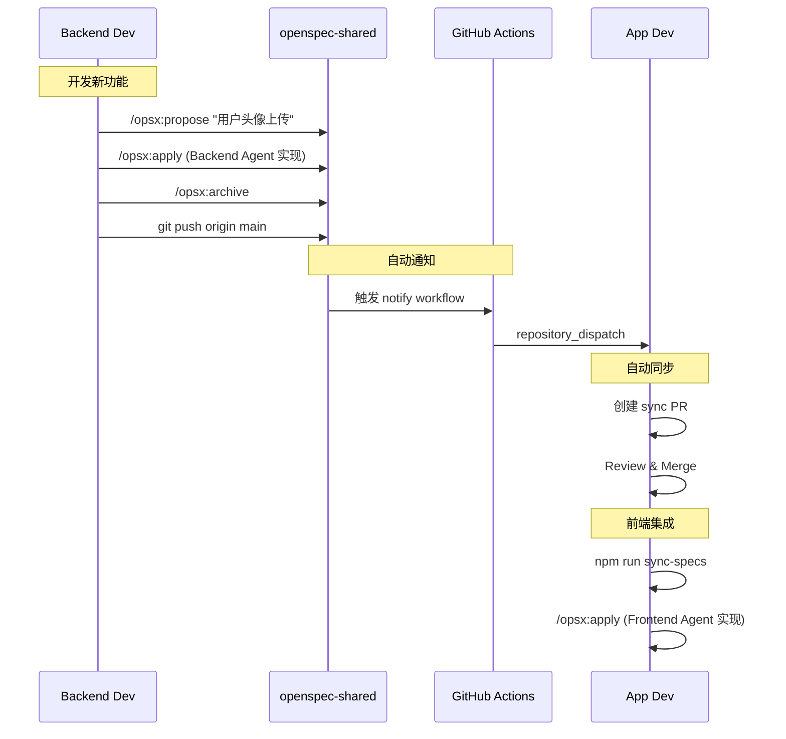

### 场景 2: 前端提出 API 需求

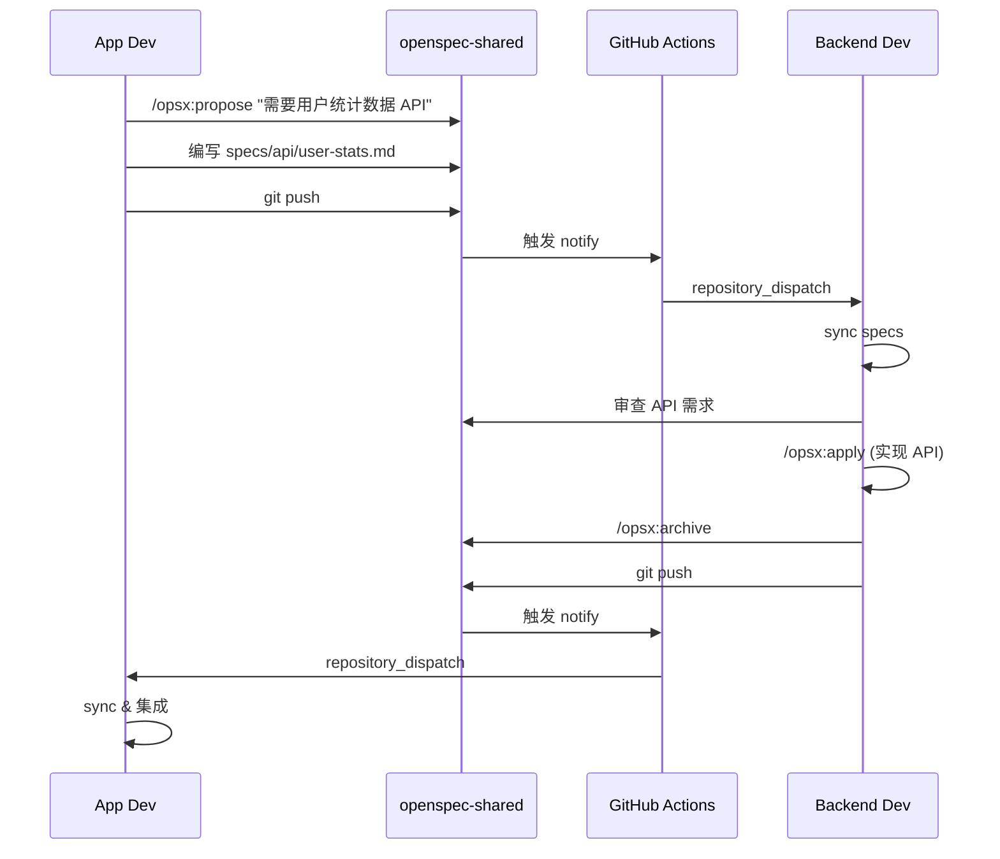

### 场景 3: 多功能并行开发

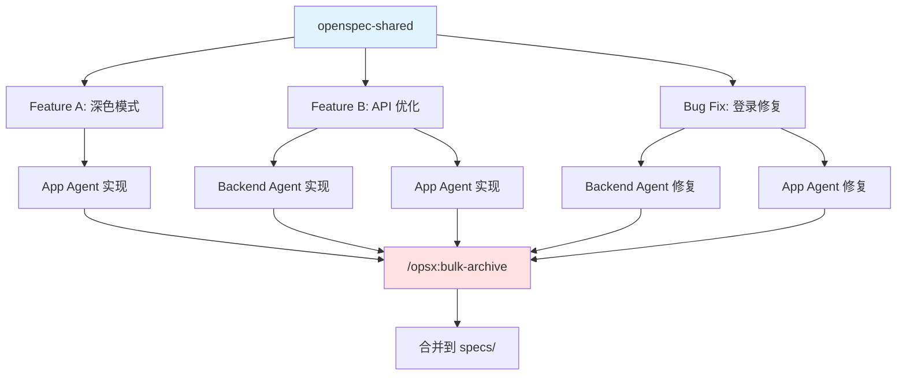

**操作流程：**

```bash
# 多个功能并行开发

# 工程师 A (App)
cd openspec-shared && /opsx:propose "添加深色模式"
cd ../app-repo && /opsx:apply add-dark-mode

# 工程师 B (Backend)
cd openspec-shared && /opsx:propose "优化 API 性能"
cd ../backend-repo && /opsx:apply optimize-api

# 工程师 C (Bug Fix)
cd openspec-shared && /opsx:propose "修复登录重定向"
cd ../app-repo && /opsx:apply fix-login

# 全部完成后批量归档
cd openspec-shared
/opsx:bulk-archive

# AI: 发现 3 个已完成的变更, 无冲突, 按时间顺序归档
```

---

## 版本管理

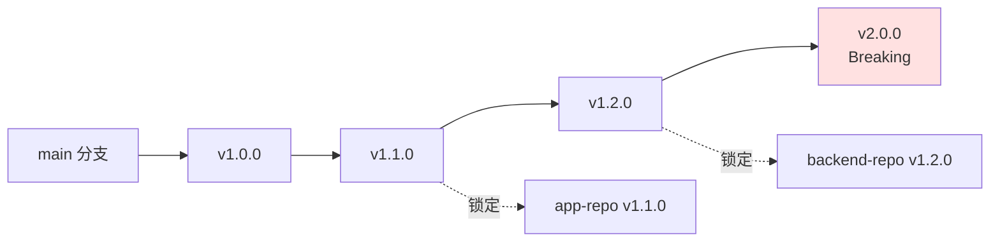

```bash
# Spec 仓库使用语义化版本
git tag v1.0.0  # 初始版本
git tag v1.1.0  # 新增功能
git tag v2.0.0  # Breaking changes

# 各仓库锁定特定版本
cd app-repo/openspec-shared
git checkout v1.1.0
cd .. && git add openspec-shared
git commit -m "chore: lock openspec to v1.1.0"
```

### 变更提交规范

```bash
# Spec 变更提交格式
git commit -m "feat(api): add user avatar upload endpoint

- ADDED: POST /api/users/:id/avatar
- MODIFIED: GET /api/users/:id (include avatar_url)
- Affects: app-repo, backend-repo"
```

---

## 最佳实践

### 1. 保持 Spec 仓库精简

Spec 仓库只放规范和约束，不放实现代码：
- `openspec/specs/` — 系统行为规范
- `AGENTS.md` — 共享 AI 约束
- `schemas/` — 共享类型定义
- 不放业务代码、不放测试代码

### 2. 同步频率

| 场景 | 同步方式 | 频率 |
|------|----------|------|
| 日常开发 | `npm run sync-specs` | 每次 dev 前自动执行 |
| Spec 变更 | GitHub Actions 自动通知 | 实时 |
| 版本锁定 | 手动 checkout tag | 稳定版本发布时 |

### 3. 冲突处理

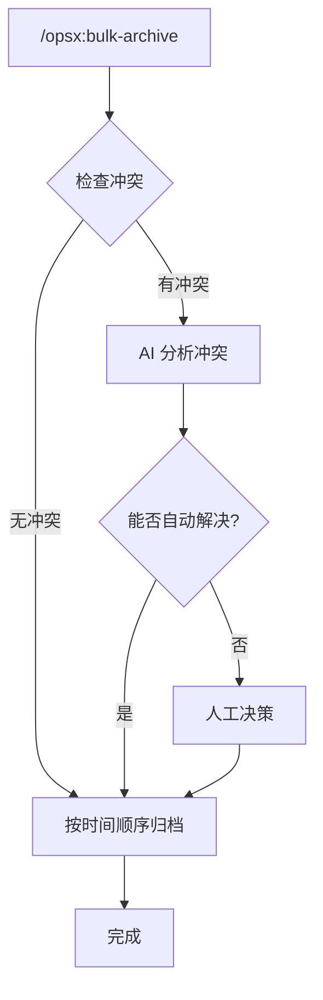

### 4. 安全注意事项

- Spec 仓库不存储任何密钥或凭证
- GitHub Actions PAT_TOKEN 使用最小权限
- 敏感的安全规范可以只放在各仓库的 AGENTS.md 中，不共享

---

## 实施清单

### 阶段 1: 基础设施 (1-2 天)
- [ ] 创建 openspec-shared 仓库
- [ ] 初始化 OpenSpec (`openspec init`)
- [ ] 编写共享 AGENTS.md
- [ ] 创建 specs 结构 (api/, auth/, data/, ui/)
- [ ] App 仓库添加 submodule + 端特定 AGENTS.md
- [ ] Backend 仓库添加 submodule + 端特定 AGENTS.md
- [ ] 配置软链接和同步脚本

### 阶段 2: 自动化配置 (1 天)
- [ ] 配置 openspec-shared 的 notify workflow
- [ ] 配置 App 的 sync-specs workflow
- [ ] 配置 Backend 的 sync-specs workflow
- [ ] 测试自动通知流程
- [ ] (可选) 配置 MCP Server 暴露 specs

### 阶段 3: 试运行 (3-5 天)
- [ ] 选择一个功能试运行完整流程
- [ ] Backend 创建规范并用 AI Agent 实现
- [ ] 验证自动通知是否工作
- [ ] App 同步并用 AI Agent 实现
- [ ] 运行 E2E 测试
- [ ] 归档变更

### 阶段 4: 全面推广
- [ ] 团队培训（AI Agent 工作流 + 上下文工程）
- [ ] 建立跨仓库协作规范
- [ ] 持续优化 AGENTS.md 和 specs
- [ ] 收集反馈并迭代

---

## 快速开始

```bash
# 1. 创建 spec 仓库
mkdir openspec-shared && cd openspec-shared
git init && openspec init
# 编写 AGENTS.md (共享 AI 约束)
git remote add origin <your-repo-url>
git push -u origin main

# 2. App 集成
cd app-repo
git submodule add <spec-repo-url> openspec-shared
ln -s openspec-shared/openspec .openspec
# 编写 App 特定的 AGENTS.md 和 .cursorrules

# 3. Backend 集成
cd backend-repo
git submodule add <spec-repo-url> openspec-shared
ln -s openspec-shared/openspec .openspec
# 编写 Backend 特定的 AGENTS.md 和 .cursorrules

# 4. 开始协作
cd openspec-shared
/opsx:propose "your feature"
```

---

**文档版本:** 2.0.0
**最后更新:** 2026-03-06
**相关文档:** [AI 驱动的端到端开发协作标准](./AI驱动的端到端开发协作标准.md) | [AI Agent 时代的技术团队重塑](./AI Agent 时代的技术团队重塑.md)

**延伸阅读（上下文工程与工具）：**
- [Agent 执行流程与规范：AGENTS.md 与规则文档](./Agent执行流程与规范-AGENTS与规则文档.md)
- [MCP：Model Context Protocol 入门与实践](./MCP-Model-Context-Protocol入门与实践.md)
- [Agent Skill：是什么、怎么用与推荐](./Agent-Skill是什么怎么用与推荐.md)
