# 跨仓库 OpenSpec 协作方案

## 问题场景

```
app-repo/              backend-repo/
├── openspec/          ├── openspec/
│   └── specs/         │   └── specs/
└── src/               └── src/

问题: 两个仓库的 specs 如何同步？
```

---

## 方案对比

### 方案 1: 独立 Spec 仓库 (推荐)

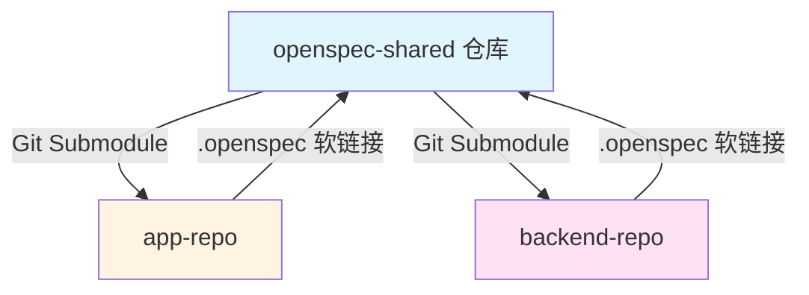

**目录结构:**
```
openspec-shared/         app-repo/              backend-repo/
├── openspec/            ├── openspec-shared/   ├── openspec-shared/
│   ├── specs/           │   └── (submodule)    │   └── (submodule)
│   │   ├── api/         ├── .openspec →        ├── .openspec →
│   │   ├── auth/        └── src/               └── src/
│   │   └── ui/
│   └── changes/
```

**优势:**
- 单一真相源
- 版本化管理
- 前后端同步拉取
- 清晰的变更历史

**实施步骤:**

#### 1. 创建独立 Spec 仓库

```bash
# 创建 spec 仓库
mkdir openspec-shared
cd openspec-shared
git init
openspec init

# 目录结构
openspec-shared/
├── openspec/
│   ├── specs/
│   │   ├── api/           # API 契约规范
│   │   │   └── spec.md
│   │   ├── auth/          # 认证规范
│   │   │   └── spec.md
│   │   ├── data/          # 数据模型规范
│   │   │   └── spec.md
│   │   └── ui/            # UI 交互规范
│   │       └── spec.md
│   ├── changes/           # 进行中的变更
│   └── config.yaml
├── schemas/               # 共享的数据 schema
│   ├── openapi.yaml       # OpenAPI 规范 (可选)
│   └── types/
└── README.md
```

#### 2. App 仓库集成

```bash
cd app-repo

# 方式 A: Git Submodule (推荐)
git submodule add https://github.com/your-org/openspec-shared.git openspec-shared
git submodule update --init --recursive

# 方式 B: Git Subtree
git subtree add --prefix openspec-shared https://github.com/your-org/openspec-shared.git main --squash

# 创建软链接
ln -s ../openspec-shared/openspec .openspec

# .gitignore
echo ".openspec" >> .gitignore
```

**App 仓库结构:**
```
app-repo/
├── openspec-shared/       # Submodule
│   └── openspec/
│       └── specs/
├── .openspec -> openspec-shared/openspec  # 软链接
├── src/
└── package.json
```

#### 3. Backend 仓库集成

```bash
cd backend-repo

# 同样方式集成
git submodule add https://github.com/your-org/openspec-shared.git openspec-shared
ln -s ../openspec-shared/openspec .openspec
```

#### 4. 同步工作流

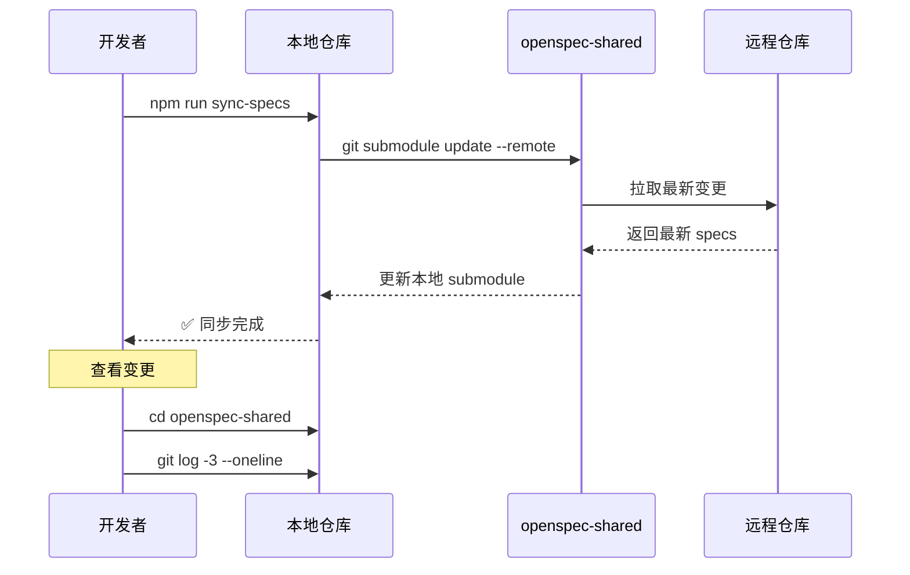

**拉取最新 Specs:**
```bash
# App 开发者
cd app-repo
git submodule update --remote openspec-shared

# 或使用自定义脚本
npm run sync-specs
```

**提交 Spec 变更:**

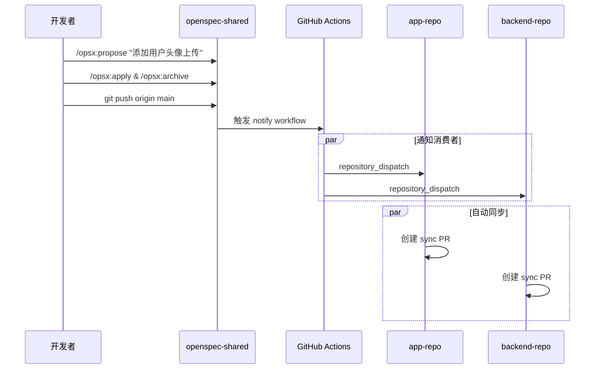

**操作步骤:**
```bash
# 在 openspec-shared 中工作
cd openspec-shared

# 创建变更
/opsx:propose "添加用户头像上传 API"

# 实现并归档
/opsx:apply add-avatar-upload
/opsx:archive add-avatar-upload

# 提交到 spec 仓库
git add .
git commit -m "feat: add avatar upload API spec"
git push origin main

# GitHub Actions 自动通知 App 和 Backend 仓库
# 两个仓库会自动创建 sync PR
```

---

### 方案 2: Monorepo (适合小团队)

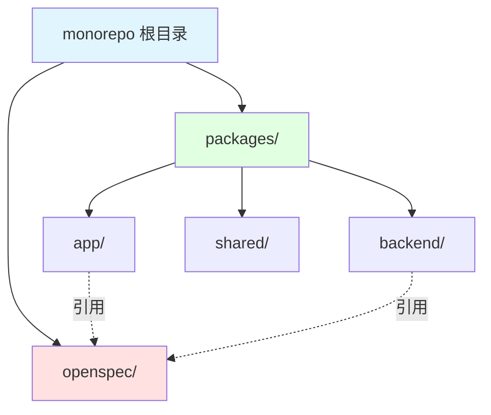

**目录结构:**
```
monorepo/
├── packages/
│   ├── app/
│   │   └── src/
│   ├── backend/
│   │   └── src/
│   └── shared/
│       └── openspec/
├── openspec/              # 根目录 OpenSpec
│   ├── specs/
│   └── changes/
└── package.json
```

**优势:**
- 无需跨仓库同步
- 原子化提交
- 简化 CI/CD

**实施步骤:**

```bash
# 初始化 monorepo
mkdir monorepo && cd monorepo
npm init -y
npm install -D turbo

# 初始化 OpenSpec
openspec init

# 目录结构
monorepo/
├── apps/
│   ├── mobile/
│   └── web/
├── services/
│   ├── api/
│   └── auth/
├── openspec/              # 共享 specs
│   ├── specs/
│   │   ├── api/
│   │   ├── auth/
│   │   └── ui/
│   └── changes/
├── package.json
└── turbo.json
```

---

### 方案 3: NPM Package (适合多团队)

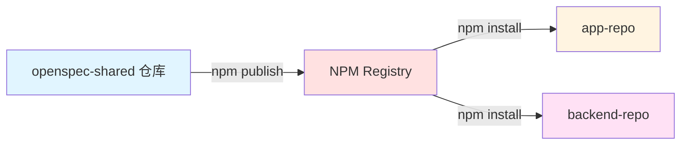

将 OpenSpec 发布为私有 NPM 包。

```bash
# openspec-shared 仓库
{
  "name": "@your-org/openspec",
  "version": "1.0.0",
  "files": ["openspec/", "schemas/"]
}

# 发布
npm publish --access restricted

# App 和 Backend 安装
npm install @your-org/openspec@latest
```

**同步:**
```bash
# 更新到最新版本
npm update @your-org/openspec
```

---

## 推荐方案: Git Submodule + 自动化脚本

### 完整架构图

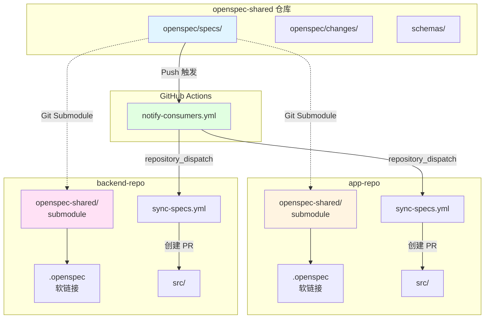

### 完整实施方案

#### 1. Spec 仓库结构

```yaml
openspec-shared/
├── openspec/
│   ├── specs/
│   │   ├── api/
│   │   │   └── spec.md          # API 端点规范
│   │   ├── auth/
│   │   │   └── spec.md          # 认证流程规范
│   │   ├── data/
│   │   │   └── spec.md          # 数据模型规范
│   │   └── ui/
│   │       └── spec.md          # UI 交互规范
│   ├── changes/
│   │   └── add-feature-x/
│   │       ├── proposal.md
│   │       ├── specs/
│   │       ├── design.md
│   │       └── tasks.md
│   └── config.yaml
├── schemas/
│   ├── openapi.yaml             # OpenAPI 规范 (可选)
│   └── graphql/                 # GraphQL Schema (可选)
├── scripts/
│   ├── sync.sh                  # 同步脚本
│   └── validate.sh              # 验证脚本
├── .github/
│   └── workflows/
│       └── notify-consumers.yml # 通知消费者
└── README.md
```

#### 2. 自动化同步脚本

**scripts/sync.sh**
```bash
#!/bin/bash
# OpenSpec 同步脚本

set -e

SPEC_REPO="https://github.com/your-org/openspec-shared.git"
SPEC_DIR="openspec-shared"

echo "🔄 同步 OpenSpec..."

if [ -d "$SPEC_DIR" ]; then
  cd "$SPEC_DIR"
  git pull origin main
  cd ..
else
  git clone "$SPEC_REPO" "$SPEC_DIR"
fi

# 创建软链接
if [ ! -L ".openspec" ]; then
  ln -sf "$SPEC_DIR/openspec" .openspec
fi

echo "✅ OpenSpec 同步完成"
echo "📋 最新变更:"
cd "$SPEC_DIR" && git log -3 --oneline
```

**package.json (App & Backend)**
```json
{
  "scripts": {
    "sync-specs": "bash scripts/sync-openspec.sh",
    "postinstall": "npm run sync-specs",
    "dev": "npm run sync-specs && next dev"
  }
}
```

#### 3. Claude CLI Skill: OpenSpec Sync

创建自定义 Skill 用于跨仓库同步。

**~/.kiro/skills/openspec-sync/SKILL.md**
```markdown
# OpenSpec Sync Skill

## Description
跨仓库同步 OpenSpec 规范，支持 App 和 Backend 仓库拉取共享的 specs。

## Triggers
- "同步 openspec"
- "拉取最新规范"
- "更新 specs"
- "sync specs"

## Instructions

当用户请求同步 OpenSpec 时:

1. 检查当前仓库类型 (app/backend)
2. 检查是否存在 openspec-shared submodule
3. 执行同步操作:
   ```bash
   git submodule update --remote openspec-shared
   ```
4. 显示最新变更摘要
5. 检查是否有影响当前仓库的变更

## Example Usage

User: "同步 openspec"

AI: 
1. 检测到 openspec-shared submodule
2. 执行 git submodule update --remote
3. 显示最新变更:
   - feat: add avatar upload API
   - fix: update auth token expiry
4. 影响分析:
   - App: 需要更新 API client
   - Backend: 需要实现新端点

## Implementation

```typescript
// 检查并同步 OpenSpec
async function syncOpenSpec() {
  const hasSubmodule = await checkSubmodule('openspec-shared');
  
  if (!hasSubmodule) {
    console.log('⚠️  未找到 openspec-shared submodule');
    console.log('运行: git submodule add <repo-url> openspec-shared');
    return;
  }
  
  // 同步
  await exec('git submodule update --remote openspec-shared');
  
  // 获取变更
  const changes = await getRecentChanges('openspec-shared');
  console.log('📋 最新变更:', changes);
  
  // 分析影响
  const impact = await analyzeImpact(changes);
  console.log('🎯 影响分析:', impact);
}
```
```

---

#### 4. GitHub Actions 自动通知

**openspec-shared/.github/workflows/notify-consumers.yml**
```yaml
name: Notify Spec Consumers

on:
  push:
    branches: [main]
    paths:
      - 'openspec/specs/**'

jobs:
  notify:
    runs-on: ubuntu-latest
    steps:
      - name: Checkout
        uses: actions/checkout@v3
        with:
          fetch-depth: 2
      
      - name: Get changed specs
        id: changes
        run: |
          CHANGED=$(git diff --name-only HEAD^ HEAD | grep 'openspec/specs/')
          echo "files=$CHANGED" >> $GITHUB_OUTPUT
      
      - name: Notify App Repo
        uses: peter-evans/repository-dispatch@v2
        with:
          token: ${{ secrets.PAT_TOKEN }}
          repository: your-org/app-repo
          event-type: spec-updated
          client-payload: |
            {
              "changed_files": "${{ steps.changes.outputs.files }}",
              "commit": "${{ github.sha }}"
            }
      
      - name: Notify Backend Repo
        uses: peter-evans/repository-dispatch@v2
        with:
          token: ${{ secrets.PAT_TOKEN }}
          repository: your-org/backend-repo
          event-type: spec-updated
          client-payload: |
            {
              "changed_files": "${{ steps.changes.outputs.files }}",
              "commit": "${{ github.sha }}"
            }
```

**app-repo/.github/workflows/sync-specs.yml**
```yaml
name: Sync OpenSpec

on:
  repository_dispatch:
    types: [spec-updated]
  workflow_dispatch:

jobs:
  sync:
    runs-on: ubuntu-latest
    steps:
      - name: Checkout
        uses: actions/checkout@v3
        with:
          submodules: true
      
      - name: Update Submodule
        run: |
          git submodule update --remote openspec-shared
          git add openspec-shared
      
      - name: Create PR
        uses: peter-evans/create-pull-request@v5
        with:
          commit-message: "chore: sync openspec from upstream"
          title: "🔄 Sync OpenSpec Specs"
          body: |
            ## OpenSpec 更新
            
            变更文件:
            ${{ github.event.client_payload.changed_files }}
            
            Commit: ${{ github.event.client_payload.commit }}
            
            请检查并更新相关代码。
          branch: sync-openspec
```

---

## 协作工作流

### 场景 1: 后端添加新 API

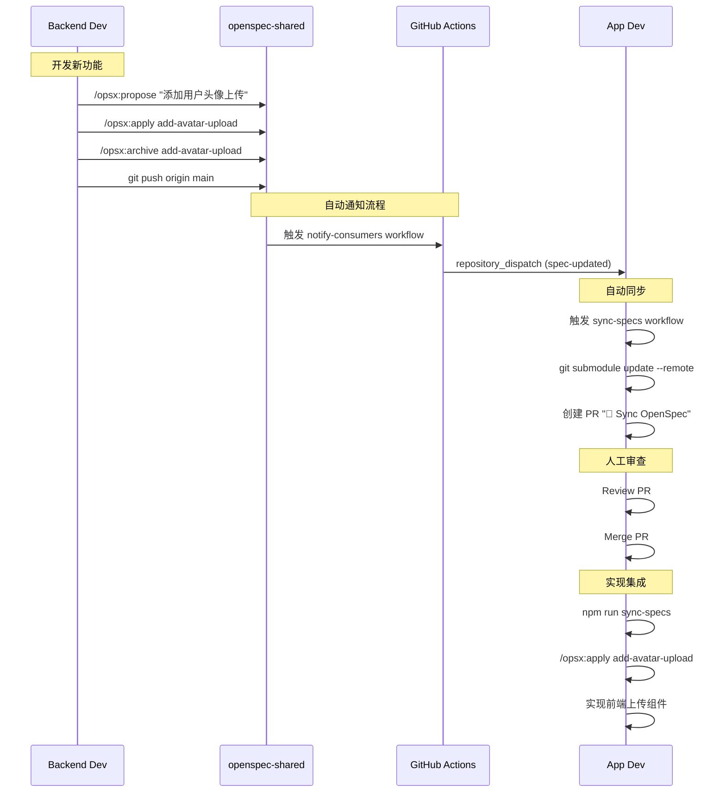

### 场景 2: 前端提出 API 需求

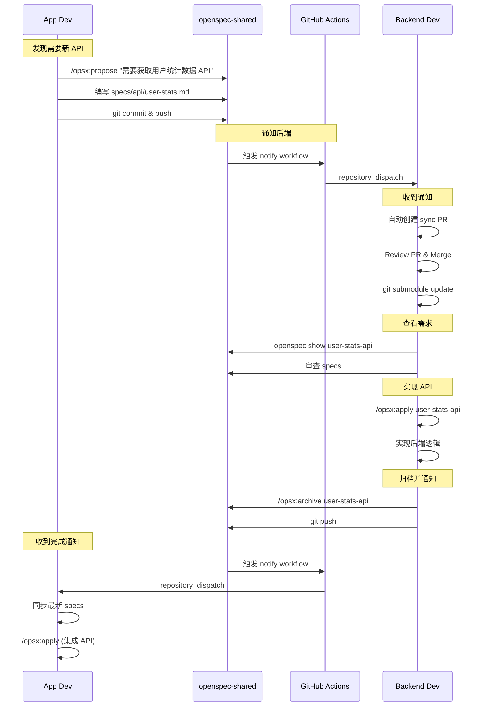

### 场景 3: 并行开发多个功能

```mermaid
graph TB
    Start[开始] --> Spec[openspec-shared]
    
    Spec --> Change1[Feature A<br/>add-dark-mode]
    Spec --> Change2[Feature B<br/>optimize-api]
    Spec --> Change3[Bug Fix<br/>fix-login]
    
    Change1 --> BE1[Backend 实现]
    Change1 --> App1[App 实现]
    
    Change2 --> BE2[Backend 实现]
    Change2 --> App2[App 实现]
    
    Change3 --> BE3[Backend 修复]
    Change3 --> App3[App 修复]
    
    BE1 --> Archive1[归档 Feature A]
    App1 --> Archive1
    
    BE2 --> Archive2[归档 Feature B]
    App2 --> Archive2
    
    BE3 --> Archive3[归档 Bug Fix]
    App3 --> Archive3
    
    Archive1 --> BulkArchive[/opsx:bulk-archive]
    Archive2 --> BulkArchive
    Archive3 --> BulkArchive
    
    BulkArchive --> Merge[合并到 specs/]
    Merge --> Done[完成]
    
    style Spec fill:#e1f5ff
    style BulkArchive fill:#ffe1e1
    style Merge fill:#e1ffe1
```

**操作流程:**

```bash
# 团队同时开发 3 个功能

# Backend Dev A
cd openspec-shared
/opsx:propose "添加深色模式"
cd ../backend-repo
/opsx:apply add-dark-mode

# Backend Dev B
cd openspec-shared
/opsx:propose "优化 API 性能"
cd ../backend-repo
/opsx:apply optimize-api

# App Dev
cd openspec-shared
/opsx:propose "修复登录重定向"
cd ../app-repo
/opsx:apply fix-login

# 所有功能完成后，批量归档
cd openspec-shared
/opsx:bulk-archive

AI: 发现 3 个已完成的变更:
    - add-dark-mode (all tasks done)
    - optimize-api (all tasks done)
    - fix-login (all tasks done)
    
    检查 spec 冲突...
    ✓ 无冲突
    
    归档所有 3 个变更？

You: Yes

AI: ✓ 归档 add-dark-mode
    ✓ 归档 optimize-api
    ✓ 归档 fix-login
    
    Specs 已合并到主分支
```

---

## 实战示例

### 完整流程演示

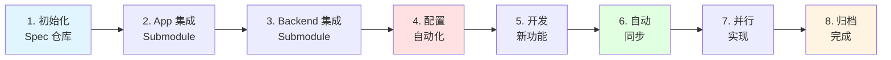

#### 1. 初始化 Spec 仓库

```bash
# 创建并初始化
mkdir openspec-shared && cd openspec-shared
git init
openspec init

# 创建初始规范
/opsx:propose "定义用户认证 API 规范"

# 生成的 specs/api/spec.md
```

#### 2. App 仓库集成

```bash
cd app-repo

# 添加 submodule
git submodule add git@github.com:your-org/openspec-shared.git openspec-shared

# 创建同步脚本
cat > scripts/sync-openspec.sh << 'EOF'
#!/bin/bash
git submodule update --init --remote openspec-shared
ln -sf openspec-shared/openspec .openspec
echo "✅ OpenSpec synced"
EOF

chmod +x scripts/sync-openspec.sh

# package.json
{
  "scripts": {
    "sync": "./scripts/sync-openspec.sh",
    "predev": "npm run sync"
  }
}

# 首次同步
npm run sync
```

#### 3. 开发新功能

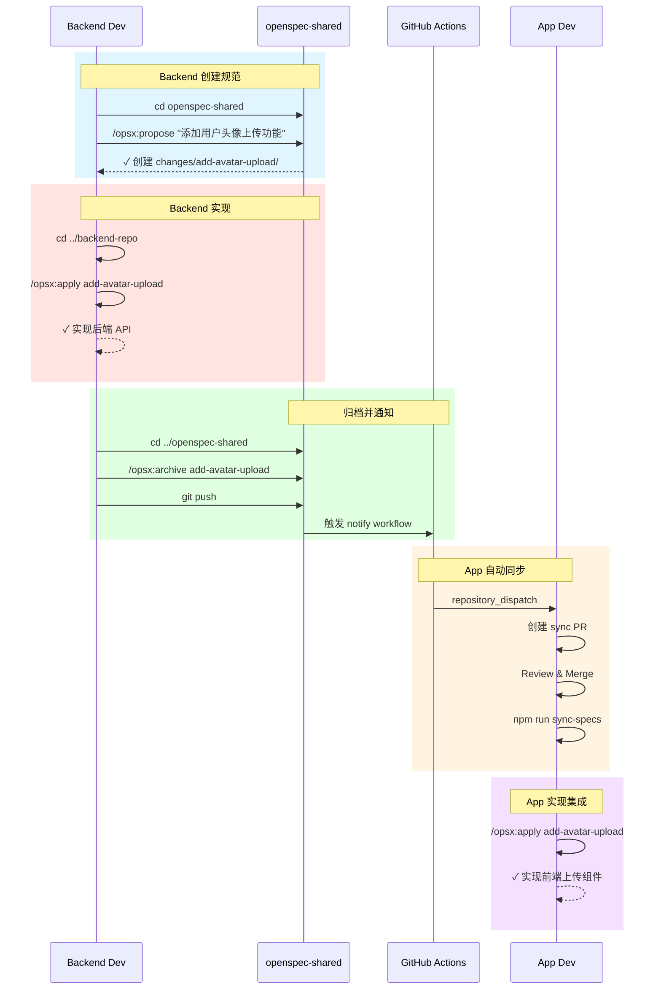

**Backend 开发者:**
```bash
cd openspec-shared

# 提出新功能
/opsx:propose "添加用户头像上传功能"

AI: ✓ 创建 changes/add-avatar-upload/
    ✓ proposal.md
    ✓ specs/api/spec.md (Delta)
    ✓ design.md
    ✓ tasks.md

# 实现后端
cd ../backend-repo
/opsx:apply add-avatar-upload

# 归档并推送
cd ../openspec-shared
/opsx:archive add-avatar-upload
git add . && git commit -m "feat: add avatar upload API"
git push
```

**App 开发者 (自动收到通知):**
```bash
cd app-repo

# 同步最新 specs
npm run sync

# 查看变更
cd openspec-shared
openspec list

# 实现前端集成
cd ..
/opsx:apply add-avatar-upload

AI: 检测到新的 API 规范: POST /api/users/avatar
    生成前端代码...
    ✓ API client
    ✓ Upload component
    ✓ Integration
```

---

## 最佳实践

### 1. Spec 仓库职责划分

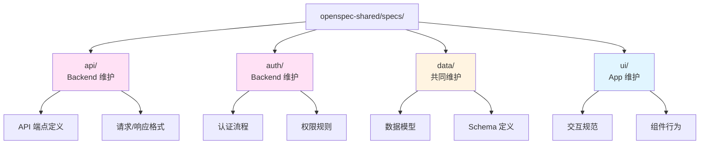

### 2. 变更提交规范

```bash
# Spec 变更必须包含完整的 Delta
git commit -m "feat(api): add user avatar upload endpoint

- ADDED: POST /api/users/:id/avatar
- MODIFIED: GET /api/users/:id (include avatar_url)
- Affects: app-repo, backend-repo
"
```

### 3. 版本管理

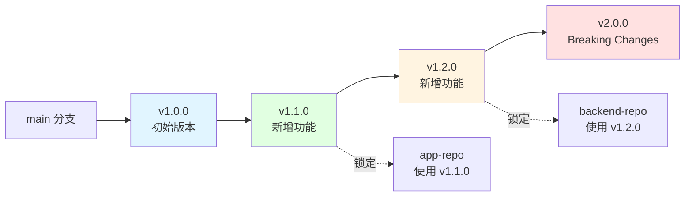

**版本锁定操作:**
```bash
# Spec 仓库使用语义化版本
git tag v1.0.0  # 初始版本
git tag v1.1.0  # 新增功能
git tag v2.0.0  # Breaking changes

# App/Backend 锁定 spec 版本
cd app-repo
git submodule update --init --remote
cd openspec-shared
git checkout v1.1.0
cd ..
git add openspec-shared
git commit -m "chore: lock openspec to v1.1.0"
```

### 4. 冲突解决

```mermaid
graph TB
    Start[多个变更完成] --> Bulk[/opsx:bulk-archive]
    
    Bulk --> Check{检查冲突}
    
    Check -->|无冲突| Auto[自动按时间顺序归档]
    Check -->|有冲突| Analyze[分析代码实现]
    
    Analyze --> Resolve{能否自动解决?}
    
    Resolve -->|是| Auto
    Resolve -->|否| Manual[人工解决冲突]
    
    Manual --> Merge[手动合并 specs]
    Merge --> Auto
    
    Auto --> Archive[归档到 archive/]
    Archive --> Done[完成]
    
    style Check fill:#ffe1e1
    style Analyze fill:#fff4e1
    style Auto fill:#e1ffe1
```

**操作示例:**
# 多人同时修改 specs
cd openspec-shared

# 使用 OpenSpec 的 bulk-archive 自动解决
/opsx:bulk-archive

AI: 检测到 2 个变更修改了 specs/api/spec.md:
    - add-avatar-upload (Backend)
    - add-profile-edit (App)
    
    分析代码实现...
    无冲突，按时间顺序合并:
    1. add-avatar-upload
    2. add-profile-edit
    
    ✓ 已归档
```

---

## 工具脚本

### sync-openspec.sh (完整版)

```bash
#!/bin/bash
# OpenSpec 跨仓库同步脚本

set -e

SPEC_REPO="${OPENSPEC_REPO:-git@github.com:your-org/openspec-shared.git}"
SPEC_DIR="openspec-shared"
LINK_NAME=".openspec"

# 颜色输出
GREEN='\033[0;32m'
YELLOW='\033[1;33m'
NC='\033[0m'

echo "🔄 同步 OpenSpec..."

# 检查是否已存在
if [ -d "$SPEC_DIR" ]; then
  echo "📦 更新现有 submodule..."
  cd "$SPEC_DIR"
  
  # 保存当前分支
  CURRENT_BRANCH=$(git rev-parse --abbrev-ref HEAD)
  
  # 拉取最新
  git fetch origin
  git pull origin main
  
  # 显示变更
  echo -e "${GREEN}✅ 同步完成${NC}"
  echo "📋 最近 3 次提交:"
  git log -3 --oneline --decorate
  
  cd ..
else
  echo "📥 克隆 OpenSpec 仓库..."
  git clone "$SPEC_REPO" "$SPEC_DIR"
  echo -e "${GREEN}✅ 克隆完成${NC}"
fi

# 创建/更新软链接
if [ -L "$LINK_NAME" ]; then
  rm "$LINK_NAME"
fi
ln -s "$SPEC_DIR/openspec" "$LINK_NAME"
echo "🔗 创建软链接: $LINK_NAME -> $SPEC_DIR/openspec"

# 检查影响当前仓库的变更
echo ""
echo "🎯 分析影响..."

# 检测仓库类型
if [ -f "package.json" ] && grep -q "\"next\"" package.json; then
  REPO_TYPE="app"
elif [ -f "package.json" ] && grep -q "\"express\"" package.json; then
  REPO_TYPE="backend"
else
  REPO_TYPE="unknown"
fi

echo "📍 当前仓库类型: $REPO_TYPE"

# 根据类型显示相关变更
cd "$SPEC_DIR"
if [ "$REPO_TYPE" = "app" ]; then
  echo "📱 App 相关变更:"
  git log -5 --oneline --grep="app\|ui\|frontend" || echo "  无相关变更"
elif [ "$REPO_TYPE" = "backend" ]; then
  echo "🔧 Backend 相关变更:"
  git log -5 --oneline --grep="api\|backend\|server" || echo "  无相关变更"
fi
cd ..

echo ""
echo -e "${GREEN}✅ OpenSpec 同步完成！${NC}"
echo "💡 提示: 运行 'openspec list' 查看活跃变更"
```

### validate-integration.sh

```bash
#!/bin/bash
# 验证 App 和 Backend 的 spec 集成

set -e

echo "🔍 验证 OpenSpec 集成..."

# 检查 submodule
if [ ! -d "openspec-shared" ]; then
  echo "❌ 未找到 openspec-shared"
  exit 1
fi

# 检查软链接
if [ ! -L ".openspec" ]; then
  echo "❌ 未找到 .openspec 软链接"
  exit 1
fi

# 验证 OpenSpec
cd openspec-shared
openspec validate

echo "✅ OpenSpec 集成验证通过"
```

---

## 总结

### 推荐方案

**独立 Spec 仓库 + Git Submodule + 自动化**

### 完整协作流程图

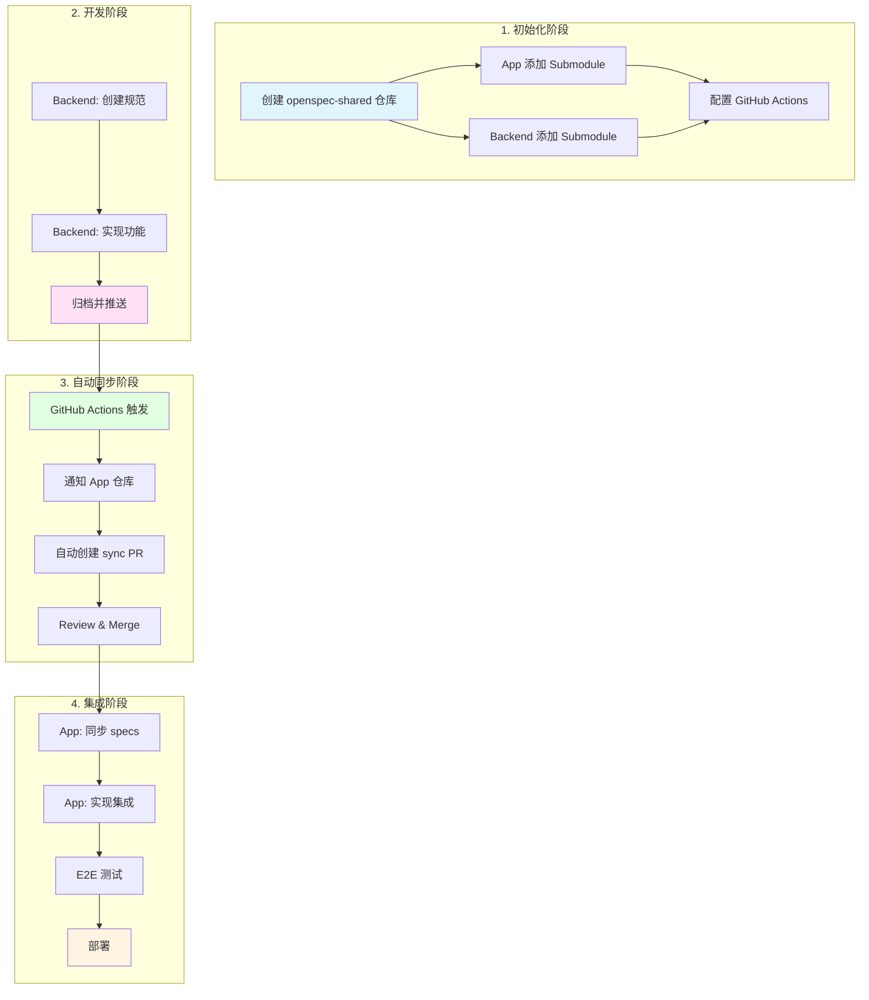

### 核心优势总结

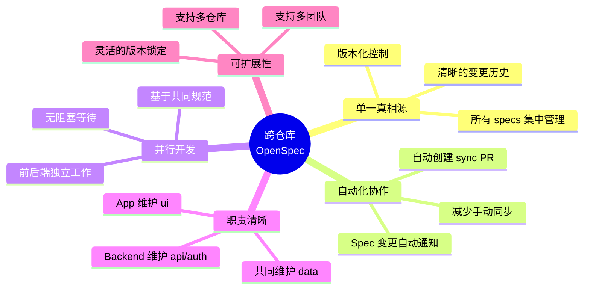

### 实施清单

**阶段 1: 基础设施 (1-2 天)**
- [ ] 创建 openspec-shared 仓库
- [ ] 初始化 OpenSpec (`openspec init`)
- [ ] 创建初始 specs 结构 (api/, auth/, data/, ui/)
- [ ] App 仓库添加 submodule
- [ ] Backend 仓库添加 submodule
- [ ] 配置软链接和同步脚本

**阶段 2: 自动化配置 (1 天)**
- [ ] 配置 openspec-shared 的 notify workflow
- [ ] 配置 App 的 sync-specs workflow
- [ ] 配置 Backend 的 sync-specs workflow
- [ ] 测试自动通知流程
- [ ] 编写团队协作文档

**阶段 3: 试运行 (3-5 天)**
- [ ] 选择一个简单功能试运行
- [ ] Backend 创建规范并实现
- [ ] 验证自动通知是否工作
- [ ] App 同步并实现集成
- [ ] 运行 E2E 测试
- [ ] 归档变更

**阶段 4: 全面推广 (持续)**
- [ ] 团队培训
- [ ] 建立最佳实践
- [ ] 优化工作流程
- [ ] 收集反馈并改进

### 快速开始命令

```bash
# 1. 创建 spec 仓库
mkdir openspec-shared && cd openspec-shared
git init && openspec init
git remote add origin <your-repo-url>
git push -u origin main

# 2. App 集成
cd app-repo
git submodule add <spec-repo-url> openspec-shared
ln -s openspec-shared/openspec .openspec
npm run sync

# 3. Backend 集成
cd backend-repo
git submodule add <spec-repo-url> openspec-shared
ln -s openspec-shared/openspec .openspec
npm run sync

# 4. 开始协作
cd openspec-shared
/opsx:propose "your feature"
```

---

**文档版本:** 1.0.0  
**最后更新:** 2026-03-05  
**相关文档:** [AI全栈开发协作流程标准.md](./AI全栈开发协作流程标准.md)
