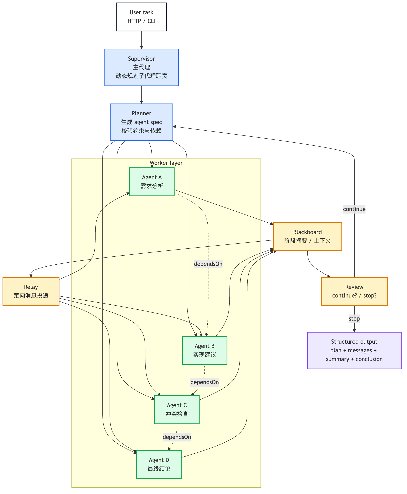

# 高效 Sub Agent 系统设计实践

## 前言

这段时间我一直在折腾一个本地的多智能体系统，底层用的是 Ollama，编排层用的是 LangGraph，前面再套一层自己的执行规范。

最开始只是想验证一件事：**一个主代理能不能根据任务，自由规划出多个子代理，让它们分工、交流、迭代，最后稳定收敛成一个可交付结果。**

做下来之后，我的感受很直接：

- 单个 Agent 能做很多事，但复杂任务下很容易发散
- 真正有价值的不是“有多少个 agent”，而是“谁来编排、怎么协作、何时停止”
- 只要编排逻辑不稳，再强的模型也会把任务带偏
- 图、文档、流程、权限这些外围东西，往往比模型本身更容易把项目搞崩

所以这篇文章不是在讲“多智能体是什么”这种空话，而是把我这次实践里真正踩过的坑、收敛出来的规则、还有可复用的流程整理出来。

## 一、为什么要做 Sub Agent 系统

如果只是做一个问答助手，一个 Agent 基本够用。

但一旦任务变成下面这些类型，单 Agent 就开始吃力了：

- 让它先分析需求，再给实现建议，再检查冲突，再写最终结论
- 让它同时处理代码、文档、测试和总结
- 让它在中间过程中不断修正自己，而不是只输出一版答案
- 让它面对一堆上下文时，还能保持结构和边界

这个时候，问题就不在“模型会不会回答”，而在“系统能不能稳定地组织回答”。

我最终想要的不是一个“万能 Agent”，而是一个更像小型团队的系统：

- **主代理**负责理解任务和拆分职责
- **子代理**分别做不同环节
- **黑板**保存阶段性结果
- **Relay**只传递必要信息
- **Review**控制是否继续迭代

这套模式的好处是：任务越复杂，优势越明显。

## 二、我想要的不是固定角色，而是动态编排

一开始很容易走进一个误区：先把角色固定好。

比如：
- 需求分析师
- 实现建议师
- 冲突检查器
- 最终总结者

这种写法能跑，但很快会发现一个问题：**角色固定了，任务就被角色绑死了。**

真实场景里，任务并不总是这四类。

有时候更像：
- 方案拆解 + 风险识别 + 兼容性检查
- 设计评审 + 接口约束校验 + 输出润色
- 文档总结 + 图表绘制 + 结论收敛
- 代码改造 + 测试补齐 + 回归检查

所以更合理的方式，是让主代理在约束框里自由生成子代理职责。

### 主代理该做什么

主代理只干三件事：

1. 先理解任务
2. 再拆职责
3. 再决定依赖顺序

它不该直接替子代理干活，也不该一上来就把角色写死。

### 子代理该做什么

子代理只干一件事：

- 按自己的职责输出高质量结果

它可以参考别人的结果，但不能抢别人的活。

这个边界如果不清楚，系统就会变成“大家都在重复同一句话”。

## 三、这次实践里我真正沉淀下来的结构

最终我把系统收敛成了下面这套结构：

- **Supervisor / 主代理**：编排任务
- **Planner**：生成 agent spec
- **Worker layer**：按职责执行
- **Blackboard**：保存阶段摘要
- **Relay**：只做定向投递
- **Review**：判断继续还是停止
- **Structured output**：保留最终结果

这里不是“形式上有几个模块”这么简单，而是每个模块都有明确边界。

### 1. Blackboard：让中间过程有地方放

子代理的输出不能直接散在日志里，也不能只存在上下文里。

我更倾向于把它们写到黑板上，作为后续流程的共享上下文：

- 当前阶段已经得出了什么
- 哪些点还没覆盖
- 哪些地方存在冲突
- 哪些信息适合传给下一个 agent

### 2. Relay：只传给需要的人

这一步很关键。

如果把一个 agent 的输出无差别广播给所有人，后面的 agent 很容易变成抄作业机器。

所以 relay 的原则是：

- 分析类 agent 收到的是“补边界、补约束”
- 实现类 agent 收到的是“继续落地、补实现细节”
- 冲突检查类 agent 收到的是“重点看冲突点、兼容性和重复项”
- 总结类 agent 收到的是“补缺口、补收敛”

### 3. Review：必须能停

review 不是为了让系统显得聪明，而是为了让系统**知道什么时候该闭嘴**。

我给它的停止条件很简单：

- 结果已经覆盖任务核心 → 停
- 只是重复表达，没有新增信息 → 停
- 真的还缺关键步骤 → 才继续

这个约束一旦没有，迭代就会无限拖下去。

## 四、案例补充与对比

为了让这套系统不只是“看起来高级”，我又单独整理了一个真实输出对比目录，把**项目版多 Agent** 和 **单 Agent** 在同一个任务上的结果放在一起看。

- [案例对比目录](./高效 Sub Agent 系统设计实践-案例对比/README.md)
- [项目版多 Agent 输出](./高效 Sub Agent 系统设计实践-案例对比/project-multi-agent-output.md)
- [单 Agent 输出](./高效 Sub Agent 系统设计实践-案例对比/single-agent-output.md)

这个对比很直观：
- 单 Agent 容易把分析、方案、风险、总结混在一起
- 项目版多 Agent 会把职责拆清楚，并通过依赖和消息流把结果收敛起来

下面继续看我拿去验证的几个真实工作场景。

### 1. 设计一个本地 Ollama 多智能体系统

### 案例 1：设计一个本地 Ollama 多智能体系统

这是我最开始拿来验证的任务。

如果用单 Agent 来做，它通常会给出一份很长的回答，但内容容易混杂：
- 先讲概念
- 再讲实现
- 再讲流程图
- 最后再讲部署

看起来完整，实际上没有分工。

而用了 Sub Agent 之后，可以拆成：
- 一个 agent 负责分析需求
- 一个 agent 负责给实现建议
- 一个 agent 负责检查冲突
- 一个 agent 负责总结结论

这样输出顺序会更稳定，结果也更容易整理成正式稿。

### 案例 2：技术方案评审

比如一个新功能方案出来以后，常见的问题不是“有没有答案”，而是“答案之间会不会打架”。

这时候就适合拆成：
- 方案梳理
- 风险识别
- 冲突检查
- 结论收敛

很多时候，一个人脑子里能想明白，但写出来就会散。
多 Agent 的好处就在于：把思路拆开后，能更容易发现自相矛盾的地方。

### 案例 3：写文档 + 画图 + 交付

这个场景是我后来特别在意的。

因为很多 AI 项目，最后不是卡在“生成不了内容”，而是卡在：

- 图太小看不清
- 画得太乱像手绘草图
- 文档权限不对
- 旧图没删干净
- 最终稿没有收敛

所以我后来给流程图单独定了一个标准：

1. 先写 Mermaid
2. 再用 mermaid-cli 渲染
3. 画布必须足够大
4. 本地确认清晰后再上传
5. 文档里只保留最终图

这件事看起来有点“细碎”，但实际非常重要。图如果看不清，再好的架构也是白搭。

### 案例 4：需求分析 + 实现建议 + 冲突校验

这是最典型的多子代理场景。

如果让一个 Agent 全干，它会出现两个问题：
- 前面分析过的内容，后面又重复一遍
- 细节写得很多，但重点不集中

拆开之后就会清楚很多：
- 需求分析只负责把问题说清楚
- 实现建议只负责把方案说出来
- 冲突检查只负责看有没有打架
- 最终结论只负责收束

这种方式比“单 Agent 一口气输出 3000 字”更像真正的协作。

## 五、实现时我踩过的几个坑

### 1. 把职责写死

一开始很容易把 agent 名称和职责全部固定下来。

这会导致系统看起来很整齐，但不够灵活。

后来我改成让主代理动态规划职责，这样同样的框架可以适应不同任务。

### 2. 消息广播过头

如果每个 agent 都收到所有内容，最后就会变成“大家都知道一点，但没有人真正负责”。

所以后来我把 relay 收紧成了定向投递。

### 3. 图尺寸太小

这个坑我踩得很实。

前面图能渲染出来，但在文档里太小，几乎看不清。
后来我固定成了大图尺寸渲染标准：

- `-w 2600 -H 2200 -s 2`

如果图再复杂，就继续放大，而不是手绘兜底。

### 4. 文档权限和可读性

创建飞书文档不是“成功了就完了”。

真正要验证的是：**用用户身份创建后，用户自己能不能立刻读回来。**

这个坑我踩过一次，所以后来我都要求创建完马上回读验证。

## 六、我现在更认可的标准流程

如果以后再做类似系统，我会按这个顺序走：

1. 定义主代理的约束框
2. 让主代理动态生成 agent spec
3. 用 LangGraph 搭固定编排框架
4. 加入 blackboard、relay、review
5. 保证依赖顺序和定向消息
6. 输出只保留结构化结果
7. 图统一用 Mermaid，并用大尺寸渲染
8. 文档里只保留最终一张图

## 七、这次实践最值钱的收获

我现在越来越相信一件事：

> 高效的 Sub Agent 系统，核心不是“多少 agent”，而是“编排是否正确”。

主代理负责动态规划，子代理负责各自职责，消息只在必要的地方流动，最终结果只保留最有价值的摘要和结论。

这套思路放到别的任务里也一样成立：
- 方案评审
- 文档整理
- 代码重构
- 流程设计
- 图表交付

只要任务有阶段、有依赖、有迭代，它就值得被拆成一个小型协作系统。

## 八、后续还可以继续做的事

- 给 agent spec 加 schema 校验
- 把 dependsOn 变成真正的执行门槛
- 给 review 加更严格的停止规则
- 增加失败重试和超时控制
- 增加持久化记忆
- 增加 Web UI 展示协作轨迹
- 给 Mermaid 图做统一模板，减少重复劳动

---

这次实践从头到尾都在做一件事：把“看起来像 AI 协作”的东西，变成“真的能收敛、真的能交付”的系统。
