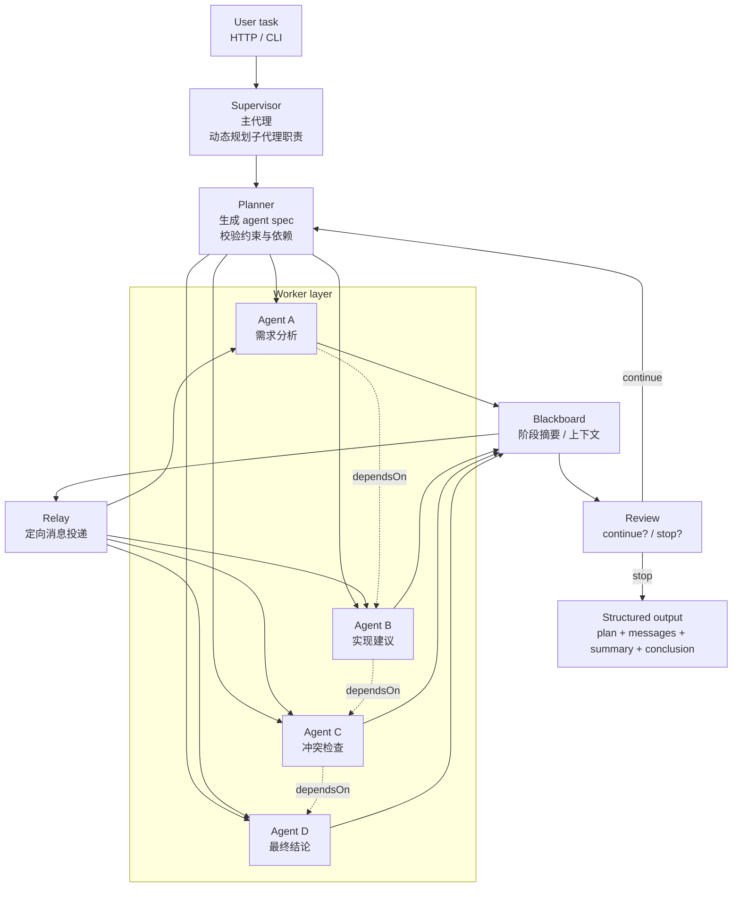

# 高效 Sub Agent 系统设计实践

## 前言

这篇文章记录的是一次很典型的 AI 协作实践：

- 先接上本地 Ollama
- 再搭一个 Node.js 的多智能体 demo
- 逐步把它从“能跑”收敛成“能协作、能迭代、能交付”
- 最后把架构和流程整理成能直接落地的规范

这个过程最有价值的部分，不是做了多少个 agent，而是弄清楚了：**主代理应该怎么规划子代理，子代理之间怎么交流，图和文档怎么一起交付**。

## 一、为什么要做 Sub Agent 系统

单个 Agent 可以解决很多问题，但一旦任务变复杂，往往会出现几个明显瓶颈：

- 一个 agent 同时管分析、实现、复核，容易信息过载
- 任务拆分不清晰时，结果会重复、发散、互相打架
- 复杂任务需要多轮迭代，但又不能无限循环
- 中间过程太多，最后很难整理成可读结果

所以更合理的方式不是“让一个 agent 干完所有事”，而是把系统拆成：

- **主代理**：负责理解任务、动态规划职责
- **子代理**：分别处理不同环节
- **黑板**：保存阶段性结果
- **Relay**：只把必要信息定向转发
- **Review**：判断是否继续还是停止

## 二、整体设计原则

### 1. 主代理不应该写死角色

早期 demo 很容易把角色固定成“需求分析师”“实现建议师”“冲突检查器”这种形式。这样能跑，但不够灵活。

更好的方式是：

- 主代理先理解任务
- 再根据任务动态生成子代理职责
- 子代理名称、任务、依赖关系都由主代理决定
- 编排框架固定，职责内容动态变化

### 2. 子代理职责必须互补

子代理不是越多越好，而是要避免重叠。

常见的能力组合可以是：

- 分析
- 检索
- 方案
- 实现
- 验证
- 总结
- 复核
- 润色

这样拆出来的子代理才有分工价值，不会出现多个 agent 在重复说一遍同样的内容。

### 3. 依赖关系必须显式化

不是所有子代理都该并行启动。

例如：
- 实现建议依赖需求分析
- 冲突检查依赖实现建议
- 最终结论依赖前面所有结果

所以任务计划里最好显式带上 `dependsOn`，让执行顺序可控。

### 4. 交流要定向，不能全员广播

这点很重要。

如果一个子代理的结果广播给所有人，很容易让后面的 agent 被噪音淹没，最后只是在重复前面的内容。

更稳的做法是：

- 只把依赖相关的信息发给对应的 agent
- relay 消息根据接收者角色定制
- 分析类接收“补边界、补约束”
- 实现类接收“继续落地、补实现细节”
- 总结类接收“补缺口、补结论”

### 5. Review 必须有硬停止条件

review 节点不能变成无限追问器。

判断标准可以很简单：
- 结果已经覆盖核心，就停
- 只是重复表达，没有新增信息，就停
- 真的还缺关键步骤，才继续

## 三、推荐的图结构

整个系统可以理解成下面这个流程：

这个图里最关键的不是线有多少，而是几个角色的边界：

- **Supervisor**：只负责编排
- **Planner**：只负责生成 agent spec
- **Worker layer**：只负责执行
- **Blackboard**：只负责沉淀
- **Relay**：只负责定向消息投递
- **Review**：只负责决定继续还是停止
- **Structured output**：只保留最终可读结果

## 四、实现时我踩过的坑

### 1. 把角色写死了

如果一开始就把角色写成固定的“需求分析师 / 实现建议师”，系统会显得很整齐，但不够通用。

后来改成：

- 主代理先看任务
- 再动态分配职责
- 任务不同，职责也不同

这样系统的适应性更强。

### 2. 结果广播太多

如果所有子代理都能看到所有内容，结果往往只会变成“大家都在抄同一份答案”。

所以后来我把 relay 收紧成定向投递，避免噪音扩散。

### 3. 图看起来太小

这也是一次比较明显的教训。

流程图和架构图如果太小，文档里根本看不清。后来我固定了一个渲染标准：

- 先写 Mermaid 语法
- 再用 mermaid-cli 渲染 PNG
- 画布足够大
- 本地确认清晰后再上传

### 4. 文档权限不对

另一个实际问题是：文档创建成功，不代表用户能读。

这件事后来纠正为：

- 必须用用户身份创建
- 创建后立刻回读验证
- 不能只看“创建成功”这四个字

## 五、推荐的标准流程

如果以后再做类似系统，我会按这个顺序走：

1. 先定义主代理的约束框
2. 再让主代理动态生成子代理 spec
3. 用 LangGraph 搭固定编排框架
4. 加入 blackboard、relay、review
5. 保证依赖顺序和定向消息
6. 输出只保留结构化结果
7. 画图时统一用 Mermaid，并用大尺寸渲染
8. 文档里只保留最终图，删掉所有中间草稿

## 六、对我来说最重要的结论

这次实践让我更确定了一件事：

> 高效的 Sub Agent 系统，核心不是“多少 agent”，而是“编排是否正确”。

主代理负责动态规划，子代理负责各自职责，消息只在必要的地方流动，最终结果只保留最有价值的摘要和结论。

如果把这个原则抓住了，系统就不会变成一堆看起来很热闹、实际上很混乱的 agent 拼盘。

## 七、后续可继续演进的方向

- 给 agent spec 加 schema 校验
- 把 dependsOn 真正做成执行门槛
- 给 review 加更严格的停止规则
- 增加失败重试和超时控制
- 增加持久化记忆
- 增加 Web UI 展示协作过程
- 对 Mermaid 图做统一模板化，减少重复劳动

---

这篇文章本质上是一次从“能跑的 demo”到“能稳定交付的体系”的收敛过程。真正有价值的，不只是代码，而是这些约束、流程和标准。
