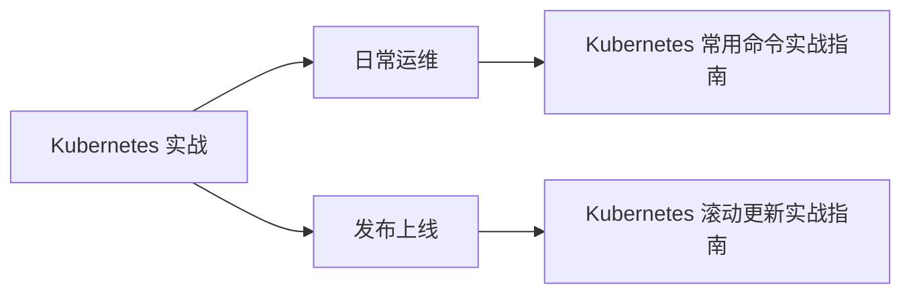

# Kubernetes 容器编排

本目录包含 Kubernetes 运维和开发相关的实战文章，重点是日常运维和发布上线。

## 快速导航

### 🚀 日常运维

- [Kubernetes 常用命令实战指南](./Kubernetes 常用命令实战指南.md)
  - kubectl 常用命令
  - Pod、Service、Deployment 调试
  - 日常故障排查

### 📦 发布上线

- [Kubernetes 滚动更新实战指南](./Kubernetes 滚动更新实战指南.md)
  - Deployment 滚动更新策略
  - 健康检查配置
  - 灰度发布与回滚

## 文章列表

| 文章 | 关键词 | 场景 |
|------|--------|------|
| [Kubernetes 常用命令实战指南](./Kubernetes 常用命令实战指南.md) | kubectl、Pod、Service、调试 | 日常运维 |
| [Kubernetes 滚动更新实战指南](./Kubernetes 滚动更新实战指南.md) | Deployment、策略、回滚、健康检查 | 发布上线 |

## 核心概念

- **Pod**：最小部署单元，包含一个或多个容器
- **Service**：为 Pod 提供稳定的网络访问入口
- **Deployment**：管理 Pod 的副本和更新策略
- **Ingress**：提供 HTTP/HTTPS 路由规则
- **ConfigMap/Secret**：配置和敏感信息管理
- **StatefulSet**：有状态应用部署
- **DaemonSet**：在每个节点上运行一个 Pod

## 学习路径

1. **基础概念**：理解 Pod、Service、Deployment 的关系
2. **常用命令**：掌握 kubectl 快速排查问题
3. **发布策略**：理解滚动更新、蓝绿部署、金丝雀发布
4. **高级特性**：资源调度、自动伸缩、服务网格

## 推荐资源

- [Kubernetes 官方文档](https://kubernetes.io/zh-cn/docs/)
- [Kubernetes Patterns](https://www.oreilly.com/library/view/kubernetes-patterns/9781492050278/)
- [Kubernetes 最佳实践](https://kubernetes.io/zh-cn/docs/concepts/configuration/overview/)
