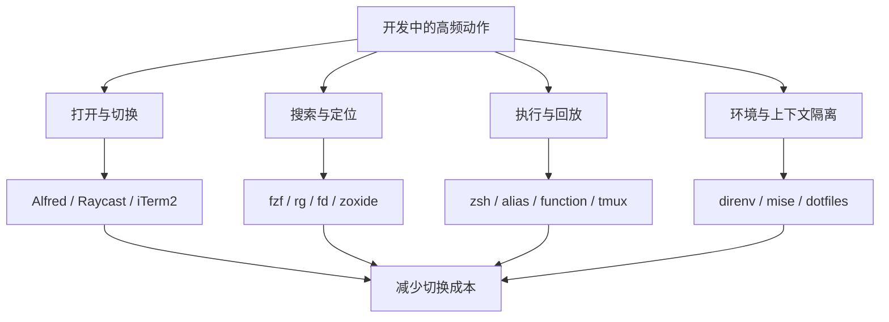

# Mac 开发者的效率工具箱

> 发布日期：2026-01-10
> 最后更新：2026-03-12
> 说明：本文不追求“工具越多越好”，而是聚焦高频操作、长期可维护和安全边界清晰的工作流。

## 先说结论

Mac 上的开发效率，不是靠装很多软件堆出来的，而是靠把高频动作系统化。真正值得投入时间优化的，通常只有四类事情：

- 打开和切换
- 搜索和定位
- 执行和回放
- 环境和上下文隔离

如果一套工具链不能持续减少这四类成本，它大概率只是“看起来很强”。



## 我判断工具值不值得留下的标准

我现在保留工具很克制，标准只有三个：

1. 高频：每天都会用，或者一周内会反复用
2. 可复用：能迁移到下一台机器，最好能配置化
3. 可控：不会把密码、路径、环境变量和习惯绑死在某个 GUI 里

这个标准会直接过滤掉很多“演示效果很好，但长期维护很重”的工具。

## 最值得优先打磨的 5 个环节

### 1. 启动器和剪贴板

如果你经常需要在应用、文件、代码片段和命令之间切换，启动器是最先该优化的。

我通常会在 Alfred 和 Raycast 之间二选一：

| 工具 | 优势 | 适合谁 |
|------|------|--------|
| Alfred | 工作流生态成熟，剪贴板和搜索体验稳定 | 已经深度定制工作流的人 |
| Raycast | 开箱即用更强，免费能力更多，扩展生态活跃 | 想快速完成整体替代的人 |

核心用途很简单：

- 全局启动应用
- 搜索文件
- 调历史剪贴板
- 执行固定工作流

这类工具的价值不在“功能多”，而在于把鼠标找入口的时间，压缩成一组肌肉记忆。

### 2. 终端本体

我更关心终端是否满足下面几个条件，而不只是主题是否好看：

- 分屏稳定
- 搜索历史输出方便
- 快速打开新会话
- 对 SSH、tmux、Unicode 和大输出更稳

iTerm2 仍然是一个稳妥选择。如果你更倾向系统自带，也可以直接用 Terminal + tmux，关键不是品牌，而是工作流是否顺手。

### 3. Shell 配置

真正能持续提效的不是主题，而是 Shell 组织方式。我的建议是：

- 主题简单即可，别让 prompt 占满一整行
- 插件控制在少量高价值项
- 别名、函数、环境变量拆文件管理
- 尽量让新机器一小时内恢复工作环境

一个可维护的 `~/.zshrc`，长期价值比花哨主题高得多。

### 4. 搜索和跳转

命令行最耗时间的不是“不会写命令”，而是“知道东西在那，但找不到”。

我会优先装这几类工具：

- `fzf`：搜索历史命令、目录、文件名
- `zoxide` 或 `z`：按使用频率跳目录
- `rg`：搜索代码和文本
- `fd`：更快地找文件
- `bat`：更友好地预览文件

这几类工具组合起来，能显著减少目录切换和全局搜索成本。

### 5. 环境隔离

很多效率问题看起来像“命令太难记”，本质上是环境太乱。

我现在更重视下面这些能力：

- 不同项目自动切换环境变量
- 不同语言版本自动切换
- 本地私钥、Token、证书不硬编码进 alias

这方面 `direnv`、`mise` 或 `asdf` 这类工具，比继续堆 alias 更值得投入。

## 一个更稳的终端工具组合

如果你不想一开始就折腾太多，我建议从下面这组最小集合开始：

| 类别 | 推荐 | 作用 |
|------|------|------|
| 包管理 | Homebrew | 安装 CLI 和 GUI |
| 终端 | iTerm2 或 Terminal + tmux | 统一命令行工作区 |
| Shell | zsh + 少量插件 | 管理别名、补全、函数 |
| 搜索 | fzf + rg + fd | 历史命令和文件定位 |
| 跳转 | zoxide | 快速进入高频目录 |
| 环境 | direnv | 项目级环境变量隔离 |

这套组合的特点是：每个工具都解决一个明确问题，而且替换成本低。

## 别名不是越多越好

很多人提效的第一反应是“多配一点 alias”。这能带来收益，但也最容易失控。

我更推荐把 alias 控制在三类：

### 1. 真正高频且无副作用的缩写

```bash
alias gs='git status -sb'
alias ga='git add'
alias gc='git commit'
alias gp='git push'
alias k='kubectl'
alias dps='docker ps'
```

这类缩写价值高，因为它们只是缩短输入，不改变行为。

### 2. 带上下文的安全函数

相比把复杂逻辑塞进 alias，我更倾向写 shell function：

```bash
gco_pull() {
  git rev-parse --is-inside-work-tree >/dev/null 2>&1 || {
    echo "not in a git repository"
    return 1
  }

  git switch "$1" && git pull --ff-only
}
```

原因很简单：函数更容易读，也更容易加参数校验。

### 3. 项目导航

```bash
alias proj='cd ~/Projects'
alias svc_user='cd ~/Projects/cloud-user'
alias svc_order='cd ~/Projects/cloud-order'
```

这类别名的价值在于稳定，而不是炫技。

## 我已经不建议这样做

这次重写时，我把一些以前文章里“能用但不稳”的做法收掉了。主要有三类：

### 1. 不要在 alias 里写密码

像 `sshpass -p "password"` 这种写法，短期省事，长期非常危险。正确做法应该是：

- 用 SSH Key
- 用跳板机或堡垒机
- 把敏感信息交给系统钥匙串或专用密钥管理

### 2. 不要把生产环境动作包装得过于轻率

像 `alias prod="ssh ..."`、`alias master="git checkout master && git pull"` 这类命令，输入确实短了，但也更容易误触。生产相关操作更适合保留一点“摩擦力”。

### 3. 不要把一切都做成 alias

只要逻辑里开始出现参数判断、分支处理、错误提示，就该从 alias 升级成函数或脚本。

## 一个可维护的 `~/.zshrc` 组织方式

我更推荐把 Shell 配置拆成几层，而不是把所有内容堆在一个文件里。

```bash
# ~/.zshrc
export ZDOTDIR="$HOME"

source ~/.config/shell/base.sh
source ~/.config/shell/aliases.sh
source ~/.config/shell/functions.sh
source ~/.config/shell/work.sh
```

例如：

```bash
# ~/.config/shell/base.sh
export EDITOR='code --wait'
export HOMEBREW_NO_AUTO_UPDATE=1

eval "$(zoxide init zsh)"
eval "$(direnv hook zsh)"
```

```bash
# ~/.config/shell/aliases.sh
alias gs='git status -sb'
alias gl='git pull --ff-only'
alias k='kubectl'
alias v='nvim'
```

这种方式的好处是：

- 更容易定位问题
- 更适合按主题维护
- 更方便同步到 dotfiles 仓库

## 进阶建议

### 1. 让搜索成为默认动作

与其记住一堆长路径，不如把搜索变成默认习惯：

- `Ctrl + R` 用 `fzf` 搜索历史命令
- `rg keyword` 搜全文
- `fd name` 找文件
- `z keyword` 跳目录

很多“操作慢”的根源，不是执行慢，而是定位慢。

### 2. 用 `direnv` 管项目变量

这是我现在很看重的一点。与其在全局 shell 里塞一堆环境变量，不如让项目目录自动加载：

```bash
# .envrc
export APP_ENV=dev
export AWS_PROFILE=my-project
layout python python3
```

这样切项目时，环境也跟着切，错误率会低很多。

### 3. 用 dotfiles 管配置

如果你已经有一套稳定终端工作流，最好尽快把配置放进一个单独仓库：

- `~/.zshrc`
- `~/.gitconfig`
- `~/.config/*`
- iTerm2 或 Terminal 的关键配置说明

这样换机器、重装系统、同步工作环境时会轻松很多。

## 快速起步清单

如果你想在一小时内把 Mac 开发环境提升到“明显顺手”的程度，我建议按这个顺序来：

1. 装 Homebrew
2. 装 `iTerm2`、`fzf`、`rg`、`fd`、`zoxide`
3. 把 `git`、`kubectl`、`docker` 的高频命令做少量缩写
4. 加上 `direnv`
5. 把 shell 配置拆文件并放进 dotfiles 仓库

## 总结

Mac 开发提效这件事，最怕两个极端：一个是什么都不配，另一个是什么都想配。真正有效的做法，是围绕自己的高频动作做最小但持续的优化。

如果只能给一个原则，那就是：**优先优化你每天都会重复做的事情，并且优先选择可迁移、可维护、可审计的工具和配置。**

**相关资源**
- [Homebrew](https://brew.sh/)
- [iTerm2](https://iterm2.com/)
- [Alfred](https://www.alfredapp.com/)
- [Raycast](https://www.raycast.com/)
- [fzf](https://github.com/junegunn/fzf)
- [ripgrep](https://github.com/BurntSushi/ripgrep)
- [zoxide](https://github.com/ajeetdsouza/zoxide)
- [direnv](https://direnv.net/)
