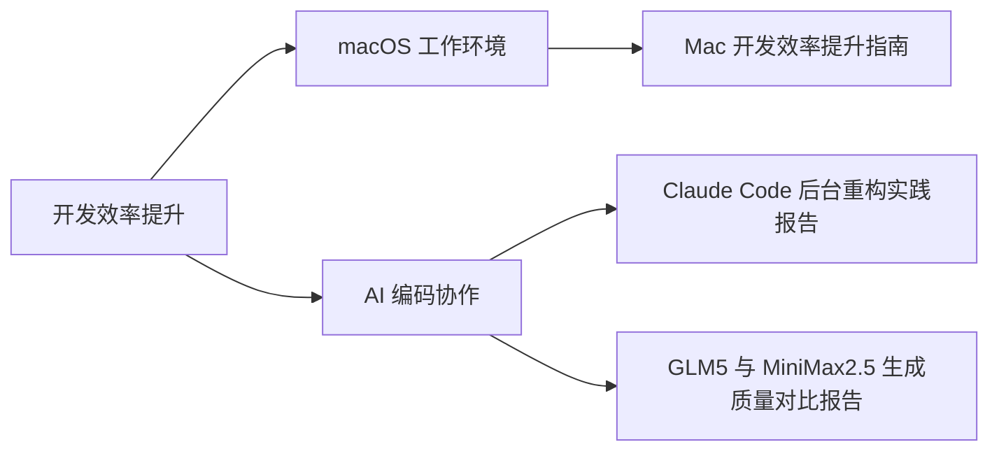

# 开发工具与效率

本目录包含开发工具、效率提升相关的文章，重点是如何通过工具和流程优化来提升开发效率。

## 快速导航

### 🖥️ macOS 开发环境

- [Mac 开发效率提升指南](./Mac 开发效率提升指南.md)
  - Alfred、iTerm2、Zsh 配置
  - 快捷键、别名、自动补全
  - 分屏操作与快速导航

### 🤖 AI 辅助编程

- [Claude Code 后台重构实践报告](../AI/Claude Code 后台重构实践报告.md)
  - AI 辅助代码重构的实战经验
  - 成本优化与效率提升
  - 团队协作最佳实践
- [GLM5 与 MiniMax2.5 生成质量对比报告](../AI/GLM5 与 MiniMax2.5 生成质量对比报告.md)
  - 同一提示词下 proposal / design / tasks / spec 产出质量对比
  - Stripe 套餐升降级方案双模型实测与落地建议

## 文章列表

| 文章 | 关键词 | 适用人群 |
|------|--------|----------|
| [Mac 开发效率提升指南](./Mac 开发效率提升指南.md) | Alfred、iTerm2、Alias、Zsh | macOS 开发者 |
| [Claude Code 后台重构实践报告](../AI/Claude Code 后台重构实践报告.md) | AI辅助编程、代码重构、效率提升、成本优化 | 团队技术负责人、后端开发者 |
| [GLM5 与 MiniMax2.5 生成质量对比报告](../AI/GLM5 与 MiniMax2.5 生成质量对比报告.md) | GLM-5、MiniMax、生成质量、Stripe、OpenSpec | 关注 AI 方案产出的架构师、产品/研发 |

## 核心理念

效率提升的本质是：

1. **减少重复输入**：别名、快捷键、自动补全
2. **减少记忆负担**：工具化常用操作
3. **减少切换成本**：快速导航、分屏操作
4. **减少等待时间**：并行、缓存、预加载

## 推荐工具

### macOS

| 工具 | 用途 | 推荐指数 |
|------|------|---------|
| Alfred | 剪切板管理、快速启动 | ⭐⭐⭐⭐⭐ |
| iTerm2 | 终端增强、分屏 | ⭐⭐⭐⭐⭐ |
| Bob | 快捷翻译 | ⭐⭐⭐⭐ |
| Raycast | Alfred 替代品（免费） | ⭐⭐⭐⭐ |

### 终端工具

| 工具 | 用途 | 推荐指数 |
|------|------|---------|
| Oh My Zsh | Zsh 配置框架 | ⭐⭐⭐⭐⭐ |
| fzf | 模糊搜索 | ⭐⭐⭐⭐⭐ |
| z | 智能目录跳转 | ⭐⭐⭐⭐ |
| tldr | 命令速查 | ⭐⭐⭐⭐ |

### 通用工具

| 工具 | 用途 | 推荐指数 |
|------|------|---------|
| VS Code | 代码编辑器 | ⭐⭐⭐⭐⭐ |
| Claude Code | AI 辅助编程 | ⭐⭐⭐⭐⭐ |
| Docker Desktop | 容器管理 | ⭐⭐⭐⭐ |
| Postman / Insomnia | API 调试 | ⭐⭐⭐⭐ |
| DBeaver | 数据库管理 | ⭐⭐⭐⭐ |

## 效率提升的关键

- **自动化**：脚本化重复操作
- **集成**：工具链的无缝协作
- **学习曲线**：投入学习成本换取长期收益
- **持续优化**：定期审视和改进工作流
