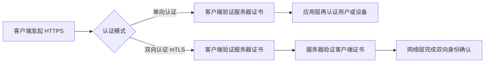

# HTTPS 单向认证与双向认证详解

> 从信任模型到工程实践，理解 HTTPS 认证机制的本质差异

## 认证模式对比



### 单向认证（常见模式）

**信任关系**：
```
客户端 → 验证 → 服务器身份
服务器 ← 其他方式认证 ← 客户端（用户名密码、JWT等）
```

**握手流程**：
```
Client                    Server
------                    ------
ClientHello          →
                     ←    ServerHello
                     ←    Certificate
                     ←    ServerKeyExchange
                     ←    ServerHelloDone
ClientKeyExchange    →
ChangeCipherSpec     →
Finished             →
                     ←    ChangeCipherSpec
                     ←    Finished
Application Data     ↔    Application Data
```

### 双向认证（mTLS）

**信任关系**：
```
客户端 ↔ 相互验证证书 ↔ 服务器
```

**握手流程**：
```
Client                    Server
------                    ------
ClientHello          →
                     ←    ServerHello
                     ←    Certificate
                     ←    ServerKeyExchange
                     ←    CertificateRequest  # 要求客户端证书
                     ←    ServerHelloDone
Certificate          →    # 客户端发送证书
ClientKeyExchange    →
CertificateVerify    →    # 客户端证明私钥所有权
ChangeCipherSpec     →
Finished             →
                     ←    ChangeCipherSpec
                     ←    Finished
Application Data     ↔    Application Data
```

## 应用场景分析

### 单向认证适用场景

**Web 网站**：
- 用户访问银行网站
- 电商平台购物
- 社交媒体应用

**API 服务**：
- 移动应用调用后端 API
- 第三方服务集成
- 公开数据接口

**特点**：
- 客户端验证服务器身份
- 服务器通过应用层认证客户端
- 证书管理简单，用户体验好

### 双向认证适用场景

**企业内网**：
- 微服务间通信
- 内部系统集成
- 管理后台访问

**高安全场景**：
- 金融交易系统
- 政府机密网络
- 医疗数据传输

**IoT 设备**：
- 设备与云平台通信
- 工业控制系统
- 智能家居网关

**特点**：
- 双方都需要证书
- 网络层强认证
- 零信任架构基础

## 证书管理对比

### 单向认证证书管理

**服务器端**：
```bash
# 生成私钥
openssl genrsa -out server.key 2048

# 生成证书请求
openssl req -new -key server.key -out server.csr

# 获得 CA 签名证书
# 或使用 Let's Encrypt
certbot certonly --webroot -w /var/www/html -d example.com
```

**客户端**：
- 内置根证书存储
- 自动验证证书链
- 无需额外配置

### 双向认证证书管理

**服务器端**：
```bash
# 除了服务器证书，还需要配置客户端 CA
ssl_client_certificate /path/to/client-ca.crt;
ssl_verify_client on;
```

**客户端**：
```bash
# 生成客户端证书
openssl genrsa -out client.key 2048
openssl req -new -key client.key -out client.csr
# CA 签名后得到 client.crt

# 使用客户端证书连接
curl --cert client.crt --key client.key https://api.example.com
```

**证书分发挑战**：
- 每个客户端需要唯一证书
- 证书更新和吊销复杂
- 密钥安全存储要求高

## 配置示例

### Nginx 单向认证配置

```nginx
server {
    listen 443 ssl;
    server_name example.com;
    
    # 服务器证书
    ssl_certificate /path/to/server.crt;
    ssl_certificate_key /path/to/server.key;
    
    # 安全配置
    ssl_protocols TLSv1.2 TLSv1.3;
    ssl_ciphers ECDHE+AESGCM:ECDHE+CHACHA20:!aNULL;
    ssl_prefer_server_ciphers off;
    
    # HSTS
    add_header Strict-Transport-Security "max-age=31536000" always;
    
    location / {
        # 应用层认证
        auth_request /auth;
        proxy_pass http://backend;
    }
}
```

### Nginx 双向认证配置

```nginx
server {
    listen 443 ssl;
    server_name api.example.com;
    
    # 服务器证书
    ssl_certificate /path/to/server.crt;
    ssl_certificate_key /path/to/server.key;
    
    # 客户端证书验证
    ssl_client_certificate /path/to/client-ca.crt;
    ssl_verify_client on;
    ssl_verify_depth 2;
    
    # 可选：证书吊销列表
    ssl_crl /path/to/crl.pem;
    
    location / {
        # 传递客户端证书信息给后端
        proxy_set_header X-SSL-Client-Cert $ssl_client_cert;
        proxy_set_header X-SSL-Client-DN $ssl_client_s_dn;
        proxy_pass http://backend;
    }
}
```

## 安全考量

### 单向认证安全要点

**证书验证**：
- 检查证书链完整性
- 验证域名匹配
- 检查证书有效期
- OCSP 状态检查

**防护措施**：
- Certificate Pinning
- HSTS 强制 HTTPS
- 应用层认证加强

### 双向认证安全要点

**客户端证书安全**：
- 私钥安全存储（HSM、TPM）
- 证书定期轮换
- 吊销机制完善

**访问控制**：
- 基于证书 DN 的授权
- 证书属性映射
- 细粒度权限控制

## 性能影响

### 握手性能对比

| 认证模式 | 握手往返 | CPU 开销 | 内存使用 | 网络延迟 |
|---------|---------|---------|---------|---------|
| 单向认证 | 2-RTT | 低 | 低 | 较低 |
| 双向认证 | 2-RTT | 中等 | 中等 | 稍高 |

### 优化策略

**会话复用**：
```nginx
# Session Ticket
ssl_session_tickets on;
ssl_session_timeout 1d;

# Session Cache
ssl_session_cache shared:SSL:50m;
```

**连接复用**：
- HTTP/2 多路复用
- Keep-Alive 长连接
- 连接池管理

## 故障排查

### 常见问题

**单向认证问题**：
```bash
# 证书链不完整
curl -I https://example.com
# 检查中间证书

# 域名不匹配
openssl s_client -connect example.com:443 -servername example.com
```

**双向认证问题**：
```bash
# 客户端证书验证失败
curl -v --cert client.crt --key client.key https://api.example.com

# 检查客户端 CA 配置
openssl verify -CAfile client-ca.crt client.crt
```

### 调试工具

```bash
# SSL Labs 测试
# https://www.ssllabs.com/ssltest/

# OpenSSL 调试
openssl s_client -connect example.com:443 -debug -msg

# 证书信息查看
openssl x509 -in cert.pem -text -noout
```

## 选择建议

### 何时使用单向认证

- **公开服务**：面向互联网用户
- **用户体验优先**：减少配置复杂度
- **大规模部署**：客户端数量庞大
- **应用层认证充分**：OAuth、JWT 等

### 何时使用双向认证

- **内部系统**：企业网络内部
- **高安全要求**：金融、医疗、政府
- **零信任架构**：网络层强认证
- **设备认证**：IoT、API 网关

### 混合方案

```nginx
# 根据路径选择认证模式
location /public/ {
    # 单向认证
    ssl_verify_client off;
}

location /admin/ {
    # 双向认证
    ssl_verify_client on;
}
```

## 总结

**单向认证**：
- 适用于大多数 Web 应用
- 配置简单，用户体验好
- 依赖应用层认证补充

**双向认证**：
- 适用于高安全场景
- 网络层强认证
- 证书管理复杂度高

选择认证模式需要平衡安全性、可用性和管理复杂度。现代应用趋向于在网关层实现双向认证，内部服务间使用服务网格的 mTLS 自动管理。
