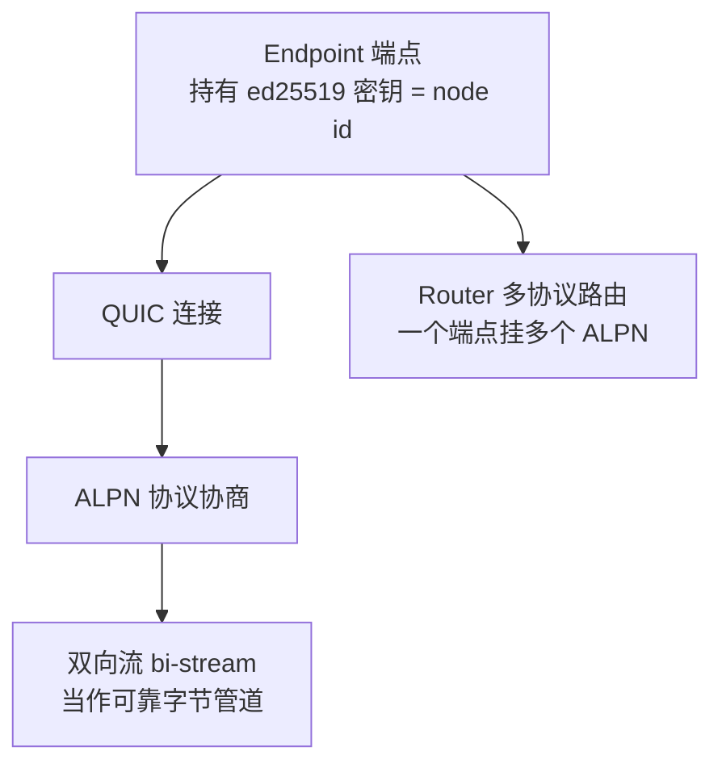
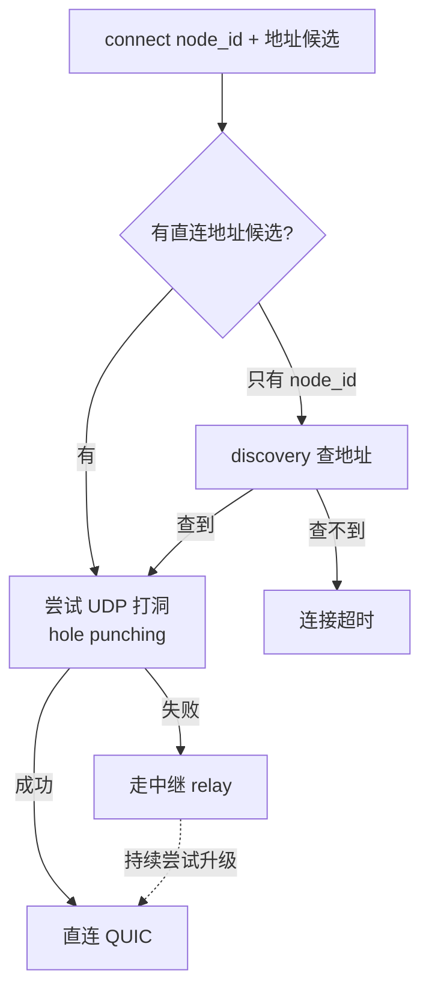
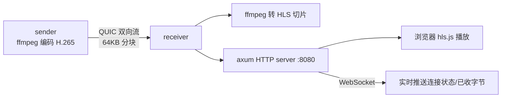

# Iroh P2P 原理与应用

## 前言

P2P（点对点）网络听起来简单——两台机器直接连上、传数据，不经过中心服务器。但真正做过的人都知道，难点全在"直接连上"这四个字：

- 两端都在 NAT 后面，各自只有内网 IP，互相看不见
- 就算打洞成功，IP 和端口随时可能变
- 有的网络环境根本打不通，必须有个中继兜底
- 还要有身份认证，不能随便谁都能连

[iroh](https://github.com/n0-computer/iroh) 是 n0-computer 团队用 Rust 写的一个 P2P 网络库，它把上面这些脏活累活都封装了。核心思路是：**节点之间靠 node id（一个公钥身份）寻址，而不是 IP。** 你只要知道对方的 node id，iroh 负责想办法把连接建起来——能直连就直连，不能就走中继。

本文以官方的 `iroh-ping` 示例项目为起点，讲清 iroh 1.0 的协议模型，再记录我在它上面自己扩展的三个 demo：基于 PIN 的会合、文件传输、H.265 视频流。这三个 demo 恰好揭示了 P2P 工程里一个反复出现的核心矛盾。

## 一、iroh 的核心抽象

iroh 1.0 的心智模型可以压缩成四个概念：



**1. Endpoint（端点）** — 每个节点是一个 Endpoint，它持有一对 ed25519 密钥。**公钥就是这个节点的 node id / 身份。** 这一点非常关键：身份不是分配来的，而是密钥自带的。

**2. QUIC 连接** — iroh 底层跑在 QUIC 上（基于 UDP，自带多路复用、加密、连接迁移）。NAT 穿透、中继回退都是在这一层做掉的，上层无感。

为什么是 QUIC 而不是 TCP？对 P2P 场景，QUIC 有几个 TCP 给不了的性质：

| 性质 | TCP | QUIC | 对 P2P 的意义 |
|------|-----|------|--------------|
| 传输层 | 内核，需 SYN 握手 | UDP 之上，用户态 | NAT 打洞只能靠 UDP，TCP 打洞极难 |
| 多路复用 | 单流，队头阻塞 | 多流独立，互不阻塞 | 一条连接上并行跑控制流 + 数据流 |
| 加密 | 要额外叠 TLS | 强制内建 TLS 1.3 | 身份和加密天然一体 |
| 连接标识 | 四元组（IP+端口） | Connection ID | IP 变了连接不断——正是 NAT 场景的刚需 |

最后一条尤其关键：TCP 连接由「源 IP+源端口+目的 IP+目的端口」四元组唯一确定，**只要 NAT 映射一变（超时重绑、切网），连接就断**。QUIC 用一个独立的 Connection ID 标识连接，底层地址可以随时迁移而上层连接不断——这正是移动设备在 4G/WiFi 间切换、NAT 映射频繁变动时最需要的能力。iroh 的「连接迁移」和「中继↔直连热切换」都建立在这个性质上。

**3. ALPN 协议协商** — ALPN（Application-Layer Protocol Negotiation）是 QUIC 握手时交换的一个协议标识字符串。**两端的 ALPN 必须完全一致，否则连接直接中止。** iroh-ping 的 ALPN 就是一个字节串：

```rust
pub const ALPN: &[u8] = b"iroh/ping/0";
```

ALPN 是 iroh 上"多协议共存"的基础——同一个 Endpoint 上，每个自定义协议占一个 ALPN，互不干扰。

**4. 双向流（bidirectional stream）** — 连接建好后，开一条双向 QUIC 流，就得到一对 `send` / `recv`，你可以把它当成一个**可靠、有序、加密的字节管道**来用。所有上层协议都是在这根管道上收发字节。

### 连接是怎么建起来的：打洞、中继、发现

上面说 iroh 把「想办法连上」封装了，这句话背后其实是三套机制在协作，值得拆开看——因为它直接决定了后面 PIN demo 为什么会翻车。



**① 打洞（hole punching）**：两端都在 NAT 后面时，各自主动向对方的公网映射地址发 UDP 包，「凿穿」各自 NAT 上的临时端口映射。iroh 借助中继服务器交换双方观察到的公网地址（类似 STUN 的作用），再同时对发，制造出「双向有来有回」的假象让 NAT 放行。这对 Full Cone / Restricted Cone 类 NAT 成功率高，但对 Symmetric NAT（每个目标分配不同端口）几乎打不通——这也是所有 P2P 方案的共同天花板。

**② 中继（relay）**：打洞失败时，流量走 n0 的中继服务器转发（`presets::N0` 里配的就是它）。中继只转发加密字节，看不到内容（端到端加密在 QUIC 层）。**中继保证了「一定连得上」，代价是多一跳延迟和带宽成本。** iroh 的策略是「先用中继把连接跑起来，同时在后台继续尝试打洞，一旦直连成功就热切换过去」——用户全程无感，这正是前面 QUIC 连接迁移能力的用武之地。

**③ 发现（discovery）**：`connect` 需要知道对方的地址候选。地址从哪来？iroh 支持几种发现方式：

| 发现方式 | 原理 | 适用场景 |
|---------|------|---------|
| 带外交换 ticket | 手动把完整地址复制给对方 | 最可靠，但要有个带外通道 |
| DNS discovery | 向 n0 的 DNS 服务发布/查询 node id → 地址 | 公网默认方式 |
| Pkarr (DHT) | 把地址记录签名后发布到 Mainline DHT | 去中心化，无需信任 n0 |
| mDNS (本地) | 局域网内组播发现 | 同一 WiFi 下自动发现 |

**记住这个三层结构**：discovery 负责「node id → 在哪」，打洞/中继负责「知道在哪之后怎么连上」。下一节 PIN demo 的翻车，本质就是只解决了 node id、却指望 discovery 凭空把地址变出来。

## 二、PING/PONG：最小协议长什么样

iroh-ping 实现的就是一个最小的请求-响应协议：客户端发 `PING`，服务端回 `PONG`，测个往返时延。它用来演示 iroh 的 `ProtocolHandler` trait。

**服务端**：在自己的 struct 上实现 `ProtocolHandler::accept`，返回的 future 会跑在一个新 spawn 的 tokio task 上，生命周期跟着连接走：

```rust
impl ProtocolHandler for Ping {
    async fn accept(&self, connection: Connection) -> Result<(), AcceptError> {
        let node_id = connection.remote_id();               // 拿到对端 node id
        let (mut send, mut recv) = connection.accept_bi().await?;  // 接受一条双向流
        let req = recv.read_to_end(4).await?;               // 读 4 字节
        assert_eq!(&req, b"PING");
        send.write_all(b"PONG").await?;                     // 回 PONG
        send.finish()?;                                     // 声明不再发送
        connection.closed().await;                          // 等对端收完
        Ok(())
    }
}
```

**客户端**：连上、开流、发 PING、读 PONG、计时：

```rust
pub async fn ping(&self, endpoint: &Endpoint, addr: EndpointAddr) -> Result<Duration> {
    let conn = endpoint.connect(addr, ALPN).await?;
    let (mut send, mut recv) = conn.open_bi().await?;
    let start = Instant::now();
    send.write_all(b"PING").await?;
    send.finish()?;
    let response = recv.read_to_end(4).await?;
    assert_eq!(&response, b"PONG");
    let rtt = start.elapsed();
    conn.close(0u32.into(), b"bye!");                       // 主动关整条连接
    Ok(rtt)
}
```

**组装**：用 `Router` 把 ALPN 和 handler 绑起来，一个端点可以 `.accept()` 多个协议：

```rust
let endpoint = Endpoint::bind(presets::N0).await?;   // presets::N0 = 用 n0 官方中继预设
endpoint.online().await;                             // 等到公网可达
let router = Router::builder(endpoint)
    .accept(ALPN, Ping::new())
    .spawn();
let addr = router.endpoint().addr();                 // 拿到自己的地址，分享给对端
```

注意两个细节：`Endpoint::bind(presets::N0)` 里的 `presets::N0` 是 n0 提供的默认中继（relay）配置——中继服务器就是打洞失败时的兜底通道；`endpoint.online().await` 会一直等到这个端点在公网可达（拿到了中继地址或公网映射）才返回。

## 三、Ticket：怎么把"我在哪"告诉对方

PING 能跑通的前提是：客户端已经有了服务端的 `EndpointAddr`。这个地址怎么传给对方？iroh 的做法是 **ticket**——把地址编码成一个可打印的字符串，带外交换（比如复制粘贴、扫码）：

```rust
// 接收端：生成 ticket
let ticket = EndpointTicket::new(endpoint.addr());
println!("{ticket}");    // 打印出来，发给对方

// 发送端：解析 ticket 再连
let ticket = EndpointTicket::decode_string(&s)?;
let addr = ticket.endpoint_addr();
endpoint.connect(addr, ALPN).await?;
```

ticket 里编码了完整的 `EndpointAddr`：**node id + 中继 URL + 直连地址候选**。有了它，对端才知道该往哪里发起连接。记住这个"完整地址"的概念，下一节的矛盾就是从这里长出来的。

## 四、核心矛盾：知道"是谁" ≠ 知道"在哪"

我在 iroh-ping 上扩展的第一个 demo 是**基于 PIN 码的文件共享**。设想很美好：两端不用交换那一长串 ticket，只要约定同一个 6 位 PIN（像 AirDrop 那样），就能连上。

思路是利用 iroh 的身份模型——既然 **node id 就是 ed25519 公钥**，那我从 PIN 确定性地派生出一把密钥，两端用同一个 PIN 就会得到同一个 node id：

```rust
fn derive_key_from_pin(pin: &str) -> Result<SecretKey> {
    if !pin.chars().all(|c| c.is_ascii_digit()) {
        bail!("PIN must contain only digits");
    }
    let mut hasher = Sha256::new();
    hasher.update(b"iroh-file-share-pin:");   // 加盐前缀，防跨用途碰撞
    hasher.update(pin.as_bytes());
    let hash: [u8; 32] = hasher.finalize().into();
    Ok(SecretKey::from_bytes(&hash))          // SHA-256 输出 32 字节，正好做私钥
}
```

看起来很漂亮。但一跑就撞墙了——**在受限网络下连接超时，连不上。**

问题的根子，是 P2P 里一个必须想清楚的区别：

> **PIN 派生只解决了"知道对方是谁"（同一个 node id），完全没解决"知道对方在哪"（IP / 端口 / 中继地址）。**

回想上一节：`connect` 需要的是完整的 `EndpointAddr`，包含地址候选。而 `EndpointAddr::new(node_id)` 只有身份、没有地址：

```rust
// 只有 node id，没有任何地址信息
let addr = EndpointAddr::new(sender_node_id);
// 指望 iroh 靠中继/发现机制去"找到"这个 node id 在哪
recv_ep.connect(addr, ALPN).await?;
```

这时候连接能不能建起来，**完全依赖 iroh 的中继/发现（discovery）机制能不能定位到这个 node id**。理想网络下，发送端向中继注册过自己，接收端就能通过中继找到它。但发现机制不是 100% 可靠的——网络一受限，超时就来了。

更糟的是还有个副作用：**两个端点若用同一个 node id，会在中继/DHT 上互相冲突**（谁是谁分不清）。

最后的设计是**承认这个矛盾，给它一个 fallback**：

```rust
// PIN 模式加 30s 超时，超时就提示改用完整 ticket
match tokio::time::timeout(
    Duration::from_secs(30),
    recv_ep.connect(addr, ALPN),
).await {
    Ok(Ok(conn)) => { /* PIN 会合成功 */ }
    _ => {
        eprintln!("PIN 会合超时，请改用: recv-ticket <TICKET>");
        // 退回到完整地址模式
    }
}
```

所以这个文件共享工具保留了三个子命令：`send`（PIN 派生身份并向中继注册）、`recv`（PIN 会合，理想网络下用）、`recv-ticket`（完整 ticket，可靠 fallback）。

**这个"翻车"其实是最有价值的部分。** 它把 P2P 一个抽象的原理，变成了摸得着的工程决策：身份可以凭空派生，但**可达性（reachability）必须有人告诉你，或者有一个可靠的发现服务替你查**。AirDrop 那种"输个码就连上"的体验，背后是苹果自己的一整套发现基础设施在撑——不是靠一个 PIN 就能凭空变出来的。

### 文件传输的 wire format

连接建立是难点，连上之后的文件传输反而朴素。协议就是在双向流这根字节管道上，自己定一个分帧格式（小端序）：

```
┌──────────┬─────────────────┬──────────┬──────────────────┐
│ u32      │ filename (UTF-8) │ u64      │ file bytes       │
│ name_len │ name_len 字节    │ file_len │ file_len 字节     │
└──────────┴─────────────────┴──────────┴──────────────────┘
```

发送端按这个格式写，接收端按同样的顺序读——**先读定长的长度字段，再按长度读变长内容**，这是所有二进制协议分帧的通用套路：

```rust
// 发送端
send.write_all(&(name.len() as u32).to_le_bytes()).await?;
send.write_all(name.as_bytes()).await?;
send.write_all(&(data.len() as u64).to_le_bytes()).await?;
for chunk in data.chunks(64 * 1024) {   // 64KB 一块
    send.write_all(chunk).await?;
}
send.finish()?;

// 接收端：先发 READY 握手，再按同样顺序读回来
send.write_all(b"READY").await?;
let mut len_buf = [0u8; 4];
recv.read_exact(&mut len_buf).await?;
let name_len = u32::from_le_bytes(len_buf) as usize;
// ... 读文件名、读 u64 大小、按 64KB 循环读内容
```

几个值得说的点：

- **为什么要分块（64KB）而不是一次性 `write_all` 整个文件？** 一是内存——几个 G 的文件不可能全读进内存；二是背压（backpressure）。QUIC 的流有内建流控，接收端来不及消费时，`write_all` 会在底层自然阻塞（await 挂起），发送端不会把内存撑爆。分块 + await 让背压自动生效，这是异步流式传输相比"一次性怼完"的关键好处。
- **为什么接收端先发 `READY`？** open_bi 只是开了流，但接收端可能还在准备落盘的文件句柄。一个显式握手让发送端确认对方就绪再开始灌数据，避免抢跑。
- **为什么用小端序、定长前缀？** 这是自定义二进制协议最省事的分帧方式——长度前缀明确告诉对端"接下来读多少字节"，不用找分隔符、不用转义。真做生产协议可以换成 protobuf / postcard 这类，但手写 demo 用裸字节最直观。

## 五、进阶应用：H.265 视频流 over QUIC

第二个 demo 更能体现"把 QUIC 双向流当字节管道"这个心智模型的威力：**实时视频流**。ALPN 换成 `b"iroh/video/h265/0"`，发送端把视频编码成 H.265 推给接收端，接收端在浏览器里播放。

### 编码：子进程 shell out，而不是 FFI 绑定

第一个工程决策就很实在。Rust 生态里有 `ffmpeg-next` / `ffmpeg-sys` 这类 FFI 绑定，但它们的构建依赖非常折腾（要装 ffmpeg 开发库、对齐版本）。权衡之后选了**直接用 `tokio::process::Command` 起一个 ffmpeg 子进程**，从它的 stdout 管道读编码后的字节：

```bash
ffmpeg -hide_banner -loglevel error -i <input> \
  -c:v libx265 -preset ultrafast -crf 28 -an \
  -f mp4 -frag_duration 1000000 \
  pipe:1
```

几个参数的用意：`libx265` 是 H.265 编码器；`-preset ultrafast` 牺牲压缩率换实时性；`-frag_duration` 产出 **fragmented MP4**（分片 MP4），这是能边编码边流式推送的关键——普通 MP4 的元数据在文件末尾，没法流式播放。启动前还会用 `ffprobe` 探一下输入是否有效。

**"子进程 vs FFI"这个权衡，选可靠性、选构建简单，在做工具型项目时几乎总是对的。** 少一个 native 依赖，就少一类难查的构建/链接错误。

### 播放：axum + HLS + hls.js

接收端要在浏览器里播 H.265。浏览器不能直接吃裸 QUIC 流，所以中间要转一道。选型经历了 actix-web → tiny_http → 最终落在 **axum 0.8**（已经在 tokio 生态里，不引入新运行时）。架构是：



- axum 起一个 HTTP server，托管播放页面和 HLS 切片
- 收到的 H.265 流喂给 ffmpeg 转成 HLS（`.m3u8` + `.ts` 切片）
- 前端用 `hls.js` 播放，WebSocket 实时推送"已连接 / 已收 N 字节"这类状态
- 全局状态用 `AtomicU64` 记录字节数和连接态

转 HLS 的 ffmpeg 参数直接决定延迟：

```bash
ffmpeg -i pipe:0 -c copy \
  -f hls -hls_time 1 \          # 每片 1 秒，片越短延迟越低
  -hls_list_size 3 \           # 播放列表只保留最近 3 片
  -hls_flags delete_segments \ # 滚动删除旧片，不占磁盘
  stream.m3u8
```

`hls_time` 是延迟的主旋钮：切片越短，播放端能越早拿到第一片，但请求更频繁、开销更大。`hls_list_size 3` + `delete_segments` 让它变成一个滚动窗口——只留最近几片，磁盘不会无限涨。

### 为什么是 HLS 而不是 WebRTC？

实时视频的"正统"低延迟方案是 WebRTC，延迟能做到亚秒级，而 HLS 天生有 2~5 秒的切片延迟。既然已经在浏览器里播，为什么不直接上 WebRTC？

这是一个明确的**权衡**：

| 维度 | HLS | WebRTC |
|------|-----|--------|
| 延迟 | 2~5s（切片决定） | < 500ms |
| 实现复杂度 | 低：ffmpeg 出切片 + hls.js | 高：信令、ICE、SRTP、编解码协商 |
| H.265 支持 | 切片里放什么都行 | 浏览器 WebRTC 对 H.265 支持很差 |
| 与本 demo 的契合 | 数据已经是 QUIC 流进来的 | 要再搭一套 ICE/信令，和 iroh 的连接层重复 |

关键在最后一行：**iroh 已经把「连接建立」这件事做完了**——QUIC 流就是现成的可靠传输。如果再上 WebRTC，等于在 iroh 的 P2P 连接之上，又叠一套 ICE 打洞 + 信令，两层做的是同一件事，纯属重复。而 HLS 只需要「把字节转成切片喂给 `<video>`」，和 iroh 的分工是干净的：**iroh 管怎么把字节可靠地送到，HLS 管怎么在浏览器里把字节播出来。** 这个 demo 的目的是验证「QUIC 流当视频管道」这个想法，不是做低延迟直播产品，所以选实现最简单、和现有架构最不冲突的 HLS。

**选型永远是从目标倒推的**：要亚秒级延迟做互动直播，WebRTC 值得那份复杂度；只是要在浏览器验证一条 P2P 视频管道通不通，HLS 的几秒延迟完全可以接受，省下的复杂度更值钱。

### 真实踩到的编译坑

Rust 的编译器很严，尤其项目 CI 开了 `-Dwarnings`（警告即错误），几个坑记录一下：

1. `child.stdin.take().context(...)` 报错——忘了 `use anyhow::Context`，`context` 方法挂在这个 trait 上
2. axum 0.8 的 WebSocket `Message::Text` 变了，要传 `Utf8Bytes` 而不是 `String`，得 `.into()` 一下
3. 一堆 unused import 警告——平时无所谓，但 `-Dwarnings` 下必须清干净才能编过

集成测试里还有两个典型坑：用 `sed` 批量改变量名时把 `total` 改成 `_total` 漏改了一处引用，报 `E0425: cannot find value`；`ffprobe` 输出的 codec 名带了多余换行（`hevc\nhevc`），`assert_eq!(codec.trim(), "hevc")` 失败，改成 `assert!(codec.trim().contains("hevc"))` 才稳。这些都是很琐碎但真实的工程摩擦。

## 六、几点心得

**1. node id 寻址是 iroh 最漂亮的抽象。** 身份和密钥绑定，寻址和 IP 解耦，NAT 穿透和中继回退对上层透明。你只需要关心"我要连哪个 node id"，剩下的交给库。

**2. "身份"和"可达性"是两件事，别混。** 这是 PIN demo 翻车教给我的最重要的一课。你可以凭空造出身份（派生密钥），但可达性要么有人带外告诉你（ticket），要么依赖一个可靠的发现服务。想清楚这一点，才不会设计出"理论上能连、实际连不上"的方案。

**3. QUIC 双向流是个万能字节管道。** PING/PONG、文件传输、视频流——上层协议千差万别，底层都是"在一根可靠字节管道上收发字节"。想清楚 wire format（怎么分帧、怎么标长度），协议就成型了。

**4. 工具型项目里，能用子进程就别上 FFI。** ffmpeg 子进程 vs `ffmpeg-sys` 绑定的取舍，本质是"少一个 native 依赖"换"多一次进程通信"。对可靠性的收益，通常远大于那点性能损耗。

iroh 把 P2P 最难的连接建立问题封装得很好，让人可以专注在自己的协议逻辑上。而真正做几个 demo 之后才会发现：**P2P 的难，从来不在传数据，而在两个躲在 NAT 后面的陌生人，怎么先"看见"彼此。**
