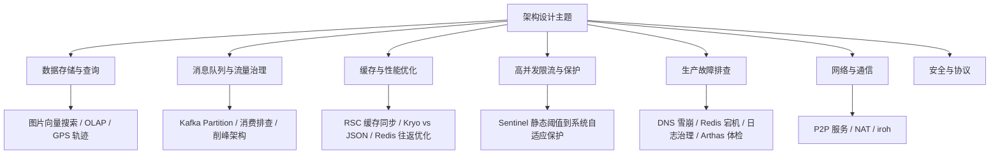

# 架构设计

本目录包含系统架构设计相关的文档和图表，重点探讨设计理念、架构模式和技术选型。随着文章数量增多，按主题拆成了二级目录，方便按话题查找。

## 快速导航

### 数据存储与查询

- [图片向量存储与相似性搜索方案](./数据存储与查询/图片向量存储与相似性搜索方案.md) - AI 时代的向量数据库选型
- [OLAP数据库选型对比](./数据存储与查询/OLAP数据库选型对比.md) - StarRocks vs ClickHouse vs InfluxDB
- [GPS 轨迹存储方案分析](./数据存储与查询/GPS 轨迹存储方案分析.md) - 地理位置数据的存储优化

### 消息队列与流量治理

- [Kafka 消费速度上不去：三个真实案例排查记](./消息队列与流量治理/Kafka 消费速度上不去排查记.md) - 分区分配错乱、rebalance 风暴、consumer 超配三个真实案例
- [Kafka Partition 规划与问题处理](./消息队列与流量治理/Kafka Partition 规划与问题处理.md) - 消息队列性能优化
- [整点半点的设备洪峰：从同步 Feign 到双 Topic 削峰架构](./消息队列与流量治理/整点半点的设备洪峰削峰架构.md) - 脉冲式流量的削峰架构演进

### 缓存与性能优化

- [高并发缓存同步 RSC方案](./缓存与性能优化/高并发缓存同步 RSC方案.md) - 百万设备状态同步架构
- [Kryo 深拷贝 vs JSON 深拷贝：用真实业务对象和火焰图说话](./缓存与性能优化/Kryo 深拷贝 vs JSON 深拷贝性能对比.md) - JMH 基准测试 + Arthas 火焰图选型
- [Redis Hash 缓存往返次数优化：从 3 次调用到 1 次](./缓存与性能优化/Redis Hash 缓存往返次数优化.md) - EXISTS+HLEN+HGETALL 合并为单次 HGETALL

### 高并发限流与保护

- [Sentinel 从 0 到 1 接入生产：范围收敛、Dashboard 运维和 7 天 QPS 基线制定](./高并发限流与保护/Sentinel从0到1接入生产实践.md)
- [Sentinel 限流从静态阈值到系统自适应保护](./高并发限流与保护/Sentinel限流从静态阈值到系统自适应保护.md)

### 生产故障排查

- [一台物理机宕机为什么能引发全局 DNS 雪崩](./生产故障排查/物理机宕机引发全局DNS雪崩.md)
- [一次"运维误操作"引发的 Redis Cluster 全局宕机：从审计日志还原真相](./生产故障排查/Redis Cluster全局宕机排查记.md)
- [一天 300GB 日志是怎么打出来的：生产环境误开 DEBUG 的治理](./生产故障排查/一天300GB日志的治理.md)
- [用 Arthas 四件套给线上 MQTT 服务做体检](./生产故障排查/Arthas四件套MQTT服务体检.md)

### 网络与通信

- [自研 P2P 服务架构设计](./网络与通信/自研 P2P 服务架构设计.md) - 10 万级并发 P2P 连接
- [NAT类型详解](./网络与通信/NAT类型详解.md) - P2P 穿透技术实践
- [Iroh P2P 原理与应用](./网络与通信/Iroh P2P 原理与应用.md) - 用 node id 寻址的 Rust P2P 库

### 安全与协议

- [TLS加密算法深度解析](./安全与协议/TLS加密算法深度解析.md)
- [HTTPS单向认证与双向认证详解](./安全与协议/HTTPS单向认证与双向认证详解.md)

### IoT 与设备

- [物模型：IoT 设备标准化实践](./物模型：IoT 设备标准化实践.md) - 从硬件到能力的抽象设计

## 文章列表

| 文章 | 分类 | 关键词 | 亮点 |
|------|------|--------|------|
| [图片向量存储与相似性搜索方案](./数据存储与查询/图片向量存储与相似性搜索方案.md) | 数据存储与查询 | Milvus、CLIP、向量数据库、相似性搜索 | AI 特征提取、颜色打标、类型分类、毫秒级搜索 |
| [OLAP数据库选型对比](./数据存储与查询/OLAP数据库选型对比.md) | 数据存储与查询 | StarRocks、ClickHouse、InfluxDB | 三大数据库架构、性能、场景全面对比 |
| [GPS 轨迹存储方案分析](./数据存储与查询/GPS 轨迹存储方案分析.md) | 数据存储与查询 | PostGIS、MongoDB、时序数据库 | 从数据结构到存储选型的完整方案 |
| [Kafka 消费速度上不去：三个真实案例排查记](./消息队列与流量治理/Kafka 消费速度上不去排查记.md) | 消息队列与流量治理 | Kafka、Consumer、Rebalance、Lag | 分区分配错乱、rebalance 风暴、consumer 超配三案例排查 |
| [Kafka Partition 规划与问题处理](./消息队列与流量治理/Kafka Partition 规划与问题处理.md) | 消息队列与流量治理 | Kafka、Partition、Consumer、性能优化 | Partition 数量规划、消费延迟、Rebalance 问题处理 |
| [整点半点的设备洪峰：从同步 Feign 到双 Topic 削峰架构](./消息队列与流量治理/整点半点的设备洪峰削峰架构.md) | 消息队列与流量治理 | 削峰、Kafka、Feign、双 Topic | 脉冲式流量整形，网关错误率从 15% 降到 0.1% |
| [高并发缓存同步 RSC方案](./缓存与性能优化/高并发缓存同步 RSC方案.md) | 缓存与性能优化 | Redis、Kafka、MongoDB、Survivor | 百万设备状态同步，数据库负载降 90% |
| [Kryo 深拷贝 vs JSON 深拷贝：用真实业务对象和火焰图说话](./缓存与性能优化/Kryo 深拷贝 vs JSON 深拷贝性能对比.md) | 缓存与性能优化 | Kryo、JSON、JMH、Arthas 火焰图 | 真实业务对象基准测试，选型判断标准 |
| [Redis Hash 缓存往返次数优化：从 3 次调用到 1 次](./缓存与性能优化/Redis Hash 缓存往返次数优化.md) | 缓存与性能优化 | Redis、Hash、RTT、Redisson | 网络往返从 3 次降到 1 次，P99 降 57% |
| [Sentinel 从 0 到 1 接入生产](./高并发限流与保护/Sentinel从0到1接入生产实践.md) | 高并发限流与保护 | Sentinel、Dashboard、QPS 基线 | 范围收敛、Dashboard 运维、7 天基线制定方法论 |
| [Sentinel 限流从静态阈值到系统自适应保护](./高并发限流与保护/Sentinel限流从静态阈值到系统自适应保护.md) | 高并发限流与保护 | Sentinel、System Rule、Load1 | 静态阈值的盲区与系统自适应保护 |
| [一台物理机宕机为什么能引发全局 DNS 雪崩](./生产故障排查/物理机宕机引发全局DNS雪崩.md) | 生产故障排查 | K8s、CoreDNS、级联故障 | 单点故障如何放大成全局故障的链路还原 |
| [一次"运维误操作"引发的 Redis Cluster 全局宕机](./生产故障排查/Redis Cluster全局宕机排查记.md) | 生产故障排查 | Redis Cluster、CloudTrail、CLUSTERDOWN | 从审计日志还原真实操作链路 |
| [一天 300GB 日志是怎么打出来的](./生产故障排查/一天300GB日志的治理.md) | 生产故障排查 | Logback、日志治理、DEBUG | 生产环境误开 DEBUG 的定位与治理 |
| [用 Arthas 四件套给线上 MQTT 服务做体检](./生产故障排查/Arthas四件套MQTT服务体检.md) | 生产故障排查 | Arthas、CPU/内存/锁/线程 | 四件套组合诊断线上性能问题 |
| [自研 P2P 服务架构设计](./网络与通信/自研 P2P 服务架构设计.md) | 网络与通信 | Pion、STUN、TURN、MQTT 信令 | 10 万级并发 P2P 连接架构 |
| [NAT类型详解](./网络与通信/NAT类型详解.md) | 网络与通信 | NAT类型、P2P通信、STUN、TURN、ICE | 从Full Cone到Symmetric的NAT类型详解 |
| [Iroh P2P 原理与应用](./网络与通信/Iroh P2P 原理与应用.md) | 网络与通信 | iroh、QUIC、node id、ALPN、Rust | 用 node id 而非 IP 寻址的三个 demo |
| [TLS加密算法深度解析](./安全与协议/TLS加密算法深度解析.md) | 安全与协议 | TLS、密码学、握手协议 | 加密算法与握手流程深度解析 |
| [HTTPS单向认证与双向认证详解](./安全与协议/HTTPS单向认证与双向认证详解.md) | 安全与协议 | HTTPS、mTLS、证书 | 单向/双向认证的原理与配置 |
| [物模型：IoT 设备标准化实践](./物模型：IoT 设备标准化实践.md) | IoT 与设备 | 物模型、设备标准化 | 从硬件到能力的抽象设计 |

## 资源列表

| 文件 | 说明 |
|------|------|
| Auth-Service 授权机制.pdf | 微服务授权架构，OAuth2/JWT 实践 |
| BMGuardr Kubernetes架构.pdf | K8s 集群架构设计方案 |
| CI架构图.pdf | 持续集成流水线架构 |

## 架构设计原则

### 1. 高可用性
- 多副本部署，消除单点故障
- 服务降级和熔断机制
- 跨可用区/跨地域容灾

### 2. 可扩展性
- 无状态服务设计
- 水平扩展优于垂直扩展
- 微服务拆分，独立部署

### 3. 安全性
- 零信任架构
- 最小权限原则
- 端到端加密

### 4. 可观测性
- 日志：ELK/Loki
- 指标：Prometheus + Grafana
- 链路追踪：Jaeger/Zipkin

## 常用架构模式

- **微服务架构**：服务拆分、独立部署、API 网关
- **事件驱动架构**：消息队列、异步处理、最终一致性
- **CQRS**：读写分离、事件溯源
- **Sidecar 模式**：服务网格、流量管理

## 推荐资源

- [微服务设计模式](https://microservices.io/patterns/)
- [系统设计入门](https://github.com/donnemartin/system-design-primer)
