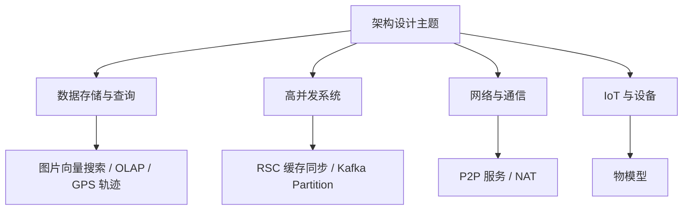

# 架构设计

本目录包含系统架构设计相关的文档和图表，重点探讨设计理念、架构模式和技术选型。

## 快速导航

### 核心文章

**数据存储与查询**
- [图片向量存储与相似性搜索方案](./图片向量存储与相似性搜索方案.md) - AI 时代的向量数据库选型
- [OLAP数据库选型对比](./OLAP数据库选型对比.md) - StarRocks vs ClickHouse vs InfluxDB
- [GPS 轨迹存储方案分析](./GPS 轨迹存储方案分析.md) - 地理位置数据的存储优化

**高并发系统**
- [高并发缓存同步 RSC方案](./高并发缓存同步 RSC方案.md) - 百万设备状态同步架构
- [Kafka Partition 规划与问题处理](./Kafka Partition 规划与问题处理.md) - 消息队列性能优化

**网络与通信**
- [自研 P2P 服务架构设计](./自研 P2P 服务架构设计.md) - 10 万级并发 P2P 连接
- [NAT类型详解](./NAT类型详解.md) - P2P 穿透技术实践

**IoT 与设备**
- [物模型：IoT 设备标准化实践](./物模型：IoT 设备标准化实践.md) - 从硬件到能力的抽象设计

## 文章列表

| 文章 | 关键词 | 亮点 |
|------|--------|------|
| [图片向量存储与相似性搜索方案](./图片向量存储与相似性搜索方案.md) | Milvus、CLIP、向量数据库、相似性搜索 | AI 特征提取、颜色打标、类型分类、毫秒级搜索 |
| [高并发缓存同步 RSC方案](./高并发缓存同步 RSC方案.md) | Redis、Kafka、MongoDB、Survivor | 百万设备状态同步，数据库负载降 90% |
| [Kafka Partition 规划与问题处理](./Kafka Partition 规划与问题处理.md) | Kafka、Partition、Consumer、性能优化 | Partition 数量规划、消费延迟、Rebalance 问题处理 |
| [GPS 轨迹存储方案分析](./GPS 轨迹存储方案分析.md) | PostGIS、MongoDB、时序数据库 | 从数据结构到存储选型的完整方案 |
| [自研 P2P 服务架构设计](./自研 P2P 服务架构设计.md) | Pion、STUN、TURN、MQTT 信令 | 10 万级并发 P2P 连接架构 |
| [OLAP数据库选型对比](./OLAP数据库选型对比.md) | StarRocks、ClickHouse、InfluxDB | 三大数据库架构、性能、场景全面对比 |
| [NAT类型详解](./NAT类型详解.md) | NAT类型、P2P通信、STUN、TURN、ICE | 从Full Cone到Symmetric的NAT类型详解，P2P穿透技术实践 |

## 资源列表

| 文件 | 说明 |
|------|------|
| Auth-Service 授权机制.pdf | 微服务授权架构，OAuth2/JWT 实践 |
| BMGuardr Kubernetes架构.pdf | K8s 集群架构设计方案 |
| CI架构图.pdf | 持续集成流水线架构 |

## 架构设计原则

### 1. 高可用性
- 多副本部署，消除单点故障
- 服务降级和熔断机制
- 跨可用区/跨地域容灾

### 2. 可扩展性
- 无状态服务设计
- 水平扩展优于垂直扩展
- 微服务拆分，独立部署

### 3. 安全性
- 零信任架构
- 最小权限原则
- 端到端加密

### 4. 可观测性
- 日志：ELK/Loki
- 指标：Prometheus + Grafana
- 链路追踪：Jaeger/Zipkin

## 常用架构模式

- **微服务架构**：服务拆分、独立部署、API 网关
- **事件驱动架构**：消息队列、异步处理、最终一致性
- **CQRS**：读写分离、事件溯源
- **Sidecar 模式**：服务网格、流量管理

## 推荐资源

- [微服务设计模式](https://microservices.io/patterns/)
- [系统设计入门](https://github.com/donnemartin/system-design-primer)
