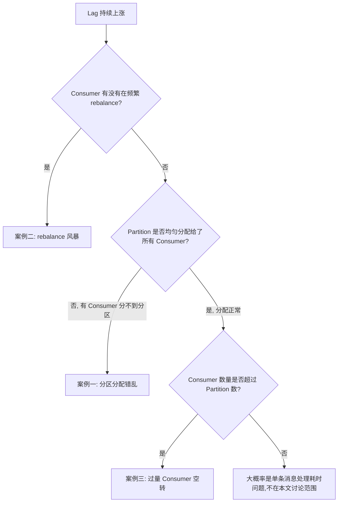
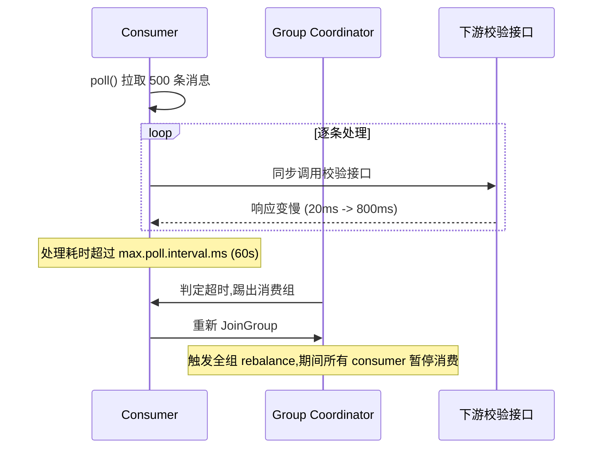
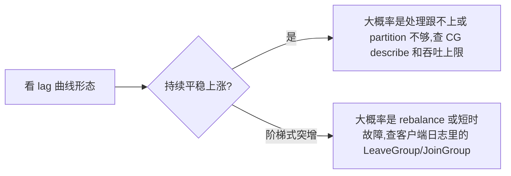

# Kafka 消费速度上不去：三个真实案例排查记

## 前言

"消费慢"是消息队列场景里最没有信息量的一句报警。Lag 涨了,但涨的原因可能是完全不同的三件事——分区没分配对、消费者在不停地重新加入组、或者消费者数量本身就超过了分区数在空转。这三种情况在监控图上看起来都是"lag 曲线往上走",但排查路径和处理方案完全不同。

这篇文章记录三次真实的排查过程,不是为了列一份"Kafka 调优参数表"（这种表网上已经很多了），而是想说清楚:看到 lag 上涨之后,第一步该往哪个方向查。



## 案例一：instanceIndex 重复导致的分区分配错乱

### 现象

一个设备上报数据的消费集群,4 个 partition,部署了 4 个 consumer 实例,理论上应该是每个实例分到一个 partition,消费能力打满。但实际观察到的是:总吞吐只有预期的一半,而且这个数字很稳定,不随时间波动。

### 排查

先看 Consumer Group 的分区分配情况:

```bash
kafka-consumer-groups.sh --bootstrap-server <broker> \
  --describe --group device-report-group
```

结果显示 4 个 partition 只分配给了 2 个 consumer 实例,另外 2 个实例的 `CONSUMER-ID` 一栏是空的——它们注册进了消费组,但没有分到任何 partition。

这不是 Kafka 默认的 range/round-robin 分配策略的问题,因为这个项目用了自定义的分区分配逻辑:每个消费者实例启动时读取自己的 `instanceIndex`（一个从环境变量注入的序号,原本设计用来做"实例 0 消费奇数分区,实例 1 消费偶数分区"这类静态映射,方便运维时定向排查某个分区的消费情况)。

问题就出在这个 `instanceIndex` 的注入方式上——它是通过 StatefulSet 的 pod 序号推算出来的,但这个服务实际用的是 Deployment 而不是 StatefulSet,多个 pod 重启后 `instanceIndex` 会重新从某个初始值计算,导致两个 pod 算出了相同的 `instanceIndex`。

```java
// 问题代码:instanceIndex 来自不保证唯一性的环境变量推算
public int resolveInstanceIndex() {
    String podName = System.getenv("POD_NAME");
    // Deployment 场景下 pod name 是随机 hash 后缀,不是有序序号
    // 这里的推算逻辑假设了 StatefulSet 式的有序命名,前提本身就不成立
    return Math.abs(podName.hashCode()) % totalInstances;
}
```

两个 pod 算出同样的 `instanceIndex` 之后,它们在自定义分配逻辑里认为自己该负责同一组 partition,于是分别去 assign 这些 partition——Kafka 客户端层面没有报错（因为不同的 consumer 实例分配不同的 partition 本身是合法操作),但结果是这两个 partition 被"双重认领",另外两个 partition 反而没人认领。

### 原因分析

根因是**用一个不保证唯一性的值去做本该由 Kafka 协调器保证唯一性的事**。Kafka 的 group coordinator 本身有一套成熟的分区分配协议（`ConsumerPartitionAssignor`),用它就不会有这个问题。这里的自定义 `instanceIndex` 逻辑是为了运维方便加的一层"人为可控"的分配,但引入这层人为控制的同时,也引入了一致性没有保障的风险——这是很多"自己实现一套分配逻辑"最终都会踩到的共性问题。

### 处理方案

**方案 A（治标）**：把 `instanceIndex` 的来源换成有唯一性保证的值,比如从注册中心（Zookeeper/Nacos）申请一个唯一序号,启动时抢占式获取。

**方案 B（治本)**：放弃自定义分配逻辑,回退到 Kafka 原生的 `CooperativeStickyAssignor`。原来想要的"定向排查某个分区"的运维需求,改成通过 Kafka 自带的 `--describe` 命令查看实际分配结果即可,不需要在应用层预先固定映射关系。

```java
props.put(ConsumerConfig.PARTITION_ASSIGNMENT_STRATEGY_CONFIG,
    CooperativeStickyAssignor.class.getName());
```

最终选择了方案 B——运维需求可以用监控命令满足,没必要为此背负一套自定义分配逻辑的维护成本和一致性风险。

## 案例二：max.poll.interval.ms 与同步下游调用耗时不匹配引发的 rebalance 风暴

### 现象

同一批 consumer,吞吐量不是持续低,而是"忽高忽低"——观察一段时间,Lag 会阶梯式上涨,每次上涨都伴随日志里出现一批 `Attempt to heartbeat failed since group is rebalancing` 和 `Member ... sending LeaveGroup`。

### 排查

先确认是不是真的在反复 rebalance:

```bash
kafka-consumer-groups.sh --bootstrap-server <broker> \
  --describe --group device-report-group --verbose
```

多次执行,发现 `CURRENT-OFFSET`、`CONSUMER-ID` 在几十秒内变化了两次——consumer 确实在反复离开和重新加入消费组。

再看客户端日志,定位到关键信息:

```
[Consumer clientId=xxx] This member will leave the group because consumer poll timeout has expired.
This means the time between subsequent calls to poll() was longer than the configured max.poll.interval.ms
```

问题在下游调用上。这个消费逻辑里,每条消息处理都会同步调用一个下游 HTTP 接口做设备状态校验,而这个下游接口在某些时段（比如设备批量上线时)响应会变慢,单次调用从平时的 20ms 涨到 800ms 以上。`max.poll.records` 配置的是 500,按 800ms/条算,处理完一批消息需要 400 秒,远超 `max.poll.interval.ms` 默认的 300 秒（5 分钟)——等等,300 秒够用,但当时这个项目的 `max.poll.interval.ms` 被之前的人调小到了 60 秒（理由是"想让 rebalance 更快发现死掉的 consumer"),这才是真正压垫脚线的原因。



### 原因分析

这是一个典型的"两个独立配置组合出问题"的案例——`max.poll.interval.ms` 调小本身是合理诉求（更快发现假死的消费者),下游接口偶尔变慢也是现实中难以完全避免的情况,但两者叠加后,正常的处理延迟被误判成了消费者假死,进而触发了不必要的 rebalance。而 rebalance 期间整个消费组会暂停消费（stop-the-world 式的 rebalance,尤其在用默认的 eager rebalance 策略时更明显),这才是 lag 阶梯式上涨的直接原因——不是处理变慢了一点,是处理**停了一段时间**。

### 处理方案

三个方向,分别对应不同的成本和覆盖面:

| 方案 | 做法 | 代价 |
|------|------|------|
| 调大 max.poll.interval.ms | 给同步调用留足够的耗时余量,比如调到 5 分钟 | 假死判定变慢,故障恢复更慢 |
| 减小 max.poll.records | 单批消息数从 500 降到 100,降低单批总耗时 | 吞吐降低,需要更多轮 poll |
| 下游调用改异步 + 独立线程池 | poll 线程只管拉取和提交,处理逻辑丢到线程池异步跑 | 需要额外处理提交位点的时序问题（要等异步处理完成才能提交 offset,否则丢消息风险) |
| 换用 CooperativeStickyAssignor | rebalance 时只重新分配变化的部分 partition,而不是全组停摆 | 需要 Kafka 版本支持（2.4+),协议切换需要全组同时升级 |

最终采用了组合方案：`max.poll.interval.ms` 从 60 秒调回默认 300 秒（原来"想让死亡发现更快"的诉求,改用独立的心跳监控+主动下线接口来满足,不再依赖 poll 超时机制),同时把 `CooperativeStickyAssignor` 换上——即使未来还有类似的耗时突刺,rebalance 的影响范围也从"全员停摆"收窄到"受影响的分区停摆"。

## 案例三：Consumer 数量超过 Partition 数导致的空转

### 现象

一次扩容,把消费集群的实例数从 4 个加到 8 个,预期吞吐能翻倍,但监控显示吞吐几乎没变化,Lag 曲线的斜率也没有明显改善。

### 排查

这个案例的排查反而最快——第一反应就是去查 partition 数量:

```bash
kafka-topics.sh --bootstrap-server <broker> --describe --topic device-report
```

Topic 只有 4 个 partition。Kafka 的消费并行度上限就是 partition 数量,同一个 consumer group 内,一个 partition 只能被一个 consumer 实例消费。扩容到 8 个实例后,有 4 个实例分不到任何 partition,处于空转（心跳、poll 空结果)状态——这也是案例一里"分不到 partition 是空转"这个现象的另一种成因,只是案例一是分配逻辑错误导致的错乱,这里是partition 数量本身不够,连正常分配都分不出来。

### 原因分析

这是一个容量规划层面的问题,不是代码 bug——扩容 consumer 之前没有先确认 partition 数量够不够,是很常见的疏漏,因为"加机器就能加吞吐"这个直觉在大多数无状态服务上是对的,但在 Kafka 消费场景里,partition 数量才是并行度的硬上限。

### 处理方案

Partition 数量只能增加,不能减少（增加 partition 还会打乱现有的 key-partition 映射,如果消费逻辑依赖分区内消息顺序,需要谨慎评估),所以处理方案是把 partition 从 4 扩到 12,预留出未来继续扩容 consumer 的空间:

```bash
kafka-topics.sh --bootstrap-server <broker> \
  --alter --topic device-report --partitions 12
```

同时把多出来的 4 个空转实例先缩回去,等 partition 扩容和数据重分布完成后,再按 12 个 partition 的上限逐步扩容 consumer——一次到位地扩容到 8,是在没搞清楚 partition 上限之前就做了决定,顺序反了。

## 三个案例的共性排查思路

三个案例的直接原因完全不同（分配逻辑 bug / 参数配置耦合 / 容量规划疏漏),但排查的第一步是一样的——**先分清楚问题出在"分配"还是"处理"**：



`kafka-consumer-groups.sh --describe` 几乎是所有 Kafka 消费问题排查的第一条命令——它能同时回答"分区分配是否均匀"和"lag 是否集中在个别分区"这两个最基础的问题,案例一和案例三都是从这条命令的输出直接定位到方向的。

## 总结

- ❌ 消费慢不是一个原因,遇到问题先分清是"分配错乱""rebalance 风暴"还是"并行度不够"
- ✅ 自定义分区分配逻辑要格外小心唯一性保证,不如直接用 Kafka 原生的 assignor
- ✅ `max.poll.interval.ms` 和处理逻辑的耗时上限要联动评估,不能只看单个参数是否合理
- ✅ 扩容 consumer 前先确认 partition 数量,并行度上限由 partition 决定,不是加机器就能加吞吐

## 相关文章

- [Kafka Partition 规划与问题处理](./Kafka%20Partition%20规划与问题处理.md)
- [整点半点的设备洪峰：从同步 Feign 到双 Topic 削峰架构](./整点半点的设备洪峰削峰架构.md)

## 参考资料

- [Kafka Consumer 配置文档](https://kafka.apache.org/documentation/#consumerconfigs)
- [KIP-429: Cooperative Incremental Rebalancing](https://cwiki.apache.org/confluence/display/KAFKA/KIP-429%3A+Kafka+Consumer+Incremental+Rebalance+Protocol)
