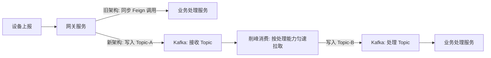
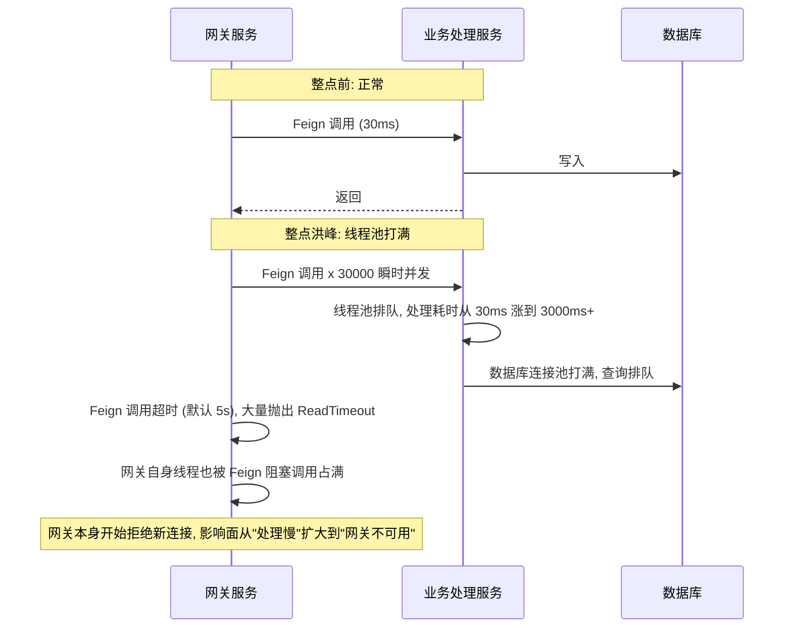
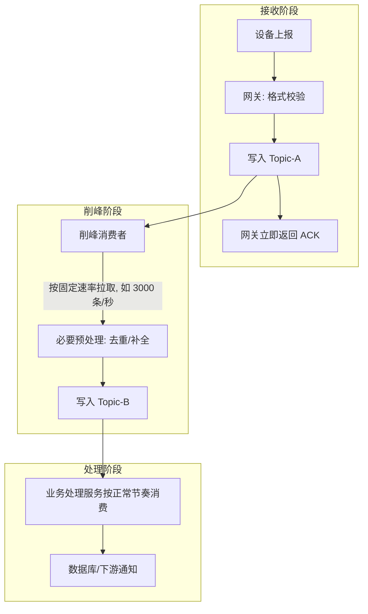

# 整点半点的设备洪峰：从同步 Feign 到双 Topic 削峰架构

## 前言

物联网设备普遍有个共性行为——很多设备的定时上报任务是按整点、半点（或者更细的 15 分/5 分粒度）触发的,因为设备端的定时器本身就是这么设计的,图省事,直接用系统时钟对齐。单台设备这么做没问题,但当接入量到了十万台、百万台规模,这个"图省事"的设计就会变成服务端的洪峰——所有设备在同一秒钟前后集中上报,平时的 QPS 是 2000,整点瞬间能冲到 3 万+。

这篇文章记录的是这类洪峰在一次真实项目里从"扛不住"到"扛得住"的架构演进,核心变化是把原来的同步调用链路拆成了两段异步的 Kafka Topic。



## 洪峰的真实样子

先看数据。下面是某天整点前后 5 分钟的 QPS 曲线（简化后的示意)：

| 时间 | QPS |
|------|-----|
| 59:00 | 1,800 |
| 59:30 | 2,100 |
| 59:55 | 4,500 |
| 00:00 | 31,200 |
| 00:05 | 22,000 |
| 00:10 | 8,600 |
| 00:15 | 2,300 |

整点前后 10 分钟内,QPS 从 2000 量级冲到 3 万+ 再回落,尖峰持续时间很短,但对系统的冲击是瞬时的——不是"持续高负载",而是"脉冲式过载"。这种流量形态用常规的"按日均 QPS 做容量规划"完全覆盖不了,按峰值容量规划又会导致平时 90% 以上的资源在闲置。

## 旧架构：同步 Feign 调用为什么扛不住

原来的架构里,网关服务接到设备上报请求后,直接用 Feign 同步调用业务处理服务完成校验、入库、下游通知等一系列操作:

```java
@FeignClient(name = "device-process-service")
public interface DeviceProcessClient {
    @PostMapping("/api/device/report")
    ProcessResult processReport(@RequestBody DeviceReportDTO report);
}

// 网关服务
public void handleReport(DeviceReportDTO report) {
    ProcessResult result = deviceProcessClient.processReport(report); // 同步阻塞调用
    // ... 处理结果
}
```

这个架构在平峰期完全没问题——2000 QPS,单次处理耗时 30ms,业务处理服务的线程池（Tomcat 默认 200 线程)绰绰有余。但整点洪峰一来,问题是连锁的:



问题不只是业务处理服务变慢,而是**同步调用把"下游变慢"直接传导成了"上游也变慢甚至不可用"**。网关服务的线程被阻塞在等待 Feign 调用返回上,新进来的设备连接因为网关线程池打满而直接被拒绝——受影响的不是一小部分请求,是整点前后几分钟内的所有请求。

### 第一轮尝试：加超时和重试（治标,效果有限）

第一反应是常规操作——调小 Feign 超时时间,加重试,给业务处理服务加机器：

```yaml
feign:
  client:
    config:
      device-process-service:
        connectTimeout: 1000
        readTimeout: 2000
  circuitbreaker:
    enabled: true
```

这套调整让"网关整体不可用"的问题缓解了（超时更快失败,不会一直占着线程),但没有解决根本问题——超时更快只是让请求更快地失败,失败的请求要么丢了,要么触发重试又给已经过载的业务处理服务加了一层重试流量,雪上加霜。加机器能提高处理能力的上限,但洪峰是瞬时 15 倍的量级,靠加机器去匹配这个量级的峰值,意味着平时 90%+ 的机器资源是闲置的——这个成本在设备规模继续增长后会越来越不现实。

## 新架构：把"接收"和"处理"拆成两个 Topic

核心思路是**用消息队列的缓冲能力,把"瞬时到达"和"匀速处理"这两件事解耦**。做法是引入两个 Kafka Topic,分别承担不同职责：

- **接收 Topic（Topic-A）**：网关服务收到上报请求后,只做最基础的格式校验,然后写入这个 Topic,立即返回给设备。写入 Kafka 本身是高吞吐操作,一个 broker 集群轻松扛住 3 万+ QPS 的瞬时写入。
- **处理 Topic（Topic-B）**：一个专门的"削峰消费者"从 Topic-A 按业务处理服务能承受的速率匀速拉取消息,做完必要的预处理后写入 Topic-B,业务处理服务从 Topic-B 按正常节奏消费。



### 为什么是两个 Topic,而不是一个 Topic 加限流

一个自然的问题是:为什么不直接用一个 Topic,业务处理服务自己控制消费速率就行,何必拆两个 Topic？

答案在于**职责边界**。如果只有一个 Topic,业务处理服务既要承担"限流"的职责,又要承担"业务处理"的职责,这两件事混在一起会导致限流逻辑散落在业务代码里,不好统一调整,也不好观测（想知道"当前削峰后的实际处理速率是多少",得从业务日志里推算)。拆成两个 Topic 之后:

- Topic-A 的堆积量,直接反映了"洪峰有多猛,还没消化完的量有多少"
- Topic-B 的堆积量（理论上应该长期趋近于 0),反映的是"业务处理服务自身的处理能力是否够用"

这两个指标分开看,排查问题时能立刻知道瓶颈在"入口太猛"还是"处理太慢",这是单 Topic 架构做不到的可观测性收益。

### 削峰消费者的核心实现

削峰消费者的关键是**按固定速率消费,而不是按 Kafka 默认的"能拉多少拉多少"**：

```java
public class RateLimitedKafkaConsumer {

    private final RateLimiter rateLimiter; // Guava RateLimiter, 或自定义令牌桶
    private final KafkaConsumer<String, String> consumer;

    public void run() {
        while (running) {
            ConsumerRecords<String, String> records = consumer.poll(Duration.ofMillis(200));
            for (ConsumerRecord<String, String> record : records) {
                rateLimiter.acquire(); // 阻塞直到拿到令牌, 天然把速率钳制在设定值
                producer.send(new ProducerRecord<>("device-process-topic", record.value()));
            }
            consumer.commitSync(); // 处理完这一批再提交, 保证 at-least-once
        }
    }
}
```

速率的具体数值不是拍脑袋定的,是根据业务处理服务的真实处理能力反推出来的——通过压测得到业务处理服务在保持 P99 稳定的前提下能扛住的最大 QPS,削峰消费者的限流值就设成这个数字的 80%（留出安全余量,也给业务处理服务自身的抖动留缓冲)。

### 效果对比

同样的整点洪峰场景,新架构下的表现：

| 指标 | 旧架构（同步 Feign) | 新架构（双 Topic 削峰) |
|------|---------------------|------------------------|
| 网关整点前后错误率 | 12%~18%（超时/连接拒绝) | < 0.1% |
| 业务处理服务 P99（整点期间) | 3000ms+（远超正常水平) | 稳定在 50ms 左右 |
| Topic-A 堆积峰值 | 不适用 | 约 18 万条,15 分钟内消化完 |
| 设备端重试率 | 明显上升（因超时触发设备侧重试逻辑) | 无明显变化 |

Topic-A 会在整点后短暂堆积,这是预期内的行为——堆积的意义就是把瞬时的洪峰"存起来",再用业务处理服务能承受的速度慢慢消化,消化窗口从"瞬间"拉长到了 15 分钟左右,而这 15 分钟对设备端上报这类非实时性极强的场景,完全可以接受。

## 需要正视的额外复杂度

引入双 Topic 削峰架构不是没有代价,老实说这套方案比同步调用复杂得多，多出来的复杂度主要是：

- **端到端延迟从毫秒级变成了分钟级**（在洪峰堆积期间)。如果业务场景对实时性要求很高（比如需要用户提交后立刻看到处理结果),这个架构不适合,削峰的前提是"业务能接受处理结果延迟返回"。
- **多了一层数据一致性问题**。原来同步调用,成功或失败是即时可知的；异步化后,网关返回的只是"已接收",不代表"已处理成功",如果处理阶段失败,需要有单独的补偿或告警机制,不能假设写入 Topic-A 就等于业务成功。
- **运维复杂度上升**。多了两个 Topic 和一个削峰消费者组件,需要监控 Topic 堆积量、消费者健康状态,原来只需要盯 Feign 调用的成功率和耗时。

这套架构解决的是"脉冲式流量整形"这一类具体问题,不是所有同步调用场景的通用替代方案——如果系统的流量本身是平稳的,没有整点/半点这类脉冲特征,引入这套复杂度反而是不必要的负担。

## 总结

- ❌ 同步调用链路下,下游变慢会直接传导成上游不可用,加超时和重试只是让失败更快,不解决根本问题
- ✅ 用消息队列把"瞬时到达"和"匀速处理"解耦,是应对脉冲式流量的常规手段
- ✅ 拆成"接收"和"处理"两个 Topic,能把限流职责从业务代码里剥离出来,同时获得更细粒度的可观测性
- ✅ 削峰架构的代价是端到端延迟变长和一致性复杂度上升,只在流量确实有脉冲特征时才值得引入

## 相关文章

- [Kafka 消费速度上不去：三个真实案例排查记](./Kafka%20消费速度上不去排查记.md)
- [Kafka Partition 规划与问题处理](./Kafka%20Partition%20规划与问题处理.md)

## 参考资料

- [Kafka 官方文档：Design](https://kafka.apache.org/documentation/#design)
- [Guava RateLimiter 文档](https://guava.dev/releases/snapshot/api/docs/com/google/common/util/concurrent/RateLimiter.html)
