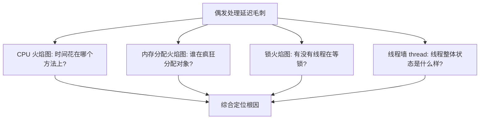
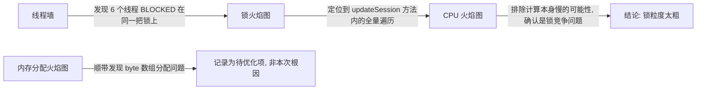

# 用 Arthas 四件套给线上 MQTT 服务做体检

## 前言

线上一个 MQTT 接入服务，负责设备的连接维护和消息转发，最近偶发性地出现处理延迟毛刺——大部分时间表现正常，但每隔十几分钟会有一次持续几秒的处理耗时突增。这类"偶发+短暂"的问题最难缠：等你登录服务器准备排查的时候，问题往往已经过去了，`top` 和 `jstack` 抓一次快照,大概率什么都抓不到。

这次没有从单一工具下手，而是用 Arthas 的四件套——CPU 火焰图、内存分配火焰图、锁火焰图、线程墙——做了一次相对完整的体检。四张图分别回答四个不同的问题，合在一起才能定位真正的瓶颈。



## 体检第一步：线程墙,先看全局再看细节

拿到一个"偶发卡顿"的问题，第一反应不是立即抓火焰图（火焰图需要持续采样一段时间，如果问题窗口很短，容易错过），而是先用 `thread` 命令看一眼线程的整体状态分布，尤其关注有没有大量线程堆积在某个状态：

```bash
# 查看当前所有线程的状态分布
thread --state BLOCKED

# 查看最忙的 3 个线程
thread -n 3
```

这一步在这次排查里发现了一个明显异常：MQTT 消息处理的线程池里，有 6 个线程处于 `BLOCKED` 状态,且它们的调用栈都停在同一行代码上：

```
"mqtt-process-pool-3" #47 daemon prio=5 os_prio=0 tid=0x... nid=0x... waiting for monitor entry
   java.lang.Thread.State: BLOCKED (on object monitor)
    at com.xxx.mqtt.DeviceSessionManager.updateSession(DeviceSessionManager.java:88)
    - waiting to lock <0x00000007a1234567> (a com.xxx.mqtt.DeviceSessionManager)
```

6 个线程卡在同一把锁上，这已经是一个相当明确的信号——问题大概率出在锁竞争，而不是单纯的 CPU 计算慢。但线程墙只能告诉你"有线程在等锁"，说不清楚"这把锁被占用的时间为什么这么长，占用者当时在干什么"，这就需要锁火焰图接上。

## 锁火焰图：谁占着锁不放,以及为什么

```bash
profiler start --event lock
# 观察一段时间, 覆盖到毛刺出现的窗口
profiler stop --format html -f /tmp/mqtt-lock-profile.html
```

锁火焰图（Arthas 底层用的是 async-profiler 的 `lock` 事件）展示的是"锁竞争"耗时在调用栈上的分布——不是"这个方法本身跑了多久"，而是"因为等这把锁，线程被阻塞了多久"。抓出来的火焰图里，最宽的一段落在 `DeviceSessionManager.updateSession` 这个方法内部，往下追一层，发现这个方法里有一段同步块，同步块内部做了一次全量的 Map 遍历：

```java
public class DeviceSessionManager {
    private final Map<String, DeviceSession> sessions = new HashMap<>();

    public synchronized void updateSession(String deviceId, SessionEvent event) {
        // 问题代码: 整个方法用 synchronized 修饰, 锁粒度是整个 sessions Map
        DeviceSession session = sessions.get(deviceId);
        if (session != null) {
            session.apply(event);
        }
        // 每次更新后, 顺带清理一次过期会话 -- 这一步是全量遍历
        sessions.entrySet().removeIf(e -> e.getValue().isExpired());
    }
}
```

问题很直白：整个方法用一把粗粒度的 `synchronized` 锁保护，而方法内部又夹带了一次全量 Map 遍历（清理过期会话）。当在线设备数达到几十万级别时，这次遍历本身就要花几十毫秒，而这几十毫秒里，锁被完全占用，其他所有想更新自己会话的线程只能排队等——这也是为什么线程墙里能看到好几个线程同时卡在同一行。

## CPU 火焰图：排除"计算本身慢"这个可能性

锁火焰图已经指向了问题所在，但为了排除"是不是这次遍历本身用了低效算法，导致 CPU 计算就很慢"这个可能性，补了一次 CPU 火焰图：

```bash
profiler start --event cpu
profiler stop --format html -f /tmp/mqtt-cpu-profile.html
```

CPU 火焰图里，`removeIf` 这次遍历占用的 CPU 时间其实不算突出，全局 CPU 使用率也一直是正常水平。这个结果确认了一个重要结论：**问题不是"计算慢"，是"锁粒度太粗导致大量线程排队等一个没必要串行的操作"**。这个区分很关键——如果误判成"计算慢"，后续的优化方向就会走偏（比如去优化 `isExpired()` 判断逻辑本身，那基本是无效优化）。

## 内存分配火焰图：意外发现的第二个问题

在做这次体检时，顺手也抓了一次内存分配火焰图（`alloc` 事件），本来只是想确认一下有没有隐藏的对象分配问题，结果确实发现了一个之前没意识到的点：

```bash
profiler start --event alloc
profiler stop --format html -f /tmp/mqtt-alloc-profile.html
```

分配火焰图里有一段占比不小的分配来自 MQTT 消息解析路径上的 `byte[]` 数组——每次解析一条 MQTT 消息，都会先把 Netty 的 `ByteBuf` 完整拷贝成一个新的 `byte[]`，再进行后续解析。这个分配量在平峰期不算显眼，但恰好在设备批量重连（比如网络抖动后大量设备重新建立 MQTT 连接）的时段，消息量陡增，这部分分配会显著推高 Young GC 频率——虽然这次的延迟毛刺主要根因是锁竞争，但这个分配问题是一个"还没发作但迟早会成为下一个瓶颈"的隐患，体检的价值就在这里：不是只解决眼前报警的那一个问题,顺手把火焰图看全了,能提前发现还没爆发的风险。

## 四张图放在一起,拼出完整画面



单看任何一张图，得到的结论都是不完整的：只看线程墙，知道"有锁竞争"但不知道锁里在干什么；只看 CPU 火焰图，会得出"CPU 很正常，没什么问题"的误导性结论（因为锁等待不占用 CPU 时间，`profiler start --event cpu` 默认只统计运行态的 CPU 时间，阻塞态的线程根本不会出现在 CPU 火焰图里）；只看锁火焰图,能定位到具体代码,但不知道这是不是当前唯一的问题。四张图合起来,才能既定位根因,又不遗漏潜在风险。

## 处理方案

锁粒度问题的处理思路是**拆分锁的粒度，把"更新会话"和"清理过期会话"这两件事解耦**：

```java
public class DeviceSessionManager {
    private final ConcurrentHashMap<String, DeviceSession> sessions = new ConcurrentHashMap<>();

    public void updateSession(String deviceId, SessionEvent event) {
        // ConcurrentHashMap 本身对单个 key 的操作是细粒度锁, 不再需要整体 synchronized
        sessions.computeIfPresent(deviceId, (id, session) -> {
            session.apply(event);
            return session;
        });
    }

    // 清理过期会话改为独立的定时任务, 与更新逻辑完全解耦, 不再共享同一把锁
    @Scheduled(fixedDelay = 30000)
    public void cleanExpiredSessions() {
        sessions.entrySet().removeIf(e -> e.getValue().isExpired());
    }
}
```

用 `ConcurrentHashMap` 替代 `HashMap + synchronized`，把锁粒度从"整个 Map"收窄到"单个 key"；同时把清理过期会话这个和"实时更新"没有强一致性要求的操作，挪到独立的定时任务里异步执行，彻底不再和高频的 `updateSession` 共享同一把锁。

内存分配的问题则是把 `ByteBuf` 到 `byte[]` 的完整拷贝，改成基于 `ByteBuf` 的直接读取（利用 Netty 提供的 `readSlice`/`getBytes` 等 API 避免不必要的拷贝），这部分改动放在了下一轮迭代里,因为它不是本次故障的直接根因,优先级排在锁粒度修复之后。

## 效果

修复锁粒度问题后：

| 指标 | 修复前 | 修复后 |
|------|--------|--------|
| 处理延迟毛刺频率（每小时） | 3~5 次 | 0 次（观察一周） |
| 毛刺期间 P99 延迟 | 2000ms+ | 无明显毛刺，稳定在 15ms 左右 |
| BLOCKED 线程数（高峰期） | 6~8 | 0 |

## 四件套的适用边界

这四个工具不是每次排查都要全上,视问题现象选合适的子集会更高效：

- **只怀疑 CPU 计算慢**（比如某个接口 CPU 使用率异常高但没有明显锁等待）：CPU 火焰图基本够用
- **怀疑 GC 频繁/内存增长异常**：内存分配火焰图 + `jmap`/`vmtool` 配合看更全面
- **多线程场景下出现处理延迟但 CPU 不高**：优先线程墙，快速判断是不是锁竞争，再决定是否需要锁火焰图深入
- **完全没有方向、问题偶发难以复现**：像本文这样四个一起上,虽然成本更高，但能一次性覆盖大部分可能性，避免"猜错方向再重新排查一轮"的往返成本

## 总结

- ❌ 只看 CPU 火焰图容易得出"CPU 正常所以没问题"的误导性结论——锁等待不占 CPU 时间，不会出现在 CPU 火焰图里
- ✅ 线程墙适合作为第一步，快速判断是不是锁竞争问题，再决定要不要上锁火焰图
- ✅ 锁火焰图能定位到"锁里在干什么"，这是线程墙看不到的细节
- ✅ 内存分配火焰图顺手抓一次，经常能发现还没发作但迟早会成为瓶颈的隐患
- ✅ 粗粒度锁的修复思路通常是拆分职责——把强一致性要求的操作和可以异步化的操作解耦，而不是简单换一种锁实现

## 相关文章

- [Kryo 深拷贝 vs JSON 深拷贝：用真实业务对象和火焰图说话](../缓存与性能优化/Kryo%20深拷贝%20vs%20JSON%20深拷贝性能对比.md)

## 参考资料

- [Arthas 官方文档：profiler](https://arthas.aliyun.com/doc/profiler.html)
- [async-profiler GitHub](https://github.com/async-profiler/async-profiler)
- [Java ConcurrentHashMap 源码解析](https://docs.oracle.com/javase/8/docs/api/java/util/concurrent/ConcurrentHashMap.html)
