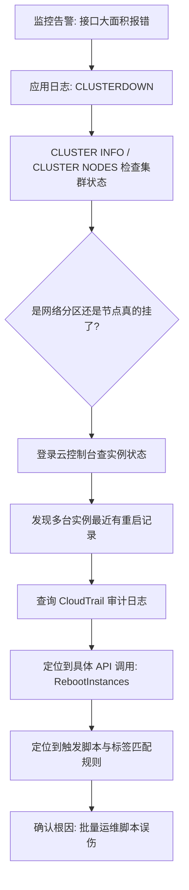

# 一次"运维误操作"引发的 Redis Cluster 全局宕机：从 CloudTrail 审计日志还原真相

## 前言

某天下午,监控突然弹出一片红——所有依赖 Redis 的接口同时开始报错,错误信息高度一致：`CLUSTERDOWN The cluster is down`。第一反应是"Redis 挂了",但"挂了"背后的真实原因,当时完全不知道——是某个节点进程崩溃？是网络分区？还是别的什么？

排查的前半段走了不少弯路,因为一开始的假设方向就不对。真正定位到根因,靠的不是看 Redis 本身的日志,而是去翻云平台的 API 调用审计记录——最后发现,是一次批量运维脚本的标签匹配规则写得不够精确,误伤了几台正在服务生产流量的 Redis 节点所在的云主机,触发了强制重启。

这篇文章记录的是完整的排查链路,以及排查过程中一个更重要的教训：**故障排查阶段应该先保证"只读",而不是一边排查一边动手重启、切换、修复**——这次事故里,如果排查早期就有人手动介入重启节点,很可能会让 CloudTrail 里那条关键的操作记录被淹没在后续一堆"抢修式操作"里，反而更难还原真相。



## 现象

事故发生的时间点前后,几个信号几乎同时出现：

- 所有服务的 Redis 调用开始大量抛出 `CLUSTERDOWN The cluster is down`
- Redis 慢查询日志没有异常,说明不是查询变慢,而是集群本身处于不可用状态
- 告警面板上,依赖 Redis 的接口错误率从 0 瞬间跳到接近 100%——不是渐进式恶化,是断崖式的

断崖式而不是渐进式,这个特征很关键——它排除了"某类查询逐渐变慢导致连接池耗尽"这类渐进型故障,更像是集群状态本身发生了突变。

## 排查第一步：确认集群真实状态

先不猜测,直接查 Redis Cluster 自身的状态：

```bash
redis-cli -c -h <redis-host> -p 6379 CLUSTER INFO
```

关键输出：

```
cluster_state:fail
cluster_slots_assigned:16384
cluster_slots_ok:10923
cluster_slots_fail:5461
cluster_known_nodes:9
```

`cluster_state:fail` 直接确认了集群整体不可用,而 `cluster_slots_fail:5461` 说明有三分之一的 slot 处于不可服务状态——这个比例正好对应"某一组 master 及其对应 slave 同时失联"的特征（Redis Cluster 里,一个 master 和它的 slave 都不可达,负责的 slot 才会真正标记为 fail;单个节点故障通常会由 slave 完成 failover 后恢复)。

再查具体是哪些节点出问题：

```bash
redis-cli -c -h <redis-host> -p 6379 CLUSTER NODES | grep fail
```

```
<node-id-1> <ip-1>:6379@16379 master,fail - 1758012345000 1758012340000 3 connected 5461-10922
<node-id-2> <ip-2>:6379@16379 slave,fail <node-id-1> 1758012345000 1758012340000 3 connected
```

一个 master 和它唯一的 slave 同时标记为 `fail`——这正好解释了为什么这组 slot 无法自动 failover:没有健康的副本可以被提升为新 master。

## 排查第二步：网络分区还是节点真的下线了

这一步是分岔路口。`fail` 状态可能是网络分区（节点其实活着,只是和集群其他节点通信不了),也可能是节点进程真的退出了、或者宿主机本身出了问题。

先用最直接的方式确认——能不能直接连上这两个节点：

```bash
redis-cli -h <ip-1> -p 6379 PING
# (error) Could not connect to Redis at <ip-1>:6379: Connection refused
```

`Connection refused` 而不是超时,说明不是网络层面的丢包或分区（网络分区通常表现为连接超时,而不是明确的拒绝),更像是这台机器上根本没有进程在监听这个端口,或者机器本身不可达。

登录云平台控制台查实例状态,发现问题所在——这两台实例的"最近状态变化"时间,和故障发生时间几乎完全对齐,实例处于刚重启完成的状态。

**这里是关键的纪律：确认到"实例被重启"之后,没有立即动手做任何恢复操作(比如手动重启 Redis 进程、手动摘除故障节点),而是先去查这次重启是谁、在什么条件下触发的。** 排查阶段一旦开始动手"抢修",现场就会被破坏——比如如果这时候手动重启了 Redis 进程,虽然服务能快速恢复,但云平台上"是谁调用了重启 API"这条审计记录未必会因此消失,但后续再想理清"重启之后发生了什么、Redis 是怎么从 fail 恢复的"这条时间线,会因为人工介入而变得混乱,不利于后续复盘和归因。

## 排查第三步：CloudTrail 审计日志还原真相

云平台的 API 调用审计日志（AWS 的 CloudTrail 是最典型的例子,其他云平台有对应的操作审计功能)记录了"谁在什么时间调用了什么 API,对哪个资源"。这是唯一能回答"这台实例为什么被重启"的数据源——实例自身的系统日志只能看到"发生了重启",看不到"重启是被谁触发的"。

```bash
aws cloudtrail lookup-events \
  --lookup-attributes AttributeKey=ResourceName,AttributeValue=<instance-id> \
  --start-time "2026-09-16T13:50:00Z" \
  --end-time "2026-09-16T14:10:00Z"
```

在返回结果里,定位到了关键的一条事件：

```json
{
  "EventName": "RebootInstances",
  "EventTime": "2026-09-16T13:59:02Z",
  "Username": "ops-batch-automation",
  "Resources": [
    {"ResourceName": "<instance-id-1>"},
    {"ResourceName": "<instance-id-2>"}
  ],
  "CloudTrailEvent": "{... \"requestParameters\": {\"instancesSet\": {...}} ...}"
}
```

调用者是一个自动化运维账号,不是人工直接操作——这把排查方向从"谁手动点错了"引向了"哪个自动化脚本的匹配逻辑出了问题"。

再往下查这个自动化任务的执行记录(内部运维平台的任务日志),发现是一个"按标签批量重启异常实例"的巡检脚本——这个脚本原本的用途是定期扫描打了 `auto-heal:true` 标签的测试环境实例,发现处于异常状态就自动重启。问题出在标签匹配规则上：

```python
# 问题代码：标签匹配条件过于宽松
def find_target_instances():
    return ec2_client.describe_instances(
        Filters=[
            {"Name": "tag:auto-heal", "Values": ["true"]}
            # 缺少环境隔离条件, 没有限定 tag:env=test
        ]
    )
```

几台生产环境的 Redis 节点主机,因为历史原因也被打上了 `auto-heal:true` 标签（这个标签最初是给测试环境用的,后来在一次批量打标签的运维操作中,因为标签值本身没有环境区分,被连带打到了一批生产主机上),于是被这个巡检脚本判定为"异常实例",触发了批量重启。

## 原因分析

这次故障的因果链条清晰,但每一环都不是孤立的偶然：

1. **标签设计缺乏环境隔离**：`auto-heal:true` 这个标签本身没有携带"仅适用于测试环境"的约束,标签的语义依赖使用者的默契,而不是强制约束
2. **批量运维脚本的过滤条件不够精确**：脚本只按功能标签过滤,没有叠加环境标签做二次确认,这是自动化脚本里最常见也最危险的疏漏——**自动化的杠杆效应是双向的,匹配规则宽一点,影响面就会成倍放大**
3. **Redis Cluster 的高可用假设被突破**：Redis Cluster 的设计假设是"master 和它的 slave 不会同时故障",这次两台实例被同一个批量操作命中,恰好击穿了这个假设——分布式系统的容错设计,前提往往是故障是独立发生的,一旦故障来源变成"同一次操作同时命中多个节点",原有的容错机制就会失效

一句话总结这次排查的核心发现：**多数据副本能容忍随机的独立故障,但容忍不了"同一个根因同时命中所有副本"——这也是为什么关键系统的多个副本应该尽量分散在不同的故障域（不同标签、不同可用区、不同运维流程),而不能只满足于"物理上部署了多个副本"这一件事。**

## 处理方案

### 应急恢复：不是重启完就算恢复

节点重启完成,进程重新拉起后,并不能立即判断服务已经恢复,还需要确认两件事：

**第一，slot 是否已经全部恢复覆盖**：

```bash
redis-cli -c -h <redis-host> -p 6379 CLUSTER INFO | grep cluster_state
# 期望输出: cluster_state:ok
```

**第二，数据是否已经追平——这一步容易被忽略但更重要**。节点重启后,如果是 slave 角色,需要重新从 master 全量或增量同步数据;如果之前有写入是在 slave 完全同步之前就被路由过来的（比如流量在集群刚恢复 `ok` 状态时就切回来,但某个 slave 其实还在追增量),会有短暂的数据不一致风险。用 `WAIT` 命令可以确认写入是否已经同步到足够数量的副本：

```bash
redis-cli -h <redis-host> -p 6379 WAIT 1 5000
# 返回值: 已确认同步的副本数, 需要 >= 期望的副本数
```

流量真正切回来之前,先用 `WAIT` 确认关键 master 的写入已经同步到其 slave,而不是看到 `cluster_state:ok` 就直接认为万事大吉——`ok` 只代表 slot 分配完整,不代表数据副本已经追平。

### 根因修复：从"人靠自觉"到"系统强制约束"

三个层面的修复,分别对应这次故障链条上的三个环节：

| 环节 | 修复措施 |
|------|----------|
| 标签设计 | 引入强制的环境维度标签（如 `env:prod` / `env:test`),批量运维脚本的过滤条件必须显式包含环境标签,不能只靠功能标签 |
| 自动化脚本 | 所有批量操作类脚本增加"预演模式"（dry-run,只打印将要操作的资源列表,不真正执行),人工确认后才允许真正执行 |
| 资源保护 | 对生产环境的关键基础设施实例（数据库、缓存节点所在主机)开启云平台的终止/重启保护（如 AWS 的 termination protection),即使误配置的脚本尝试操作,也会被平台层面拦截 |

第三层"资源保护"是最后一道防线——前两层修复的是"人和流程",第三层修复的是"即使人和流程都出了问题,系统本身也不该允许这个操作生效"。对生产环境的关键节点,这层平台级保护应该是默认开启的,而不是等出过事故才补上。

### 复盘流程：建立只读排查纪律

比技术修复更值得记录的是排查过程中的这条经验：**故障排查的前半段应该保持"只读",先把状态和证据收集完整,再决定怎么动手恢复**。

理由不是"求稳",而是现实的：

- 排查阶段就动手重启或切换,一旦操作本身又引入新的变量（比如重启触发了另一个自动化脚本的联动),会让原本清晰的因果链变得混乱
- 云平台的审计日志、实例的系统日志,都是有真实价值的一次性证据——现场保持得越完整,复盘越容易还原出真实的时间线
- "先恢复再排查"在业务影响巨大、必须争分夺秒止损的场景下是合理的优先级,但在能够容忍分钟级排查窗口的场景里,先花几分钟定位根因,往往比"边猜边修"更快收敛

## 总结

- ❌ 看到 `CLUSTERDOWN` 就假设是 Redis 自身的问题,容易把排查方向带偏,该先确认是节点故障还是网络分区
- ✅ 云平台的 API 调用审计日志（CloudTrail 或同类工具)是还原"谁做了什么操作"的关键数据源,应用层和 Redis 自身的日志回答不了这个问题
- ✅ 批量运维脚本的过滤条件必须包含环境隔离维度,标签语义不能只靠"大家都记得"这种默契
- ✅ 节点恢复后先用 `CLUSTER INFO` 和 `WAIT` 确认 slot 覆盖和数据同步完整,再切回流量,`cluster_state:ok` 不等于数据已经追平
- ✅ 排查阶段保持只读,收集完整证据后再动手恢复,能大幅提升复盘时还原真实因果链的能力

## 相关文章

- [一台物理机宕机为什么能引发全局 DNS 雪崩](./物理机宕机引发全局DNS雪崩.md)
- [Redis Hash 缓存往返次数优化：从 3 次调用到 1 次](../缓存与性能优化/Redis%20Hash%20缓存往返次数优化.md)

## 参考资料

- [Redis Cluster 官方文档：Fault Tolerance](https://redis.io/docs/manual/scaling/#fault-tolerance)
- [AWS CloudTrail 官方文档](https://docs.aws.amazon.com/awscloudtrail/latest/userguide/cloudtrail-user-guide.html)
- [Redis WAIT 命令文档](https://redis.io/commands/wait/)
