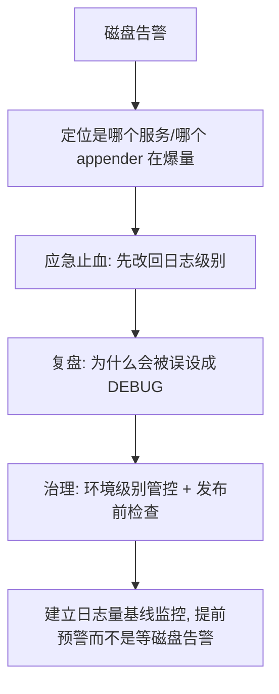
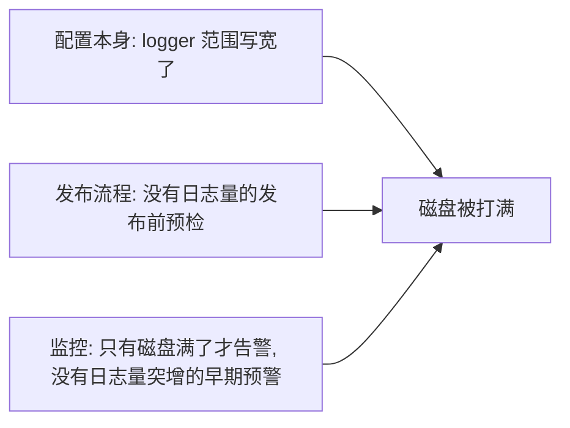

# 一天 300GB 日志是怎么打出来的：生产环境误开 DEBUG 的治理

## 前言

凌晨磁盘告警，日志盘用量在 6 小时内涨了 40%。排查下去，原因平平无奇——一次配置发布把某个核心服务的日志级别从 `INFO` 误设成了 `DEBUG`，这个服务日均日志量从平时的 40GB 涨到了 300GB+，把整个日志盘挤到了告警线。

这类问题的处理如果只停在"把级别改回去"，下次换个人、换个服务，还会再发生一次。这篇文章记录的是从应急止血到建立管控机制的完整过程。



## 应急处理：先止血,再追因

### 定位爆量来源

磁盘告警只会告诉你"盘满了",不会直接告诉你是哪个服务。第一步是快速定位：

```bash
# 按目录统计日志占用, 找出爆量的服务
du -sh /var/log/app/*/ | sort -rh | head -10

# 确认是不是某天之内的突增(而不是长期堆积没清理)
find /var/log/app/device-service -name "*.log*" -mtime -1 -exec du -ch {} + | tail -1
```

定位到是 `device-service` 这一个服务的日志目录,在过去 6 小时内新增了将近 80GB,而这个服务平时一天的日志量在 6~8GB。方向明确了——不是"所有服务日志都在涨",是"单个服务突然话多了"。

### 确认是不是级别问题

```bash
# 抓一段日志看级别分布, 而不是猜
tail -n 5000 /var/log/app/device-service/app.log | awk '{print $3}' | sort | uniq -c | sort -rn
```

```
   4231 DEBUG
    712 INFO
     57 WARN
```

DEBUG 占了 85% 以上,基本可以确认就是级别问题。翻当天的发布记录,确认是一次 `logback-spring.xml` 的配置调整——本意是给一个正在排查的问题临时打开某个包的 DEBUG 日志,但配置里的 `<logger>` 标签范围写宽了,实际生效的是根 logger 级别。

```xml
<!-- 误改后的配置: 本意只想调试 com.example.device.report 这个包 -->
<logger name="com.example.device" level="DEBUG"/>
<!-- 但 com.example.device 这个包路径下挂了设备服务几乎所有的核心类
     几乎所有业务日志的类都在这个包路径下, 等于把大半个应用的日志级别都拉到了 DEBUG -->
```

问题不在"打开 DEBUG"这件事本身——排查问题时临时开 DEBUG 是正常操作,问题在于**这个包路径的范围比预想的大得多**,写配置的人以为自己精确控制到了一个小模块，实际控制的是整个业务包。

### 止血

```xml
<!-- 改回原来的级别, 或者缩小到真正需要排查的具体类 -->
<logger name="com.example.device.report.DeviceReportValidator" level="DEBUG"/>
<logger name="com.example.device" level="INFO"/>
```

止血本身很简单——发布一次配置改回去。但止血完就结束的话，这次事故唯一的产出就是"记住了这一次不要写错"，这种"记住"是不可靠的治理手段。

## 复盘：为什么一个日志级别配置能造成这么大影响

深挖下去，有三个环节都存在问题，任何一个环节做对了，这次事故的影响都会小得多：



**配置范围写宽**：这是直接原因，但只是表面原因——业务代码的包结构设计,天然容易出现"想精确控制一个小类,却不小心控制了一整个大包"的情况，这不是靠"以后写配置仔细一点"能根治的，人总会犯这类错误。

**发布流程没有校验**：`logback-spring.xml` 的变更走的是和普通配置文件一样的发布流程，没有任何针对日志级别的特殊检查——比如"这次改动会不会把根 logger 或者覆盖面很大的包设成 DEBUG"这类校验，理论上是可以在发布前拦截的。

**监控只在"已经出问题"时告警**：磁盘用量告警的阈值设在 85%，这个告警的性质是"事情已经发生了",而不是"事情正在发生,提前给你反应时间"。如果有一个"日志量突增"的告警（比如某服务小时级日志量超过历史均值 3 倍),这次事故能在磁盘涨到 40% 之前就被发现。

## 治理方案

### 1. 环境级别的日志级别管控

给不同环境设置日志级别的硬性上限，而不是完全依赖人工审查每一次配置改动：

```xml
<!-- logback-spring.xml, 按环境区分默认级别 -->
<springProfile name="prod">
    <root level="INFO">
        <appender-ref ref="FILE"/>
    </root>
    <!-- 生产环境允许临时开 DEBUG, 但限定到具体类, 不允许对包级别设置 DEBUG -->
</springProfile>

<springProfile name="dev,test">
    <root level="DEBUG">
        <appender-ref ref="CONSOLE"/>
    </root>
</springProfile>
```

关键约束是**生产环境的 DEBUG 只允许配置到具体类，不允许配置到包**——这条规则通过代码评审的检查清单来落地，而不是指望配置文件本身能自我限制（logback 本身不支持这种粒度的强制约束）。

### 2. 发布前的日志配置检查

在配置发布的 CI 流程里加一段简单的静态检查，拦截明显有风险的改动：

```bash
#!/bin/bash
# check-log-config.sh: 检查 logback 配置里是否存在大范围 DEBUG 设置

CONFIG_FILE=$1
RISKY_PATTERNS=(
  'name="com\.example"[^>]*level="DEBUG"'      # 顶级包全开 DEBUG
  '<root[^>]*level="DEBUG"'                     # 根 logger 设 DEBUG (仅生产环境配置块内检查)
)

for pattern in "${RISKY_PATTERNS[@]}"; do
  if grep -qE "$pattern" "$CONFIG_FILE"; then
    echo "⚠️  检测到可能影响范围过大的 DEBUG 配置: $pattern"
    echo "如果确认需要,请在 PR 描述中说明预期日志量增幅和回滚时间"
    exit 1
  fi
done
echo "✅ 日志配置检查通过"
```

这不是什么复杂的静态分析,就是几条正则匹配,但足够拦截"顶级包/根 logger 被设成 DEBUG"这类最容易造成大范围影响的改动。它不追求完美覆盖所有风险模式,而是拦截最常见、最容易犯的那一类。

### 3. 日志量基线监控,提前预警

在磁盘告警之前,加一层"日志产出速率"的监控——按服务统计每小时日志行数/字节数,和历史同期均值做对比：

```yaml
# Prometheus 告警规则示例
- alert: LogVolumeSpike
  expr: |
    rate(log_lines_total[10m]) 
    > 3 * avg_over_time(rate(log_lines_total[10m])[7d:1h])
  for: 5m
  labels:
    severity: warning
  annotations:
    summary: "{{ $labels.service }} 日志产出速率超过 7 天均值的 3 倍"
```

这条规则的核心是**用历史均值做动态基线,而不是写死一个绝对阈值**——不同服务的正常日志量差异很大,写死阈值要么对小服务太敏感,要么对大服务失效,用"相对历史均值的倍数"能兼顾不同服务的基线差异。

## 效果

治理落地后半年内的对比：

| 指标 | 治理前 | 治理后 |
|------|--------|--------|
| 磁盘告警因日志导致的次数（月均） | 2~3 次 | 0 次 |
| 日志异常突增的发现方式 | 磁盘告警（事后) | 日志量基线告警（提前 1~2 小时) |
| 误开大范围 DEBUG 的发布 | 无拦截机制 | CI 检查拦截，需人工确认才能通过 |

半年内 CI 检查拦截了 3 次类似的配置改动,其中 2 次确认是真的需要临时开 DEBUG（走了确认流程,补充了预期影响说明和回滚时间点），1 次是发布者自己发现范围写宽了，改小之后重新提交。

## 一个容易被忽略的点：不是所有链路都能随便调级别

治理的时候还遇到一个容易被忽视的细节——有些日志即使级别调整,也不能被这套"允许临时 DEBUG"的机制覆盖。比如支付回调、验签这类链路的日志,即使临时需要排查问题,也不应该无脑打开 DEBUG,因为这类日志本身可能记录敏感字段（哪怕是脱敏后的),打开 DEBUG 意味着更多这类记录会落盘,审计和合规层面的风险比磁盘占用更值得关注。这次治理明确把支付相关的几个包排除在"允许临时 DEBUG"的白名单之外,即便要排查问题,也走单独的、有时限的临时授权流程。

## 总结

- ❌ "把日志级别改回去"只是止血,不是治理,同样的错误换个人换个服务还会再发生
- ✅ 包路径的日志级别配置容易"以为精确控制,实际控制范围远大于预期",需要靠流程而不是靠人细心来约束
- ✅ 磁盘告警是"事后"信号,日志量基线监控能提前 1~2 小时发现异常
- ✅ 敏感链路（支付、验签等）的日志级别调整需要单独的白名单和授权流程,不能和普通业务日志一视同仁

## 相关文章

- [Kafka 消费速度上不去：三个真实案例排查记](../消息队列与流量治理/Kafka%20消费速度上不去排查记.md)

## 参考资料

- [Logback 官方文档](https://logback.qos.ch/manual/configuration.html)
- [Prometheus 告警规则文档](https://prometheus.io/docs/prometheus/latest/configuration/alerting_rules/)
