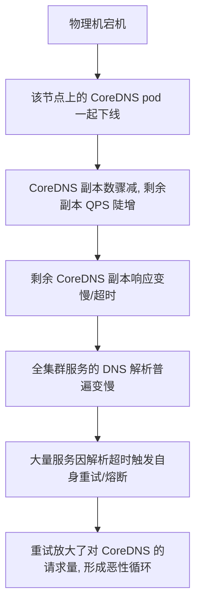
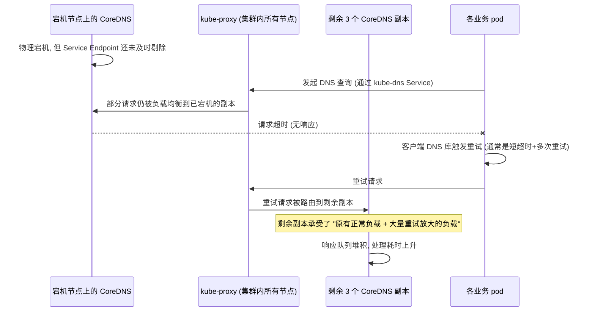

# 一台物理机宕机为什么能引发全局 DNS 雪崩

## 前言

一台 K8s worker 节点物理宕机，直觉上的影响范围应该是"这台机器上跑的那几个 pod 挂了，重新调度到别的节点就好"。但这次故障的实际影响远超预期——集群内几乎所有服务在故障发生后的几分钟内都出现了不同程度的 DNS 解析超时，哪怕这些服务的 pod 压根没有部署在那台宕机的节点上。

一台机器的物理故障，为什么能演变成全局性的解析问题？这篇文章按时间线复盘这次排查,重点是**故障是怎么从局部扩散到全局的**，而不只是"最后怎么修复的"。



## 故障时间线

先按只读排查原则还原整个过程——这次排查全程没有对生产环境做任何修改性操作，先弄清楚发生了什么，再决定怎么处理。

### T+0：物理机宕机

监控首先报出的是一台 worker 节点 `NotReady`，紧接着 kubelet 心跳丢失。查看该节点的最后状态：

```bash
kubectl describe node <node-name>
```

```
Conditions:
  Type             Status    LastHeartbeatTime
  Ready            Unknown   2026-09-15T03:14:22Z
```

节点心跳在某个时间点后完全停止，没有任何 `NodeNotReady` 之前的降级过程（比如资源压力告警），符合物理机断电/硬件故障的特征，而不是渐进式的资源耗尽。

### T+1min：该节点上的 pod 被标记为 Unknown/Terminating

K8s 的默认容忍机制（`node.kubernetes.io/unreachable` taint，默认 5 分钟容忍时间）意味着这些 pod 不会立刻被重新调度，而是先进入一段等待期。这个等待期本身设计上是合理的——避免网络短暂抖动就触发大规模重新调度，但这次这台节点恰好承载了集群 DNS 组件（CoreDNS）的一部分副本，等待期内这些副本处于"名义上还在但实际不可用"的状态。

### T+2min~T+5min：全局 DNS 解析普遍变慢

这是最反直觉的一环。查看 CoreDNS 的部署情况：

```bash
kubectl get pods -n kube-system -l k8s-app=kube-dns -o wide
```

CoreDNS 部署了 4 个副本，其中 1 个恰好在这台宕机的节点上。表面上看，"4 个副本少了 1 个，还剩 3 个"，不应该造成这么大的影响，但实际观察到的是：**几乎全集群的服务发起的 DNS 查询都出现了延迟或超时**，不只是原本路由到那个副本的请求。

## 为什么少一个副本会拖垂全局解析

排查的关键突破点是查看 CoreDNS 自身的监控指标：

```bash
kubectl exec -n kube-system <coredns-pod> -- wget -qO- localhost:9153/metrics | grep coredns_dns_request_duration
```

发现剩余 3 个 CoreDNS 副本的请求耗时 P99 从平时的 2ms 飙升到 300ms+，同时 `coredns_dns_requests_total` 的总量在这段时间内也在明显攀升,而不是按预期减少到"少了一个副本应该分担的量"。



问题的核心在两层叠加：

**第一层：Endpoint 剔除的时间差**。K8s 通过 kubelet 心跳丢失判断节点不可达，再到 Endpoint Controller 把该节点上的 pod 从 Service 的 Endpoints 列表里剔除，这中间有一段时间差（不是瞬时的）。在这段时间差里，`kube-proxy` 的负载均衡规则里仍然包含那个已经不可达的 CoreDNS 副本地址，一部分请求会被转发过去,直接超时,没有响应。

**第二层：客户端重试放大**。大多数应用里 DNS 客户端库的默认行为是"短超时+快速重试"（比如 glibc resolver 默认 5 秒超时但很多容器化场景配置得更短，重试 2~3 次）。当一部分请求命中了已宕机的副本、超时之后，客户端会重试，这个重试请求会被重新路由——大概率路由到剩余健康的副本上。这意味着：**每一个原本会失败的请求，都变成了"至少一次失败尝试 + 一次或多次重试尝试"，实际打到健康副本上的总请求量，比正常情况下的负载分摊还要多**，形成了请求量的放大。

而 CoreDNS 的资源配置（CPU/内存 limit）是按"平时正常分摊到 4 个副本"的量级配置的，剩余 3 个副本要扛住"正常负载的 4/3 倍 + 重试放大的额外量"，直接被压垫脚线，响应变慢，变慢又进一步加剧了后续请求的超时和重试——这是一个自我强化的恶性循环。

## 排查中的一个误判和纠正

排查初期,一度怀疑是 CoreDNS 自身的资源配置不足（CPU limit 太低），因为监控图上确实看到 CoreDNS pod 的 CPU 使用率在故障期间打到了 limit 上限。但如果只看这一层信息就直接下结论"扩大 CoreDNS 资源配置"，会漏掉真正的根因——**CPU 打满是结果,不是原因**，根因是"节点宕机到 Endpoint 剔除之间的时间差"和"客户端重试放大"这两个因素叠加导致的请求量异常。单纯加大资源配置能提高系统能扛住这类冲击的上限，但不能消除问题本身，下次节点数更少或者故障影响面更大时，同样的问题还会复现。

## 处理方案

这次给出的方案分了两个层次，分别对应"快速止血"和"长期改善"：

### 快速止血：加速 Endpoint 收敛

```yaml
# kubelet 侧调整节点不可达后的容忍时间, 让 Endpoint 更快被剔除
# 注意: 调得太短会增加网络抖动误判为节点故障的风险, 需要权衡
apiVersion: v1
kind: Pod
spec:
  tolerations:
    - key: node.kubernetes.io/unreachable
      operator: Exists
      effect: NoExecute
      tolerationSeconds: 30  # 从默认 300 秒收窄到 30 秒, 仅针对 CoreDNS 自身的容忍配置
```

同时给 CoreDNS 增加了 `readinessProbe`，配合 Service 的健康检查机制，让不健康的副本更快从负载均衡池里被剔除，而不完全依赖节点级别的心跳判断。

### 长期改善：提高 CoreDNS 的抗冲击能力

| 措施 | 作用 |
|------|------|
| CoreDNS 副本数从 4 提升到 6，并配置反亲和性（跨节点/跨可用区分布） | 单节点故障时,剩余副本承担的负载增量比例更小 |
| 客户端侧引入 DNS 本地缓存（如 NodeLocal DNSCache） | 大部分重复查询在节点本地缓存命中，不需要每次都打到 CoreDNS，从源头减少重试放大的基数 |
| 调整业务 pod 的 DNS 客户端超时和重试策略,避免过于激进的短超时快速重试 | 减少"雪崩式重试"的触发概率 |

其中 NodeLocal DNSCache 的收益最明显——它在每个节点上跑一个本地的 DNS 缓存代理，业务 pod 的 DNS 查询优先命中本地缓存，只有缓存未命中才会真正打到 CoreDNS，这从根本上降低了 CoreDNS 需要承受的请求基数，即使发生类似的节点故障，冲击也会被本地缓存吸收掉大部分。

## 效果

引入 NodeLocal DNSCache 和调整副本数/反亲和性之后，用一次类似的节点计划性维护（主动 drain 一台承载 CoreDNS 副本的节点）做了验证：

| 指标 | 优化前（真实故障期间观察） | 优化后（模拟节点下线验证） |
|------|---------------------------|---------------------------|
| 全局 DNS 解析 P99 | 300ms+，持续约 5 分钟 | 无明显变化，稳定在 2~3ms |
| 剩余 CoreDNS 副本 CPU 峰值 | 打满 limit | 峰值上升但远低于 limit（约 40%） |
| 受影响的业务服务数量 | 几乎全部服务出现解析异常日志 | 无异常日志 |

## 一些值得记住的判断原则

这次复盘留下的最有价值的经验，不是具体的参数调整,而是排查思路上的两点：

- **看到"资源打满"不要直接下结论"资源不够"**，先确认这个"打满"是原因还是结果——本文案例里 CPU 打满是请求量异常放大的结果,根因在别处。
- **单点故障的影响范围,要考虑"共享组件"而不只是"共同调度的 pod"**。这台宕机节点上没有承载任何业务 pod，只承载了一个 CoreDNS 副本，如果只看"这台节点上跑了什么业务"，很容易漏掉"这台节点承载的基础设施组件，其故障半径会波及全集群"这个更隐蔽的影响链路。

## 总结

- ❌ 一台节点宕机的影响范围，不能只看这台节点上直接跑了哪些业务 pod
- ✅ K8s 的 Endpoint 剔除存在时间差，这个时间差 + 客户端重试机制，会把局部故障放大成全局冲击
- ✅ 看到资源使用率打满，先确认是原因还是结果，别急着扩容了事
- ✅ NodeLocal DNSCache 从源头削减了 CoreDNS 需要承受的请求基数，是应对这类冲击最有效的长期手段

## 相关文章

- [一天 300GB 日志是怎么打出来的：生产环境误开 DEBUG 的治理](./一天300GB日志的治理.md)

## 参考资料

- [Kubernetes 官方文档：DNS for Services and Pods](https://kubernetes.io/docs/concepts/services-networking/dns-pod-service/)
- [NodeLocal DNSCache 官方文档](https://kubernetes.io/docs/tasks/administer-cluster/nodelocaldns/)
- [CoreDNS 官方文档](https://coredns.io/manual/toc/)
