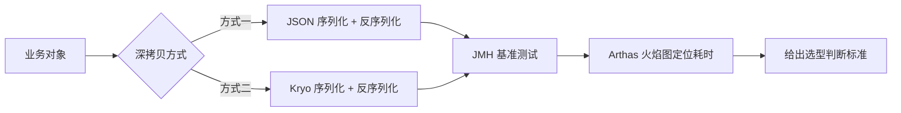
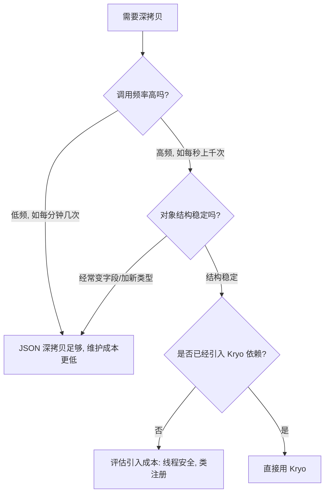

# Kryo 深拷贝 vs JSON 深拷贝：用真实业务对象和火焰图说话

## 前言

项目里有一段"深拷贝一个复杂业务对象再做异步处理"的逻辑，原来用的是 `JSONUtil` 序列化再反序列化的老套路。有人建议换成 Kryo，理由是"Kryo 快"。这个理由没错，但不够——快多少、在什么条件下快、换了之后要多接受哪些约束，这些问题网上的文章基本不会告诉你具体数字，多半是抄一个通用 benchmark 的结论。

所以干脆自己测一遍：用项目里真实的业务对象（而不是简单的 POJO），跑 JMH 基准测试,再用 Arthas 火焰图看清楚两种方案的耗时到底花在哪一步。



## 为什么需要深拷贝

场景很常见：一个设备状态对象需要同时给多个下游异步处理（写库、推送、统计），如果直接传引用，某个下游改了字段，其他下游看到的就是被污染的数据。深拷贝在这类场景里是必要的隔离手段，问题只在于怎么拷贝。

两种常见做法：

```java
// 方式一：JSON 深拷贝（基于 Hutool JSONUtil）
public static <T> T deepCopyByJson(T source, Class<T> clazz) {
    String json = JSONUtil.toJsonStr(source);
    return JSONUtil.toBean(json, clazz);
}

// 方式二：Kryo 深拷贝
public static <T> T deepCopyByKryo(T source) {
    Kryo kryo = KRYO_THREAD_LOCAL.get();
    return kryo.copy(source);
}
```

JSON 方案胜在直观、几乎不需要额外配置；Kryo 方案需要注册序列化器、处理线程安全（`Kryo` 实例本身不是线程安全的），门槛更高。门槛高不高不是重点，重点是：值不值得为了这个性能收益接受这些额外约束。

## 基准测试设计

### 测试对象

用的是项目里真实的设备状态对象，不是简化过的示例，字段结构大概是这样（字段名已做脱敏处理）：

```java
public class DeviceState {
    private String deviceId;
    private String productKey;
    private Long timestamp;
    private Integer status;
    private Map<String, Object> properties;      // 通常 15~30 个属性
    private List<AlarmRecord> alarms;             // 0~5 条告警记录
    private DeviceLocation location;               // 嵌套对象
    private Map<String, String> tags;
    // ... 共 22 个字段，3 层嵌套
}
```

选真实对象而不是简单 POJO 是关键——很多网上的 benchmark 用一个只有 3、4 个字段的扁平对象去测，这种测试结果对"深拷贝一个 3 层嵌套、包含 List 和 Map 的业务对象"没有参考价值。嵌套层级和集合字段越多，两种方案的差距通常会被放大。

### JMH 基准代码

```java
@BenchmarkMode(Mode.AverageTime)
@OutputTimeUnit(TimeUnit.MICROSECONDS)
@State(Scope.Thread)
@Warmup(iterations = 5, time = 1)
@Measurement(iterations = 10, time = 1)
@Fork(2)
public class DeepCopyBenchmark {

    private DeviceState source;
    private Kryo kryo;

    @Setup
    public void setup() {
        source = buildRealisticDeviceState(); // 构造接近真实数据量的对象
        kryo = new Kryo();
        kryo.setInstantiatorStrategy(new StdInstantiatorStrategy());
        kryo.setRegistrationRequired(false);
    }

    @Benchmark
    public DeviceState jsonDeepCopy() {
        String json = JSONUtil.toJsonStr(source);
        return JSONUtil.toBean(json, DeviceState.class);
    }

    @Benchmark
    public DeviceState kryoDeepCopy() {
        return kryo.copy(source);
    }
}
```

用 JMH 而不是自己写循环加 `System.currentTimeMillis()` 计时，是因为 JVM 的 JIT 编译、GC 时机都会干扰简单计时的准确性——JMH 内置的预热、多轮 fork 能把这些干扰降到可控范围。

## 测试结果

在同一台机器上（8 核 / 16G，JDK 17）跑出的结果：

| 拷贝方式 | 平均耗时（单次调用） | 相对倍数 |
|----------|---------------------|----------|
| JSON 深拷贝 | 18.6 μs | 1x（基准） |
| Kryo 深拷贝 | 3.2 μs | 5.8x |

单看这个数字，Kryo 确实快了近 6 倍。但这只是耗时对比，实际决策还要看另外两个维度：**内存分配**和**吞吐量下的表现**。

### 内存分配对比

用 JMH 的 `-prof gc` 参数统计每次调用分配的内存：

| 拷贝方式 | 单次调用分配内存 |
|----------|-----------------|
| JSON 深拷贝 | 约 4.8 KB（字符串中间产物 + 反射构造对象） |
| Kryo 深拷贝 | 约 1.1 KB（直接对象图拷贝，无字符串中间态） |

JSON 方案多出来的内存分配主要来自序列化过程中产生的 JSON 字符串——这个字符串本身就是一次性的中间产物，用完就扔，但这些分配会直接推高 Young GC 的频率。在高 QPS 场景下，这个差距会被放大成 GC 停顿的差距。

## 用 Arthas 火焰图看清楚耗时花在哪

数字说明了"快多少"，但没说明"为什么快"。用 Arthas 的 `profiler` 命令对两种方案分别抓 CPU 火焰图，能看到耗时具体分布在哪一层调用。

```bash
# 对跑 JSON 深拷贝的压测线程抓 30 秒火焰图
profiler start --event cpu
# ... 压测 30 秒 ...
profiler stop --format html -f /tmp/json-deepcopy-profile.html
```

JSON 方案的火焰图里，耗时大头集中在两块：

- `JSONUtil.toJsonStr` 内部的反射取字段值 + 字符串拼接（尤其是嵌套的 `Map<String, Object>` 字段，反射代价会随嵌套层级叠加）
- `JSONUtil.toBean` 里的反射构造对象 + 类型转换（JSON 里数字默认解析成 `Double`，反序列化回 `Integer`/`Long` 字段时要做一次类型转换）

Kryo 方案的火焰图则明显更"扁"——耗时集中在对象图的直接遍历拷贝，没有字符串构建和反射类型转换这两层开销。Kryo 通过 `StdInstantiatorStrategy` 绕过了构造函数调用（不走 `new`，直接用字节码层面的对象分配），这也是它比反射式 JSON 反序列化快的原因之一。

一句话总结这次火焰图对比的发现：**JSON 深拷贝的额外开销不在"序列化"本身，而在"序列化产生的字符串"和"反序列化时的反射与类型转换"这两个中间过程。**

## 该选哪个：判断标准而不是无脑抄结论

看到"Kryo 快 6 倍"就无脑换掉所有 JSON 深拷贝，是另一种形式的"没有真正理解问题"。实际选型要看三个条件：



- **调用频率低**：JSON 方案的可读性和调试便利性（出错时能直接打印 JSON 字符串看数据）价值更高，几微秒的差距在业务上几乎无感
- **对象结构频繁变化**：Kryo 对某些类型（如带自定义 `readObject`/`writeObject` 的类，或者动态代理生成的类）需要额外配置序列化器，JSON 方案的兼容性更好、改动成本更低
- **高频调用且结构稳定**：Kryo 是明显更优的选择，尤其是在这类深拷贝逻辑处于压测能压到的热点路径上时

实际项目里的选择是：**高频、结构稳定的核心链路换成 Kryo，低频、字段还在迭代的边缘逻辑保留 JSON**，而不是全量替换。全量替换看起来"更彻底"，但对低频路径而言,收益趋近于零,却要为此多维护一套线程安全和类型注册的复杂度。

## 使用 Kryo 需要注意的坑

如果决定引入 Kryo，有两个容易踩的坑：

**线程安全**：`Kryo` 实例本身不是线程安全的，不能像 `ObjectMapper` 那样做成单例直接共享。常见做法是用 `ThreadLocal` 复用：

```java
private static final ThreadLocal<Kryo> KRYO_THREAD_LOCAL = ThreadLocal.withInitial(() -> {
    Kryo kryo = new Kryo();
    kryo.setInstantiatorStrategy(new StdInstantiatorStrategy());
    kryo.setRegistrationRequired(false); // 生产环境建议改为 true 并显式注册，兼顾性能与可控性
    return kryo;
});
```

`setRegistrationRequired(false)` 图个方便，但生产环境更推荐显式注册所有需要拷贝的类——不注册时 Kryo 会用类全名做类型标识，注册后可以用更小的整数 ID，多一层性能收益，也避免拷贝到未预期的类型。

**不支持的类型**：Kryo 对某些 JDK 内置类型（比如某些 `Collections.unmodifiableXxx` 包装类）默认不友好，遇到反序列化异常时，优先检查是不是拷贝的字段里混了这类特殊集合包装。

## 总结

- ❌ "Kryo 比 JSON 快"是笼统结论，没有说明快在哪一层、值不值得为此换方案
- ✅ 用真实业务对象（多层嵌套、含集合字段）做基准测试，结果才有参考价值
- ✅ 火焰图能看清楚耗时具体花在序列化的哪个环节，而不只是知道"耗时多少"
- ✅ 选型看调用频率和对象结构稳定性，而不是无脑全量替换

## 相关文章

- [高并发缓存同步 RSC方案](./高并发缓存同步%20RSC方案.md)
- [Redis Hash 缓存往返次数优化](./Redis%20Hash%20缓存往返次数优化.md)

## 参考资料

- [Kryo GitHub](https://github.com/EsotericSoftware/kryo)
- [JMH 官方文档](https://github.com/openjdk/jmh)
- [Arthas profiler 命令文档](https://arthas.aliyun.com/doc/profiler.html)
