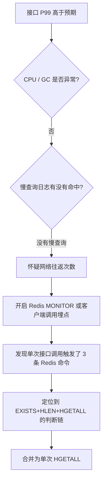

# Redis Hash 缓存往返次数优化：从 3 次调用到 1 次

## 前言

这是一个很容易被忽略的性能问题：单看某一行代码，你不会觉得它有什么问题——判断存在、判断长度、再取数据，逐层递进，逻辑上无可指摘。但把这几行摆在一起看，会发现它对 Redis 发了三次网络请求，而这三次请求原本可以合并成一次。

问题出现在一个设备属性缓存的读接口上。压测时这个接口的 P99 比预期高了不少，火焰图上看不出明显的慢查询，CPU 也不高，问题最后定位在网络往返（RTT）上——不是慢，是"跑了三趟"。


三次调用，三次网络往返，即使每次只要 0.3ms，单机房内网也白白多花了 0.6ms，而在真实环境里，往返成本远不止这个数字。

## 问题代码是怎么长成这样的

代码本身的演化路径很典型，基本是"每次加一个判断"的自然结果。

```java
public Map<String, String> getDeviceAttrs(String deviceId) {
    String key = "device:attrs:" + deviceId;

    // 第一版：判断 key 是否存在，不存在直接返回空
    if (!redisTemplate.hasKey(key)) {
        return Collections.emptyMap();
    }

    // 后来发现空 Hash 和不存在的 key 都会导致上面判断通过，
    // 于是加了一层"数据是否完整"的校验
    Long size = redisTemplate.opsForHash().size(key);
    if (size == null || size == 0) {
        return Collections.emptyMap();
    }

    // 最后才是真正要的数据
    return redisTemplate.<String, String>opsForHash().entries(key);
}
```

`hasKey` 对应 `EXISTS`，`size` 对应 `HLEN`，`entries` 对应 `HGETALL`。三行代码，三条命令，三次网络往返。这段代码在低并发场景下完全不会暴露问题——本地开发环境里，一次 RTT 可能只有 0.1ms 都感觉不到延迟。但放到生产环境，尤其是跨可用区部署、或者这个方法被大量并发调用时，往返次数就会被放大成实际的耗时。

## 为什么"多判断几次"看起来更安全，实际上是伪安全

写这段代码的人多半是出于防御性编程的直觉：怕 key 不存在时 `HGETALL` 返回什么奇怪的东西，怕空 Hash 和不存在的 key 混在一起处理出错。但事实是，Redis 对这两种情况的行为本来就是明确且一致的：

| 场景 | `EXISTS` | `HLEN` | `HGETALL` |
|------|----------|--------|-----------|
| key 不存在 | 0 | 0 | 空 Map（不是 null，是空集合） |
| key 存在但 Hash 为空 | 0（Redis 会在 Hash 所有字段被删除后自动删掉这个 key） | 0 | 空 Map |
| key 存在且有数据 | 1 | 字段数 | 正常 Map |

关键点在这里：**Redis 的 Hash 类型没有"存在但为空"这个状态**。当一个 Hash 的所有字段都被 `HDEL` 删除后，这个 key 会被 Redis 自动清除，`EXISTS` 也会返回 0。也就是说，`HGETALL` 本身就已经完整覆盖了"存在"和"不存在"两种情况——不存在时直接返回空 Map，不需要用 `EXISTS` 或 `HLEN` 提前判断。

一句话总结这次排查的核心发现：**判断"要不要取数据"的逻辑，往往可以合并进"取数据"这一步本身，而不需要单独发一次请求去判断。**

## 优化方案

### 方案对比

| 方案 | 网络往返 | 说明 |
|------|---------|------|
| 原始实现（EXISTS + HLEN + HGETALL） | 3 次 | 每一步都是独立的同步调用 |
| 直接 HGETALL，用返回值判空 | 1 次 | 用 `isEmpty()` 替代存在性判断 |
| Pipeline / RBatch 打包三条命令 | 1 次（但仍执行 3 条命令） | 命令数没变，只是合并了往返，适合"确实需要三个结果"的场景 |

对这个场景，最优解不是"把三条命令打包在一次往返里发出去"（那是 pipeline 该做的事），而是**根本不需要另外两条命令**：

```java
public Map<String, String> getDeviceAttrs(String deviceId) {
    String key = "device:attrs:" + deviceId;
    Map<String, String> attrs = redisTemplate.<String, String>opsForHash().entries(key);
    // HGETALL 对不存在的 key 返回空 Map，天然覆盖了"不存在"和"存在但为空"两种情况
    return attrs;
}
```

从三行判断压缩成一行调用，接口逻辑没有任何变化,但网络往返从 3 次降到 1 次。

### 如果真的需要多条命令，用 Pipeline 而不是逐条同步调用

上面这个案例比较幸运，三条命令本身就是冗余的。但生产代码里更常见的情况是：确实需要拿多个不同 key 或不同类型的数据，这时候减少判断没用，得靠 pipeline（Redisson 里对应 `RBatch`）把多条命令打包进一次往返：

```java
public DeviceSnapshot getDeviceSnapshot(String deviceId) {
    RBatch batch = redissonClient.createBatch();
    RFuture<Map<Object, Object>> attrsFuture = batch.getMap("device:attrs:" + deviceId).readAllMapAsync();
    RFuture<Long> onlineFuture = batch.getBucket("device:online:" + deviceId).sizeAsync();
    RFuture<Set<Object>> tagsFuture = batch.getSet("device:tags:" + deviceId).readAllAsync();

    batch.execute(); // 一次网络往返，三条命令一起发出去

    return new DeviceSnapshot(
        attrsFuture.getNow(),
        onlineFuture.getNow(),
        tagsFuture.getNow()
    );
}
```

这里三条命令确实各自承担不同的职责，没法合并成一条，但通过 `RBatch` 把它们打包，网络往返依然是 1 次。这和前面"去掉多余判断"是两个不同层次的优化：**先问自己是不是真的需要这么多条命令，再考虑怎么把必要的命令打包发出去。**

## 效果

这个改动在压测环境下的对比：

| 指标 | 优化前 | 优化后 |
|------|--------|--------|
| 单次调用往返数 | 3 | 1 |
| 接口 P99（同机房 Redis） | 2.1ms | 0.9ms |
| 接口 P99（跨可用区 Redis） | 5.8ms | 2.3ms |
| Redis QPS 占用（相同业务 QPS 下） | 3x | 1x |

跨可用区的收益比同机房更明显，这也符合直觉：往返次数的收益和单次 RTT 成正比，RTT 越高，省掉的两次往返价值越大。另外一个容易被忽视的收益是**Redis 自身的 QPS 占用降了 2/3**——这不只是接口变快了，Redis 实例的压力也实打实降下来了，对同一个 Redis 集群上的其他业务也是间接的减负。

## 排查思路：怎么发现这类问题

这次问题不是靠"看代码"发现的，而是先看到接口 P99 异常，再一层层排查过去的：



`CPU` 和 `GC` 都正常、也没有慢查询,这个组合往往就该怀疑"次数"而不是"速度"——单次调用不慢，但调用次数比预期多。定位这类问题最直接的方式是给 Redis 客户端加一层调用埋点，统计"一次业务接口调用触发了几条 Redis 命令"，如果这个数字比你预期的高,大概率就是这种可以合并的判断链。

## 适用场景与局限性

这个优化思路不是对所有场景都适用：

- **适用**：多条命令之间存在"判断-取值"这种递进关系，且后一条命令的返回值本身已经能表达前面判断的结果（如本文的 `HGETALL` 案例）。
- **不适用**：多条命令之间是并列关系，各自承担不同职责，无法合并——这种情况应该用 pipeline/批量接口打包往返，而不是强行合并语义。
- **要小心的场景**：如果 Hash 里存的字段数量很大（比如上千个字段），一次 `HGETALL` 会比 `HLEN` 判断后再决定要不要取全量数据的成本更高。这种情况下，"减少往返"和"减少单次传输量"是有冲突的，需要按实际字段数量做取舍，比如改用 `HRANDFIELD` 或按需的 `HMGET` 取部分字段。

往返次数优化的本质,是先确认"这几条命令是不是必须分开发",而不是一上来就套用 pipeline。合并判断链是免费的性能提升；打包必要的多条命令则是有成本的工程手段（批处理逻辑、错误处理都要跟着变复杂）,该用在真正无法合并的场景上。

## 总结

- ❌ 用 `EXISTS` / `HLEN` 做存在性判断,再单独取数据,是很多人写缓存读取逻辑时的默认写法,但对 Hash 类型往往是多余的
- ✅ `HGETALL` 对不存在的 key 天然返回空 Map,判空逻辑可以直接合并进取值这一步
- ✅ 如果确实需要多条独立命令,用 pipeline/RBatch 打包往返,而不是逐条同步调用
- ✅ 排查"次数"类问题时,CPU/GC 正常 + 无慢查询,基本可以确定往网络往返方向查

## 相关文章

- [高并发缓存同步 RSC方案](./高并发缓存同步%20RSC方案.md)
- [Kafka Partition 规划与问题处理](../消息队列与流量治理/Kafka%20Partition%20规划与问题处理.md)

## 参考资料

- [Redis HGETALL 命令文档](https://redis.io/commands/hgetall/)
- [Redisson RBatch 文档](https://github.com/redisson/redisson/wiki/10.-additional-features#103-batches-execution-of-several-commands-in-a-batch)
