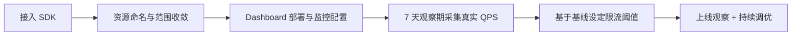
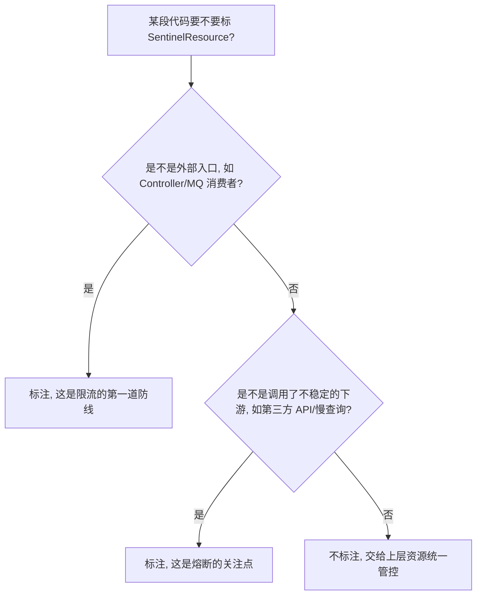
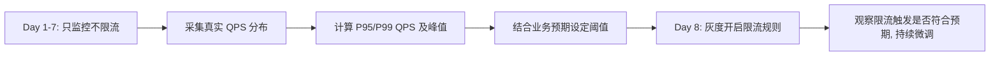

# Sentinel 从 0 到 1 接入生产：范围收敛、Dashboard 运维和 7 天 QPS 基线制定

## 前言

Sentinel 接入本身的技术门槛不高——加依赖、配置 Dashboard 地址、给关键接口标注资源名，半天就能跑起来。真正决定这次接入是"能落地的治理工具"还是"上线后就没人管的摆设"，在于三件接入文档通常不会重点讲的事：监控范围要不要收敛、Dashboard 怎么用在日常运维里、限流阈值怎么定而不是拍脑袋写一个数字。

这篇文章记录的是一次真实的从 0 到 1 接入过程，按时间顺序讲清楚每一步踩到的问题和处理方式。



## 第一步：接入本身很快,但资源范围要先想清楚

Sentinel 的资源（Resource）概念很灵活——理论上可以给任意一段代码打标，细到每个 Service 方法都能单独限流。但"能做到"不代表"应该这么做"。

### 遇到的问题：资源数量爆炸

第一版接入,团队里几个人各自给自己负责的接口都加了 `@SentinelResource`,标注粒度也不统一——有人标注到 Controller 方法,有人标注到 Service 内部的某个私有方法,还有人给每个下游 RPC 调用都单独标了资源名。上线一周后,Dashboard 里的资源列表滚了几百条,而且大部分资源没有配置任何规则,纯粹是"标了但没人管"。

```java
// 问题写法: 粒度不统一, 命名随意
@SentinelResource(value = "getUserInfo")           // 有人标 Controller
@SentinelResource(value = "checkDeviceStatusInner") // 有人标内部私有方法
@SentinelResource(value = "rpc-call-1")             // 有人标 RPC 调用, 命名没有语义
```

更实际的影响是 Prometheus 抓取 Sentinel 指标时的开销——Sentinel 默认会把每个资源的实时指标暴露给监控系统，资源数量一旦超过某个量级（这次实测在 1000+ 左右开始出现明显影响），Prometheus 抓取的耗时和存储量都会明显上涨，Sentinel 官方对这种情况有一个 `__overflow__` 聚合机制，超出上限的资源会被归并到一个统一的 `__overflow__` 桶里统计，这本身是一种保护措施，但代价是这些资源各自的监控数据就丢失了细粒度——相当于治理工具本身先变成了需要被治理的对象。

### 处理方案：收敛到"值得单独治理"的粒度

重新规划资源命名和标注范围，原则是**只给真正需要独立限流/熔断决策的地方打资源标**，不是所有方法都需要：



按这个原则重新梳理后，资源数量从几百条收敛到 60 多条，命名也统一成 `{业务域}-{动作}` 的格式（比如 `device-report`、`device-query`），Dashboard 里终于能一眼看完所有资源，而不是要翻好几页去找自己关心的那个。

## 第二步：把 Dashboard 用成日常运维工具,而不是只在出问题时才打开

Sentinel Dashboard 默认的部署方式是单实例、数据存内存——这个默认配置对"测试一下功能"够用，但对生产运维不够用，原因是：

- Dashboard 重启后，之前配置的规则会丢失（除非配合了持久化数据源，比如 Nacos/ZooKeeper）
- 单实例部署意味着 Dashboard 本身也是个单点，如果它挂了，虽然不影响已生效的限流规则（规则在客户端内存里持续生效），但会失去实时监控和动态调整规则的能力

### 处理方案：规则持久化到 Nacos

把规则源从"Dashboard 内存"换成 Nacos，Dashboard 变成一个"编辑器"，真正的规则存储和推送交给 Nacos：

```java
@Configuration
public class SentinelNacosConfig {

    @PostConstruct
    public void initFlowRules() {
        ReadableDataSource<String, List<FlowRule>> flowRuleDataSource =
            new NacosDataSource<>(nacosProperties, "SENTINEL_GROUP",
                "device-service-flow-rules",
                source -> JSON.parseArray(source, FlowRule.class));
        FlowRuleManager.register2Property(flowRuleDataSource.getProperty());
    }
}
```

改完之后，Dashboard 重启不再丢规则，而且规则变更历史可以在 Nacos 的配置历史里追溯——这一点在后续排查"这个限流值是什么时候改的、谁改的"这类问题时很有用，纯内存模式完全没有这个能力。

### 日常运维怎么用

把 Dashboard 纳入日常巡检的一部分，具体做的是：

- 每天上班第一件事看一眼实时监控里的通过 QPS/拒绝 QPS 曲线，判断昨晚有没有异常的限流触发
- 每次大促/活动前，提前把相关资源的阈值临时上调（活动结束后再调回基线值），而不是等触发限流了才手忙脚乱去改

## 第三步：限流阈值怎么定——7 天基线观察期

这是最容易被跳过、但最关键的一步。很多团队接入 Sentinel 之后，阈值是"随便写一个感觉安全的数字"，比如"这个接口应该不会超过 1000 QPS 吧，就设 1000"——这种拍脑袋的数字大概率是错的：设太低会误伤正常流量，设太高等于没设。

### 做法：先观察,不设限,采集真实数据

接入的前 7 天，先只做监控，不配置任何限流规则（`FlowRule` 全部留空或设成一个明显不会触发的极高值），纯粹用 Dashboard 和 Prometheus 采集这段时间的真实 QPS 分布：



7 天的窗口是为了覆盖一周内的完整业务周期（工作日/周末的流量模式往往不同，某些定时任务是按周触发的），只观察 1 天容易被单日的异常波动带偏。

采集到的数据大概是这样（某核心查询接口的示例）：

| 指标 | 数值 |
|------|------|
| 日常 P50 QPS | 320 |
| 日常 P95 QPS | 780 |
| 日常 P99 QPS | 1,150 |
| 7 天内峰值 QPS（周一上午高峰） | 2,400 |

### 阈值怎么定：不是直接照抄峰值

拿到这组数据之后，阈值不是直接设成峰值 2400——那等于允许历史上最坏的情况随时重现，没有给系统留任何缓冲。实际定阈值的逻辑是：

- 参考压测得到的**这个接口在保持 P99 响应时间稳定的前提下能承受的最大 QPS**（这次压测结果是 3200），而不是单纯照抄线上观察到的流量
- 在压测上限和线上峰值之间取一个留有余量的值，这次定的是 2800（压测上限的 87.5%），既留了安全边际，又不会离线上真实峰值太远导致误伤

```java
FlowRule rule = new FlowRule();
rule.setResource("device-query");
rule.setGrade(RuleConstant.FLOW_GRADE_QPS);
rule.setCount(2800);
rule.setControlBehavior(RuleConstant.CONTROL_BEHAVIOR_WARM_UP); // 冷启动模式, 避免刚超过阈值就硬拒绝
```

`WARM_UP` 冷启动模式是这次特意选的控制策略——直接硬拒绝（`CONTROL_BEHAVIOR_DEFAULT`）在真正触发限流的瞬间体验比较差（QPS 刚超过阈值就直接拒绝一部分请求），冷启动模式会在系统刚启动或者刚从低水位恢复时，逐步放开阈值到设定值，避免了流量突增瞬间的"陡坡式"拒绝。

## 灰度开启：先告警不拦截,再拦截

即使有了基于真实数据算出来的阈值，也没有直接一步到位设成"拦截模式"。中间加了一步——先设成"只告警不拦截"（通过自定义的 `RequestOriginParser` 加日志埋点，模拟规则触发但不真正调用 `SphU.entry()` 的拦截逻辑），观察一周确认没有误伤，再切换成真正拦截。

这一步在这次接入里确实拦到了一个问题——有个接口的阈值定低了（当时没考虑到月初有一个批量对账任务会集中调用这个接口），如果直接上线拦截模式，会误伤这个本身合理的批量任务。灰度期发现之后单独给这个来源加了白名单例外规则。

## 效果

接入 3 个月后的运行情况：

| 指标 | 数值 |
|------|------|
| 纳入监控的资源数 | 62 个（收敛后） |
| 配置了限流规则的资源数 | 24 个（只对真正有风险的资源配规则） |
| 3 个月内真实触发限流的次数 | 7 次，均对应到真实的异常流量（爬虫/客户端重试风暴等） |
| 误伤（限流规则拦截了正常业务流量）次数 | 1 次（灰度期发现，上线拦截前已修正） |

## 总结

- ❌ 给所有方法都标 `@SentinelResource` 看起来更全面，实际会导致资源爆炸，反而让治理工具本身变成负担
- ✅ 只对"外部入口"和"不稳定下游调用"两类地方做资源标注，把范围收敛到真正需要治理的粒度
- ✅ Dashboard 要配合持久化数据源（Nacos/ZooKeeper）才能真正用于日常运维，纯内存模式经不起重启
- ✅ 限流阈值来自 7 天真实流量基线 + 压测上限，不是拍脑袋写一个"应该够用"的数字，上线前先灰度观察再真正拦截

## 相关文章

- [Sentinel 限流从静态阈值到系统自适应保护](./Sentinel限流从静态阈值到系统自适应保护.md)

## 参考资料

- [Sentinel 官方文档](https://sentinelguard.io/zh-cn/docs/introduction.html)
- [Sentinel Dashboard 规则持久化](https://github.com/alibaba/Sentinel/wiki/在生产环境中使用-Sentinel)
