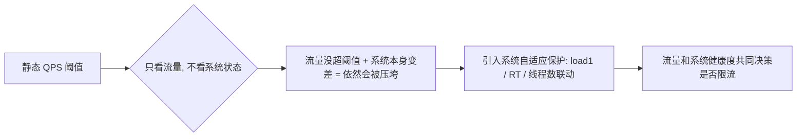
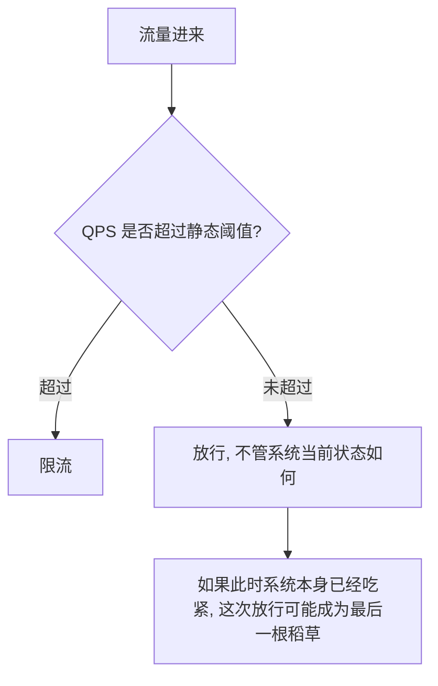
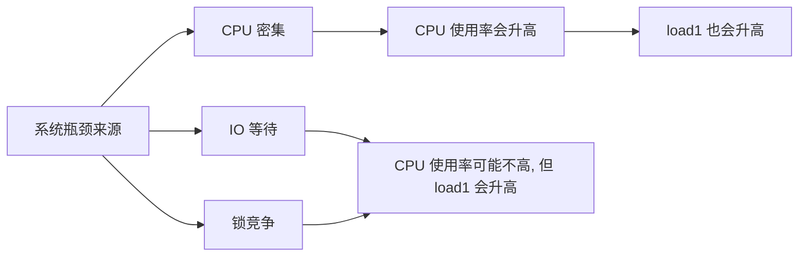

# Sentinel 限流从静态阈值到系统自适应保护

## 前言

[上一篇文章](./Sentinel从0到1接入生产实践.md)里，我们花了 7 天时间跑出了一份 QPS 基线，给核心接口配上了看起来很合理的静态阈值。这套方案在大多数时候确实管用——直到遇到一次"QPS 没超阈值，但系统已经在临界点上"的情况，才意识到静态阈值方案有一个结构性的盲区。



## 静态阈值的盲区

回顾一下问题现场：某个核心接口的静态 QPS 阈值是 2800（基于 7 天基线定的），当天的实际 QPS 只有 1900，明显低于阈值，Sentinel 完全没有触发限流。但同一时间段，这台机器上的另一个批处理任务正在跑一次全量数据校验，占满了大量 CPU 和 IO，导致整机的响应时间全面恶化——这个接口的 P99 从平时的 40ms 涨到了 900ms，虽然没有直接报错，但已经处于"随时可能连锁崩溃"的边缘。

问题的本质是：**静态 QPS 阈值只回答了"流量有多大"这一个问题，完全不知道"系统当前还能不能扛得住这么大的流量"**。同样是 1900 QPS，系统健康时轻松应对，系统本身已经吃紧时可能就是压垮骆驼的最后一根稻草。而静态阈值对这两种情况给出的是同一个答案——不限流。



## Sentinel 系统自适应保护：把"系统健康度"也纳入决策

Sentinel 提供了一套独立于资源级限流规则的机制——系统自适应保护（`SystemRule`），它不针对某个具体资源，而是从整机维度监控几个系统性指标，任何一个指标超过阈值，就对**所有入口流量**进行保护性限流，直到系统指标恢复正常。

```java
// 系统自适应保护规则配置示例
List<SystemRule> rules = new ArrayList<>();

SystemRule loadRule = new SystemRule();
loadRule.setHighestSystemLoad(4.0); // load1 阈值, 一般参考 CPU 核数 x 系数
rules.add(loadRule);

SystemRule cpuRule = new SystemRule();
cpuRule.setHighestCpuUsage(0.75); // CPU 使用率阈值
rules.add(cpuRule);

SystemRule rtRule = new SystemRule();
rtRule.setAvgRt(500); // 全局平均响应时间阈值(ms)
rules.add(rtRule);

SystemRule threadRule = new SystemRule();
threadRule.setMaxThread(800); // 并发线程数阈值
rules.add(threadRule);

SystemRuleManager.loadRules(rules);
```

这几个规则不是简单的"或"关系去粗暴限流，Sentinel 内部用的是一套基于 BBR（Bottleneck Bandwidth and RTT，参考自 TCP 拥塞控制算法思路）的自适应算法，核心逻辑是：只有当系统当前的"并发数"超过按照"当前吞吐量 x 最小响应时间"估算出来的最大处理能力时，才开始限流——不是指标一超红线就立即全面拒绝,而是动态计算系统当前真实能扛住多少。

### 为什么用 load1 而不是 CPU 使用率作为核心信号

配置里同时留了 `load1` 和 CPU 使用率两个指标，但实际生产上主要依赖的是 `load1`（1 分钟平均负载）。原因是 CPU 使用率反映的是"CPU 有多忙"，但 IO 等待、锁等待这些不占用 CPU 但同样会拖慢系统的因素，CPU 使用率是看不出来的——上面那次批处理任务如果主要瓶颈是磁盘 IO，CPU 使用率未必会飙高，但 `load1`（衡量的是"正在运行或等待运行的进程数"，会把 IO 等待的进程也算进去）会更早反映出系统整体在排队。



`load1` 能同时覆盖 CPU 密集和 IO/锁等待这几类瓶颈，这也是为什么它被当作系统自适应保护里最核心的一个信号，而不是仅仅依赖 CPU 使用率。

## 静态阈值 vs 系统自适应保护：不是替代关系,是互补

接入系统自适应保护之后一个容易想错的方向是——"这个更智能，是不是可以把之前配的静态资源级阈值都去掉"。实际上两者解决的是不同层面的问题，需要同时保留：

| 维度 | 静态资源级阈值（FlowRule） | 系统自适应保护（SystemRule） |
|------|---------------------------|------------------------------|
| 作用范围 | 单个资源（接口/方法） | 整机所有入口流量 |
| 决策依据 | 该资源自身的 QPS/并发数 | 整机 load1/CPU/RT/线程数 |
| 典型场景 | 某个接口被爬虫高频调用 | 系统整体健康度下降（不管是不是这个资源导致的） |
| 缺陷 | 看不到系统整体状态 | 无法针对性保护某个具体资源，触发时是全局性的 |

两者的关系更像是两道不同粒度的防线——`FlowRule` 是"这个资源自己是不是被打爆了"，`SystemRule` 是"不管具体是哪个资源的问题，整机是不是已经吃不住了"。只有 `FlowRule` 会漏掉本文开头那种"流量没超但系统本身吃紧"的场景；只有 `SystemRule` 又会导致没办法针对某个明确有问题的资源（比如被爬虫刷的接口）做精细化限流,必须等到整机指标恶化才会触发保护,反应会偏慢。

## 接入过程中的两个教训

### 教训一：阈值配得太激进,导致误触发

第一版把 `highestSystemLoad` 设成了 2.0（这台机器是 8 核），结果上线当天，一次正常的定时批量任务（本身设计上就会短时占用较高 CPU，是预期内的行为）就触发了系统保护，导致所有正常业务请求也被一并限流了几分钟。

问题在于**没有先观察这台机器在正常业务高峰 + 预期内的批量任务运行时,`load1` 实际能到多少**，直接套用了一个"看起来保守"的数字。补做了和静态阈值一样的观察步骤——跑几天，记录正常情况下（包括预期内的批处理任务运行时段）`load1` 的分布，最终把阈值调整为 6.0（约等于核数 x 0.75），既能在真正异常时兜底，又不会误伤已知的正常波动。

### 教训二：只在单机上验证不够,集群整体压力被忽略了

系统自适应保护是单机维度的决策——每台机器各自监控自己的指标，互相不通信。这在大多数场景下没问题，但如果流量分配不均衡（比如负载均衡策略有问题，导致某几台机器分到的流量明显高于其他机器），可能出现"整个集群总体健康，但个别机器已经触发保护"的情况，从整体看是局部限流，但从用户视角看，落到那几台"倒霉"机器上的请求会被拒绝。

这个问题最终不是靠 Sentinel 本身解决的——而是回头去检查负载均衡策略，确认流量分配确实均衡（这次排查发现是某个客户端的连接池配置导致长连接过度集中在少数几个后端实例上，是负载均衡上游的问题，不是 Sentinel 的问题）。这也是这次接入过程里一个值得记录的经验：**系统自适应保护能发现"这台机器扛不住了"，但不能替代对集群流量分布本身的检查**。

## 效果

引入系统自适应保护后 3 个月的观察：

| 指标 | 数值 |
|------|------|
| 系统自适应保护触发次数 | 4 次 |
| 其中对应到真实系统异常（GC 异常/批处理占用过高等） | 3 次 |
| 误触发（调优后已消除） | 1 次（教训一里提到的批处理场景，已通过调整阈值消除） |
| 触发保护后的平均恢复时间 | 90 秒左右（限流生效后系统指标回落，逐步恢复正常放量） |

有意思的是，3 次真实触发里，有 2 次事后排查发现是应用自身的 GC 问题（Full GC 期间 STW 导致瞬时 load 飙高），系统自适应保护在这种场景下起到的作用不是"解决了 GC 问题"，而是"在 GC 抖动期间先兜住一道，避免过多请求在这个窗口内堆积造成雪崩式恶化"，问题的根本解决还是要回到 GC 调优本身。

## 总结

- ❌ 静态 QPS 阈值只回答"流量多大"，回答不了"系统当前还能不能扛"，两者不是一回事
- ✅ Sentinel 系统自适应保护基于 load1/CPU/RT/线程数等系统级信号，能兜住"流量没超但系统已经吃紧"的场景
- ✅ `load1` 比单纯的 CPU 使用率更能反映 IO 等待和锁竞争带来的系统压力，是更合适的核心信号
- ✅ 系统自适应保护和资源级静态阈值是互补关系，不是替代关系，两道防线的粒度和作用范围不同
- ✅ 阈值同样需要先观察再配置，不能凭感觉设一个"看起来保守"的数字，容易和预期内的正常波动冲突

## 相关文章

- [Sentinel 从 0 到 1 接入生产：范围收敛、Dashboard 运维和 7 天 QPS 基线制定](./Sentinel从0到1接入生产实践.md)

## 参考资料

- [Sentinel 系统自适应保护官方文档](https://sentinelguard.io/zh-cn/docs/system-adaptive-protection.html)
- [BBR 拥塞控制算法简介](https://en.wikipedia.org/wiki/TCP_congestion_control#TCP_BBR)
