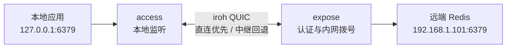
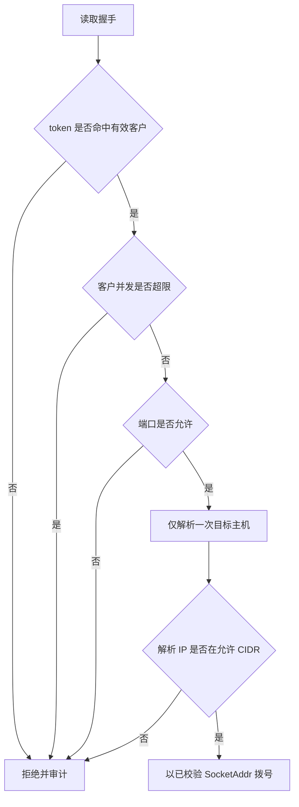

# PowerMap 项目复盘：从 P2P 连通到可控内网访问

> 项目地址：[github.com/steven-ld/PowerMap](https://github.com/steven-ld/PowerMap)

## 前言：问题不是“打洞”，而是让访问可控

PowerMap 最初解决的是一个很具体的远程开发问题：服务在家里、办公室或实验室的内网，设备没有公网 IP，也无法配置路由器；但我希望本地的 Redis 客户端、IDE、浏览器和数据库工具仍然可以像访问本机服务一样访问它们。

最容易想到的答案是“做一条隧道”。但只要继续追问，就会发现连通只是开始：

- 隧道由谁发起？NAT 打洞失败怎么办？
- 只知道远端节点 ID 的人，能否借此扫描整个内网？
- token 泄漏后，如何只撤销一个使用者？
- 反向映射会不会反过来把本地服务暴露出去？
- 两个二进制、两套配置如何升级而不丢失已有映射？
- 浏览器必须使用原有 HTTPS 域名时，怎样不终止 TLS，也不污染 hosts 文件？

这篇文章不介绍“如何安装一个工具”，而是复盘 PowerMap 从 v0.1 到 v0.7 的设计过程：需求如何约束方案、几个关键选型为何成立，以及实现过程中遇到的问题如何被拆开解决。

## 1. 先定义边界：这是服务访问工具，不是全网 VPN

一开始必须明确不做什么。否则项目很容易从“远程访问两个服务”膨胀成“自建企业网络”。

PowerMap 的目标是：

```text
把远端受控内网服务，映射为本地的 127.0.0.1:端口。
```

例如：

```bash
redis-cli -h 127.0.0.1 -p 6379
psql -h 127.0.0.1 -p 5432 -U app
open http://127.0.0.1:3000
```

它刻意不承担以下职责：

- 不发布面向互联网的网站或 API。
- 不接管整张网卡、不下发全网路由。
- 不提供组织级 SSO、设备准入或终端安全管理。
- 不扫描远端内网来“自动发现”服务。

这个边界带来一个非常实际的结果：PowerMap 的本地映射默认监听在回环地址，业务应用仍然只连接 `127.0.0.1`。对应用来说，远端服务被“带回本地”；对网络来说，没有多开一个可被公网扫描的服务端口。

## 2. 方案选型：为什么最后选择 iroh + QUIC

在写代码前，我先按约束排除了几类常见方案。

| 方案 | 优点 | 在本项目中的问题 | 结论 |
|------|------|------|------|
| SSH 本地转发 | 简单、成熟、调试方便 | 前提是远端 SSH 可达；多服务和长期运维需要额外管理 | 适合已有跳板机，不作为基础能力 |
| FRP / 自建中转 | 模式清晰、生态成熟 | 需要公网服务器和入站端口；数据路径固定经中心节点 | 不符合“无公网 IP、优先直连” |
| WireGuard / Tailscale 类方案 | 网络能力完整、体验成熟 | 解决的是组网和路由问题，授权粒度容易扩大到整网 | 对少量服务访问偏重 |
| 自己实现 UDP 打洞 | 可完全控制协议 | STUN、候选地址、重传、中继回退和跨平台问题会吞掉项目周期 | 不值得重复造底层网络层 |
| iroh + QUIC | 节点发现、NAT 穿透、直连与中继回退已具备；Rust 集成自然 | 仍需自己设计授权、映射、可观测性和运维 | 选择 |

最终的选择不是“QUIC 比 TCP 更潮”，而是需求刚好需要它的三个能力：

1. **双方主动连出即可。** `access` 和 `expose` 都不需要监听一个面向公网、可扫描的 TCP 端口。
2. **优先点对点，失败自动降级。** 能直连就直连；遇到对称 NAT 或复杂网络时，仍可通过中继维持可用性。
3. **一条连接可以复用多个业务流。** 一个 Redis 客户端、浏览器并发请求、IDE 连接池，不必每次都重新建立 NAT 穿透链路。

因此 PowerMap 基于 iroh 的 N0 预设建立 QUIC Endpoint。`expose` 使用持久化身份，`access` 使用凭证中的 `node_id` 找到它；直连失败时，iroh 负责切换到中继路径。应用层只需关心“连接是否可用”和“这条流是否被授权”。



### 一个刻意没有做的选择：不把中继当业务网关

如果将中继设计成 HTTP 代理或业务网关，它会逐渐承担鉴权、服务发现、路由和审计，最后重新长成中心化转发平台。PowerMap 的中继只是不可直连时的密文搬运通道；真正的目标校验和内网拨号始终在 `expose` 所在网络完成。

这样做的代价是不能把一切逻辑放到中心节点统一解决；收益是数据路径、权限边界和故障域都更清晰。

## 3. 第一版架构：一条本地 TCP 连接对应一个 QUIC 流

PowerMap 的第一个可用版本只有一件事：将远端内网的 `host:port` 映射为本地端口。

为避免一个本地连接重新建立一次端到端链路，`access` 维护一条到 `expose` 的共享 QUIC 连接。每有一个本地 TCP 连接，只在共享连接上打开一条双向流。

```text
一条 access -> expose 的 QUIC 连接
├── 流 1：redis-cli
├── 流 2：IDE 数据库连接
├── 流 3：浏览器访问 Grafana
└── 流 4：同一映射的另一条连接
```

每条流的建立过程很小，也刻意保持稳定：

1. `access` 打开 QUIC 双向流。
2. 先写入一个有长度上限的握手头：`token`、目标主机、端口、传输类型。
3. `expose` 认证并校验目标策略。
4. `expose` 在自己所在内网拨号目标服务，返回成功或失败状态。
5. 两端开始双向字节透传。

握手头使用长度前缀 JSON，最大限制为 4 KB。它不是为了追求“协议优雅”，而是为了让协议能演进，同时避免恶意对端先塞入超大头部消耗内存。TCP 隧道建立后，PowerMap 只负责搬运字节；HTTP、Redis 和 PostgreSQL 的协议不需要被识别或改写。

### 细节问题：不能用一次 `copy_bidirectional` 就结束

最初看起来，双向转发似乎只需要一个 `copy_bidirectional`。但真实协议会依赖半关闭：一侧请求体发送完毕后关闭写方向，另一侧仍要继续返回响应。

因此 PowerMap 将两个方向的复制拆开处理：

- 本地到远端读到 EOF 后，只对 QUIC 发送方向执行 `shutdown`。
- 远端到本地继续转发，直到它也结束。
- 两个方向都结束后，才关闭这条隧道并更新指标。

这个细节让 HTTP/1.1 keep-alive 等依赖正常 FIN 语义的场景不至于出现“请求已经发完，但响应被提前截断”的问题。

## 4. 第一个安全问题：token 通过后，能访问什么

第一版如果只校验 token，实际上等同于给 token 持有者一台内网代理。只要他知道或猜到地址，就可以尝试访问 `expose` 所在网络中的任意端口。

这不是一个可以靠文档提醒解决的问题，授权必须落在**实际发起内网拨号的位置**。

### 4.1 从共享 token 走向客户策略

PowerMap 将 `expose` 端的授权抽象为客户注册表。每个客户独立拥有：

- token
- 允许访问的 CIDR 网段
- 允许访问的端口
- 最大并发流数
- 吊销状态
- 可选的审计归属

配置示例：

```toml
[expose]
identity = "powermap.key"
max_streams_per_conn = 256
dial_timeout_secs = 10
audit_log = "/var/log/powermap/audit.jsonl"

[[expose.clients]]
id = "developer"
token = "replace-with-a-long-random-token"
allow_networks = ["192.168.1.0/24"]
allow_ports = [6379, 5432, 3000]
max_streams = 32
published_targets = [
  { host = "192.168.1.101", port = 6379, label = "Redis 主库" },
  { host = "192.168.1.102", port = 5432, label = "PostgreSQL" },
]
```

收到一条流后，`expose` 按以下顺序处理：



token 比较使用常量时间逻辑；认证时始终遍历客户列表，而不是命中第一个 token 就返回，降低从比较耗时推断 token 前缀或客户位置的风险。

### 4.2 DNS 重绑定：看似是白名单，实际上可能被绕过

一个常见但隐蔽的错误是：

```text
先解析域名并检查 IP 是否在白名单
再用原始域名调用 connect
```

第二次 `connect(host, port)` 会再次 DNS 解析。如果 DNS 在两次解析之间变化，最终拨号的 IP 可能已经不在白名单内。

PowerMap 的处理方式是：解析一次，过滤得到允许的 `SocketAddr`，然后直接对这个已验证地址拨号。这个约束看起来只是实现细节，但它把“白名单检查的对象”和“实际连接的对象”固定为同一个值。

### 4.3 一个需要诚实面对的兼容性取舍

为了兼容旧配置，正向 `allow_networks` 或 `allow_ports` 留空时仍表示放行全部；反向策略的空列表则表示拒绝全部。前者对旧用户友好，但它不是适合生产环境的默认配置。

所以项目在文档和启动日志中明确提示：长期运行的 `expose` 节点必须显式填写 `allow_networks` 与 `allow_ports`。真正可靠的安全不是“代码支持白名单”，而是把白名单写进部署配置和审核流程。

## 5. 第二个架构问题：反向映射让 server/client 术语失效

当项目只支持“本地访问远端内网”时，叫 server/client 似乎没有问题。

但 v0.4 增加反向映射后，`expose` 可以在自己的内网监听一个端口：连接到这个端口的流量经既有 QUIC 连接送到 `access`，再由 `access` 回拨它自己一侧的服务。此时真正拨号本地目标的是原来的“client”。

继续用 server/client 描述，用户会遇到两个问题：

- 不知道应该在哪一端写哪条配置。
- 容易误以为配置了一个“server 监听”就默认可以访问另一端的所有服务。

因此项目把角色改为能力：

| 能力 | 责任 | 关键风险 |
|------|------|----------|
| `expose` | 将自己网络中的服务提供给远端 | 不能把内网变成任意代理 |
| `access` | 接入远端网络并提供本地映射 | 不能被远端反向利用来访问本机 |

这不仅是命名替换。两种方向采用了**刻意不同的空白名单语义**：

| 流量方向 | 校验位置 | 空白名单含义 |
|------|------|------|
| `access -> expose` 正向访问 | `expose` | 为兼容旧配置，空列表仍可放行 |
| `expose -> access` 反向访问 | `access` | 默认全部拒绝 |

反向访问必须同时打开总开关，并同时列出允许网段与端口：

```toml
[access]
reverse_enabled = true
reverse_allow_networks = ["127.0.0.0/8"]
reverse_allow_ports = [5900]
```

实现时没有把两者粗暴抽成一个“通用白名单配置”。底层可以复用 CIDR 解析和地址过滤，但正向 `TargetPolicy` 与反向 `ReversePolicy` 保持独立类型，避免未来维护时误把“空=放行”和“空=拒绝”统一掉。

这个选择的原则是：**可以复用无状态的解析逻辑，但不要复用承载安全语义的抽象。**

## 6. 第三个架构问题：两套二进制已经无法表达系统能力

v0.1 的 `powermap-server` 和 `powermap-client` 对正向场景足够直观；但反向映射、UDP、HTTP 网关加入后，一个节点可能同时具备暴露和接入两种能力。

继续维持两个二进制会带来真实的维护成本：

- 用户要先判断“这台机器应该装 server 还是 client”。
- 两边的配置、部署模板和升级路径不断重复。
- 同一台机器同时需要两种能力时，进程生命周期、日志和关闭顺序不好协调。
- 新功能的代码边界不再和 binary 边界一致。

v0.4 的解决方案是统一成一个 `powermap` 二进制，配置中按需存在 `[expose]` 和 `[access]`：

```toml
[expose]
identity = "powermap.key"

[access]
node_id = "remote-expose-node-id"
token = "credential-token"
web_bind = "127.0.0.1:8088"
```

### 6.1 迁移不是“读旧配置再写新配置”这么简单

旧版本已有 `powermap-server.toml`、`powermap-client.toml`、节点身份、凭证和映射。迁移过程如果先删除旧文件，后写新文件，一次磁盘写入失败就会让用户失去可用配置。

因此迁移被实现成原子步骤：

1. 读取所有存在的旧配置。
2. 转换为统一配置模型。
3. 校验合并结果。
4. 原子写入新的 `powermap.toml`。
5. 只有新文件成功写入后，才删除已经成功并入的旧文件。

统一入口启动两个角色时也使用同一个取消令牌：收到退出信号或任一角色初始化失败后，另一个角色会被通知停止。这个设计没有改变 A 到 B 的线上协议、凭证格式或白名单语义，降低了迁移的影响面。

## 7. 第四个难题：域名映射不能靠“改 DNS”草率解决

端口映射适合命令行和数据库工具，但有些 HTTPS 服务把域名写进跳转地址、Cookie 或回调配置。将它们改为 `http://127.0.0.1:8443` 往往会破坏业务。

v0.5 引入域名映射时，核心需求是：

```text
浏览器继续访问 https://ai-router.example.com
但连接实际经 PowerMap 到 expose 网络中解析到的同名 HTTPS 服务。
```

这里有三条不能妥协的约束：

1. 不终止 TLS，不签发证书，不读取 HTTPS 内容。
2. 不做全局 DNS 代理，也不影响不相关的域名。
3. 只管理 PowerMap 自己创建的 hosts 记录，故障时能恢复。

最终做法是：

- `access` 仅为一个完整域名写入带专属标记的 hosts 条目，指向 `127.0.0.1`。
- 多个域名共享本机 `127.0.0.1:443` 监听。
- 接入端从 TLS ClientHello 读取 SNI，只用它选择对应映射，然后把原始 TLS 字节流透传到远端。
- 远端的域名解析和拨号仍在 `expose` 网络完成，因此企业内网的 split DNS 可以正常工作。

这里最容易踩坑的是 hosts 文件所有权。直接“删掉包含该域名的行”会误删用户手工维护的配置，所以 PowerMap 只删除精确匹配自己标记的记录；更新时使用协作锁与原子替换，避免多个 PowerMap 进程互相覆盖。

域名映射的启用也被视为一个小事务：验证域名格式、检查管理员权限、预检远端解析和拨号、确认本地 443 可绑定、再写入受管 hosts 条目并发布监听。中间任一步失败，都应该留下可诊断状态，而不是留下一个指向 `127.0.0.1`、但本地没有服务接收的脏 hosts 记录。

## 8. 第五个难题：连接会断，管理页必须说真话

P2P 网络的常态不是“永远在线”：笔记本休眠、网络切换、路由器重启、中继波动都会让现有连接失效。

PowerMap 不把“连接对象还存在”当作“链路可用”。`access` 侧维护共享连接，并在新建隧道失败或检测到关闭原因后使缓存失效；看门狗按指数退避加抖动重连，避免大批节点在网络恢复瞬间同时重试。

同时，必须限制资源：

- 映射总数上限。
- 每条映射的并发连接上限。
- 每个客户的并发流上限。
- 单条 QUIC 连接的并发双向流上限。
- 内网拨号超时。

这几层限制分别处理不同维度的失控：用户误配了大量映射、某个本地程序连接泄漏、单个 token 被滥用，或目标服务长时间无响应。

### 8.1 可观测性不是“加一个仪表盘”

在 v0.7 前，最常见的排障描述是“我连不上”。这句话包含至少五种完全不同的问题：本地端口未监听、凭证未配置、QUIC 未连上、远端策略拒绝、目标服务拨号失败。

因此管理面将状态拆开：

| 状态 | 说明 | 排查方向 |
|------|------|----------|
| 未配置 | 没有有效凭证 | 检查 `node_id` 与 token |
| 未连接 | 没有可用 QUIC 链路 | 查看直连/中继路径与重连次数 |
| 已停止 | 本地监听绑定失败或被手动停用 | 检查端口占用和映射配置 |
| 降级 | 最近一次建隧道失败 | 核对白名单、远端服务和审计日志 |
| 健康 | 本地监听正常，最近一次隧道成功 | 持续监控流量和延迟 |

`access` 暴露 Prometheus 指标和健康接口，记录隧道建立、拒绝、拨号失败、重连和双向字节数；`expose` 可选 JSON Lines 审计日志，记录客户、目标和结果，但不记录 token。

诊断报告默认脱敏：版本、路径、延迟、映射状态和近期事件可以导出，凭证和本机路径不能混进去。这个要求来自实际支持场景：排障资料通常会被复制到工单和聊天中，默认安全比“让用户自己记得删 token”可靠得多。

## 9. 版本演进：功能不是堆出来的

PowerMap 的版本演进可以看成一条从“可连通”到“可运行”的路径：

| 版本 | 时间 | 解决的主要问题 |
|------|------|----------------|
| v0.1.0 | 2026-07-21 | 建立 iroh/QUIC 隧道、多租户、白名单、基本监控与断线重连 |
| v0.2.0 | 2026-07-21 | 首次映射预检、已验证服务列表、受管部署与更明确的排障入口 |
| v0.4.0 | 2026-07-22 | UDP、HTTP 网关、反向映射，以及从双二进制迁移到统一二进制 |
| v0.5.0 | 2026-07-22 | 域名映射、受管 hosts 文件、共享 443 和 SNI 分发 |
| v0.6.0 | 2026-07-23 | 校验 Release、原子替换、启动失败回滚的受管升级 |
| v0.7.0 | 2026-07-23 | 映射健康、脱敏诊断报告、运行信息与更少误导的状态展示 |

这个过程也暴露了一个规律：网络连通功能往往能很快做出来，但权限边界、兼容迁移、状态诊断和升级回滚才决定它能否长期运行。

## 10. 复盘：几个可迁移的设计原则

### 10.1 先选“最小网络能力”，再谈功能扩展

需求是访问几个内网服务，就不要把用户带进整网路由和全局 DNS。将服务映射回 `127.0.0.1`，既兼容现有工具，也缩小了攻击面和排障范围。

### 10.2 权限必须在资源所在处执行

token 在入口处认证，但网段、端口和 DNS 结果必须在实际拨号的 `expose` 侧检查。任何只在前端或接入端做的限制，都不应被当成真正的安全边界。

### 10.3 安全语义比代码复用更重要

正向与反向映射都需要“网段 + 端口”配置，但它们的默认含义不能一样。为了少写几个结构体而抹平这种差异，后续一定会埋下事故。

### 10.4 系统级副作用必须可归属、可回滚

修改 hosts 文件、替换二进制、迁移配置，都不能只关注“成功路径”。要给每次修改留下明确归属，让失败时只回滚自己创建的状态，绝不误伤用户原有配置。

### 10.5 没有可解释状态的网络工具不可运营

“已连接”不是足够的状态。用户需要知道是直连还是中继、映射为什么降级、最近一次失败发生在认证、策略还是拨号阶段。把这些状态变成指标、审计和诊断报告，才算完成了工程闭环。

## 总结

PowerMap 最终不是一个“把端口转出去”的工具，而是一组围绕受控访问设计的约束：

```text
本地应用
  -> 回环监听
  -> 复用的 QUIC 多流
  -> expose 侧认证、限额、白名单和安全解析
  -> 远端内网服务
```

P2P 和 NAT 穿透解决了“怎么连”；真正让项目成立的，是对“连上以后能做什么、断了以后怎么恢复、升级时如何不丢数据”的持续设计。

PowerMap 的源码、Release 和部署文档见 [GitHub 项目主页](https://github.com/steven-ld/PowerMap)。
