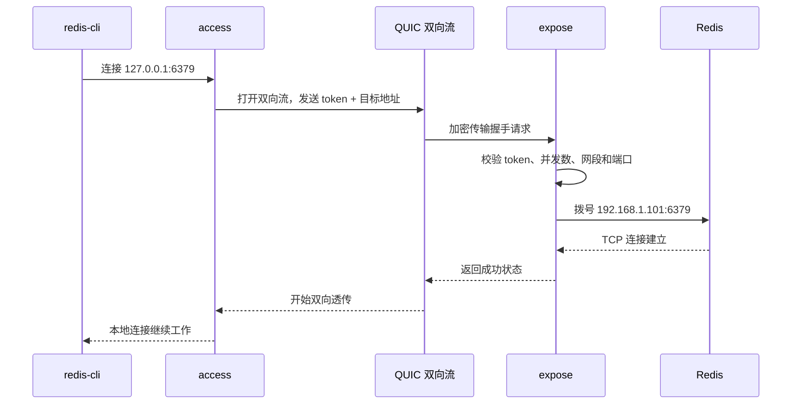
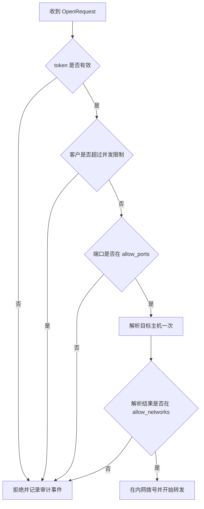

# PowerMap：用 P2P 把内网服务安全带回本地

## 前言

远程开发时，真正棘手的往往不是“能不能连上机器”，而是远端网络里的服务如何被安全、稳定地使用。

例如：数据库只允许内网访问，Redis 位于家里的局域网，Grafana 没有公网入口，或者调试服务运行在一台无法修改路由器配置的设备上。传统做法通常是公网 IP、端口转发、VPN、跳板机或 FRP，但这些方案往往意味着额外的网络权限、长期运维成本，或更大的暴露面。

PowerMap 是我为这类场景实现的 P2P 内网访问工具。它基于 Rust、[iroh](https://iroh.computer) 和 QUIC，让两台设备优先直接建立加密连接；直连失败时再通过中继转发密文。最终效果是：远端内网服务被映射成自己电脑上的 `127.0.0.1:端口`，浏览器、IDE、数据库客户端和命令行工具都可以继续按原来的方式工作。

```bash
redis-cli -h 127.0.0.1 -p 6379
psql -h 127.0.0.1 -p 5432 -U app
open http://127.0.0.1:3000
```

本文不把它当成“又一个内网穿透工具”来介绍，而是从项目落地过程拆解几个核心问题：

- 没有公网 IP 时，怎样建立可用的连接？
- 为什么要把“暴露能力”和“接入能力”拆开？
- 如何避免 token 泄漏后变成任意内网扫描器？
- 隧道断开、服务重启、映射增多时，怎样保证系统仍可运营？

## 1. 问题边界：访问内网，而不是暴露服务

PowerMap 的目标不是把服务发布到互联网，而是让有权限的设备安全访问受控内网中的服务。

以“家中电脑访问办公室内网 Redis”为例，需求可以概括为：

| 约束 | 期望结果 |
|------|----------|
| 办公室网络没有公网 IP | 不依赖固定公网地址 |
| 不能改路由器或防火墙 | 内网设备只需要主动连出 |
| 不希望维护完整 VPN | 仅访问几个明确服务，不接管全网路由 |
| 既有客户端不能改造 | 仍然连接 `127.0.0.1:6379` |
| 访问权限应最小化 | 每个接入方只能访问允许的网段和端口 |

这一定义决定了几个重要取舍：

1. **本地监听默认绑定回环地址。** 外部网络无法直接扫描到映射端口。
2. **不自动扫描远端内网。** 接入方只能访问管理员显式配置或授权的目标。
3. **中继只负责转发。** 当 P2P 打洞失败时，中继能看到连接元数据，但不能解密隧道内容。
4. **它不替代企业 VPN。** 如果需求是全网路由、SSO、设备准入、细粒度组织策略，应选择成熟的企业网络方案。

## 2. 架构：统一二进制，两种能力

早期很容易把两个节点简单叫作“服务端”和“客户端”，但这个命名在支持反向映射后会失效：谁主动发起连接、谁负责拨号目标服务，不再总是同一方。

因此 PowerMap 用两个能力描述节点：

- **expose**：部署在目标内网，负责将本网络中的服务提供给远端访问。
- **access**：部署在使用者电脑，负责把远端服务映射为本地监听端口。

同一个 `powermap` 二进制可以只运行一种能力，也可以同时运行两种能力；差异完全由 `powermap.toml` 中的 `[expose]` 与 `[access]` 配置决定。


### 2.1 为什么不是“公网服务器中转”

公网中转能解决连通性，但会把数据路径和成本固定在中心节点上，也会把可用性和安全边界更多地交给中转服务器。

PowerMap 采用 iroh 的节点发现与 NAT 穿透能力：

1. `access` 通过 `node_id` 发现 `expose` 节点。
2. 两端尝试 UDP NAT 打洞，建立 QUIC 直连。
3. 直连成功后，业务流量点对点传输。
4. 直连不成功时，自动回退到加密中继路径，保持功能可用。

这意味着“直连”和“经中继”只是传输路径的差异，不是两套业务协议。管理页会展示当前路径、往返延迟和中继主机，方便判断网络质量。

### 2.2 为什么是 QUIC 多流，而不是一条 TCP 隧道一个连接

用户在本地访问 Redis、PostgreSQL 或 Web 管理页时，通常会同时创建多个 TCP 连接。如果每条连接都重新做 NAT 穿透和握手，延迟、资源消耗和失败概率都会上升。

PowerMap 会复用一条 `access -> expose` 的 iroh QUIC 连接，每一个本地 TCP 连接只需在该连接上创建一个双向流：

```text
一个 QUIC 连接
├── 流 1：本地 redis-cli 连接
├── 流 2：IDE 的数据库连接
├── 流 3：浏览器访问 Grafana
└── 流 4：健康检查或其他本地连接
```

QUIC 的多流避免了不同业务连接共用单一 TCP 字节流时的队头阻塞问题，也让连接重建和流量统计更容易按映射维度管理。

## 3. 一条请求如何穿过隧道

理解数据流，才能看清安全校验究竟发生在哪里。

假设本机已经创建了一条映射：

```toml
[[access.mappings]]
name = "Redis 主库"
local = "127.0.0.1:6379"
host = "192.168.1.101"
port = 6379
mode = "tcp"
```

一次 `redis-cli -h 127.0.0.1 -p 6379` 的访问路径如下：



协议层的握手非常小：先发送一个有长度上限的 JSON 头，内容包括访问 token、目标主机、端口和隧道类型；`expose` 返回成功或失败状态。握手完成后，后续就是裸字节流透传。

这里有两个实现细节很重要：

- **目标地址只解析一次。** `expose` 解析主机名、按 CIDR 过滤得到允许的具体 IP 后，直接拨号该 IP，而不是再次用主机名解析。这避免了 DNS 重绑定带来的 TOCTOU 风险。
- **支持半关闭。** 当一侧读到 EOF 后，PowerMap 只关闭对应写方向，另一方向继续转发直到完成。这对依赖半关闭语义的 HTTP/1.1 等协议很关键。

## 4. 安全模型：权限必须落在拨号点

内网访问工具的风险不在“隧道能不能通”，而在“通了之后能访问什么”。

PowerMap 把真正的授权校验放在 `expose` 侧，也就是实际能够拨号内网目标的节点。一个接入请求必须依次通过以下检查：



### 4.1 多租户不是多发几个 token

每个 `[[expose.clients]]` 都对应独立的 token、白名单、并发上限和吊销状态。例如可以让不同使用者只看到各自需要的服务：

```toml
[expose]
identity = "powermap.key"
max_streams_per_conn = 256
dial_timeout_secs = 10
audit_log = "/var/log/powermap/audit.jsonl"

[[expose.clients]]
id = "developer"
token = "replace-with-a-long-random-token"
allow_networks = ["192.168.1.0/24"]
allow_ports = [6379, 5432, 3000]
max_streams = 32
published_targets = [
  { host = "192.168.1.101", port = 6379, label = "Redis 主库" },
  { host = "192.168.1.102", port = 5432, label = "PostgreSQL" },
]
```

`published_targets` 只是给管理页提供可选服务，不是授权规则。即使一个目标出现在推荐列表中，仍然必须同时满足 `allow_networks` 与 `allow_ports` 才能真正拨号。

这比“给所有人一个共享 token，然后约定不要乱连”更接近可运维的权限模型：需要收回权限时只需吊销单个客户，审计日志也可以关联到客户 ID。

### 4.2 正向与反向映射的默认策略不能混用

PowerMap 支持反向映射：由 `expose` 在自己的内网监听一个端口，将进入该端口的连接经既有隧道交给 `access` 端，再由 `access` 回拨它自己一侧的目标服务。

这项能力很方便，但风险也更高，因此两个方向的空白名单语义故意不同：

| 场景 | 策略 | 空白名单含义 |
|------|------|--------------|
| 正向映射 | `expose` 访问自己内网的目标 | 默认放行，建议生产环境显式收紧 |
| 反向映射 | `access` 接受远端要求，访问自己一侧目标 | 默认拒绝，必须显式启用并列出网段和端口 |

反向映射的安全配置类似这样：

```toml
[access]
reverse_enabled = true
reverse_allow_networks = ["127.0.0.0/8"]
reverse_allow_ports = [5900]
```

只有 `reverse_enabled` 打开，并且网段、端口都明确允许时，`access` 才会接受回拨。这样即使远端错误配置了反向监听，也不会静默暴露本机服务。

### 4.3 管理页也属于攻击面

`access` 端管理页默认监听 `127.0.0.1:8088`，用于维护映射、查看链路状态和指标。当前版本的管理 API 不启用应用层鉴权，因此不应直接将管理端口暴露到公网。

远程查看管理页时，优先使用 SSH 隧道：

```bash
ssh -N -L 8088:127.0.0.1:8088 admin@powermap-host
```

确实需要通过 HTTPS 远程管理时，应在反向代理层同时启用 mTLS 和来源 CIDR 限制，而不是仅将 `web_bind` 改为 `0.0.0.0`。

## 5. 从零跑通：Redis 映射示例

下面用最常见的 Redis 场景说明部署过程。

### 5.1 在远端内网运行 expose

在能够访问 Redis 的设备上启动：

```bash
powermap --config /opt/powermap/powermap.toml
```

首次启动会生成稳定节点身份、统一配置和接入凭证。对于长期运行的节点，应将配置与身份文件保存在持久化目录，并明确限制客户可访问的网段和端口。

部署在 Linux 主机时，可以使用 systemd；部署在 NAS、小主机或家用服务器时，也可以使用 Docker。Docker 场景建议使用 host 网络模式，以提高 UDP NAT 打洞成功率：

```yaml
services:
  powermap:
    image: ghcr.io/steven-ld/powermap:v0.7.0
    network_mode: host
    restart: unless-stopped
    volumes:
      - ./data:/data
    command: ["powermap", "--config", "/data/powermap.toml"]
```

### 5.2 在本地运行 access 并录入凭证

在自己的电脑上运行相同的 `powermap` 二进制，打开本地管理页后录入远端生成的凭证。凭证包含 `node_id` 和 token，应像密码一样保管，不能提交到 Git、聊天群或日志中。

也可以直接维护配置：

```toml
[access]
node_id = "remote-expose-node-id"
token = "credential-token"
web_bind = "127.0.0.1:8088"
max_mappings = 256
max_conns_per_mapping = 512

[[access.mappings]]
name = "Redis 主库"
local = "127.0.0.1:6379"
host = "192.168.1.101"
port = 6379
mode = "tcp"
```

映射生效后，业务工具只需要连接本机端口：

```bash
redis-cli -h 127.0.0.1 -p 6379 ping
```

如果返回 `PONG`，说明本地监听、P2P 连接、远端认证、白名单校验和 Redis 拨号都已通过。

## 6. 稳定性：连接会断，系统必须会恢复

网络切换、笔记本休眠、路由器重启和中继波动都很常见。对端口映射工具来说，真正可用的标准不是“第一次连接成功”，而是“发生这些事情后能否恢复”。

PowerMap 在运行期做了几层处理：

- **共享连接复用**：所有映射复用到同一远端节点的 QUIC 连接，避免重复建链。
- **连接看门狗**：持续检测连接是否可用，失效后主动重连。
- **指数退避加抖动**：连续失败时逐渐延长重试时间，并加入随机抖动，避免大量客户端同时重连。
- **连接与映射限额**：限制映射数量、单映射连接数、单客户并发流和单连接并发流，防止异常流量耗尽资源。
- **优雅退出**：删除映射或收到退出信号时，通过取消令牌停止接收新流，并让在途连接完成 drain。

QUIC 传输层还设置了保活和空闲超时，使失联能够较快被识别，而不是让本地应用长时间卡在一个已经失效的连接上。

## 7. 观测与排障：把“连不上”拆成可判断的状态

内网连接故障并不只有一种原因。PowerMap 在管理页和本地指标中尽量把它们区分开来：

| 现象 | 常见原因 | 优先检查 |
|------|----------|----------|
| 未配置远端节点 | 没有导入凭证 | `node_id` 与 token 是否同时存在 |
| 连接未建立 | 网络不可达、打洞或中继暂时异常 | 管理页路径状态、重连次数 |
| 映射已停止 | 本地监听端口被占用或绑定失败 | 更换本地端口、检查进程占用 |
| 映射降级 | 最近一次隧道建立失败 | token、白名单、目标服务可达性 |
| 拨号失败 | 远端服务未启动或地址错误 | 在 expose 侧本机测试目标 IP 与端口 |
| 被拒绝 | token 无效、端口或网段不在允许列表 | 对照对应客户的 `allow_*` 配置 |

`access` 端提供 Prometheus 格式的 `/metrics` 和聚合健康状态接口，可监控隧道创建、握手拒绝、拨号失败、重连次数及双向字节数：

```bash
curl http://127.0.0.1:8088/metrics
curl http://127.0.0.1:8088/api/health
```

`expose` 端还可以将每一次拨号结果写入 JSON Lines 审计日志，记录成功、token 拒绝、目标拒绝、并发超限、拨号失败和超时等结果。日志中不应记录 token 本身。

## 8. 项目中的几个设计收获

### 8.1 “服务端/客户端”是部署习惯，不是安全模型

网络工具常用的 server/client 命名，在简单转发模型中没有问题；但一旦支持双向能力，它就会开始误导使用者。使用 `expose/access` 命名后，配置、权限和文档都围绕“谁暴露哪个网络、谁接入哪个网络”组织，安全边界更清晰。

### 8.2 默认值本身就是产品设计

安全默认不是把所有功能关掉，而是对不同风险的动作使用不同默认策略：

- 本地管理页默认只绑定回环地址。
- 反向映射默认 deny-all。
- 目标白名单支持显式收紧。
- 推荐目标不等于访问授权。
- 配置导出默认脱敏，完整导出需要明确确认。

这些约束会让首次配置多写几行，但能显著降低“工具跑通了，同时也把网络暴露了”的概率。

### 8.3 可运营性不应等到上线后补

管理页上的传输路径、延迟、映射健康度、近期事件和诊断报告，不是锦上添花的 UI，而是排障闭环的一部分。只要系统涉及 NAT、P2P 和多个网络环境，用户就必须知道当前是直连还是中继、问题发生在本地监听还是远端拨号、重连是否正在发生。

## 总结

PowerMap 的核心价值不是“打洞”本身，而是将一条不稳定、跨 NAT 的网络连接封装成受控的本地服务访问体验：

```text
远端内网服务
    -> expose 侧认证、白名单与拨号
    -> iroh P2P / QUIC 加密连接
    -> access 侧本地监听
    -> 原有客户端继续连接 127.0.0.1
```

当我们把问题从“如何把端口暴露出去”改写为“如何把受控的内网能力带回本地”，架构重点也随之改变：P2P 连接只是基础，真正决定项目质量的是身份、白名单、默认策略、连接恢复和可观测性。

PowerMap 的源码、Release 和部署文档见 [GitHub 项目主页](https://github.com/steven-ld/PowerMap)。
