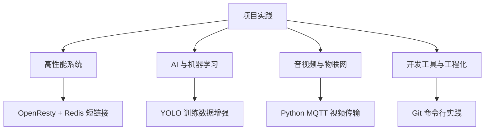

# 项目实践

本目录包含个人项目实践的技术总结和经验分享，重点是从零开始的完整项目实现。

## 快速导航

### 高性能系统

- [OpenResty + Redis 短链接服务系统](./OpenResty + Redis 短链接服务系统.md)
  - 单机 10 万+ QPS，延迟 < 5ms
  - Lua 脚本优化、Redis 数据结构设计
  - 完整的业务系统实现

### AI 与机器学习

- [AI 生成训练数据增强 YOLO 检测方案](../AI/AI生成训练数据增强YOLO检测方案.md)
  - 用 AI 训练 AI，避免数据偏差
  - Stable Diffusion + SAM + CLIP 组合
  - 混合训练策略与效果对比

### 音视频与物联网

- [Python MQTT 实时视频传输](./Python MQTT 实时视频传输.md)
  - 嵌入式设备视频传输
  - 性能优化与架构简化
  - 局限性分析与改进方向

### 网络与远程访问

- [PowerMap 项目复盘：从 P2P 连通到可控内网访问](./PowerMap：用 P2P 把内网服务安全带回本地.md)
  - 从网络约束出发的技术选型与架构演进
  - 白名单、反向映射、配置迁移与域名映射的设计取舍
  - 连接恢复、资源限制、审计与可观测性

### 开发工具与工程化

- [为什么我选择Git命令行而不是IDEA版本管理](./为什么我选择Git命令行而不是IDEA版本管理.md)
  - 从底层命令开始学习 Git
  - 环境无关性与脚本化
  - 团队协作最佳实践

## 文章列表

| 文章 | 技术栈 | 亮点 |
|------|--------|------|
| [AI 生成训练数据增强 YOLO 检测方案](../AI/AI生成训练数据增强YOLO检测方案.md) | Stable Diffusion、YOLO、SAM、CLIP | 用 AI 训练 AI，避免数据偏差，混合训练策略 |
| [OpenResty + Redis 短链接服务系统](./OpenResty + Redis 短链接服务系统.md) | OpenResty、Lua、Redis | 单机 10 万+ QPS，延迟 < 5ms，完整业务系统实现 |
| [Python MQTT 实时视频传输](./Python MQTT 实时视频传输.md) | Python、OpenCV、MQTT | 性能优化、架构简化、局限性分析 |
| [PowerMap 项目复盘：从 P2P 连通到可控内网访问](./PowerMap：用 P2P 把内网服务安全带回本地.md) | Rust、iroh、QUIC | 技术选型、权限边界、配置迁移与可运营性 |
| [为什么我选择Git命令行而不是IDEA版本管理](./为什么我选择Git命令行而不是IDEA版本管理.md) | Git、开发工具 | 从底层命令开始学习，环境无关性，脚本化和自动化 |

## 项目特点

这些项目都是我从零开始探索和实现的，特点是：

1. **完整的问题分析**：不只是实现功能，还深入分析性能瓶颈和设计问题
2. **优化方案对比**：对比优化前后的数据，量化改进效果
3. **局限性反思**：诚实评估方案的适用场景和局限性
4. **技术选型思考**：解释为什么选择某种技术，以及其他方案的对比

## 核心收获

> 脱离业务的代码是空谈，脱离现实的技术更是纸上谈兵。

每个项目都让我学到了不同的东西：
- **技术选型需要权衡**：没有银弹，只有最适合的方案
- **性能优化 80/20 原则**：抓住关键点，事半功倍
- **简单的方案往往更可靠**：复杂度是系统的大敌
- **工程化很重要**：好的工具和流程能大幅提升效率

## 我的项目经验

### 物联网平台
- 百万级设备接入
- 高并发消息处理
- 实时数据分析

### 嵌入式开发
- PCB 设计到量产全流程
- Luckfox Pico Max 视频方案
- 边缘 AI 部署

### 后端系统
- 高并发系统优化
- 分布式架构设计
- WMS/ERP 系统开发

欢迎交流项目经验！
